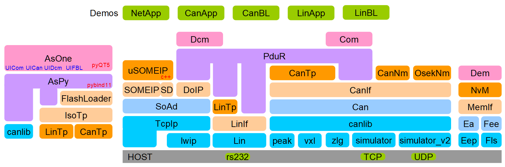

# AS - Automotive Software

This project is only free to be used for evaluation and study purpose, all of the BSWs are developed by me alone according to AUTOSAR 4.4.

## AUTOSAR and its toolchain

## Tools & Libraries

This project now provide below tools & libraries:

- **CanBusSimulator**: CAN bus simulator over IP socket

- **LinBusSimulator**: LIN bus simulator over IP socket

- **CanLib**: CAN lib used to access CAN hardware(Vecotr CanCaseXL, PeakCan, ZLGCAN, etc)

- **LinLib**: LIN lib used to access LIN hardware(COM, USB2I2C, USB2SPI etc)

- **DevLib**: abstract device libraries used to access any other kind of devices for automotive

- **IsoTp**: LIN or CAN(CANFD) Transport Layer(ISO15765)

- **Loader**: A library used for bootloader

- **AsPy**: A python interface to provide API to access CAN, LIN and IsoTp, it's easy to be used to implement test cases.

- **asone**: QT based GUI tool for Com/Dcm/FlashLoader, it provides both the python version and pure C++ version, and the C++ version is the best. The asone tool also provides the lua engine for the UICom and UIDcm, thus lua scripts can be utilized to control Com/UDS communication.

- **DoIPClient**: DoIP client library to access DoIP server

- **JSON Editor**: JSON schema & PyQT5 based JSON configuation GUI tool for ssas

- [**VDDS**](infras/libraries/dds/vdds/): [The Virtio Ring Buffer & Shared Memory based DDS](doc/EN/ViotioDDS.md)

## Successful solutions for customer

- CAN/LIN protocal based flashloader/bootloader for MCU.

- CAN/LIN based UDS/COM stack for MCU.

- PC tool asone UICom for the CAN/LIN based signal communication, lua script can be used to control the communication

- PC tool asone UIDcm for the CAN/LIN based UDS, lua script can be used to process the request/response data and display it.

- PC tool asone UIFBL for the CAN/LIN based flashloader/bootloader.

## Documents

- **Background**: [CN](doc/CN/background.md)

- **How to setup build environment**: [CN](doc/CN/build-env-setup.md) [EN](doc/EN/build-env-setup.md)

- **Virtuan CAN environment**: [CN](doc/CN/virtual-can-env.md)

- **Virtuan LIN environment**: TBD

- **CAN Bootloader**: [CN](doc/CN/can-bootloader.md)

- **CAN OSEKNM**: [CN](doc/CN/can-oseknm.md)

- **NVM**: [CN](doc/CN/nvm.md)

- **SOMEIP/SD**: [EN](doc/EN/SOMEIP-SD.md)

- **DoIP**: [EN](doc/EN/DoIP.md)

- **Json Editor**: [EN](doc/EN/JsonEditor.md)

- **VDDS**: [EN](doc/EN/ViotioDDS.md)
