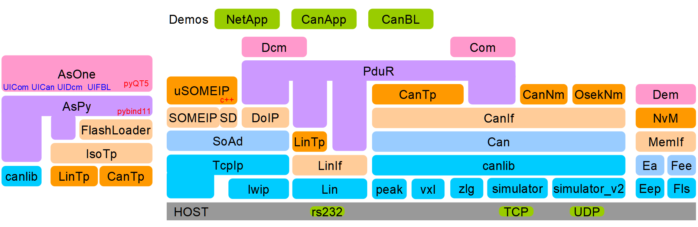

# AS - Automotive Software

This project is not open source, all of the BSWs are developed by me alone according to AUTOSAR 4.4. 

## AUTOSAR and its toolchain



## Tools & Libraries

This project now provide below tools & libraries:

​	**CanBusSimulator**: CAN bus simulator over IP socket

​	**LinBusSimulator**: LIN bus simulator over IP socket

​	**CanLib**: CAN lib used to access CAN hardware(Vecotr CanCaseXL, PeakCan, ZLGCAN, etc)

​	**LinLib**: LIN lib used to access LIN hardware(COM, etc)

​	**DevLib**: abstract device libraries used to access any other kind of devices for automotive

​	**IsoTp**: LIN or CAN(CANFD) Transport Layer(ISO15765)

​	**Loader**: A library used for bootloader

​	**AsOne**: PyQT5 based GUI tool for Com/Dcm

​	**DoIPClient**: DoIP client library to access DoIP server


## prebuilt demo applications and its tools

* [CAN bootloader demo](examples/CAN-BOOTLOADER.md)
* [CanNm](examples/CanNm.md)
* [OsekNm](examples/OsekNm.md)

## Pages

[Prelog](https://autoas.github.io/ssas-public/autosar/2021/12/02/%E5%BC%80%E7%AF%87.html)

[Setup development environment](https://autoas.github.io/ssas-public/autosar/2021/12/03/setup.html)

[CAN development with simulation](https://autoas.github.io/ssas-public/autosar/2021/12/10/vcan.html)

[CAN bootloader](https://autoas.github.io/ssas-public/autosar/2021/12/15/CAN-bootloader.html)

[CAN OSEK NM](https://autoas.github.io/ssas-public/autosar/2021/12/25/CAN-OSEK-NM.html)

[AUTOSAR NVM Memory Stack](https://autoas.github.io/ssas-public/autosar/2022/01/23/NVM.html)

[DoIP](https://autoas.github.io/ssas-public/autosar/2022/02/25/DoIP.html)

[SOMEIP-SD](https://autoas.github.io/ssas-public/autosar/2022/05/04/SOMEIP-SD.html)


## Funny demos

​	**Cluster & Watch**: legacy things from [as](https://github.com/autoas/as), something like:


```sh
git submodule update --init --recursive
scons --app=Cluster
scons --app=Watch
```


