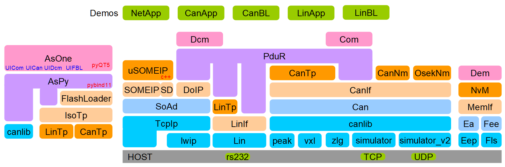
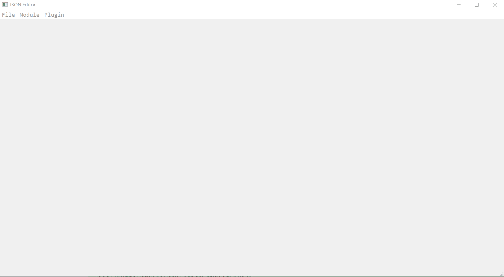

# AS - Automotive Software

**AS** is an open-source implementation of automotive software based on **AUTOSAR 4.4**, covering BSW (Basic Software) modules, PC tools, and supporting libraries, developed independently by one author. It is free for evaluation and study purposes; commercial use requires a commercial license (see [License](#license)).

## Architecture

## Supported Platforms

MCU/ECU platforms currently supported by AS:

| MCU (Vendor / Core) | Bootloader | Application |
| --- | :-: | :--- |
| AutoChips AC7840x (Cortex-M4F) | CAN | Com Stack, Diagnostic Stack, Memory Stack |
| TI AWR294x radar SoC (R4F) | CAN | Com Stack, Diagnostic Stack, Memory Stack |
| TI CC27xx (Cortex-M33, BLE) | CAN | Com Stack, Diagnostic Stack |
| ChipON KF32A136 (KungFu32) | CAN | Com Stack, Diagnostic Stack, Memory Stack |
| Microchip SAMD21/SAMDA1 (Cortex-M0+) | LIN | Diagnostic Stack, Memory Stack |
| NXP MC9S12XEP100 (S12X) | CAN+LIN | Com Stack, Diagnostic Stack, Memory Stack |
| NXP MPC5634M (PowerPC e200z3) | CAN | Com Stack, Diagnostic Stack |
| QEMU virtual: virt / versatilepb / x86 / STM32-P107 | CAN | Com Stack, Diagnostic Stack, Memory Stack |
| Renesas RH850 | CAN | Com Stack, Diagnostic Stack, Memory Stack |
| NXP S32K1xx (Cortex-M4F) | CAN | Com Stack, Diagnostic Stack, Memory Stack |
| Infineon AURIX TC3x7 (TriCore) | CAN, DoIP (in app) | Com Stack, Diagnostic Stack, DoIP, SOME/IP-SD |
| ST STM32F107VC (Cortex-M3, USB2CAN device) | CAN | Com Stack, Diagnostic Stack |
| YTM32B1xx (Cortex-M4F) | CAN | Com Stack, Diagnostic Stack, Memory Stack |

## Tools & Libraries

### Bus Simulation & Hardware Access

- **CanBusSimulator**: CAN bus simulator over IP socket.
- **LinBusSimulator**: LIN bus simulator over IP socket.
- **CanLib**: CAN library to access CAN hardware (Vector CanCaseXL, PeakCan, ZLGCAN, etc.).
- **LinLib**: LIN library to access LIN hardware (COM, USB2I2C, USB2SPI, etc.).
- **DevLib**: abstract device libraries to access any other kind of automotive devices.

### Protocol & Middleware

- **IsoTp**: LIN or CAN (CAN FD) transport layer (ISO 15765).
- **Loader**: library used for bootloader.
- **DoIPClient**: DoIP client library to access a DoIP server.
- [**VDDS**](infras/libraries/dds/vdds/): [Virtio ring buffer & shared memory based DDS](doc/EN/VirtioDDS.md).

### PC Tools

- **AsPy**: Python interface providing APIs for CAN, LIN and IsoTp, easy to be used to implement test cases.
- **asone**: Qt based GUI tool for Com/Dcm/FlashLoader, provided in both a Python version and a pure C++ version (the C++ version is recommended). It embeds a Lua engine for UICom and UIDcm, so Lua scripts can be used to control Com/UDS communication.
- **JSON Editor**: JSON schema & PyQt5 based configuration GUI tool for AS.

## Successful Solutions for Customers

- CAN/LIN protocol based flashloader/bootloader for MCU.
- CAN/LIN based UDS/COM stack for MCU.
- **asone UICom**: PC tool for CAN/LIN based signal communication, scriptable with Lua.
- **asone UIDcm**: PC tool for CAN/LIN based UDS; Lua scripts process request/response data and display it.
- **asone UIFBL**: PC tool for CAN/LIN based flashloader/bootloader.

## Documents

| Topic | CN | EN |
| --- | --- | --- |
| Background | [CN](doc/CN/background.md) | |
| Build environment setup | [CN](doc/CN/build-env-setup.md) | [EN](doc/EN/build-env-setup.md) |
| Virtual CAN environment | [CN](doc/CN/virtual-can-env.md) | |
| Virtual LIN environment | TBD | |
| CAN bootloader | [CN: boot over QEMU](doc/CN/can-bootloader.md) | [EN: boot sim on host](doc/EN/BL.md) |
| CAN OSEK NM | [CN](doc/CN/can-oseknm.md) | |
| NvM | [CN](doc/CN/nvm.md) | [EN](doc/EN/NvM.md) |
| SOME/IP-SD | | [EN](doc/EN/SOMEIP-SD.md) |
| DoIP | | [EN](doc/EN/DoIP.md) |
| JSON Editor | | [EN](doc/EN/JsonEditor.md) |
| VDDS | | [EN](doc/EN/VirtioDDS.md) |

More documents can be found under [doc/CN](doc/CN) and [doc/EN](doc/EN).

## License

Dual-licensed under GPLv3 and a commercial license (see [LICENSE](LICENSE)). For commercial use, contact: parai@foxmail.com
