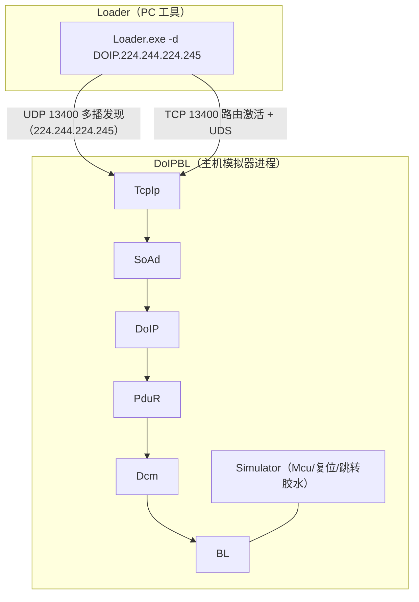
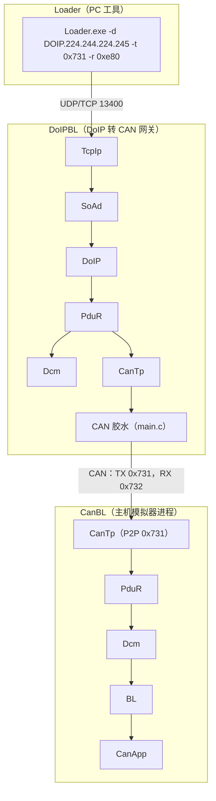

# 主机模拟器上的 BL over DoIP 示例

## 目录

1. [简介](#1-简介)
2. [架构](#2-架构)
3. [配置](#3-配置)
4. [构建](#4-构建)
5. [运行 DoIPBL](#5-运行-doipbl)
6. [测试通过 DoIP 烧写](#6-测试通过-doip-烧写)
   - [生成虚拟 Flash 驱动](#61-生成虚拟-flash-驱动1052-字节)
   - [生成虚拟应用](#62-生成虚拟应用a-与-b-分区)
   - [为 Flash 驱动与应用签名](#63-为-flash-驱动与应用签名)
   - [通过 DoIP 烧写](#64-通过-doip-烧写)
7. [DoIP 到 CAN 的网关示例（Loader -> DoIPBL -> CanBL）](#7-doip-到-can-的网关示例loader---doipbl---canbl)
   - [网关配置](#71-网关配置)
   - [运行网关环回示例](#72-运行网关环回示例)
   - [Loader 端的 SA/TA 映射](#73-loader-端的-sata-映射)

## 1. 简介

`DoIPBL` 是一个运行在主机模拟器（Windows 或 Linux）上的 Bootloader 应用，演示通过 DoIP（ISO 13400）诊断服务烧写 Bootloader，替代 CAN 方式。

它基于与 `CanBL` 相同的 BL 软件栈（参见 [BL 配置与主机模拟](BL.md)），将 CAN 相关模块（CanTp）替换为以太网诊断栈：DoIP 及其底层的 SoAd 与 TcpIp。BL、Dcm 和 PduR 的配置与行为保持一致。

说明：

- 主机模拟器上的 DoIPBL 构建（`USE_BL` + `USE_DOIP`）会保持 Bootloader 持续运行：既不跳转到应用，也不执行暖复位，因此是一个纯粹的 DoIP 烧写目标，便于复现演示。（CAN BL 仍会像真实硬件一样跳转到应用并复位。）
- 本示例的测试端（诊断仪）是 `Loader` PC 工具，它支持 DoIP 传输（例如 `-d DOIP.224.244.224.245`）。

## 2. 架构



诊断请求路径：`Loader -> TCP 13400 -> TcpIp -> SoAd -> DoIP -> PduR(P2P_RX) -> Dcm -> BL`。
响应路径：`BL -> Dcm -> PduR(P2P_TX) -> DoIP -> SoAd -> TcpIp -> TCP -> Loader`。

DoIP 会自动创建两个 SoAd socket：

- 一个 UDP socket，加入车辆识别发现多播组 `224.244.224.245:13400`。
- 一个 TCP 服务端 socket，监听 `13400` 端口（最多 `max_connections` 个连接）。

TCP 连接建立后，诊断仪以源地址 `0xbeef` 发送路由激活请求；激活成功后，UDS 请求以目标地址 `0xdead` 路由到 Dcm。

## 3. 配置

DoIP 相关的所有配置位于 `app/bootloader/config/Net`：

| 文件 | 内容 |
| --- | --- |
| `Network.json` | DoIP 模块：发现地址、`max_connections`、名为 `P2P` 的目标（逻辑地址 `0xdead`）、`default` 例程与地址为 `0xbeef` 的 `default` 诊断仪 |
| `Dcm.json` | DoIPBL 专用的 Dcm 配置，仅 `P2P` 物理通道用于路由（`P2A` 通道仅为满足生成器要求而保留） |
| `PduR.json` | PduR 路由：`P2P_RX` 从 DoIP 到 Dcm，`P2P_TX` 从 Dcm 到 DoIP |
| `Mempool.json` | SoAd/DoIP 使用的内存池（名为 `Net` 的 `MemCluster`） |

DoIP 目标命名为 `P2P`，PduR 例程命名为 `P2P_RX`/`P2P_TX`，从而映射到 `Dcm.json` 生成的 Dcm `P2P` 通道（索引 0）。

应用侧胶水代码位于 `app/bootloader/src/doip.c`（由 `USE_DOIP` 保护），提供：

- `DoIP_default_RoutingActivationAuthenticationCallback` 与 `DoIP_default_RoutingActivationConfirmationCallback`：不做鉴权，直接接受路由激活。
- `Dcm_GetVin`：提供 DoIP 车辆公告所用的 VIN。
- `DoIP_UserGetEID`/`DoIP_UserGetGID`/`DoIP_UserGetPowerModeStatus`/`DoIP_UserGetRoutingActivationResponseOem`：DoIP 用户回调。

在 `app/bootloader/main.c` 中，当定义了 `USE_TCPIP`、`USE_SOAD` 与 `USE_DOIP` 时，初始化会调用 `TcpIp_Init`、`SoAd_Init`、`DoIP_Init` 与 `DoIP_ActivationLineSwitchActive`，并调度 `TcpIp_MainFunction`、`SoAd_MainFunction` 与 `DoIP_MainFunction`。

## 4. 构建

工具链请参考 [构建环境搭建](build-env-setup.md)。然后与 CanBL 模拟测试相同，逐个构建 `AsOne`、`LoaderFBL` 库、`Loader` PC 工具与 `DoIPBL` Bootloader：

```bash
scons --lib=AsOne
scons --lib=LoaderFBL
scons --app=Loader
scons --app=DoIPBL
```

Windows 下的构建产物为：

- `build/nt/GCC/DoIPBL/DoIPBL.exe`，基于 DoIP 的 Bootloader。
- `build/nt/GCC/Loader/Loader.exe`，PC 烧写工具。

构建 `DoIPBL` 时还会根据 `app/bootloader/config/Net/*.json` 在构建目录中生成 Dcm/PduR/SoAd/DoIP 配置代码。

## 5. 运行 DoIPBL

启动 Bootloader（Windows 下请确保 MSYS2 `mingw64/bin` 中的运行时 DLL（如 `libstdc++-6.dll`）在 `PATH` 中）：

```bash
# 可选：打开 Dcm 模块日志（DCMI 为 DEBUG 级，默认日志级别下不显示）
set AS_LOG_DCMI=1            # Windows CMD；Linux 下为 export AS_LOG_DCMI=1
build\nt\GCC\DoIPBL\DoIPBL.exe
```

DoIPBL 主机构建既不会跳转到应用，也不会复位，因此它会持续运行在默认会话中，随时可接受烧写。

预期行为：

- 打印 `bootloader build @ ...` 后持续运行。
- TcpIp/SoAd 报告链路 up，DoIP 在 UDP/TCP `13400` 端口监听。
- `-v <级别>` 可设置全局日志详细程度，数值越大日志越多；也可用 `AS_LOG_<模块>` 环境变量按模块控制（如 `AS_LOG_DCMI=1` 打开 Dcm 日志）。
- 可用 `netstat -ano | findstr 13400` 验证监听 socket，应能看到 `TCP 0.0.0.0:13400 LISTENING` 条目以及 13400 端口上的 UDP 发现 socket。
- 按 `Ctrl+C` 退出。

## 6. 测试通过 DoIP 烧写

本节给出在主机上端到端验证烧写的完整命令列表，所有命令均在仓库根目录下执行。前提：`python` 已在 `PATH` 中，且已按第 4 节构建出 `Loader.exe` 与 `DoIPBL.exe`。

### 6.1 生成虚拟 Flash 驱动（1052 字节）

与 6.2 节一样使用生成脚本，在地址 0 处生成单段 1052 字节、内容为顺序值（0, 1, 2, ..., 255, 0, 1, ...）的 S19：

```bash
python tools/utils/gensims19.py -n 1 -s 1052 -g 0 -b 0 -o build/FlashDriverDummy.s19
```

### 6.2 生成虚拟应用（A 与 B 分区）

生成脚本保存在 [tools/utils/gensims19.py](../../tools/utils/gensims19.py)，用于生成多段 S19 镜像；A 分区起始地址为 `0x1000`，B 分区为 `0x100000`（DoIPBL 共用 `config/BL/BL.json`，因此内存布局与 CanBL 相同）：

```bash
# A 分区
python tools/utils/gensims19.py -n 8 -s 8192 -g 2048 -b 0x1000 -o build/AppDummy.s19.A

# B 分区
python tools/utils/gensims19.py -n 8 -s 8192 -g 2048 -b 0x100000 -o build/AppDummy.s19.B
```

### 6.3 为 Flash 驱动与应用签名

使用 Loader 对镜像签名（签名区与 BL 的 A/B 分区布局对应）：

```bash
# 为 A 分区应用签名
build\nt\GCC\Loader\Loader.exe -f build/AppDummy.s19.A -s 0xfff00 -S crc32-v3

# 为 B 分区应用签名
build\nt\GCC\Loader\Loader.exe -f build/AppDummy.s19.B -s 0x1fff00 -S crc32-v3

# 为 Flash 驱动签名
build\nt\GCC\Loader\Loader.exe -f build/FlashDriverDummy.s19 -s 2048 -S crc32
```

### 6.4 通过 DoIP 烧写

在另一个终端中运行 Loader（Windows 下请确保 `C:\msys64\mingw64\bin` 与 `build\nt\GCC\one` 在 `PATH` 中，以提供 Loader 运行时 DLL）。启动 DoIPBL 并保持其运行；由于 DoIPBL 主机构建既不会跳转到应用也不会复位，同一个 DoIPBL 实例可连续烧写 A、B 两个分区。

```bash
# 启动 DoIPBL 并保持运行
set AS_LOG_DCMI=1            # Windows CMD；Linux 下为 export AS_LOG_DCMI=1
build\nt\GCC\DoIPBL\DoIPBL.exe

# 烧写 A 分区
build\nt\GCC\Loader\Loader.exe -d DOIP.224.244.224.245 -c FBL -S crc32 -f build/FlashDriverDummy.s19.sign -a build/AppDummy.s19.A.sign

# 烧写 B 分区（无需重启 DoIPBL）
build\nt\GCC\Loader\Loader.exe -d DOIP.224.244.224.245 -c FBL -S crc32 -f build/FlashDriverDummy.s19.sign -a build/AppDummy.s19.B.sign
```

烧写成功时每一步都会打印 `okay`，最后出现 `progress 100.00%` 以及加载速度统计（主机环回约 4 kbps）。烧写流程依次经过 DoIP 路由激活、扩展会话、关闭通信、安全访问（扩展级与编程级）、擦除、下载、校验、完整性检查、ECU 复位、使能通信与开启 DTC 设置，每一步会打印 `PASS` 或 `FAIL`，出现 `FAIL` 即中止烧写。

说明：

- `-d DOIP.224.244.224.245` 选择 DoIP 传输并指定发现多播地址。
- DoIP 默认端口为 `13400`，诊断仪源地址为 `0xbeef`，ECU 目标地址为 `0xdead`（Loader DoIP 客户端的默认值，与 `Network.json` 一致）。
- 此处不需要 `-l 64`，它仅用于 CAN TP。
- `-c FBL` 选择 FBL 加载器，`-S crc32` 必须与 BL 配置一致，详见 [BL 配置](BL.md)。
- 排错：未带 Flash 驱动（缺少 `-f`）时擦除会以 NRC `0x24`（请求顺序错误）失败，请务必先烧写 Flash 驱动。

## 7. DoIP 到 CAN 的网关示例（Loader -> DoIPBL -> CanBL）

DoIPBL 还可以用作 DoIP 到 CAN 的诊断网关：通过 DoIP 收到的、目标地址为 `0x731` 的 UDS 请求，经 CanTp 转发到 CAN 总线上的 `CanBL`，从而实现通过 DoIP 远程烧写 CAN 应用（`CanApp`）。完整环路为 `Loader -> DoIPBL -> CanBL -> CanApp`：



- 请求路径：`Loader -> DoIP -> PduR(CAN_BL_RX) -> CanTp -> CAN 0x731 -> CanBL`。
- 响应路径：`CanBL -> CAN 0x732 -> CanTp -> PduR(CAN_BL_TX) -> DoIP -> Loader`。
- `P2P` 目标 `0xdead` 仍然路由到网关自身的 Dcm/BL（见第 6 节），因此 DoIPBL 在转发的同时自身也可被烧写。

### 7.1 网关配置

与第 3 节相比，在 `app/bootloader/config/Net` 下新增如下配置（BL `main.c` 保持不变）：

| 文件 | 内容 |
| --- | --- |
| `Network.json` | 新增目标：`CAN_BL`（地址 `0x0731`，节点 CAN 发送 id `0x731`）；新增例程/诊断仪 `CANBL`，诊断仪地址 `0x0E80` |
| `PduR.json` | TP 网关路由 `CAN_BL_RX`（DoIP -> CanTp）与 `CAN_BL_TX`（CanTp -> DoIP），并配置 `DestBufferSize: 4096`（TP 网关缓冲必须配置，否则 DoIP 回 NACK `0x08`） |
| `CanTp.json` | 一个 TP 网关通道 `CAN_BL`（`LL_DL: 64`，路由的源/目的 PduId 由 PduR 配置推导） |

网关的 CAN 发送 id 与接收过滤 id 由 `app/bootloader/SConscript` 中的编译定义静态给出（`CAN_DIAG_P2P_TX=0x731`、`CAN_DIAG_P2P_RX=0x732`），`main.c` 的胶水逻辑以这些宏为默认值，命令行 `-t`/`-r` 可在运行时覆盖。

注意：Loader 的 `-t`/`-r` 参数不带 `0x` 前缀时按十进制解析，请务必写成例如 `-t 0x731`。

### 7.2 运行网关环回示例

构建 CAN 侧并启动三个进程（Windows：确保 MSYS2 `mingw64/bin` 的 DLL 在 `PATH` 中）：

```bash
scons --app=CanBL
scons --app=CanApp

# 终端 1：CAN 目标（将自身烧入 A/B 分区后跳转到 CanApp）
build\nt\GCC\CanBL\CanBL.exe

# 终端 2：DoIP 转 CAN 网关（CAN 发送 id 0x731、接收过滤 id 0x732，由 SConscript 编译定义给出）
# 默认日志级别下 Dcm 的 DCMI 日志（DEBUG 级）不显示，可按模块打开：
set AS_LOG_DCMI=1            # Windows CMD；Linux 下为 export AS_LOG_DCMI=1
build\nt\GCC\DoIPBL\DoIPBL.exe

# 终端 3：通过 DoIP 烧写 CAN 应用，诊断仪 SA 0xE80，目标 TA 0x731
build\nt\GCC\Loader\Loader.exe -d DOIP.224.244.224.245 -t 0x731 -r 0xe80 -c FBL -S crc32 -f build/FlashDriverDummy.s19.sign -a build/AppDummy.s19.A.sign

# 烧写 B 分区（无需重启）
build\nt\GCC\Loader\Loader.exe -d DOIP.224.244.224.245 -t 0x731 -r 0xe80 -c FBL -S crc32 -f build/FlashDriverDummy.s19.sign -a build/AppDummy.s19.B.sign
```

烧写成功时最后出现 `progress 100.00%`（约 2-3 kbps，每个 UDS 请求都经 CAN TP 穿过网关）。最终 ECU 复位后，CanBL 校验应用完整性、激活被烧写的分区并跳转到 `CanApp.exe`。

### 7.3 Loader 端的 SA/TA 映射

网关引入了诊断仪 `CANBL`（SA `0x0E80`）及其例程路由的目标 `CAN_BL`（TA `0x0731`）。Loader 无需修改即可通过命令行使用该映射，其 DOIP 分支（[loader_cmd.cpp](../../tools/libraries/loader/utils/loader_cmd.cpp)）的映射机制如下：

- `-r` 映射为诊断仪源地址 `params.U.DoIP.sourceAddress`，未指定时默认 `0xbeef`（命中 `default` 诊断仪）；
- `-t` 映射为诊断目标地址 `params.U.DoIP.targetAddress`，未指定时默认 `0xdead`（此时烧写网关自身，见第 6 节）；
- 路由激活类型固定为 `0`，SA `0x0E80` 命中 `Network.json` 中的 `CANBL` 例程；
- Loader 不校验 UDS 响应的 SA，因此无需修改代码。

可选：若希望不带 `-r/-t` 时默认走网关转发（而不是烧写网关自身），可在 `loader_cmd.cpp` 的 DOIP 分支按设备名区分默认值，例如设备名 `DOIP-CANBL.224.244.224.245` 时默认 `rxid = 0xe80`（CANBL 诊断仪）、`txid = 0x731`（`CAN_BL` 目标）。注意保留既有的 `0xbeef/0xdead` 默认值（第 6 节依赖）。不建议将 `toU32` 改为默认十六进制解析：`-s`（签名区偏移）、`-T`（超时）等参数同样使用它，会改变既有用法的行为，保持 `0x` 前缀约定即可。
