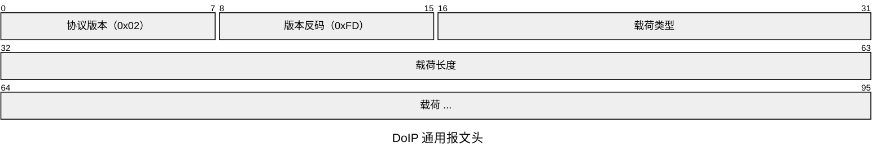
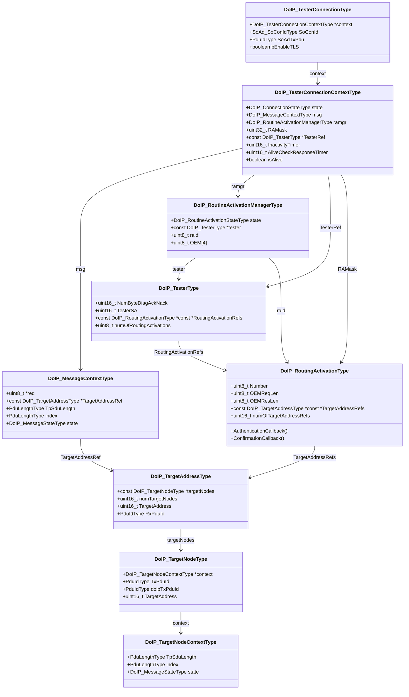
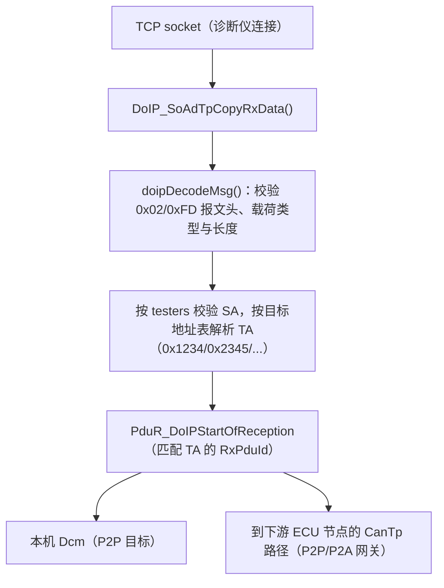
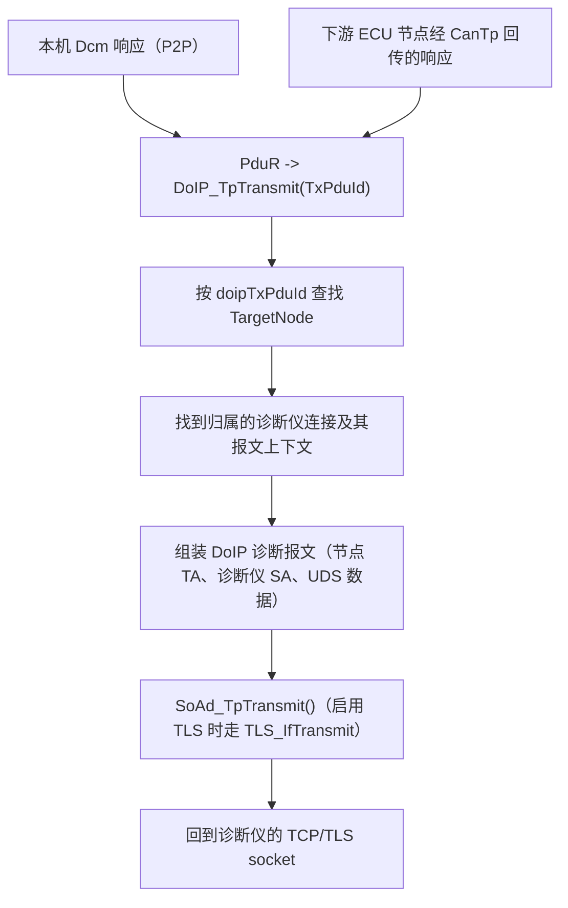

# DoIP - 以太网上的 UDS 诊断

**DoIP**（Diagnostics over IP，ISO 13400 / AUTOSAR CP 4.4）在以太网上承载 UDS 诊断流量。运行在 ECU（或主机仿真环境）上的 DoIP 服务端可以让外部诊断仪：

* 在网络中发现 ECU（车辆识别：VIN/EID/GID/逻辑地址）；
* 建立 TCP 连接并请求路由激活（routing activation）；
* 收发 UDS 诊断报文（0x10/0x22/0x2E/0x31/0x34/0x36 等服务），既可以在本机 Dcm 内终结，也可以作为网关经 CAN（CanTp）转发给其他 ECU。

协议实现位于 [infras/communication/DoIP](../../infras/communication/DoIP/DoIP.c)；主机端诊断仪库为 [doipc](../../tools/libraries/doipc)（DoIPClient）。

## 一、协议基础

每条 DoIP 报文都由 8 字节通用报文头加载荷组成：



版本字节必须为 `0x02` 和 `0xFD`（按位取反），否则会收到通用报文头否定应答（载荷类型 `0x0000`），见 [DoIP.c](../../infras/communication/DoIP/DoIP.c) 的 `doipFillHeader()` / `doipDecodeMsg()`。

已实现的载荷类型（见 [DoIP_Priv.h](../../infras/communication/DoIP/DoIP_Priv.h)）：

| 载荷类型 | 值 | 传输 | 作用 |
| --- | --- | --- | --- |
| 通用报文头 NACK | 0x0000 | UDP/TCP | 报文头错误 / 未知类型 / 长度非法 |
| 车辆识别请求 | 0x0001/0x0002/0x0003 | UDP | 广播识别、按 EID/VIN 识别 |
| 车辆通告 / VIN 响应 | 0x0004 | UDP | VIN(17) + LA + EID(6) + GID(6) + 同步状态 |
| 路由激活请求 / 响应 | 0x0005 / 0x0006 | TCP | 诊断仪请求开通诊断路由 |
| Alive check 请求 / 响应 | 0x0007 / 0x0008 | TCP | 连接保活监控 |
| 实体状态请求 / 响应 | 0x4001 / 0x4002 | UDP | 节点类型、最大/已开连接数 |
| 电源模式请求 / 响应 | 0x4003 / 0x4004 | UDP | 电源模式状态 |
| 诊断报文 | 0x8001 | TCP | UDS 请求（SA + TA + 用户数据） |
| 诊断报文肯定应答 | 0x8002 | TCP | 请求已接受并开始路由 |
| 诊断报文否定应答 | 0x8003 | TCP | SA 非法 / TA 未知 / 过大 / 不可达 / TP 错误 |

套接字（由配置中的 `discovery` / `max_connections` 生成，见 [Net.py ProcDoIp](../../tools/generator/Net.py)）：

* **UDP 13400**，组播组 `224.244.224.245`：车辆识别请求/响应与周期性车辆通告；
* **TCP 服务器 13400**：接受诊断仪连接，最多支持 `max_connections` 个并发诊断仪套接字（`DOIP_TCP_APT0..n`）。

DoIP 实体在应用调用 `DoIP_ActivationLineSwitchActive()`（[DoIP.c](../../infras/communication/DoIP/DoIP.c)）之前**保持静默**：在此之前收到的所有 DoIP 报文都会被静默丢弃，套接字也不会打开。激活后实体连续发送 3 次车辆通告（初始延时 50 ms、间隔 200 ms，数值由 [DoIp.py](../../tools/generator/DoIp.py) 生成）。在真实 ECU 上，该调用与 KL15/激活线状态绑定；集成示例在 `EcuM_AL_EnterRUN()` 中调用。

## 二、配置（Network.json）

DoIP 由 `Network.json`（class 为 `Net`）中的 `DoIp` 模块配置。以下示例取自 [app/app/config/Net/Network.json](../../app/app/config/Net/Network.json)：

```json
{
  "name": "DoIp",
  "class": "DoIp",
  "discovery": "224.244.224.245:13400",
  "EnableTLS": false,
  "max_connections": 3,
  "targets": [
    { "name": "P2P",    "address": "0xdead" },
    { "name": "GW_P2P", "address": "0xcaaa" },
    { "name": "GW_P2A",  "address": "0xcaab",
      "nodes": [
        { "name": "GW_P2A0", "address": "0xcaa0" },
        { "name": "GW_P2A1", "address": "0xcaa1" }
      ]
    }
  ],
  "routines": [
    { "name": "default", "number": "0x00", "targets": ["P2P", "GW_P2P", "GW_P2A"] }
  ],
  "testers": [
    { "name": "default", "address": "0xbeef", "routines": ["default"] }
  ]
}
```

| 字段 | 含义 |
| --- | --- |
| `discovery` | 车辆识别/通告使用的组播组与 UDP 端口 |
| `EnableTLS` | 是否在 DoIP TCP 连接外包裹 TLS（需要 TLS.json 配置和 mbedTLS） |
| `max_connections` | 诊断仪并发 TCP 连接上限，同时也是 TCP listen 队列长度 |
| `targets[].address` | 诊断仪可以寻址的目标地址（TA） |
| `targets[].nodes[]` | 可选：同一个 TA 由多个下游节点提供服务（一对多网关），每个节点有独立的 PduR 路由 |
| `routines[]` | 路由激活类型（`number`）及其开放的目标地址，可带认证/确认回调 |
| `testers[]` | 受信任的诊断仪源地址（SA）及其允许激活的路由类型 |

生成器 [DoIp.py](../../tools/generator/DoIp.py) 据此产出 `DoIP_Cfg.c/.h`：目标/节点表、诊断仪连接（TCP 套接字 + TxPdu；启用 TLS 时用 TLS TxPdu）、套接字连接器引用、各类定时器（初始/常规非活动超时 5000 ms、alive check 超时 50 ms、主函数周期 10 ms）以及实体逻辑地址（`0xdead`）。

### 2.1 PduR 路由：本机 Dcm 与 CAN 网关

诊断报文的去向由 [PduR.json](../../app/app/config/Net/PduR.json) 决定：

* **P2P（点对点）**：`DoIP <-> Dcm`，UDS 请求在本 ECU 内终结（目标 `0xdead`）；
* **GW_P2P**：`DoIP <-> CanTp`，转发给唯一的一个 CAN ECU（目标 `0xcaaa`）；
* **GW_P2A（point-to-any，一对多）**：一个 DoIP 目标（`0xcaab`）扇出到多个 CAN 节点（`0xcaa0`、`0xcaa1`……），共享 4096 字节路由缓冲区，由实际应答的节点回传响应。

### 2.2 TLS

当 `EnableTLS` 为 true 时，TCP 服务器套接字改由 TLS 层持有，证书文件由 [TLS.json](../../app/app/config/Net/TLS.json) 指定（[config/Net/Cert](../../app/app/config/Net/Cert) 下的 `Cert/TLS0_ServerCerts.pem`、`TLS0_ServerKey.pem`、`TLS0_CasCerts.pem`）。诊断仪侧通过 `-T` 参数传入 CA 证书 PEM 来校验服务端证书（客户端基于 mbedTLS，见 [doip_client.cpp](../../tools/libraries/doipc/src/doip_client.cpp)）。

## 三、主机实验

本章全部内容直接使用 OSAL 原生套接字在主机上运行，不需要 LWIP、VirtualBox 或 PCAP。

### 3.1 编译

```sh
# ECU 侧：集成应用（SOME/IP + DoIP + CAN 协议栈）
scons --app=NetApp --os=OSAL

# CAN 边缘节点 ECU，用于响应网关转发（可选，对应 -t caaa/caab）
scons --app=CanApp

# 独立 DoIP 诊断仪
scons --app=DoIPSend
```

### 3.2 在主机应用中激活 DoIP

链接 DoIP 库后构建系统会自动定义 `USE_DOIP`，因此 EcuM 已经会自动调用 `DoIP_Init()` 并周期调度 `DoIP_MainFunction()`（[EcuM_Cfg.c](../../infras/system/EcuM/config/EcuM_Cfg.c)）。但应用仍需在运行时主动切换一次激活线。将真实 ECU 示例（[AsDemo main.c](../../app/platform/tc3x7/AsDemo/src/main.c)）中的同一段代码加入 `EcuM_AL_EnterRUN()`：

```c
#ifdef USE_DOIP
  DoIP_ActivationLineSwitchActive();
#endif
```

### 3.3 运行

```sh
# 终端 1：DoIP ECU
build/nt/GCC/NetApp/NetApp.exe

# 终端 2（可选）：CAN 边缘节点
build/nt/GCC/CanApp/CanApp.exe -d simulator_v2

# 终端 3：诊断仪 - 向本机目标 0xdead 发送 UDS 10 01（进入默认会话）
build/nt/GCC/DoIPSend/DoIPSend.exe -v 1001
```

DoIPSend 会先在组播组上等待车辆通告，超时后改为主动发送车辆识别请求；随后打开 TCP 13400、完成路由激活、发送**一条** UDS 请求并打印响应。

### 3.4 DoIPSend 命令行

源码：[doip_send.c](../../tools/libraries/doipc/utils/doip_send.c)。

| 选项 | 默认值 | 含义 |
| --- | --- | --- |
| `-v <hex>` | （必填） | 十六进制字符串表示的 UDS 请求，如 `1001` 表示 DiagnosticSessionControl 默认会话；同时也是 DoIP 诊断报文携带的载荷 |
| `-i <ip>` | `224.244.224.245` | 车辆识别使用的 IP / 组播组（UDP_TEST_EQUIPMENT_REQUEST 目标） |
| `-p <port>` | `13400` | DoIP UDP/TCP 端口 |
| `-s <hex>` | `beef` | 诊断仪源地址（SA） |
| `-a <hex>` | `00` | 路由激活类型 |
| `-t <hex>` | `dead` | 目标地址（TA） |
| `-T <pem>` | 无 | CA 证书 PEM；指定后诊断仪使用 TLS（mbedTLS）连接 |

更多示例：

```sh
# 网关测试：UDS 10 01 经 CAN 路由给 TA 0xcaaa 的边缘节点
build/nt/GCC/DoIPSend/DoIPSend.exe -v 1001 -t caaa

# 加密连接（需先把 Network.json 中 EnableTLS 置为 true 并重新编译 NetApp）
build/nt/GCC/DoIPSend/DoIPSend.exe -v 1001 -T app/app/config/Net/Cert/TLS0_CasCerts.pem
```

除 CanApp 外，也可以用 Python 仿真下游 CAN ECU：[TestDoIP_CANTP_GW.py](../../app/app/config/Net/TestDoIP_CANTP_GW.py) 在 v2 组播 CAN 总线上模拟了两个 ISO-TP 响应节点（rxid/txid 为 0x7E0/0x7D0 和 0x7E1/0x7D1）。

PC 工具还可以通过 DoIPClient 库（[doip_client.h](../../tools/libraries/doipc/include/doip_client.h)）使用同样的客户端能力：`doip_create_client()`、`doip_await_vehicle_announcement()`、`doip_request()`、`doip_connect()`、`doip_activate()`、`doip_transmit()`。

## 四、DoIP 架构

### 4.1 诊断仪连接模型



### 4.2 UDS 报文接收（诊断仪 -> ECU）

所有诊断流量复用同一个 TCP 连接。DoIP 解码报文头，把 TA 解析为配置中的目标地址，并在该目标的 RxPduId 上启动一次 PduR TP 接收；随后 PduR 把组装完成的 UDS 报文路由给本机 Dcm（P2P）或一条/多条 CanTp 路径（网关）。



### 4.3 UDS 应答（ECU -> 诊断仪）

下游 UDS 响应经 PduR 进入 `DoIP_TpTransmit`。DoIP 通过 `doipTxPduId` 反查目标节点，找到此前发起该路由的诊断仪连接及其报文上下文，用节点 TA 与诊断仪 SA 重新组装诊断报文，并沿同一条 TCP（或 TLS）连接发回。



## 五、真实 ECU 集成：AURIX TC3x7 AsDemo

[tc3x7 AsDemo](../../app/platform/tc3x7/AsDemo/SConscript) 是一个贴近量产形态的示例：DoIP 运行在以太网上，30 多个目标地址被网关路由到 CAN/CAN FD ECU（其中 P2A 目标 `MCANFD_E400` 还扇出到两个使用不同 CAN TxId 的节点）。DoIP 在启动时自动激活（[main.c](../../app/platform/tc3x7/AsDemo/src/main.c) 的 `EcuM_AL_EnterRUN`，`USE_DOIP` 条件内）。其 SConscript 中注册的诊断仪调用示例：

```sh
# 本机 ECU（TA 0xE400），诊断仪 SA 0x0E80
DoIPSend.exe -v 1001 -s 0x0E80 -t 0xE400
# 网关到 CAN TA 0x0724
DoIPSend.exe -v 1001 -s 0x0E80 -t 0x724
# 第二个诊断仪 SA，目标 TA 0x0757
DoIPSend.exe -v 1001 -s 0x0F00 -t 0x757
```
