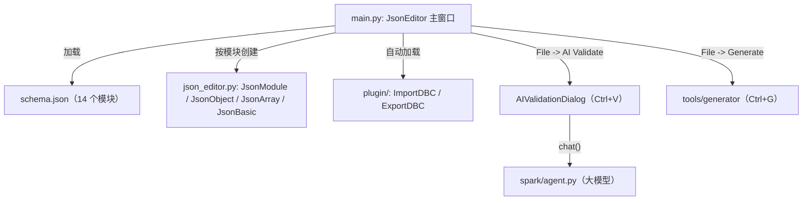
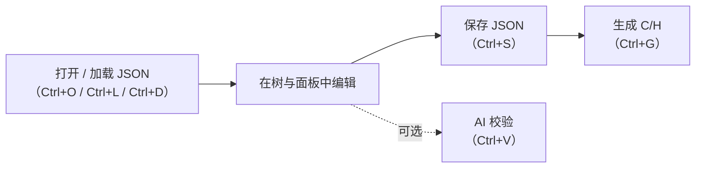

# JSON Editor

**JSON Editor** 是一个基于 PyQt5 的桌面 GUI 工具，用于配置 AS 项目的 AUTOSAR BSW 模块。集成人员无需手工编辑 JSON 或生成的 C 文件，而是通过 schema 驱动的树形视图编辑配置，工具负责回写 JSON，并（通过代码生成器）生成 C/H 源文件。

本文介绍工具的架构、命令行用法、主要特性，以及从打开配置到生成 C 代码的完整流程。

## 1. 概览

编辑器加载单个 [schema.json](../../tools/json.editor/schema.json)，其中将每个支持的 ECU 模块声明为顶层对象。对每个模块，工具渲染一个停靠窗口，左侧是配置树，右侧是属性面板；多个模块以标签页形式加载。

[schema.json](../../tools/json.editor/schema.json) 中定义的顶层模块如下：

| 模块 | 用途 |
| --- | --- |
| Dcm | UDS 诊断服务、会话、安全访问、DID、例程 |
| OS | 操作系统任务 / 告警 / 资源配置 |
| Dem | 诊断事件管理（DTC、快照、扩展数据） |
| NvM | NVRAM 管理器（块描述符、RAM 镜像） |
| EcuC | ECU 配置（PDU 注册表，跨模块共享） |
| CanIf | CAN 接口（网络、收发 PDU、上层路由） |
| LinIf | LIN 接口 |
| PduR | PDU 路由器（模块间路由路径） |
| CanTp | ISO 15765 CAN 传输层 |
| J1939Tp | J1939 传输层 |
| Com | COM 信号 / I-PDU / 组 / 触发定义 |
| Net | 以太网协议栈：SoAd、DoIP、SomeIp、SomeIpXf、TLS |
| E2E | 端到端保护 profile |
| BL | Bootloader（内存布局、签名、安全） |

这些 JSON 文件同时也被 [tools/generator](../../tools/generator) 下的代码生成器直接消费（如 `Dcm.py`、`Com.py`、`CanIf.py`、`NvM.py`、`BL.py`、`DoIp.py`、`SomeIp.py`）。

## 2. 架构

| 组件 | 作用 |
| --- | --- |
| [main.py](../../tools/json.editor/main.py) | 入口；命令行解析、主窗口、菜单栏（File / Module / Plugin）、文件读写、AI 校验对话框、跨模块编排 |
| [json_editor.py](../../tools/json.editor/json_editor.py) | Schema 驱动的控件框架：`JsonBase`、`JsonObject`、`JsonArray`、`JsonBasic`、`JsonModule`、字段控件、问题标注 |
| [schema.json](../../tools/json.editor/schema.json) | 全部 14 个模块的声明式 schema（类型、默认值、约束、交叉引用、条件可见性） |
| [plugin/](../../tools/json.editor/plugin) | 自动发现的插件：`ImportDBC.py`、`ExportDBC.py`（Vector CAN DBC 导入/导出） |
| [tools/generator](../../tools/generator) | Generate 动作调用的后端，把 JSON 转为 C/H |



## 3. 命令行用法

```sh
cd tools/json.editor
python main.py                       # 使用默认 schema.json
python main.py -s myschema.json      # 自定义 schema
python main.py -i path/to/jse.json   # 启动时打开一个配置文件
```

参数（见 [main.py](../../tools/json.editor/main.py)）：

| 选项 | 默认值 | 含义 |
| --- | --- | --- |
| `-s`, `--schema` | `tools/json.editor/schema.json` | 要加载的 schema 文件 |
| `-i`, `--input` | 无 | 启动时打开的 JSON 配置文件 |

## 4. 主要特性

### 4.1 Schema 驱动的 GUI
整个 UI 由 `schema.json` 生成；新增模块只需添加一条 schema 条目，无需修改 Python 代码。每个属性按类型映射到对应控件。

### 4.2 跨模块引用（`enumref`）
字段可以引用另一个模块中定义的值。例如 Dcm 服务的 `sessions` 字段使用 `"enumref": "/Dcm/sessions:name"`，下拉框始终列出当前 Dcm 模块中定义的会话名。引用每秒刷新一次。

### 4.3 条件可见性（`enabled`）
字段可用 `${path}` 模板语法的表达式控制显隐：

```json
"enabled": "'${../use_dbc}' == 'True'"
```

支持的路径形式：`${/Module/path}`（绝对）、`${../field}`（父级）、`${field}`（同对象）。运算符：`==`、`!=`、`in`、`and`、`or`、`not`。

### 4.4 通过 `map` + `extends` 实现多态
当 `map` 字段带有 `"extend": true` 时，选择某个选项会把 `extends` 块的属性动态合并进对象的 schema（例如选择某种 UDS 服务类型后追加相应子字段）；取消选择则恢复原 schema。

### 4.5 数值格式与表达式
整数字段支持 `0x` 十六进制值和算术表达式，如 `8*1024` 或 `0xA0600000 - 0xA0300000`，便于内存布局尺寸计算。

### 4.6 自动值字段（`auto_field`）
像 `Xxx_ReadDID${name}` 这样的模板字符串会按当前对象上下文解析，使名称自动传播。

### 4.7 AI 校验（Ctrl+V）
**AI Validate** 动作把当前配置发送给 OpenAI 兼容的大模型（经 [spark/agent.py](../../tools/spark/agent.py)），并解析结构化 JSON 响应，列出带严重级别（`ERROR` / `WARNING` / `INFO`）、位置、建议和可选可修复 `changes` 的问题。

校验对话框中，每个可修复问题提供 **Show in Editor**（定位并高亮树节点/字段）和 **Apply Fix**。叶子值的修改就地应用（保留树选中状态）；结构性变更（增/删）则重载模块。**Apply All** 按钮可一次性应用所有剩余修复。问题位置还会以严重级别着色的图标和字段边框标注在编辑器树中，用户编辑受影响字段后标注自动清除。

### 4.8 插件
插件从 [plugin/](../../tools/json.editor/plugin) 目录自动发现并加入 **Plugin** 菜单，每个插件导出一个 `Plugin(QAction)` 类。内置插件：

- **ImportDBC**：读取 Vector `.dbc` 文件，一次性更新 `EcuC`、`CanIf`、`PduR`、`Com`。
- **ExportDBC**：把 COM 网络配置导出为 `.dbc` 文件。

### 4.9 跨模块编排
加载 `CanIf` 或 `PduR` 配置时，编辑器会自动在 `EcuC` 模块中创建/更新 PDU 条目（见 [main.py](../../tools/json.editor/main.py) 中的 `UpdateEcuCByCanIf` / `UpdateEcuCByPduR`），保持共享 PDU 注册表一致。

## 5. 工作流程



**Open**（`Ctrl+O`）：加载合并的 JSON 文件（`jse.json`），其中每个模块作为数组的一项，按 `class` 匹配 schema 的 `title`。

**Load**（`Ctrl+L`）：加载单模块 JSON 文件；**Load Directory**（`Ctrl+D`）加载目录下所有 `*.json`（例如某个 `app/<platform>/config/` 目录树）。

**Save**（`Ctrl+S`）：如果每个模块都来自各自的文件，则分别回写并在目录旁生成合并的 `jse.json`；否则写入单个合并文件。

**Generate**（`Ctrl+G`）：在 `config/` 子目录中为每个模块写一个 `<Module>.json`，并调用 [tools/generator](../../tools/generator) 的 `Generate()` 生成 C/H 源文件。

## 6. Schema 语言参考

| 特性 | JSON 键 | 示例 |
| --- | --- | --- |
| 类型 | `type` | `"integer"`、`"string"`、`"bool"`、`"object"`、`"array"` |
| 取值范围 | `minimum`、`maximum` | `"minimum": 0, "maximum": 255` |
| 默认值 | `default` | `"default": 100` |
| 数值格式 | `format` | `"hex"` 或 `"dec"` |
| 固定选项 | `enum` | `"enum": ["CAN", "CANFD", "LIN"]` |
| 跨模块引用选项 | `enumref` | `"enumref": "/Dcm/sessions:name"` |
| 条件可见性 | `enabled` | `"'${../use_dbc}' == 'True'"` |
| 命名选项 + 自动填充 | `map`、`friends` | 选择时填充兄弟字段 |
| 选择时扩展 schema | `map` + `extend: true` | 合并 `extends` 块 |
| 字段排序 | `orders` | `["name", "Driver", "Action"]` |
| 提示 | `description` | 悬停显示 |

## 7. 常见问题

- **某个字段找不到**：检查其 `enabled` 表达式——可能依赖于另一字段的值。
- **`enumref` 下拉框为空**：被引用的模块（如 `Dcm`）未加载；用 **Load** 或 **Load Directory** 打开它。
- **Generate 没有生成文件**：确保至少加载了一个模块并已保存 JSON；`Generate()` 只在哈希变化时重新生成（GUI 的 Generate 动作会传 `force=True` 强制生成）。
- **AI 校验失败**：检查 `.spark/settings.json` 中的 `api_key`、`base_url`、`model` 是否正确；该 agent 需要 OpenAI 兼容的接口。
