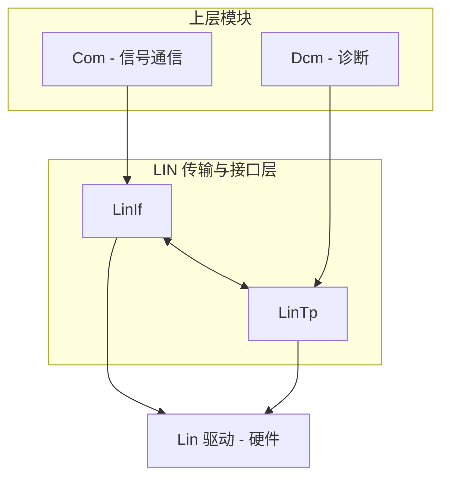
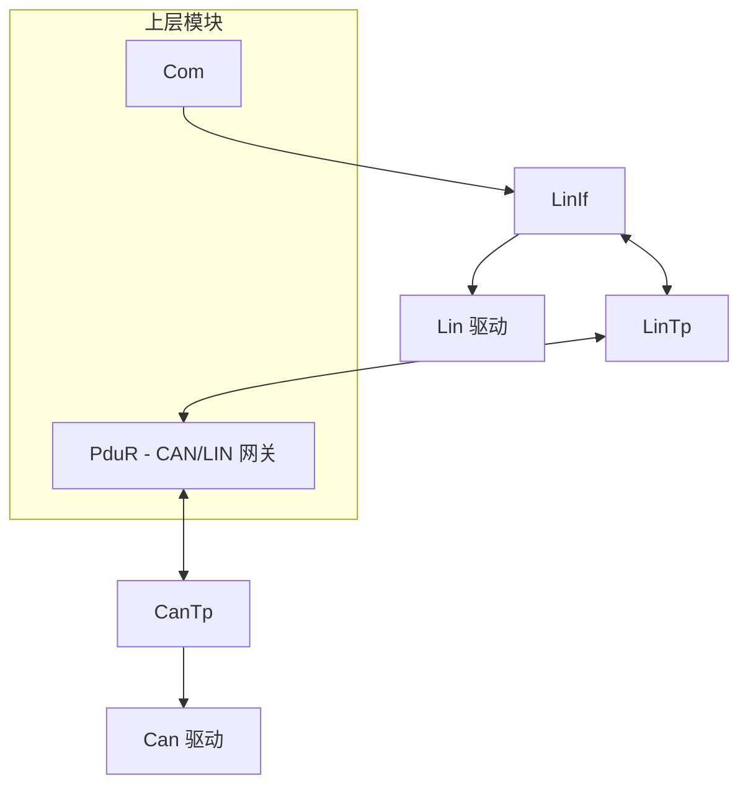

# AUTOSAR LinIf 配置概览

LIN 接口层（LinIf）负责 LIN 总线与上层模块（基于信号的 Com、负责分段传输的LinTp）之间的通信。它位于 Lin 驱动之上，提供调度表管理、帧收发以及 LinTp 所需的挂钩。配置由 [LinIf.py](../../tools/generator/LinIf.py) 消费。

## 1. 核心配置原则

* 定义 LIN 网络参数（网络名、本节点名、LDF 文件、超时）；
* Com 配置中引用相同的网络和 LDF，保证信号路由一致；
* 需要分段诊断（例如 LIN 上的 UDS）时加入 LinTp。

## 2. LinIf 配置示例

`networks` 中每个条目描述一个 LIN 网络：

```json
{
  "class": "LinIf",
  "networks": [
    {
      "name": "LIN0",
      "me": "AS",
      "timeout": 100,
      "ldf": "LIN0.ldf"
    }
  ]
}
```

* `name` - 逻辑网络名（用户自定义）；
* `me` - 本地（自身）节点名；
* `timeout` - LIN 帧超时，单位毫秒；
* `ldf` - LIN 描述文件路径，定义帧和信号。

## 3. 与 Com 模块集成

Com 通过 LIN 进行基于信号的通信，其网络条目必须与 LinIf 使用相同的 `name` 和`ldf`：

```json
{
  "class": "Com",
  "networks": [
    {
      "name": "LIN0",
      "network": "LIN",
      "me": "AS",
      "ldf": "LIN0.ldf"
    }
  ]
}
```

两处配置必须引用同一个 LDF 文件，避免信号映射漂移；Com 生成器会自动把 LDF 转换为内部 DBC 表示（见 Com 文档）。

## 4. LinTp 配置（主节点与从节点）

LinTp 负责 LIN 上大数据的分段与重组，具体配置取决于节点角色。

### 4.1 LIN 从节点

LIN 从节点响应主节点请求（例如传感器数据或 DTC 读写）。在 `LinTp_Cfg.c` 中配置从节点侧的 LinTp 通道参数（响应超时、帧映射）。

### 4.2 LIN 主节点（网关）

LIN 主节点通常通过 PduR/CanTp 在 LIN 与 CAN 之间做网关（例如 CAN 转 LIN 上的UDS）。除本地 LinTp 参数外，还需要在 PduR 中配置 LinTp 与 CanTp 之间的路由（见PduR 文档）。

## 5. 架构概览

### 5.1 LIN 从节点



### 5.2 LIN 主节点（CAN/LIN 网关）



## 6. 关键注意事项

* **LDF 一致性**：LinIf 与 Com 必须引用同一个 `.ldf` 文件；
* **超时调整**：根据总线速率和从节点响应时间调整 `timeout`，典型值为 50 至200 ms；
* **网关路由**：主节点需要在 PduR 中配置 LinTp 与 CanTp 之间的分段路由，实现UDS over CAN-to-LIN 网关。

## 7. 生成器

[LinIf.py](../../tools/generator/LinIf.py) 在 JSON 同目录生成 `LinIf_Cfg.c` 和`LinIf_Cfg.h`。
