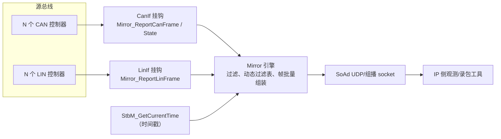

# AUTOSAR Bus Mirror 配置与集成指南

Bus Mirror（总线镜像）模块把原始 CAN/LIN 流量复制（镜像）到 IP 目的地，用于观测、录包或残余总线仿真分析。源帧通过 CanIf/LinIf 挂钩捕获，批量组装为 UDP报文后经 SoAd 发出。示例配置：[app/app/config/Mirror/Mirror.json](../../app/app/config/Mirror/Mirror.json)。

## 1. 架构总览



## 2. 目录

* [Bus Mirror 配置](#bus-mirror-配置)
  * [`SourceNetworkCan` 配置](#sourcenetworkcan-配置)
  * [`SourceNetworkLin` 配置](#sourcenetworklin-配置)
  * [`DestNetworkIp` 配置](#destnetworkip-配置)
* [Bus Mirror 集成](#bus-mirror-集成)
  * [LinIf 集成](#linif-集成)
  * [CanIf 集成](#canif-集成)
  * [SoAd 集成](#soad-集成)
  * [Mirror 时间戳集成](#mirror-时间戳集成)

# Bus Mirror 配置

## `SourceNetworkCan` 配置

定义一个 CAN 源网络，包括接收过滤器和控制器标识。

### JSON 示例

```json
"SourceNetworkCan": [
  {
    "name": "CAN0",
    "StaticFilters": [
      { "type": "range", "lower": 0, "upper": "0x100" },
      { "type": "mask", "code": "0x700", "mask": "0x700" }
    ],
    "MaxDynamicFilters": 128,
    "ControllerId": 0,
    "NetworkId": 3
  }
]
```

### 参数说明

| 参数 | 是否必需 | 说明 |
| --- | --- | --- |
| `name` | 是 | CAN 网络名，例如 `"CAN0"` |
| `StaticFilters` | 否 | 静态过滤器列表（见下），默认 `[]` |
| `MaxDynamicFilters` | 是 | 允许的最大动态过滤器数（范围 1 至 255）；静态与动态过滤器总数不得超过 255 |
| `ControllerId` | 是 | CAN 控制器数字 ID，例如 `0` |
| `NetworkId` | 是 | 放入镜像帧头中的数字网络 ID |

### 静态过滤器类型

1. **`range`** - 接受落在 `[lower, upper]` 内的 CAN ID：
   * `lower` - 范围起点，例如 `0`；
   * `upper` - 范围终点，例如 `"0x100"`。
2. **`mask`** - 按位模式匹配：
   * `code` - 待匹配模式，例如 `"0x700"`；
   * `mask` - 两侧施加的掩码，例如 `"0x700"`；
   * 匹配条件：`(接收ID & mask) == (code & mask)`。

## `SourceNetworkLin` 配置

定义 LIN 源网络，包括过滤器和控制器标识。

### JSON 示例

```json
"SourceNetworkLin": [
  {
    "name": "LIN0",
    "StaticFilters": [
      { "type": "range", "lower": 0, "upper": "0x10" },
      { "type": "mask", "code": "0x20", "mask": "0x70" }
    ],
    "MaxDynamicFilters": 128,
    "ControllerId": 0,
    "NetworkId": 3
  }
]
```

### 参数说明

| 参数 | 是否必需 | 说明 |
| --- | --- | --- |
| `name` | 是 | LIN 网络名，例如 `"LIN0"` |
| `StaticFilters` | 否 | 静态过滤器列表（见下），默认 `[]` |
| `MaxDynamicFilters` | 是 | 允许的最大动态过滤器数（范围 1 至 255）；静态与动态过滤器总数不得超过 255 |
| `ControllerId` | 是 | LIN 控制器数字 ID，例如 `0` |
| `NetworkId` | 是 | 放入镜像帧头中的数字网络 ID |

### 静态过滤器类型

1. **`range`** - 接受落在 `[lower, upper]` 内的 LIN PID：
   * `lower` - 范围起点，例如 `0`；
   * `upper` - 范围终点，例如 `"0x10"`。
2. **`mask`** - 按位模式匹配：
   * `code` - 待匹配模式，例如 `"0x20"`；
   * `mask` - 施加的掩码，例如 `"0x70"`。

## `DestNetworkIp` 配置

定义 IP 目的地，包括队列/缓冲区大小和关联的 SoAd socket。

### JSON 示例

```json
"DestNetworkIp": [
  {
    "name": "AS",
    "DestQueueSize": 2,
    "DestBufferSize": 1400,
    "MirrorDestTransmissionDeadline": 655,
    "SoAd": "MIRROR_CLIENT_0"
  }
]
```

### 参数说明

| 参数 | 是否必需 | 说明 |
| --- | --- | --- |
| `name` | 是 | IP 目的地逻辑名，例如 `"AS"` |
| `DestQueueSize` | 是 | 输出队列中最多缓存的帧数；影响延迟和内存占用；必须为 2 的幂 |
| `DestBufferSize` | 是 | 每个批量输出报文的字节大小；需与 MTU/报文大小限制对齐 |
| `MirrorDestTransmissionDeadline` | 是 | 源帧组装为一个目的报文的最长收集时间（毫秒）；到截止时间时报文最迟必须发出 |
| `SoAd` | 是 | SoAd socket 连接名，例如 `"MIRROR_CLIENT_0"` |

# Bus Mirror 集成

## LinIf 集成

```c
void Mirror_ReportLinFrame(NetworkHandleType network, Lin_FramePidType pid,
                           const PduInfoType *pdu, Lin_StatusType status);

/* 该 API 为可选 */
Std_ReturnType LinIf_EnableBusMirroring(NetworkHandleType Channel,
                                        boolean MirroringActive);

/* LinIf_EnableBusMirroring 的建议实现 */
static boolean bLinMirroringActive[4];
Std_ReturnType LinIf_EnableBusMirroring(NetworkHandleType Channel,
                                        boolean MirroringActive) {
  bLinMirroringActive[Channel] = MirroringActive;
  return E_OK;
}

/* 在 LinIf 的对应位置调用 Mirror_ReportLinFrame */
if (TRUE == bLinMirroringActive[Channel]) {
  /* status: LIN_RX_OK、LIN_TX_OK 或其他错误状态 */
  Mirror_ReportLinFrame(Channel, pid, &PduInfo, status);
}
```

## CanIf 集成

```c
void Mirror_ReportCanFrame(uint8_t controllerId, Can_IdType canId,
                           uint8_t length, const uint8_t *payload);
void Mirror_ReportCanState(uint8_t controllerId,
                           Mirror_CanNetworkStateType NetworkState);

/* 该 API 为可选 */
Std_ReturnType CanIf_EnableBusMirroring(uint8_t ControllerId,
                                        boolean MirroringActive);

/* CanIf_EnableBusMirroring 的建议实现 */
static boolean bCanMirroringActive[4];
Std_ReturnType CanIf_EnableBusMirroring(uint8_t ControllerId,
                                        boolean MirroringActive) {
  bCanMirroringActive[ControllerId] = MirroringActive;
  return E_OK;
}

/* 在 CanIf 的对应位置调用 Mirror_ReportCanFrame */
if (TRUE == bCanMirroringActive[ControllerId]) {
  Mirror_ReportCanFrame(ControllerId, canId, &length, payload);
}

/* 在 CanIf 或 Can 状态 ISR 中调用 Mirror_ReportCanState */
if (TRUE == bCanMirroringActive[ControllerId]) {
  Mirror_ReportCanState(ControllerId, MIRROR_CAN_NS_BUS_ONLINE);
  /* 或 */
  Mirror_ReportCanState(ControllerId, MIRROR_CAN_NS_BUS_OFF);
  /* 或 */
  Mirror_ReportCanState(ControllerId,
      MIRROR_CAN_NS_ERROR_PASSIVE |
      ((TxErrorCounter / 8) & MIRROR_CAN_NS_TX_ERROR_COUNTER_MASK));
}
```

## SoAd 集成

### AS SoAd 配置示例

```json
"sockets": [
  {
    "name": "MIRROR_CLIENT_0",
    "client": "224.244.224.245:30511",
    "protocol": "UDP",
    "multicast": true,
    "up": "Mirror",
    "RxPduId": "0"
  }
]
```

其他 AUTOSAR SoAd 实现思路相同：为 Bus Mirror 配置一个 socket 并绑定到 Mirror上层。

生成器 [SoAd.py](../../tools/generator/SoAd.py) 可能需要适配，使生成的`SoAd_Cfg.h` 中 SoConId 和 TxPduId 名称使用正确的宏前缀：

```python
C.write("    SOAD_SOCKID_%s, /* SoConId */\n" % (network["SoAd"]))
C.write("    SOAD_TX_PID_%s, /* TxPduId */\n" % (network["SoAd"]))
```

```c
/* AS 的 Mirror_Cfg.c 中 */
static const Mirror_DestNetworkIpType Mirror_DestNetworkIps[] = { {
    &Mirror_DestNetworkIpContexts[0],
    Mirror_DestBuffersAS,
    MIRROR_CONVERT_MS_TO_MAIN_CYCLES(655u), /* MirrorDestTransmissionDeadline */
    SOAD_SOCKID_MIRROR_CLIENT_0,           /* SoConId */
    SOAD_TX_PID_MIRROR_CLIENT_0,           /* TxPduId */
    2u,                                    /* NumDestBuffers */
} };
```

需要修改生成器，或手动编辑生成的 `Mirror_Cfg.c`，使 `SoConId` 和 `TxPduId` 符合目标工程的命名约定。

## Mirror 时间戳集成

### 必须提供标准的 `StbM_GetCurrentTime` API

AS 不包含完整的 StbM 模块，但[std_timer.c](../../infras/system/timer/std_timer.c) 中有一个最小演示实现。Mirror只需要 `secondsHi`、`seconds`、`nanoseconds` 三个时间字段：

```c
Std_ReturnType StbM_GetCurrentTime(StbM_SynchronizedTimeBaseType timeBaseId,
                                   StbM_TimeTupleType *timeTuple,
                                   StbM_UserDataType *userData) {
  Std_ReturnType ret = E_OK;
  std_time_t tm;

  if (0 == timeBaseId) {
    tm = Std_GetTime();
    timeTuple->globalTime.secondsHi = (tm / 1000000) >> 32;
    timeTuple->globalTime.seconds = (tm / 1000000) & 0xFFFFFFFFul;
    timeTuple->globalTime.nanoseconds = (tm % 1000000) * 1000;
  } else {
    ret = E_NOT_OK;
  }
  return ret;
}
```

平台还必须实现 `std_time_t Std_GetTime(void)`，返回当前单调时间，单位为微秒。
