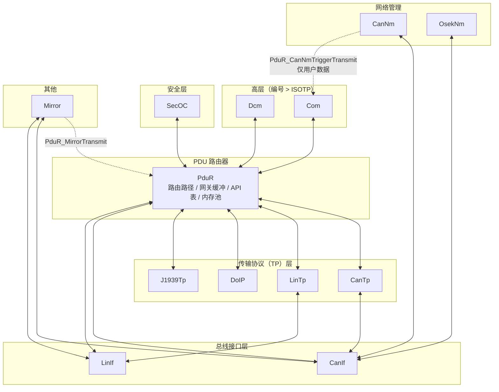
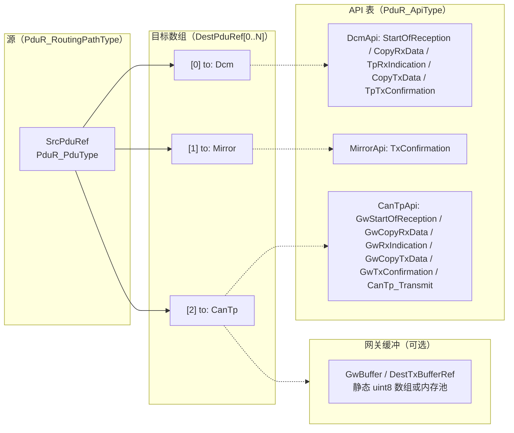
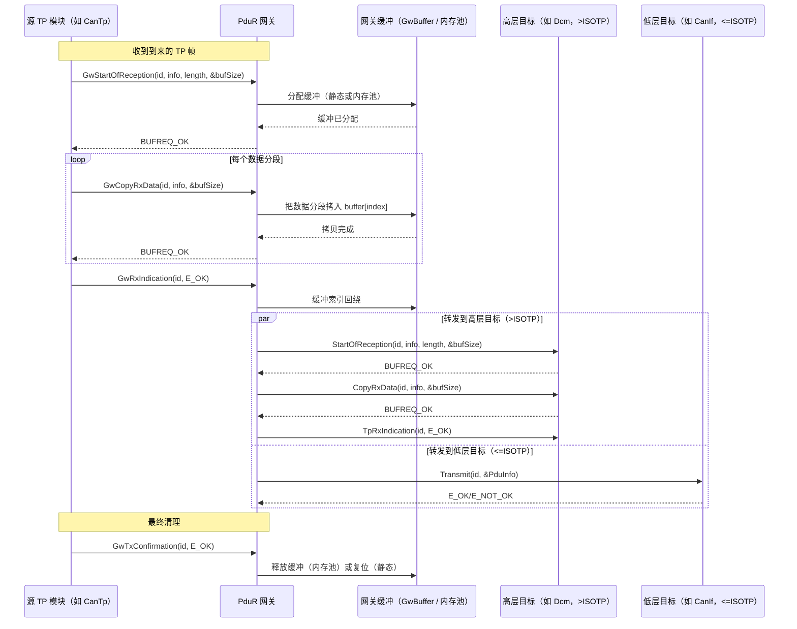

# AUTOSAR PduR 配置概览

AUTOSAR 中的 **PDU Router（PduR，PDU 路由模块）** 通过在系统中路由协议数据单元（PDU）来管理各软件模块（如 `CanTp`、`Dcm`、`LinTp`）之间的通信。本文介绍如何配置PduR 的路由规则（routines）、网络（networks）、内存池（memory）和网关缓冲区（buffers），以及 JSON 定义与自动代码生成机制。

---

## 1. 核心概念

### 1.1 什么是 PduR

PduR 是一个软件路由器：

* 在高层模块之间路由 PDU（例如 `Dcm` 与 `CanTp` 之间）；
* 支持网关场景（例如通过 `CanTp` 与 `CanTp` 之间把 CAN PDU 路由到另一个 CAN 网络）；
* 物理总线通信依赖 `Com` 和 `CanIf`（PduR 本身不直接操作硬件）。

### 1.2 关键组成

* **Routines（路由规则）**：定义路由路径，把一个 PDU 从源模块映射到一个或多个目标模块；
* **Networks（网络）**：定义逻辑通信通道（如 `CAN0`、`LIN0`），用于从 DBC 文件自动生成路由规则；
* **Memory（内存池）**：PduR 内部缓冲使用的内存池配置；
* **Buffers（缓冲区）**：TP 网关场景使用的网关缓冲池。

### 1.3 支持的模块

`from` / `to` 字段使用以下模块标识：

| 模块 | 类型 | 说明 |
| --- | --- | --- |
| `CanIf` | 低层模块 | CAN 接口层 |
| `CanTp` | 传输协议（TP） | CAN 传输协议 |
| `LinTp` | 传输协议（TP） | LIN 传输协议 |
| `DoIP` | 传输协议（TP） | DoIP 传输协议 |
| `J1939Tp` | 传输协议（TP） | J1939 传输协议 |
| `Dcm` | 高层模块 | 诊断通信管理 |
| `Com` | 低层模块 | 基于信号的通信 |
| `OsekNm` | 网络管理 | OSEK 网络管理 |
| `CanNm` | 网络管理 | CAN 网络管理 |
| `PduR` | 路由器 | PDU Router（自引用） |
| `SecOC` | 安全 | 安全车载通信 |
| `Mirror` | 镜像 | 用于测试/观测的 Mirror 模块 |

> **TP 模块**：`DoIP`、`CanTp`、`LinTp`、`J1939Tp` - 当 `from` 和 `to` 都是 TP 模块时，判定为**网关**场景，生成网关专用代码（缓冲、拷贝函数等）。
>
> **高层模块**：`Dcm` - 目标为 Dcm 的路由按高优先级诊断路径处理。
>
> **低层模块**：TP 模块加 `CanIf` - 除 Dcm 外的所有其他模块。

### 1.4 PduR 架构总览

下图展示 PduR 位于 AUTOSAR 通信栈中心，在高层模块（Dcm、Com）、安全模块（SecOC）、传输协议（CanTp、LinTp、DoIP、J1939Tp）和总线接口（CanIf、LinIf）之间路由 PDU。Mirror 通过 `PduR_MirrorTransmit` 从 PduR 获得路由出的 PDU，但镜像帧直接发送到CanIf/LinIf。CanNm 和 OsekNm 完全绕过 PduR，直接与 CanIf 通信。



**分层边界**：`ISOTP` 边界（模块编号 > 8）把高层模块（Dcm、Com、SecOC、Mirror）与低层模块（CanIf、CanTp、LinTp、DoIP、J1939Tp、CanNm、OsekNm）分开。该边界决定网关转发行为 - 高层目标通过 TP 回调接收数据，低层目标则通过直接调用 `Transmit` 接收数据。

---

## 2. 完整 PduR JSON 配置

```json
{
  "class": "PduR",

  "routines": [
    {
      "name": "P2P_RX",
      "from": "CanTp",
      "to": "Dcm"
    },
    {
      "name": "P2P_TX",
      "from": "Dcm",
      "to": "CanTp"
    }
  ],

  "networks": [
    {
      "name": "CAN0",
      "network": "CAN",
      "me": "AS",
      "use_dbc": true,
      "dbc": "CAN0.dbc",
      "ignore": ["IGNORED_MSG"]
    }
  ],

  "memory": [
    {
      "name": "MyPool",
      "size": 256,
      "number": 2
    }
  ],

  "buffers": [
    {
      "name": "GwBuf",
      "size": 4096
    }
  ]
}
```

---

## 3. Routines 路由规则配置

### 3.1 概述

Routines 定义 **PDU 如何在模块之间路由**。每条规则把一个 PDU 从源模块映射到一个或多个目标模块。生成器为每条规则分配唯一索引（宏 `PDUR_<name>`），并生成源/目标 PDU结构体。

### 3.2 规则参数

| 参数 | 类型 | 必需 | 默认值 | 说明 |
| --- | --- | --- | --- | --- |
| `name` | string | 是 | - | PDU 名称，引用自 `EcuC.Pdus[].name`，用于生成 `PDUR_<name>` 宏 |
| `from` | string | 是 | - | 源模块，取值：`CanIf`、`CanTp`、`OsekNm`、`CanNm`、`PduR`、`Dcm`、`Com`、`LinTp`、`DoIP`、`J1939Tp`、`SecOC`、`Mirror` |
| `to` | string | 是 | - | 目标模块，枚举同 `from` |
| `useDest` | bool | 否 | `true` | 启用/禁用 `dest` 字段；为 `false` 时忽略 `dest`，目标 PDU 名直接使用 `name` |
| `dest` | string | 否 | `name` | 替代的目标 PDU 名，仅在 `useDest` 为 `true` 时生效；设置后目标 PDU 标识使用该名称，同时生成 `PDUR_<name>` 和 `PDUR_<dest>` 两个宏 |
| `useDestBuffer` | bool | 否 | `false` | 启用/禁用网关缓冲配置；为 `true` 时 `DestBufferType`、`DestBuffer`、`DestBufferSize` 生效 |
| `DestBufferType` | string | 否 | `private` | 网关缓冲类型：`"private"` 分配大小为 `DestBufferSize` 的专用缓冲；`"shared"` 通过 `DestBuffer` 名引用 `buffers[]` 中预定义的缓冲。仅在 `useDestBuffer` 为 `true` 时生效 |
| `DestBuffer` | string | 否 | - | `buffers[]` 中预定义的共享网关缓冲名，仅在 `useDestBuffer` 为 `true` 且 `DestBufferType` 为 `"shared"` 时生效 |
| `DestBufferSize` | integer | 否 | 0 | 本规则专用私有网关缓冲的大小；当 > 0 且 `useDestBuffer` 为 `true`、`DestBufferType` 为 `"private"` 时，分配私有的 `PduR_GwBuffer_<name>` |
| `useFake` | bool | 否 | `true` | 启用/禁用 `fake` 字段；为 `false` 时忽略 `fake`，不生成 fake PDU 宏 |
| `fake` | string | 否 | - | 镜像路由使用的 fake PDU 名，仅在 `useFake` 为 `true` 时生效；生成指向同一索引的附加宏 `PDUR_<fake>` |
| `destinations` | array | 否 | - | 多播/镜像路由的附加目标，每个条目可把 PDU 复制到其他模块 |

#### 3.2.1 附加目标条目参数

| 参数 | 类型 | 必需 | 默认值 | 说明 |
| --- | --- | --- | --- | --- |
| `name` | string | 是 | - | 该附加分支的目标 PDU 名 |
| `to` | string | 是 | - | 目标模块（枚举同规则的 `to`）；`from` 继承父规则 |
| `useFake` | bool | 否 | `false` | 是否为该目标启用 fake PDU 名 |
| `fake` | string | 否 | - | 该目标分支镜像路由的 fake PDU 名，仅在父规则 `useFake` 为 `true` 时生效 |

### 3.3 网关判定

当 `from` 和 `to`（或任一 `destinations[].to`）都是 **TP 模块**（`DoIP`、`CanTp`、`LinTp`、`J1939Tp`）时，生成器：

1. 置 `hasGW = true`，生成 `PDUR_USE_TP_GATEWAY` 宏；
2. 把 TP 到 TP 的目标放在目标数组**最前面**（网关路径优先）；
3. 分配运行时网关缓冲结构 `PduR_BufferType`；
4. 为相关模块生成网关专用回调（`PduR_<Mod>GwStartOfReception`、`PduR_<Mod>GwCopyRxData`、`PduR_<Mod>GwRxIndication` 等）。

### 3.4 目标缓冲指定

对需要数据缓冲的网关规则，先把 `useDestBuffer` 置为 `true`，再通过`DestBufferType` 选择缓冲类型：

* **`DestBufferType = "private"`**：为本规则分配专用`uint8_t PduR_GwBuffer_<name>[<DestBufferSize>]`，大小由 `DestBufferSize` 指定；
* **`DestBufferType = "shared"`**：通过 `DestBuffer` 按名引用 `buffers[]` 中预定义的缓冲。

`useDestBuffer` 为 `false` 时不使用专用网关缓冲（`NULL`）。

### 3.5 代码生成行为

对每条规则，生成器输出：

* **宏**：`#define PDUR_<name> <index>` - 路由路径的唯一从零开始索引；
* **源 PDU**：`PduR_SrcPdu_<from>_<to>_<name>` - 包含模块 ID、PDU ID 和 API 表指针；
* **目标 PDU 数组**：`PduR_DstPdu_<from>_<to>_<name>[]` - 目标 PDU 条目数组；
* **路由路径**：`PduR_RoutingPaths[]` 表中的一个条目，把源与各目标（及可选网关缓冲）连接起来。

下图展示路由路径数据结构以及一个源 PDU 如何扇出到多个目标：



**路由模式**：

| API | 扇出范围 | 目标 | 是否支持网关 |
| --- | --- | --- | --- |
| `PduR_Transmit` / `PduR_RxIndication` | 所有目标 | DestPduRef[0..N] | 否 |
| `PduR_TpTransmit` | 仅第一个 | DestPduRef[0] | 是（使用 GwBuffer） |
| `PduR_StartOfReception` / `CopyRxData` / `TpRxIndication` | 仅第一个 | DestPduRef[0] | 否 |
| `PduR_CopyTxData` / `TxConfirmation` | 仅源 | SrcPduRef | 是（使用 GwBuffer） |
| `PduR_Gw*` | 网关专用 | 缓冲 -> DestPduRef[0..N] | 是 |

### 3.6 示例：基础诊断路由

```json
{
  "name": "DiagRequest_RX",
  "from": "CanTp",
  "to": "Dcm"
}
```

把 PDU 从 `CanTp`（传输层）路由到 `Dcm`（诊断管理）。

### 3.7 示例：带私有缓冲的网关

```json
{
  "name": "CAN0_Diag",
  "from": "CanTp",
  "to": "DoIP",
  "DestBufferSize": 2048
}
```

把 PDU 从 `CanTp` 路由到 `DoIP`，使用专用的 2048 字节网关缓冲。

### 3.8 示例：带 Mirror 的多目标路由

```json
{
  "name": "CAN1_MSG",
  "from": "CanIf",
  "to": "Com",
  "destinations": [
    {
      "name": "CAN1_MSG_MIRROR",
      "to": "Mirror",
      "from": "CanIf"
    }
  ]
}
```

把 CAN 报文路由到 `Com`，同时镜像一份到 `Mirror` 模块用于监测。

### 3.9 示例：使用共享缓冲的网关

```json
{
  "name": "J1939_To_CanTp",
  "from": "J1939Tp",
  "to": "CanTp",
  "DestBuffer": "GwBuf"
}
```

把 PDU 从 `J1939Tp` 路由到 `CanTp`，使用名为 `GwBuf`（在 `buffers[]` 中定义）的共享缓冲。

### 3.10 生成的宏

每条规则在 `PduR_Cfg.h` 中生成以下宏：

```
#define PDUR_<name>                   <index>
#define PDUR_<dest>                   <index>    // 仅当 dest != name
#define PDUR_<fake>                   <index>    // 仅当设置了 fake
#define PDUR_<destinations[i].name>  <index>    // 每个附加目标
#define PDUR_<destinations[i].fake>  <index>    // 每个带 fake 的附加目标
```

---

## 4. Networks 网络配置

### 4.1 用途

Networks 定义**逻辑通信通道**（如 CAN0、LIN0），用于**从 DBC 文件自动生成路由规则**。与 `CanIf`（负责物理总线配置）不同，PduR 的 networks 关注**模块间路由的自动发现**。

### 4.2 网络参数

| 参数 | 类型 | 必需 | 默认值 | 说明 |
| --- | --- | --- | --- | --- |
| `name` | string | 是 | `CAN?` | 网络逻辑名（如 `CAN0`），用作生成 PDU 符号的前缀 |
| `network` | string | 是 | - | 物理网络类型，必须为 `"CAN"` 或 `"LIN"`；决定低层模块：`CAN` -> `CanIf`，`LIN` -> `LinIf` |
| `me` | string | 是 | `AS` | 自身节点名。`node == me` 的报文视为**发送**（`Com` -> `CanIf`/`LinIf`），其余视为**接收**（`CanIf`/`LinIf` -> `Com`） |
| `use_dbc` | boolean | 否 | `false` | 启用基于 DBC 的路由自动生成；为 `true` 时 `dbc` 必须指向有效文件 |
| `dbc` | string | 条件需要 | `""` | Vector CAN DBC 文件路径，相对于配置目录解析；`use_dbc` 为 `true` 时必需 |
| `ignore` | array | 否 | - | 从 DBC 自动生成中排除的 PDU/报文名列表 |

### 4.3 基于 DBC 的自动生成

`use_dbc` 为 `true` 时，生成器的 `extract()` 函数：

1. 读取 DBC 文件并提取全部报文；
2. 对每个**不在** `ignore` 中的报文：
   * 若 `msg.node == me`（自身发送）：生成 **TX 路由**（`from: "Com"` -> `to: "CanIf"`/`"LinIf"`），PDU 名加后缀 `_TX`；
   * 若 `msg.node != me`（接收他人报文）：生成 **RX 路由**（`from: "CanIf"`/`"LinIf"` -> `to: "Com"`），PDU 名加后缀 `_RX`；
3. 把生成的路由规则写入输出目录的 `PduR.json`。

> 常用后缀：接收为 `_RX`，发送为 `_TX`。生成器会检查后缀，缺失时自动补上。

### 4.4 示例：基于 DBC 的网络

```json
{
  "name": "CAN0",
  "network": "CAN",
  "me": "AS",
  "use_dbc": true,
  "dbc": "config/CAN0.dbc",
  "ignore": ["DEBUG_MSG", "TEST_MSG"]
}
```

为 `CAN0.dbc` 中除 `DEBUG_MSG` 和 `TEST_MSG` 之外的所有报文生成路由规则。

---

## 5. Memory 内存配置

### 5.1 用途

`memory` 数组定义 PduR 内部数据缓冲使用的**内存池**。配置后生成`PDUR_USE_MEMPOOL` 宏，并输出 `MemCluster` 定义。

### 5.2 内存参数

| 参数 | 类型 | 必需 | 默认值 | 说明 |
| --- | --- | --- | --- | --- |
| `name` | string | 是 | - | 内存池名，用作 cluster 标识 |
| `size` | integer | 否 | 256 | 每个内存块的字节数，范围 0 - 4294967295 |
| `number` | integer | 否 | 2 | 池中内存块数量，范围 0 - 4294967295 |

### 5.3 示例

```json
"memory": [
  {
    "name": "PduR_MemPool",
    "size": 512,
    "number": 4
  }
]
```

创建名为 `PduR_MemPool` 的内存池，含 4 个各 512 字节的内存块。

### 5.4 代码生成

存在 `memory` 时，生成器：

* 在头文件中写入 `#define PDUR_USE_MEMPOOL`；
* 通过 `MC.Gen_Macros()` 生成 `MemCluster` 宏；
* 通过 `MC.Gen_Defs()` 生成内存池定义；
* 在 `PduR_Config` 中引用 `&MC_PduR`。

---

## 6. Buffers 缓冲区配置

### 6.1 用途

`buffers` 数组定义**共享网关缓冲池**，可被多条路由规则通过 `DestBuffer` 参数引用，用于 TP 到 TP 网关场景中的临时数据存储。

### 6.2 缓冲参数

| 参数 | 类型 | 必需 | 默认值 | 说明 |
| --- | --- | --- | --- | --- |
| `name` | string | 是 | - | 缓冲名，被路由规则的 `DestBuffer` 引用 |
| `size` | integer | 否 | 4096 | 缓冲字节数，范围 0 - 4294967295 |

### 6.3 示例

```json
"buffers": [
  {
    "name": "GwBuf",
    "size": 8192
  }
]
```

分配静态缓冲 `uint8_t PduR_GwBuffer_GwBuf[8192]`。

### 6.4 代码生成

每个缓冲条目生成：

```c
static uint8_t PduR_GwBuffer_<name>[<size>];
```

---

## 7. 配置开关

以下构建期配置开关由宏控制：

| 宏 | 说明 | 默认值 |
| --- | --- | --- |
| `PDUR_USE_PB_CONFIG` | 启用 post-build 配置支持 | 启用 |
| `PDUR_USE_MEMPOOL` | 启用内存池支持 | 配置了 `memory` 时启用 |
| `PDUR_USE_TP_GATEWAY` | 启用 TP 到 TP 网关支持 | 存在 TP 到 TP 路由时启用 |

`PDUR_USE_PB_CONFIG` 宏由 PduR 配置级的 `UsePostBuildConfig` 选项控制（默认`true`）；置为 `false` 时该宏被注释掉。

---

## 8. 公共 API 参考

PduR 公共 API 定义在 [PduR.h](../../infras/include/PduR.h)，遵循 AUTOSAR CP 4.4.0。

### 8.1 错误码

| 宏 | 值 | 说明 |
| --- | --- | --- |
| `PDUR_E_PDU_ID_INVALID` | 0x02 | PDU ID 超出有效范围 |
| `PDUR_E_ROUTING_PATH_GROUP_ID_INVALID` | 0x08 | 路由路径组 ID 无效 |
| `PDUR_E_PARAM_POINTER` | 0x09 | 向 API 传入空指针 |

### 8.2 核心 API 函数

| 函数 | 说明 |
| --- | --- |
| `PduR_Init(const PduR_ConfigType *ConfigPtr)` | 初始化 PduR 模块；定义了 `PDUR_USE_MEMPOOL` 时调用 `PduR_MemInit()` 初始化内存池 |
| `PduR_EnableRouting(PduR_RoutingPathGroupIdType id)` | 使能一个路由路径组 |
| `PduR_DisableRouting(PduR_RoutingPathGroupIdType id, boolean initialize)` | 禁用一个路由路径组 |
| `PduR_GetVersionInfo(Std_VersionInfoType *versionInfo)` | 返回 PduR 模块版本信息：vendor `STD_VENDOR_ID_AS`、module `MODULE_ID_PDUR`、版本 4.0.0 |

### 8.3 各模块适配 API

每个接入模块暴露一组适配函数作为 PduR 的回调入口，定义在各模块专用头文件中：

#### CanIf 模块（[PduR_CanIf.h](../../infras/include/PduR_CanIf.h)）

| 函数 | 方向 | 说明 |
| --- | --- | --- |
| `PduR_CanIfRxIndication(RxPduId, PduInfoPtr)` | Rx | 把 CAN 接收指示转发给 PduR 路由，委托给 `PduR_RxIndication()` |
| `PduR_CanIfTxConfirmation(TxPduId, result)` | Tx | 转发 CAN 发送确认，委托给 `PduR_TxConfirmation()` |

#### CanTp 模块（[PduR_CanTp.h](../../infras/include/PduR_CanTp.h)）

| 函数 | 说明 |
| --- | --- |
| `PduR_CanTpStartOfReception(id, info, TpSduLength, bufferSizePtr)` | 委托给 `PduR_StartOfReception()` |
| `PduR_CanTpCopyRxData(id, info, bufferSizePtr)` | 委托给 `PduR_CopyRxData()` |
| `PduR_CanTpCopyTxData(id, info, retry, availableDataPtr)` | 委托给 `PduR_CopyTxData()` |
| `PduR_CanTpRxIndication(id, result)` | 委托给 `PduR_TpRxIndication()` |
| `PduR_CanTpTxConfirmation(id, result)` | 委托给 `PduR_TxConfirmation()` |
| `PduR_CanTpGwStartOfReception(id, info, TpSduLength, bufferSizePtr)` | 网关：委托给 `PduR_GwStartOfReception()` |
| `PduR_CanTpGwCopyRxData(id, info, bufferSizePtr)` | 网关：委托给 `PduR_GwCopyRxData()` |
| `PduR_CanTpGwCopyTxData(id, info, retry, availableDataPtr)` | 网关：委托给 `PduR_GwCopyTxData()` |
| `PduR_CanTpGwRxIndication(id, result)` | 网关：先调用 `LINTP_GW_USER_HOOK_RX_IND`，再委托给 `PduR_GwRxIndication()` |
| `PduR_CanTpGwTxConfirmation(id, result)` | 网关：委托给 `PduR_GwTxConfirmation()` |

#### Com 模块（[PduR_Com.h](../../infras/include/PduR_Com.h)）

| 函数 | 说明 |
| --- | --- |
| `PduR_ComTransmit(TxPduId, PduInfoPtr)` | 委托给 `PduR_Transmit()` |
| `PduR_ComRxIndication(RxPduId, PduInfoPtr)` | 委托给 `PduR_RxIndication()` |
| `PduR_ComTxConfirmation(TxPduId, result)` | 委托给 `PduR_TxConfirmation()` |
| `PduR_ComTriggerTransmit(TxPduId, PduInfoPtr)` | 触发发送（SWS_PduR_00369） |

#### Dcm 模块（[PduR_Dcm.h](../../infras/include/PduR_Dcm.h)）

| 函数 | 说明 |
| --- | --- |
| `PduR_DcmTransmit(TxPduId, PduInfoPtr)` | 委托给 `PduR_TpTransmit()` |
| `PduR_DcmCancelTransmit(TxPduId)` | 取消正在进行的 TP 发送 |
| `PduR_DcmCancelReceive(RxPduId)` | 取消正在进行的 TP 接收 |

#### DoIP 模块（[PduR_DoIP.h](../../infras/include/PduR_DoIP.h)）

| 函数 | 说明 |
| --- | --- |
| `PduR_DoIPStartOfReception(id, info, TpSduLength, bufferSizePtr)` | 委托给 `PduR_StartOfReception()` |
| `PduR_DoIPCopyRxData(id, info, bufferSizePtr)` | 委托给 `PduR_CopyRxData()` |
| `PduR_DoIPCopyTxData(id, info, retry, availableDataPtr)` | 委托给 `PduR_CopyTxData()` |
| `PduR_DoIPRxIndication(id, result)` | 委托给 `PduR_TpRxIndication()` |
| `PduR_DoIPTxConfirmation(id, result)` | 委托给 `PduR_TxConfirmation()` |
| `PduR_DoIPGwStartOfReception(id, info, TpSduLength, bufferSizePtr)` | 网关：委托给 `PduR_GwStartOfReception()` |
| `PduR_DoIPGwCopyRxData(id, info, bufferSizePtr)` | 网关：委托给 `PduR_GwCopyRxData()` |
| `PduR_DoIPGwCopyTxData(id, info, retry, availableDataPtr)` | 网关：委托给 `PduR_GwCopyTxData()` |
| `PduR_DoIPGwRxIndication(id, result)` | 网关：委托给 `PduR_GwRxIndication()` |
| `PduR_DoIPGwTxConfirmation(id, result)` | 网关：委托给 `PduR_GwTxConfirmation()` |

#### J1939Tp 模块（[PduR_J1939Tp.h](../../infras/include/PduR_J1939Tp.h)）

| 函数 | 说明 |
| --- | --- |
| `PduR_J1939TpTransmit(TxPduId, PduInfoPtr)` | 委托给 `PduR_TpTransmit()` |
| `PduR_J1939TpStartOfReception(id, info, TpSduLength, bufferSizePtr)` | 委托给 `PduR_StartOfReception()` |
| `PduR_J1939TpCopyRxData(id, info, bufferSizePtr)` | 委托给 `PduR_CopyRxData()` |
| `PduR_J1939TpCopyTxData(id, info, retry, availableDataPtr)` | 委托给 `PduR_CopyTxData()` |
| `PduR_J1939TpRxIndication(id, result)` | 委托给 `PduR_TpRxIndication()` |
| `PduR_J1939TpTxConfirmation(id, result)` | 委托给 `PduR_TxConfirmation()` |

#### LinTp 模块（[PduR_LinTp.h](../../infras/include/PduR_LinTp.h)）

函数集与 CanTp 相同（StartOfReception、CopyRxData、CopyTxData、RxIndication、TxConfirmation 加网关变体）。

#### SecOC 模块（[PduR_SecOC.h](../../infras/include/PduR_SecOC.h)）

| 函数 | 说明 |
| --- | --- |
| `PduR_SecOCTransmit(TxPduId, PduInfoPtr)` | 委托给 `PduR_Transmit()` |
| `PduR_SecOCRxIndication(RxPduId, PduInfoPtr)` | 委托给 `PduR_RxIndication()` |
| `PduR_SecOCTxConfirmation(TxPduId, result)` | 委托给 `PduR_TxConfirmation()` |
| `PduR_SecOCTriggerTransmit(TxPduId, PduInfoPtr)` | 触发发送 |

#### Mirror 模块（[PduR_Mirror.h](../../infras/include/PduR_Mirror.h)）

| 函数 | 说明 |
| --- | --- |
| `PduR_MirrorTransmit(TxPduId, PduInfoPtr)` | 委托给 `PduR_TpTransmit()` |

---

## 9. 内部数据结构

私有头文件 [PduR_Priv.h](../../infras/communication/PduR/PduR_Priv.h) 定义核心运行时数据结构。

### 9.1 模块枚举（`PduR_ModuleType`）

```c
typedef enum {
  PDUR_MODULE_CANIF,    // 0 - CAN 接口层
  PDUR_MODULE_CANTP,    // 1 - CAN 传输协议
  PDUR_MODULE_J1939TP,  // 2 - J1939 传输协议
  PDUR_MODULE_LINIF,    // 3 - LIN 接口层
  PDUR_MODULE_LINTP,    // 4 - LIN 传输协议
  PDUR_MODULE_DOIP,     // 5 - DoIP 传输协议
  PDUR_MODULE_CANNM,    // 6 - CAN 网络管理
  PDUR_MODULE_OSEKNM,   // 7 - OSEK 网络管理
  /* ---- 边界 ---- */
  PDUR_MODULE_ISOTP,    // 8 - ISO-TP 边界标记
  PDUR_MODULE_SECOC,    // 9 - 安全车载通信
  PDUR_MODULE_COM,      // 10 - 通信（基于信号）
  PDUR_MODULE_DCM,      // 11 - 诊断通信管理
  PDUR_MODULE_MIRROR,   // 12 - Mirror 模块
} PduR_ModuleType;
```

> **架构意义**：编号不大于 `PDUR_MODULE_ISOTP`（0-8）的模块视为"低层"模块，编号在其上（9-12）的为"高层"模块。这会影响网关路由行为（见网关数据流一节）。

### 9.2 API 函数指针表（`PduR_ApiType`）

每个模块注册一张含 7 个函数指针的表：

```c
typedef struct {
  BufReq_ReturnType (*StartOfReception)(PduIdType, const PduInfoType*,
                                        PduLengthType, PduLengthType*);
  BufReq_ReturnType (*CopyRxData)(PduIdType, const PduInfoType*, PduLengthType*);
  void (*TpRxIndication)(PduIdType, Std_ReturnType);
  void (*RxIndication)(PduIdType, const PduInfoType*);
  Std_ReturnType (*Transmit)(PduIdType, const PduInfoType*);
  BufReq_ReturnType (*CopyTxData)(PduIdType, const PduInfoType*,
                                  const RetryInfoType*, PduLengthType*);
  void (*TxConfirmation)(PduIdType, Std_ReturnType);
} PduR_ApiType;
```

未使用的回调允许为 NULL 指针，每个模块只填写自己支持的回调。

### 9.3 PDU 描述符（`PduR_PduType`）

```c
typedef struct {
  PduR_ModuleType Module;    // 模块标识（枚举）
  PduIdType PduHandleId;     // 该模块侧的 PDU 标识
  const PduR_ApiType *api;   // 指向模块 API 表
} PduR_PduType;
```

### 9.4 网关缓冲（`PduR_BufferType`）

```c
typedef struct {
  uint8_t *data;         // 缓冲数据指针
  PduLengthType size;    // 缓冲总大小
  PduLengthType index;   // 当前读写位置
} PduR_BufferType;
```

### 9.5 路由路径（`PduR_RoutingPathType`）

```c
typedef struct {
  const PduR_PduType *SrcPduRef;          // 源 PDU 描述符
  const PduR_PduType *DestPduRef;         // 目标 PDU 数组（首条目）
  PduR_BufferType *DestTxBufferRef;       // 网关发送缓冲（可选）
  uint8_t *GwBuffer;                      // 静态网关目标缓冲
  PduLengthType GwBufferSize;             // 静态缓冲大小
  uint16_t numOfDestPdus;                 // 目标条目数量
} PduR_RoutingPathType;
```

### 9.6 配置结构

```c
struct PduR_Config_s {
#if defined(PDUR_USE_MEMPOOL)
  const mem_cluster_t *mc;    // 内存池 cluster 描述符
#endif
  const PduR_RoutingPathType *RoutingPaths;  // 所有路由路径数组
  uint16_t numOfRoutingPaths;                // 路由路径数量
};
```

---

## 10. 路由路径处理

每个 PduR API 函数根据路径配置遵循特定的路由模式。

### 10.1 发送路由（`PduR_Transmit`）

1. 校验 `pathId` 是否小于 `numOfRoutingPaths`（失败上报`PDUR_E_PDU_ID_INVALID`）；
2. 校验 `PduInfoPtr` 和 `PduInfoPtr->SduDataPtr`（失败上报`PDUR_E_PARAM_POINTER`）；
3. 遍历**所有**目标（`DestPduRef[0..numOfDestPdus-1]`）；
4. 调用每个目标的 `Transmit` 回调；
5. 只有**全部**发送成功才返回 `E_OK`，否则返回第一个失败码。

### 10.2 TP 发送路由（`PduR_TpTransmit`）

1. 只路由到 `DestPduRef[0]`（仅**第一个**目标，不是全部）；
2. 若存在网关缓冲（`DestTxBufferRef != NULL`），使用 `pathId` 作为 PDU 句柄；
3. 否则使用目标自身的 `PduHandleId`。

### 10.3 TP 接收序列（`PduR_StartOfReception` -> `PduR_CopyRxData` ->
`PduR_TpRxIndication`）

三个函数都只路由到 `DestPduRef[0]`：

* **StartOfReception**：新的 TP 接收开始时调用，返回所需缓冲大小；
* **CopyRxData**：拷贝接收到的数据分段；
* **TpRxIndication**：TP 接收完成（成功或失败）时调用。

### 10.4 接收指示路由（`PduR_RxIndication`）

* 遍历**所有**目标（与 `PduR_Transmit` 相同）；
* 调用每个目标的 `RxIndication` 回调。

### 10.5 发送数据拷贝与确认路由（`PduR_CopyTxData`、
`PduR_TxConfirmation`）

* 路由到 `SrcPduRef`（**源**模块，不是目标）；
* 若存在网关缓冲，使用 `pathId` 作为 PDU 句柄；
* 否则使用源自身的 `PduHandleId`。

### 10.6 句柄 ID 选择逻辑

全局使用一致的模式：当 `DestTxBufferRef` 不为 NULL（网关模式）时，`pathId` 本身作为 PDU 句柄 ID；否则使用模块配置的 `PduHandleId`：

```
if (RoutingPath->DestTxBufferRef != NULL)
    PduHandleId = pathId;                    // 使用路由路径索引
else
    PduHandleId = DestPduRef->PduHandleId;   // 使用模块自身 PDU ID
```

---

## 11. 网关数据流

网关路由处理 TP 到 TP 转发（如 `CanTp` 与 `DoIP`、`CanTp` 与 `LinTp` 之间）。网关机制使用内部缓冲先暂存完整 TP 报文，再转发。

### 11.1 网关接收流程

下图展示一次 TP 到 TP 网关转发的完整生命周期：



### 11.2 `PduR_GwStartOfReception` - 缓冲分配

1. 若配置了**静态**缓冲（`GwBuffer != NULL` 且`GwBufferSize >= TpSduLength`）：
   * 直接使用静态缓冲：`buffer->data = RoutingPath->GwBuffer`；
   * 无需动态分配。
2. 若无静态缓冲或大小不足，回退到**内存池**（`PDUR_USE_MEMPOOL`）：
   * 先释放此前分配的动态缓冲；
   * 调用 `PduR_MemAlloc(TpSduLength)` 按实际所需大小分配。
3. 置 `buffer->size = TpSduLength`、`buffer->index = 0`，返回 `BUFREQ_OK`。

### 11.3 `PduR_GwCopyRxData` - 数据拷贝

* 把 `info->SduDataPtr` 拷入 `buffer->data[buffer->index]`；
* `buffer->index` 前进 `info->SduLength`；
* 检测到缓冲溢出时返回 `BUFREQ_E_OVFL`。

### 11.4 `PduR_GwRxIndication` - 转发逻辑

接收成功（`result == E_OK`）时遍历所有目标：

| 目标模块类型 | 行为 |
| --- | --- |
| **高层**（模块编号 > `PDUR_MODULE_ISOTP`，如 SecOC、Com、Dcm、Mirror） | 依次调用 `StartOfReception` + `CopyRxData` + `TpRxIndication`，把完整缓冲数据作为一次 TP 接收投递 |
| **低层**（模块编号 <= `PDUR_MODULE_ISOTP`，如 CanIf、CanTp、DoIP） | 置 `buffer->index = 0`，直接调用 `Transmit` 把完整缓冲数据作为单个 I-PDU 发出 |

接收失败（`E_NOT_OK`）时，若定义了 `PDUR_USE_MEMPOOL` 且缓冲为动态分配，则通过`PduR_MemFree()` 释放。

### 11.5 网关发送路径

```
PduR_GwCopyTxData()           -- 从缓冲拷到输出（用于重试）
    |
    v
PduR_GwTxConfirmation()       -- 发送成功后释放缓冲
```

### 11.6 `PduR_GwCopyTxData` - 出站数据拷贝

* 从 `info->MetaDataPtr` 读取 `offset`；
* 从 `buffer->data[offset]` 拷贝 `info->SduLength` 字节到`info->SduDataPtr`；
* 更新 offset 并返回 `BUFREQ_OK`。

### 11.7 `PduR_GwTxConfirmation` - 缓冲清理

* 收到发送确认后复位 `buffer->data = NULL`；
* 若定义了 `PDUR_USE_MEMPOOL` 且缓冲为动态分配（不是静态 `GwBuffer`），调用`PduR_MemFree()` 释放。

---

## 12. 零开销优化宏

PduR 支持**零开销路由**宏，可完全绕过 PduR 层实现模块间直连，在编译期消除路由开销。

| 宏 | 效果 |
| --- | --- |
| `PDUR_DCM_CANTP_ZERO_COST` | `PduR_DcmTransmit` -> 直接 `CanTp_Transmit`；`PduR_CanTp*` 回调 -> 直接 `Dcm_*` |
| `PDUR_DCM_LINTP_ZERO_COST` | `PduR_DcmTransmit` -> 直接 `LinTp_Transmit`；`PduR_LinTp*` 回调 -> 直接 `Dcm_*` |
| `PDUR_DCM_J1939TP_ZERO_COST` | `PduR_J1939Tp*` 回调 -> 直接 `Dcm_*` |

使能后，相应适配函数在头文件中被替换为 `#define` 宏，消除函数调用开销并减小代码体积。

[PduR_Dcm.h](../../infras/include/PduR_Dcm.h) 中的示例：

```c
#ifdef PDUR_DCM_CANTP_ZERO_COST
#define PduR_DcmTransmit CanTp_Transmit
#endif
```

[PduR_CanTp.h](../../infras/include/PduR_CanTp.h) 中的示例：

```c
#ifdef PDUR_DCM_CANTP_ZERO_COST
#define PduR_CanTpCopyTxData      Dcm_CopyTxData
#define PduR_CanTpRxIndication    Dcm_TpRxIndication
#define PduR_CanTpTxConfirmation  Dcm_TpTxConfirmation
#define PduR_CanTpStartOfReception Dcm_StartOfReception
#define PduR_CanTpCopyRxData      Dcm_CopyRxData
#endif
```

---

## 13. 用户挂钩

LinTp 网关实现提供用户自定义挂钩宏：

| 挂钩宏 | 位置 | 说明 |
| --- | --- | --- |
| `LINTP_GW_USER_HOOK_RX_IND(id, result)` | [PduR_LinTp.c](../../infras/communication/PduR/PduR_LinTp.c) | 在 `PduR_GwRxIndication()` 之前调用，默认为空操作 |
| `LINTP_GW_USER_HOOK_TX_CONFIRM(id, result)` | [PduR_LinTp.c](../../infras/communication/PduR/PduR_LinTp.c) | 在 `PduR_TxConfirmation()` 之前调用，默认为空操作 |

通过这些挂钩可以在不修改 PduR 核心代码的情况下加入应用定制处理（如日志、统计、流量整形）。

---

## 14. 错误上报（Det 集成）

PduR 与 **Default Error Tracer（Det）** 模块集成，进行运行时诊断错误上报。所有 API使用 `DET_VALIDATE` 宏校验参数：

| 校验 | 错误码 | 上报的 Service ID |
| --- | --- | --- |
| `pathId >= numOfRoutingPaths` | `PDUR_E_PDU_ID_INVALID` | 各函数自有（0x40-0xF5） |
| Transmit 中空指针 | `PDUR_E_PARAM_POINTER` | 0x49 |
| GetVersionInfo 中空指针 | `PDUR_E_PARAM_POINTER` | 0xF1 |

`DET_THIS_MODULE_ID` 设置为 `MODULE_ID_PDUR`。

---

## 15. 内存池内部实现

内存池子系统（[PduR_Mem.c](../../infras/communication/PduR/PduR_Mem.c)）为网关场景提供动态缓冲分配，仅在定义了 `PDUR_USE_MEMPOOL` 时编译。

| 函数 | 说明 |
| --- | --- |
| `PduR_MemInit()` | 通过 `mc_init(config->mc)` 初始化内存池 cluster |
| `PduR_MemAlloc(size)` | 从池中分配 `size` 字节的缓冲 |
| `PduR_MemGet(size)` | 获取下一个可用缓冲但不分配 |
| `PduR_MemFree(buffer)` | 把缓冲归还内存池 |

内存池通过 `memory[]` 配置（见第 5 节），由 `MemPool` 库管理（通过 `SConscript`链接）。

---

## 16. 应用配置示例

### 16.1 基础诊断路由（Bootloader）

来自[app/bootloader/config/PduR/PduR.json](../../app/bootloader/config/PduR/PduR.json)：

```json
{
  "class": "PduR",
  "routines": [
    { "name": "P2P_RX", "from": "CanTp", "to": "Dcm" },
    { "name": "P2P_TX", "from": "Dcm", "to": "CanTp" },
    { "name": "P2A_RX", "from": "CanTp", "to": "Dcm" },
    { "name": "P2A_TX", "from": "Dcm", "to": "CanTp" }
  ]
}
```

简单的诊断请求/响应路由，不含网关和 DBC 支持。

### 16.2 带 SecOC 和 Mirror 的完整应用

来自 [app/app/config/Com/PduR.json](../../app/app/config/Com/PduR.json)：

```json
{
  "class": "PduR",
  "routines": [
    { "name": "P2P_RX", "from": "CanTp", "to": "Dcm" },
    { "name": "P2P_TX", "from": "Dcm", "to": "CanTp" },
    { "name": "P2A_RX", "from": "CanTp", "to": "Dcm",
      "destinations": [{ "name": "P2A_FW_TX", "to": "CanTp", "fake": "P2A_FW_RX" }] },
    { "name": "P2A_TX", "from": "Dcm", "to": "CanTp" },
    { "name": "CAN0_SECOC_MSG0_TX", "from": "Com", "to": "SecOC" },
    { "name": "FW_CAN0_SECOC_MSG0_TX", "from": "SecOC", "to": "CanIf" },
    { "name": "FW_CAN0_SECOC_MSG1_RX", "from": "CanIf", "to": "SecOC" },
    { "name": "CAN0_SECOC_MSG1_RX", "from": "SecOC", "to": "Com" },
    { "name": "MIRROR_TX", "from": "Mirror", "to": "CanIf" }
  ],
  "networks": [
    { "name": "CAN0", "network": "CAN", "me": "AS", "dbc": "CAN0.dbc",
      "ignore": ["CanNmUserData"] },
    { "name": "CAN1", "network": "CAN", "me": "AS", "dbc": "CAN0.dbc",
      "ignore": ["CanNmUserData"] }
  ],
  "memory": [
    { "name": "middle", "size": 64, "number": 2 }
  ]
}
```

展示的关键特性：

* **SecOC 链**：发送为 `Com -> SecOC -> CanIf`，接收为`CanIf -> SecOC -> Com`；
* **多目标**：P2A_RX 带一个附加转发目标（`P2A_FW_TX`，用 `fake` 镜像接收）；
* **Mirror**：`Mirror -> CanIf` 支持测试/监测注入；
* **DBC 网络**：两个 CAN 网络（CAN0、CAN1）共用同一个 DBC 文件；
* **内存池**：2 个 64 字节块用于动态网关缓冲。

### 16.3 经 CanTp 的 SecOC（备份路由）

备用路由路径（注释为 `backup-routines-secoc-test-over-cantp`）演示了把 SecOC 保护的 PDU 经 CanTp 而非 CanIf 路由：

```json
{
  "name": "FW_CAN0_SECOC_MSG0_TX",
  "from": "SecOC",
  "to": "CanTp"
},
{
  "name": "FW_CAN0_SECOC_MSG0_RX",
  "from": "CanTp",
  "to": "SecOC",
  "dest": "CAN0_SECOC_MSG1_RX"
}
```

---

## 17. 构建系统集成

[SConscript](../../infras/communication/PduR/SConscript) 构建脚本：

* 编译 PduR 目录下所有 `.c` 文件；
* 包含所有支持模块的配置路径：`CanIf_Cfg`、`Com_Cfg`、`CanTp_Cfg`、`LinTp_Cfg`、`J1939Tp_Cfg`、`Dcm_Cfg`、`NvM_Cfg`、`SecOC_Cfg`、`Mirror_Cfg`、`DoIP_Cfg`；
* 编译器不是 `CWS12`（HC(S)12 的 CodeWarrior）时链接 `MemPool` 库。

---

## 18. 生成产物

### 18.1 输出文件

生成器在 `<cfg_dir>/GEN/` 下产出两个文件：

| 文件 | 说明 |
| --- | --- |
| `PduR_Cfg.h` | 头文件，含 `PDUR_<name>` 宏、配置开关和 MemCluster 宏 |
| `PduR_Cfg.c` | 源文件，含路由表、API 表、缓冲定义和 `PduR_Config` 结构 |

### 18.2 生成的 API 表

对路由中引用的每个模块生成一张 `PduR_<Module>Api` 表，包含以下函数指针：

```
PduR_ApiType {
  StartOfReception     // TP 接收开始时调用
  CopyRxData           // 拷贝接收数据
  TpRxIndication       // TP 接收完成指示
  RxIndication         // 单帧接收指示（仅 Com）
  Transmit             // 发送函数
  CopyTxData           // 拷贝待发送数据
  TxConfirmation       // 发送确认
}
```

网关模块（`hasGW` 为 true 时）获得网关专用回调：

* `PduR_<Mod>GwStartOfReception`
* `PduR_<Mod>GwCopyRxData`
* `PduR_<Mod>GwRxIndication`
* `PduR_<Mod>GwCopyTxData`
* `PduR_<Mod>GwTxConfirmation`

### 18.3 生成的配置结构

```c
const PduR_ConfigType PduR_Config = {
  &MC_PduR,                // MemCluster 指针（定义 PDUR_USE_MEMPOOL 时）
  PduR_RoutingPaths,       // 路由路径表
  ARRAY_SIZE(PduR_RoutingPaths)  // 路由路径数量
};
```

---

## 19. 使用 `PduR.py` 生成代码

[PduR.py](../../tools/generator/PduR.py) 生成器脚本：

1. **提取配置**：读取模块配置 JSON，调用 `extract()` 处理 DBC 文件并自动生成路由规则；
2. **校验**：确保模块引用正确、DBC 文件存在；
3. **生成代码**：调用 `Gen_PduR()` 在 `GEN/` 输出目录生成 `PduR_Cfg.h` 和`PduR_Cfg.c`。

### 19.1 提取流程（`extract()`）

* 从配置中读取 `routines`、`memory` 和 `buffers`；
* 对每个带 `dbc` 文件的网络：
  * 解析 DBC 路径（绝对路径或相对于 `../`）；
  * 使用 `Com.get_messages()` 解析报文；
  * 按 `node == me` 比较生成 TX/RX 路由；
  * 把更新后的配置写回 `PduR.json`。

### 19.2 生成流程（`Gen_PduR()`）

* 按源模块、再按高/低层目标对路由规则分组；
* 生成含宏和配置开关的头文件；
* 生成源文件，包含：
  * 每个被引用模块的 API 表；
  * 源和目标 PDU 结构体；
  * 网关缓冲分配；
  * `PduR_RoutingPaths[]` 表；
  * `PduR_Config` 结构。

---

## 20. 配置参数汇总

### 20.1 顶层参数

| 节 | 类型 | 必需 | 说明 |
| --- | --- | --- | --- |
| `routines` | array | 是 | PDU 路由规则（至少一条） |
| `networks` | array | 否 | 用于基于 DBC 自动生成的网络定义 |
| `memory` | array | 否 | 内存池配置 |
| `buffers` | array | 否 | 共享网关缓冲池 |

### 20.2 参数参考表

#### 路由规则参数

| 字段 | 类型 | 默认值 | 说明 |
| --- | --- | --- | --- |
| `name` | string | - | PDU 名（引用自 EcuC.Pdus） |
| `from` | enum | - | 源模块 |
| `to` | enum | - | 目标模块 |
| `useDest` | bool | `true` | 启用/禁用替代目标名 |
| `dest` | string | `name` | 替代目标 PDU 名 |
| `useDestBuffer` | bool | `false` | 启用/禁用网关缓冲 |
| `DestBufferType` | string | `private` | `"private"` 或 `"shared"` |
| `DestBuffer` | string | - | 共享网关缓冲名 |
| `DestBufferSize` | int | 0 | 私有网关缓冲大小 |
| `useFake` | bool | `true` | 启用/禁用镜像 fake PDU 名 |
| `fake` | string | - | 镜像用 fake PDU 名 |
| `destinations` | array | - | 附加路由分支 |

#### 网络参数

| 字段 | 类型 | 默认值 | 说明 |
| --- | --- | --- | --- |
| `name` | string | `CAN?` | 网络逻辑名 |
| `network` | enum | - | `"CAN"` 或 `"LIN"` |
| `me` | string | `AS` | 自身节点名 |
| `use_dbc` | bool | `false` | 启用 DBC 解析 |
| `dbc` | string | `""` | DBC 文件路径 |
| `ignore` | array | - | 从 DBC 解析中排除的 PDU |

#### 内存参数

| 字段 | 类型 | 默认值 | 说明 |
| --- | --- | --- | --- |
| `name` | string | - | 内存池名 |
| `size` | int | 256 | 内存块字节数 |
| `number` | int | 2 | 内存块数量 |

#### 缓冲参数

| 字段 | 类型 | 默认值 | 说明 |
| --- | --- | --- | --- |
| `name` | string | - | 缓冲名 |
| `size` | int | 4096 | 缓冲字节数 |
