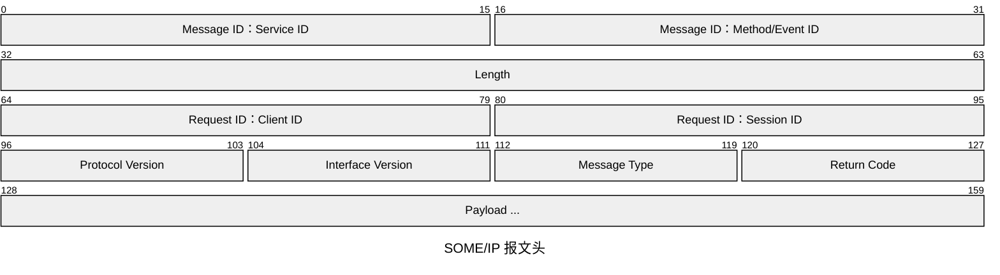
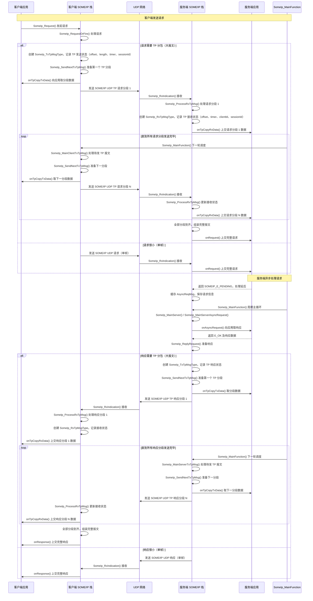
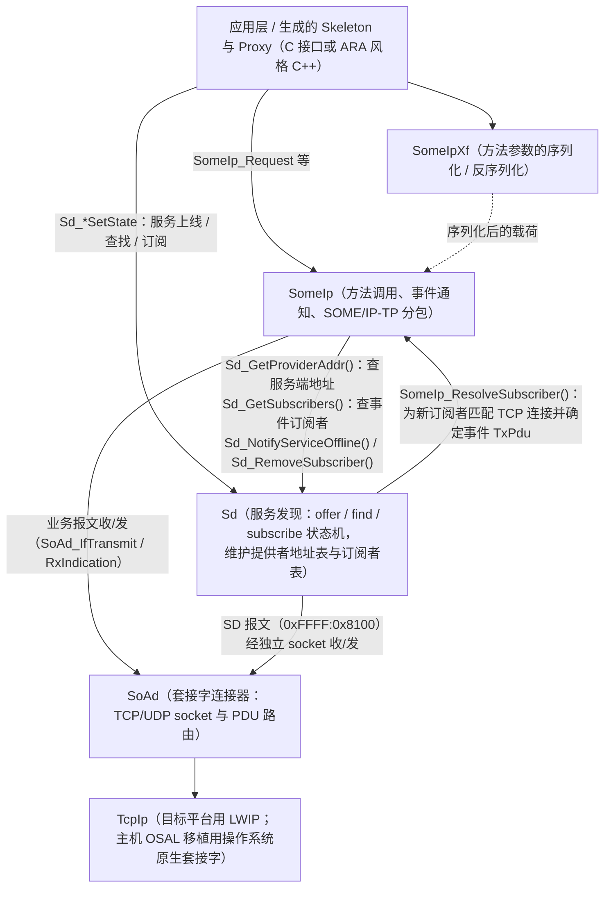
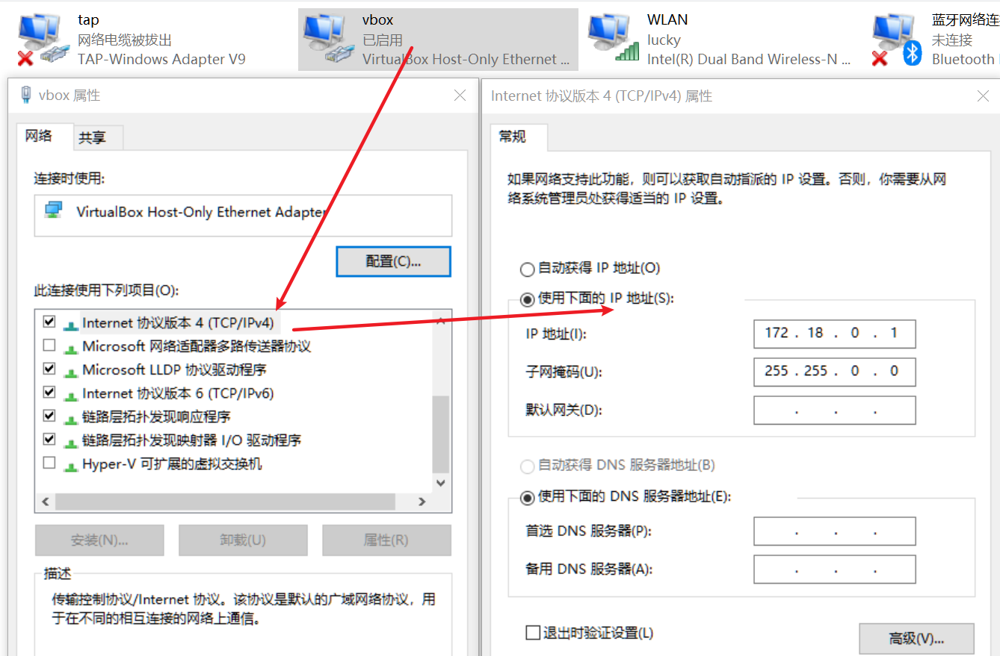
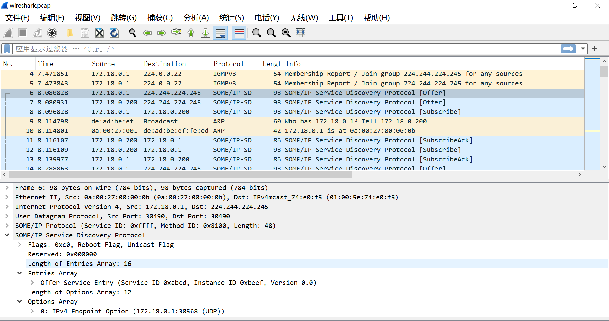

# AUTOSAR SOME/IP 与 SOME/IP-SD

**SOME/IP**（Scalable service-Oriented MiddlewarE over IP）是 AUTOSAR 定义的面向服务的车载以太网通信标准：服务端提供服务（方法、事件、字段），客户端在运行时动态发现并调用，编译期无需任何静态绑定。**SOME/IP-SD**（Service Discovery，服务发现）则是让服务端与客户端在运行时互相找到对方的控制协议。

本文介绍 AS 的 SOME/IP 协议栈、JSON 配置方式，以及无需 ECU 硬件即可在 PC 主机上构建运行的示例程序。

## 目录

1. [协议基础](#一协议基础)
2. [协议栈架构](#二协议栈架构)
3. [配置（Network.json）](#三配置networkjson)
4. [主机示例](#四主机示例)
5. [NetApp / NetAppT（集成应用）](#五netapp--netappt集成应用)
6. [与 vsomeip 互通](#六与-vsomeip-互通)
7. [常见问题](#七常见问题)

## 一、协议基础

SOME/IP 报文由 16 字节报文头加序列化载荷组成：



本协议栈实现的报文类型（见 [SomeIp.c](../../infras/communication/SomeIp/SomeIp.c)）：

| 类型 | 值 | 方向 |
| --- | --- | --- |
| REQUEST | 0x00 | 客户端 -> 服务端，需要响应 |
| REQUEST_NO_RETURN | 0x01 | 客户端 -> 服务端，发后不管 |
| NOTIFICATION | 0x02 | 服务端 -> 客户端，事件通知 |
| RESPONSE | 0x80 | 服务端 -> 客户端，响应 |
| ERROR | 0x81 | 服务端 -> 客户端，错误响应 |
| TP 标志 | 0x20 | 与报文类型按位或，表示 SOME/IP-TP 分包报文 |

单个 UDP 数据报最多承载 1396 字节载荷；更大的载荷使用 SOME/IP-TP 分包传输（每段最多 1392 字节，TP 头中带偏移量）。可靠方法走 TCP。

### SOME/IP-TP 请求/响应流程

下面的时序图给出完整的 UDP 请求/响应 TP 分包流程，其中也包含服务端异步处理模式（`SOMEIP_E_PENDING`）：



要点说明：

1. **`SomeIp_RxIndication()` 的时机**：服务端在客户端发出请求（分段）后很快被回调，客户端在服务端发出响应（分段）后很快被回调。
2. **TP 报文管理**：发送侧用 `SomeIp_TxTpMsgType` 跟踪发送状态（offset、定时器、sessionId），接收侧用 `SomeIp_RxTpMsgType` 跟踪接收状态并组装；`SomeIp_MainFunction` 周期推进待发/待收的 TP 报文，因此主函数必须被周期调度。
3. **异步请求处理**：服务端应用返回 `SOMEIP_E_PENDING` 时，请求被缓存为 `AsyncReqMsg`；之后主函数通过 `onAsyncRequest()` 回调向应用索取已准备好的响应。
4. **回调职责**：`onTpCopyTxData()` 从应用取分段发送数据；`onTpCopyRxData()` 上交收到的分段数据；`onRequest()` 上交完整请求；`onAsyncRequest()` 为挂起的请求取响应；`onResponse()` 向应用上交完整响应。

SOME/IP-SD 本身也是一条 SOME/IP 报文（Service ID 0xFFFF、Method ID 0x8100，UDP），在可配置的组播组上收发。其 Entry 类型（见 [Sd.c](../../infras/communication/Sd/Sd.c)）为：

| Entry | 值 | 作用 |
| --- | --- | --- |
| FindService | 0x00 | 客户端查找服务实例 |
| OfferService | 0x01 | 服务端通告服务实例（周期发送 / 按需响应） |
| SubscribeEventgroup | 0x06 | 客户端订阅事件组 |
| SubscribeEventgroupAck/Nack | 0x07 | 服务端接受/拒绝订阅 |

另外还有对应的 StopOfferService / StopSubscribeEventgroup。每个 Entry 都带 TTL：服务下线或停止订阅时以 TTL = 0 通告，超时后实体自动消失。

## 二、协议栈架构

实现遵循 AUTOSAR CP 4.4 的模块划分，但 **SomeIp 与 Sd 并非严格的上下层，而是并列于 SoAd 之上的两个对等模块**，并通过一组横向接口互相协作：



图中的协作关系均来自代码：

* **SomeIp -> Sd**：客户端发起请求前，调用 `Sd_GetProviderAddr()` 获取 Sd 发现到的服务端地址（再据此打开 TCP 连接）；服务端发送事件通知前，调用 `Sd_GetSubscribers()` 取 Sd 维护的订阅者列表；连接断开或服务下线时调用 `Sd_RemoveSubscriber()` / `Sd_NotifyServiceOffline()`。
* **Sd -> SomeIp**：服务端的 Sd 收到 SubscribeEventgroup Entry 时，调用 `SomeIp_ResolveSubscriber()`，由 SomeIp 在已建立的 TCP 连接中按远端地址匹配订阅者并分配事件 TxPdu（UDP 服务直接取单播 TxPdu；订阅数达到 MulticastThreshold 后，Sd 直接改用组播 TxPdu 并打开组播 socket）。
* **两者共用 SoAd 但通道独立**：SD 报文（Service ID 0xFFFF、Method ID 0x8100）由 Sd 经自己的 socket connector 收/发，业务 SOME/IP 报文走 SomeIp 的连接，SoAd 按 PDU/连接器把上行报文分别指示给 `Sd_RxIndication` 或 `SomeIp_RxIndication`。

相关模块位于 [infras/communication](../../infras/communication)：[SomeIp](../../infras/communication/SomeIp)、[SomeIpXf](../../infras/communication/SomeIpXf)、[Sd](../../infras/communication/Sd)、[SoAd](../../infras/communication/SoAd)，以及可选的 [E2E](../../infras/communication/E2E) 端到端保护模块（P04/P05/P07/P11 等 profile）。

主要公共 API：

* SomeIp：`SomeIp_Request`、`SomeIp_RxIndication`、`SomeIp_SoAdTpStartOfReception`、`SomeIp_MainFunction`（[SomeIp.h](../../infras/include/SomeIp.h)）；
* Sd：`Sd_ServerServiceSetState(handle, SD_SERVER_SERVICE_AVAILABLE/DOWN)`、`Sd_ClientServiceSetState(handle, SD_CLIENT_SERVICE_REQUESTED/RELEASED)`、`Sd_ConsumedEventGroupSetState`、`Sd_MainFunction`（[Sd.h](../../infras/include/Sd.h)）。

应用代码通常不直接调用这些接口：代码生成器会为配置中的每个服务生成 **Skeleton**（服务端）和 **Proxy**（客户端）。生成的 C 接口形如：

```c
/* 服务端 Skeleton */
Std_ReturnType Math_OfferService(void);
Std_ReturnType Math_StopOfferService(void);
Std_ReturnType Math_add(const add_args_Type *args, Result_Type *ret);  /* 由用户实现 */

/* 客户端 Proxy */
Std_ReturnType Math_add_Call(const add_args_Type *args);               /* 异步调用 */
void Math_add_OnResponse(Result_Type *ret);                            /* 由用户实现 */
```

同时也会生成 C++/ARA 风格的版本（`MathSkeleton` / `MathProxy`，使用 `ara::core::Result`、future 与回调），并可选择 vsomeip 后端以实现跨协议栈互通（见第 6 节）。

## 三、配置（Network.json）

所有网络模块由同一个 `Network.json`（class 为 `Net`）配置。下面是 TCP "add" 请求/响应示例的服务端配置（[add/config/server/Network.json](../../app/examples/someip/add/config/server/Network.json)）：

```json
{
  "class": "Net",
  "Modules": [
    {
      "name": "SomeIp",
      "class": "SomeIp",
      "SD": { "hostname": "AS", "multicast": "224.244.224.245" },
      "structs": [
        { "name": "Vector", "data": [
          { "name": "number", "type": "uint8_n", "variable_array": true, "size": 2048 } ] },
        { "name": "Result", "data": [
          { "name": "ercd", "type": "uint8" },
          { "name": "summary", "type": "uint32" },
          { "name": "number", "type": "uint8_n", "variable_array": true, "size": 2048 } ] }
      ],
      "args": [
        { "name": "add-args", "args": [
          { "name": "A", "type": "Vector" }, { "name": "B", "type": "Vector" } ] }
      ],
      "servers": [
        {
          "name": "Math", "service": "0xadda", "instance": "0x1001",
          "clientId": "0x1001", "protocol": "TCP", "reliable": 30680,
          "methods": [
            { "name": "add", "methodId": "0x0add", "args": "add-args",
              "return": "Result", "tp": true, "version": "0" }
          ],
          "event-groups": []
        }
      ]
    }
  ]
}
```

配置元素说明：

| 元素 | 含义 |
| --- | --- |
| `SD.multicast` | SOME/IP-SD 使用的组播组（DoIP 发现可共用） |
| `structs` | 用户自定义数据类型：标量/数组成员，支持定长或 `variable_array` 变长数组 |
| `args` | 可复用的方法参数列表 |
| `servers` / `clients` | 本节点提供/消费的服务实例，每个一条 |
| `service` / `instance` / `clientId` | SOME/IP 服务 ID、实例 ID、客户端 ID |
| `protocol` + `reliable` / `unreliable` | 服务使用的 TCP 端口或 UDP 端口 |
| `methods[]` | 方法 ID、参数列表、返回结构体；`tp: true` 允许分包传输；`version` 为接口主版本 |
| `event-groups[]` | 事件（NOTIFICATION），走 UDP，可选组播与 E2E 保护 |
| `fields[]` | 字段的 get/set/notify 三元组（各占用一个保留方法/事件） |

客户端 JSON 完全相同，只是把 `servers` 换成 `clients`。生成器据此产出 SomeIp/SomeIpXf/Sd/SoAd 的 C 配置以及 Skeleton/Proxy 代码；也可以使用 JSON Editor 工具（见 [JSON Editor 文档](./JsonEditor.md)）图形化编辑和生成。

功能完整的示例是 [RadarService](../../app/examples/someip/ara/RadarService/Skeleton/config/Network.json)（服务 0xadaa / 实例 0x2001，UDP 端口 12345）：包含 `Adjust` 方法、`BrakeEvent` 事件组、`UpdateRate` 字段（get/set/notify）、变长数组以及 E2E P11 保护。

## 四、主机示例

最快的上手方式是 OSAL 主机构建——直接使用操作系统原生 TCP/IP 套接字（回环 / 组播），不需要 VirtualBox、PCAP 或 LWIP。

### 4.1 TCP 请求/响应：add 示例

```sh
scons --app=AddServerEx --os=OSAL
scons --app=AddClientEx --os=OSAL
```

在两个终端分别运行服务端和客户端：

```sh
build\nt\GCC\AddServerEx\AddServerEx.exe
build\nt\GCC\AddClientEx\AddClientEx.exe
```

客户端通过 SD 发现 `Math` 服务，经 TCP 以 2KB 的 TP 分包载荷调用 `add`，输出类似：

```text
MATH    :add response session=2: ercd = 0 summary 64448 == 64448
MATH    :add response session=3: ercd = 0 summary 68096 == 68096
```

详见 [examples/someip/add/README.md](../../app/examples/someip/add/README.md)。

### 4.2 UDP 组播发布/订阅：can 示例

```sh
scons --app=CanPubEx --os=OSAL
scons --app=CanSubEx --os=OSAL
```

启动一个发布者和任意数量的订阅者；所有订阅者都会通过 UDP 组播收到相同的 NOTIFICATION。详见 [examples/someip/can/README.md](../../app/examples/someip/can/README.md)。

### 4.3 ARA 风格 RadarService（C++ 或 C，可选 E2E）

```sh
# C++/ARA 版 Skeleton 与 Proxy
scons --app=RadarServiceServer --os=OSAL
scons --app=RadarServiceClient --os=OSAL

# 纯 C 版 Skeleton 与 Proxy
scons --app=RadarServiceServerC --os=OSAL
scons --app=RadarServiceClientC --os=OSAL
```

服务端 Offer `RadarService`（方法 + 事件组 + 字段），客户端发现服务、订阅事件组并收发带 E2E 保护的报文。

以上示例都可以在 Wireshark 中选择回环网卡抓包：SD 组播握手、OfferService/FindService Entry、SOME/IP-TP 分段都能被 Wireshark 的 SOME/IP 解析器解码。

## 五、NetApp / NetAppT（集成应用）

主集成应用位于 [app/app](../../app/app)，把 SOME/IP 协议栈与 DoIP、CAN 通信栈集成在一起：

* **NetApp**：FreeRTOS + LWIP 上的完整协议栈。在 Windows 主机上通过 [PCAP](../../tools/libraries/pcap/pcap.c) 对接虚拟网卡来模拟真实 ECU 以太网口。构建命令：

  ```sh
  set PACKET_LIB_ADAPTER_NR=0
  set USE_PCAP=YES
  scons --app=NetApp --net=LWIP --os=FreeRTOS
  ```

  需安装 VirtualBox，并把其 host-only 网卡的静态 IPv4 地址设为 `172.18.0.1`；仿真 ECU 内的 LWIP 以 `172.18.0.200` 启动（若网卡序号不是 0，用 `ipconfig` 查看实际序号）：

  

* **NetAppT**：使用同一份 SOME/IP 配置，但构建在 OSAL 主机套接字上（SoAd_T / SomeIp_T / Sd_T 测试版本），协议栈直接在 PC 上原生运行，无需 LWIP：

  ```sh
  scons --app=NetAppT --os=OSAL
  build\nt\GCC\NetAppT\NetAppT.exe
  ```

在两个终端分别运行 NetApp 和 NetAppT，它们会通过 SD 互相发现并交互方法/事件数据。服务由应用骨架代码中生成的 `ServiceX_OfferService()` 调用上线。设置 `USE_PCAP=YES` 时，工作目录下会生成文本跟踪文件 `net.log` 和抓包文件 `wireshark.pcap`：



## 六、与 vsomeip 互通

为验证报文级兼容性，ARA 风格的 RadarService 示例可以改用开源 [vsomeip](https://github.com/COVESA/vsomeip) 后端编译，两个后端可以互通。构建脚本会自动拉取维护中的镜像（[infras/libraries/dds/vsomeip/SConscript](../../infras/libraries/dds/vsomeip/SConscript)）：

```sh
# 构建 vsomeip 动态库（从 gitee.com/autoas/vsomeip 下载）
scons --lib=vsomeip3 -j8
scons --lib=vsomeip3-cfg --prebuilt -j8
scons --lib=vsomeip3-sd --prebuilt -j8
scons --lib=vsomeip3-e2e --prebuilt -j8
scons --app=vsomeip3-routingmanagerd --prebuilt -j8
```

然后一端用 vsomeip 后端、另一端用 AS 原生栈构建（由 RadarService SConscript 中的 `SOMEIP_BACKEND` 环境变量选择）：

```sh
# 客户端使用 vsomeip
set SOMEIP_BACKEND=vsomeip
scons --app=RadarServiceClient --os=OSAL --gen

# 服务端使用 AS 原生 SOME/IP 栈
set SOMEIP_BACKEND=someip
scons --app=RadarServiceServer --os=OSAL --gen
```

先启动 routing manager（vsomeip 在每台机器上都需要一个 routing manager），再启动服务端和客户端。vsomeip 客户端会通过 SD 发现 AS 服务端，通信过程与对端是另一个 vsomeip 节点完全一致。

## 七、常见问题

* **LWIP/PCAP 打不开网卡**：检查 `PACKET_LIB_ADAPTER_NR` 是否与 `ipconfig` 列出的 VirtualBox 网卡序号一致；确认其 IP 已设为 `172.18.0.1`；在 Windows 防火墙中放行相关流量。
* **OSAL 示例收不到流量**：OSAL 移植走主机套接字；确认 UDP 组播 `224.244.224.245` 没有被 VPN 或防火墙拦截，并在 Wireshark 中选择正确的（回环 / 组播）网卡抓包。
* **服务互相发现不到**：确认两侧组播组、Service ID、Instance ID 一致；SD Entry 带 TTL，对端停止后需等 TTL 超时才会消失。
* **vsomeip 客户端连不上**：routing manager 必须先启动，且其 JSON 配置中的网络接口要与实际一致。
* **TP 报文超时**：`SomeIp_MainFunction`（以及 `Sd_MainFunction`）必须被周期调度——分包传输和 SD 定时器都由这两个主函数驱动。
