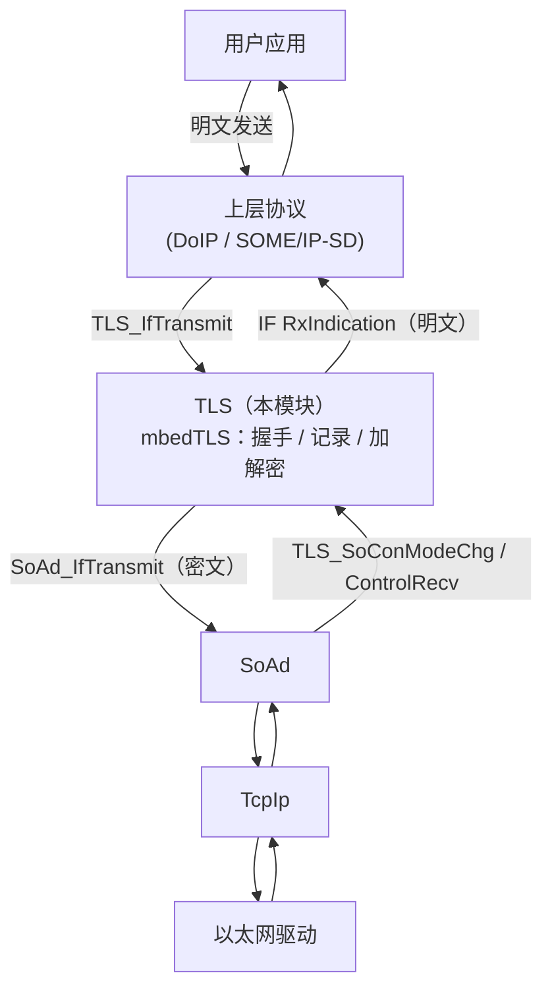
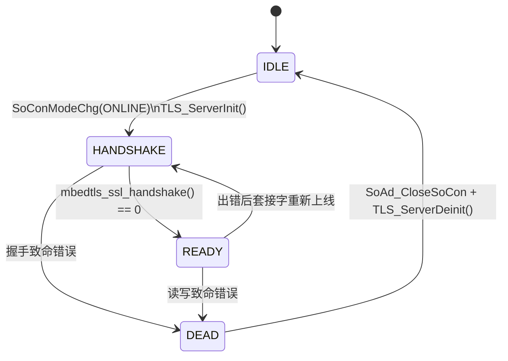

# TLS 概览

**TLS** 模块为基于套接字的车载协议（DoIP、SOME/IP-SD）增加 TLS 1.x 加密能力。它是 [mbedTLS](https://www.trustedfirmware.org/projects/mbed-tls/) 库之上的一层薄适配层：mbedTLS 实现 TLS 协议与密码学，AS 的 TLS 模块则把 mbedTLS 的BIO（传输）回调对接到 [SoAd](SoAd.md)，并把解密后的应用数据流交给上层协议（DoIP/Sd）。

当前实现仅作为 **TLS 服务器**（`MBEDTLS_SSL_IS_SERVER`）：ECU 接受外部测试仪或客户端发起的安全 TCP 连接。

## 1. 在通信栈中的位置

TLS 透明地位于上层协议与套接字适配层之间：



上层仍使用相同的基于 `PduInfoType` 的接口，加解密对它完全透明；不启用 TLS 时，上层协议直接与 SoAd 通信。

源码文件：

- 公共 API：[TLS.h](../../infras/include/TLS.h)
- 实现：[TLS.c](../../infras/communication/TLS/TLS.c)
- 私有类型：[TLS_Priv.h](../../infras/communication/TLS/TLS_Priv.h)
- 代码生成器：[TLS.py](../../tools/generator/TLS.py)

## 2. 配置文件（TLS.json）

来自 [app/app/config/Net/TLS.json](../../app/app/config/Net/TLS.json) 的真实示例：

```json
{
  "class": "TLS",
  "servers": [
    {
      "name": "DOIP_TCP",
      "ServerCerts": "Cert/TLS0_ServerCerts.pem",
      "CasCerts": "Cert/TLS0_CasCerts.pem",
      "ServerKey": "Cert/TLS0_ServerKey.pem",
      "MaxSize": 512,
      "up": "DoIP",
      "SoConId": "DOIP_TCP_APT",
      "RxPduId": "DOIP_RX_PID_TCP",
      "repeat": 3
    }
  ]
}
```

### 2.1 服务器参数

| 字段 | 类型 | 必需 | 默认值 | 说明 |
| --- | --- | --- | --- | --- |
| `name` | string | 是 | - | 服务器逻辑名，用于生成宏 `TLS_SERVER_<name>` |
| `up` | string | 是 | - | 上层协议模块：`DoIP`、`SD` 或 `SOMEIP`。这三者会使生成器把解帧头长度设为 8 字节 |
| `SoConId` | string | 是 | - | 绑定的 SoAd 套接字，生成器展开为 `SOAD_SOCKID_<SoConId>` 和 `SOAD_TX_PID_<SoConId>` |
| `RxPduId` | string | 是 | - | 上层接收 PDU 标识，按原文展开（例如 DoIP 的 `DOIP_RX_PID_TCP`） |
| `ServerCerts` | string | 是 | - | 服务器证书链 PEM 文件 |
| `CasCerts` | string | 是 | - | 所有受信 CA 证书拼接而成的 PEM 文件 |
| `ServerKey` | string | 是 | - | 服务器私钥 PEM 文件 |
| `repeat` | integer | 否 | 1 | 为同一份配置创建多个服务器实例。生成的名称带数字后缀（`<name>0`、`<name>1`……），与重复的 SoAd 套接字对应 |
| `MaxSize` | integer | 否 | 512 | 写入生成配置的最大长度提示 |

### 2.2 顶层参数

| 字段 | 类型 | 默认值 | 说明 |
| --- | --- | --- | --- |
| `servers` | array | - | TLS 服务器列表 |
| `UsePostBuildConfig` | bool | `false` | 为 true 时生成 `#define TLS_USE_PB_CONFIG`，运行时使用传入 `TLS_Init()` 的配置指针 |

### 2.3 证书

PEM 路径相对于配置目录（即生成目录 `GEN/` 的上一级）解析。上例中的文件位于`app/app/config/Net/Cert/`：

- [TLS0_ServerCerts.pem](../../app/app/config/Net/Cert/TLS0_ServerCerts.pem)
- [TLS0_CasCerts.pem](../../app/app/config/Net/Cert/TLS0_CasCerts.pem)
- [TLS0_ServerKey.pem](../../app/app/config/Net/Cert/TLS0_ServerKey.pem)

生成器把每个 PEM 文件以 C 字符串常量形式嵌入 `TLS_Cfg.c`，目标机无需访问文件系统。使用 OpenSSL 创建根 CA、中间 CA 和服务器证书的流程见[如何创建 CA(x.509)](HowToCreateCA.md)。

## 3. 生成产物

生成器在 `GEN/` 目录下产出 `TLS_Cfg.h` 和 `TLS_Cfg.c`。

### 3.1 宏（TLS_Cfg.h）

对每个服务器（使用 `repeat` 时对每个实例）生成：

```c
#define TLS_SERVER_DOIP_TCP0 0u
#define TLS_RX_PID_DOIP_TCP0 0u
#define TLS_TX_PID_DOIP_TCP0 0u
```

其他生成的宏：

| 宏 | 说明 |
| --- | --- |
| `TLS_HEADER_MAX_LEN` | 解帧头最大长度。任一服务器的 `up` 为 `DoIP`/`SD`/`SOMEIP` 时为 8，否则为 1 |
| `TLS_CONVERT_MS_TO_MAIN_CYCLES(x)` | 借助应用提供的 `TLS_MAIN_FUNCTION_PERIOD`，把毫秒换算为 `TLS_MainFunction` 的调用次数 |
| `TLS_USE_PB_CONFIG` | 仅在 `UsePostBuildConfig` 为 true 时生成 |

### 3.2 配置结构体（TLS_Cfg.c）

对每种不同的上层协议生成一张 SoAd 接口表：

```c
static const SoAd_InterfaceType SoAd_DoIP_IF = {
  DoIP_HeaderIndication,
  DoIP_RxIndication,
  NULL,
};
```

然后为每个服务器生成一个 `TLS_ServerConfigType` 条目（运行时上下文、名称、上层接口、模式变化回调、三段嵌入的 PEM 数据及其长度、SoConId/TxPduId/RxPduId和头部长度），最后生成：

```c
const TLS_ConfigType TLS_Config = {
  TLS_ServerConfigs,
  TLS_TxPduIds,
  ARRAY_SIZE(TLS_ServerConfigs),
  ARRAY_SIZE(TLS_TxPduIds),
};
```

## 4. 运行时状态机

每个服务器拥有一个 `TLS_ServerContextType`，其中保存 mbedTLS 上下文（entropy、CTR-DRBG、SSL、SSL 配置、证书、私钥）和当前状态：



| 状态 | 取值 | 含义 |
| --- | --- | --- |
| `TLS_SERVER_IDLE` | 0 | 无连接，mbedTLS 上下文未初始化 |
| `TLS_SERVER_HANDSHAKE` | 1 | TCP 套接字已上线，TLS 握手进行中 |
| `TLS_SERVER_READY` | 2 | 握手完成，可传输应用数据 |
| `TLS_SERVER_RESPONSE` | 3 | 保留的响应状态 |
| `TLS_SERVER_DEAD` | 4 | 致命错误，正在关闭套接字 |

初始化（`TLS_ServerInit`）执行标准的 mbedTLS 服务器配置流程：

1. 调用 `SoAd_TakeControl()` 取得套接字接收路径的控制权；
2. 为随机数发生器播种（`mbedtls_ctr_drbg_seed`）；
3. 解析服务器证书、CA 证书和私钥；
4. 调用 `mbedtls_ssl_config_defaults(..., MBEDTLS_SSL_IS_SERVER, MBEDTLS_SSL_TRANSPORT_STREAM, ...)`；
5. 注册 RNG、调试回调、可选的会话缓存以及本机证书；
6. `mbedtls_ssl_setup()` 并安装 BIO 回调（`TLS_NetSend` / `TLS_NetRecv`）。

握手本身由 `TLS_MainFunction()` 协作式驱动：当还需要更多网络 I/O 时，mbedTLS返回 `MBEDTLS_ERR_SSL_WANT_READ/WRITE`，主函数在下一周期继续重试。成功后通过`SoConModeChgNotification(SoConId, SOAD_SOCON_ONLINE)` 通知上层。

## 5. 数据流

### 5.1 发送（上层 -> TLS -> 套接字）

1. 上层调用 `TLS_IfTransmit(TxPduId, PduInfoPtr)`；
2. 当服务器状态为 `TLS_SERVER_READY` 时，明文被送入`mbedtls_ssl_write()`；
3. mbedTLS 调用 BIO 回调 `TLS_NetSend()`，把加密后的 TLS 记录交给`SoAd_IfTransmit()` 发出。

### 5.2 接收（套接字 -> TLS -> 上层）

1. BIO 回调 `TLS_NetRecv()` 通过 `SoAd_ControlRecv()` 按需拉取密文；暂无数据时返回 `MBEDTLS_ERR_SSL_WANT_READ`；
2. `TLS_MainFunction()` 调用 `mbedtls_ssl_read()` 取得解密后的字节；
3. 对 `DoIP`/`SD`/`SOMEIP` 服务器（头部长度 8），前 8 字节先交给`<up>_HeaderIndication()` 以获知完整载荷长度，随后在 `Net_MemAlloc()`缓冲区中重组剩余分段，再一次性投递；
4. 不做头部解析的服务器则把每个数据块立即通过 `<up>_RxIndication()` 投递；
5. 远端套接字地址通过 `PduInfoPtr->MetaDataPtr`（`SoAd_GetRemoteAddr()`）附带。

发生致命 TLS 错误时，服务器关闭 SoAd 套接字、释放 mbedTLS 上下文，并以`SOAD_SOCON_OFFLINE` 通知上层。

## 6. 与 SoAd、DoIP 的集成

- 在 SoAd JSON 配置中，`"up": "TLS"` 的套接字会生成接口表 `SoAd_TLS_IF`，其套接字模式变化回调为 `TLS_SoConModeChg`；
- DoIP 配置项 `EnableTLS` 用于标记走安全通道的 DoIP TCP 连接。DoIP 生成器随后用编译开关 `USE_TLS` 包住 TLS 发送路径，并按连接保存 `bEnableTLS` 标志；
- 运行时当 `bEnableTLS == TRUE` 时，DoIP 的响应通过 `TLS_IfTransmit()`发送，而不是直接调用 `SoAd_IfTransmit()`；
- 需在应用构建中定义预处理宏 `USE_TLS` 才会编译 DoIP 的 TLS 路径，同时确保链接 TLS 库。

## 7. 构建集成

TLS 的 [SConscript](../../infras/communication/TLS/SConscript) 链接两个库：`MbedTls` 和 `MemPool`（接收缓冲区来自网络内存池）。

应用侧要求：

- 默认 mbedTLS 配置不满足目标平台需求时，提供自定义配置（例如`config/mbedtls_config.h`，注册为 `MbedTls` 配置并设置`MBEDTLS_CONFIG_FILE`）；
- 周期性调度 `TLS_MainFunction()`，并定义 `TLS_MAIN_FUNCTION_PERIOD`（单位毫秒），生成的 `TLS_CONVERT_MS_TO_MAIN_CYCLES()` 宏依赖该宏；
- 启动时调用 `TLS_Init(&TLS_Config)`（示例应用中由生成的 EcuM 配置完成）。

## 8. 公共 API

声明于 [TLS.h](../../infras/include/TLS.h)：

| 函数 | 说明 |
| --- | --- |
| `TLS_Init(config)` | 初始化（清零）所有服务器上下文；定义了 `TLS_USE_PB_CONFIG` 时使用 post-build 指针 |
| `TLS_ServerOpen(server)` | 打开/激活一个 TLS 服务器 |
| `TLS_MainFunction()` | 为所有服务器驱动握手与接收，需周期性调用 |
| `TLS_SoConModeChg(SoConId, Mode)` | SoAd 套接字模式变化入口，用于启动或拆除 TLS 会话 |
| `TLS_IfTransmit(TxPduId, PduInfoPtr)` | 上层发送接口，经 mbedTLS 加密后发出 |
| `TLS_SoAdIfRxIndication(RxPduId, PduInfoPtr)` | 普通接收指示入口 |
| `TLS_SoAdIfTxConfirmation(TxPduId, result)` | 发送确认入口 |
| `TLS_SoAdStartOfReception(...)` | TP 风格的开始接收入口 |
| `TLS_SoAdCopyRxData(...)` | TP 风格的拷贝接收数据入口 |
| `TLS_SoAdRxIndication(RxPduId, result)` | TP 风格的接收完成入口 |

## 9. 限制

- 仅支持服务器角色，不支持主动发起 TLS 客户端连接；
- 仅支持流传输（`MBEDTLS_SSL_TRANSPORT_STREAM`，TCP）；
- `DoIP`、`SD`、`SOMEIP` 的解帧头长度固定为 8；
- 所有生成的发送 PDU 标识都映射到服务器上下文（`bServer = TRUE`）。
