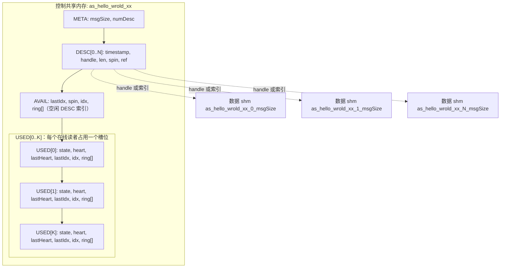
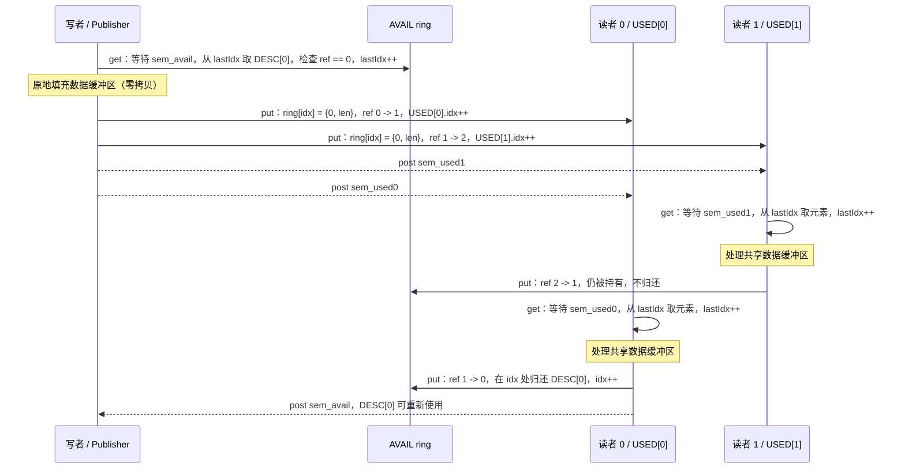
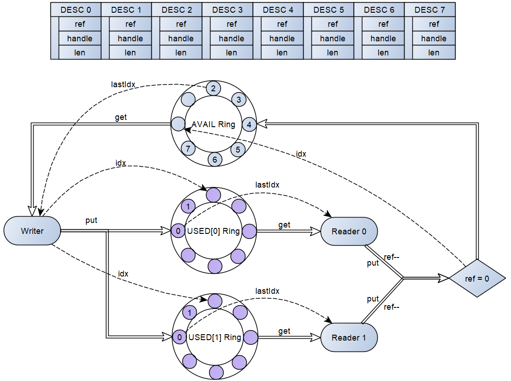
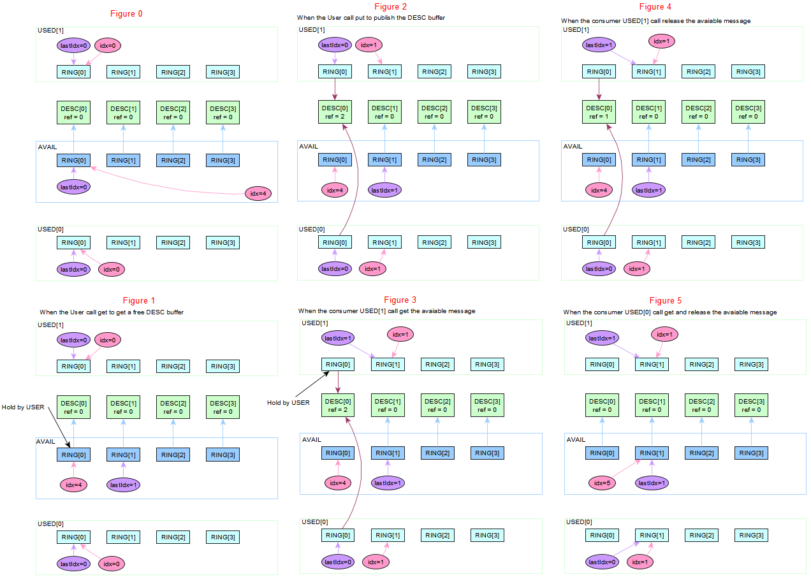
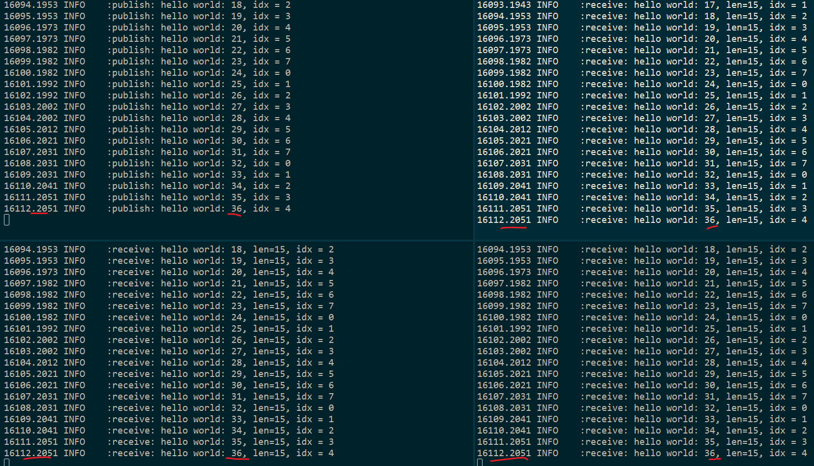

# VDDS - 基于 Virtio Ring Buffer 的 DDS

**VDDS** 是一个轻量级的零拷贝发布/订阅数据共享服务，用于进程间通信（IPC）。
它的设计受 [iceoryx](https://iceoryx.io/) 启发，但刻意保持精简：

* 无中心守护进程（iceoryx 依赖 RouDi 守护进程）- 由发布者创建共享内存对象，订阅者直接挂载；
* 无数据拷贝、无 socket 传输 - 数据负载存放在共享内存中，ring 中只传递 4 字节的描述符索引；
* 单发布者、多消费者（SPMC），每个描述符带引用计数，只有所有在线订阅者都消费完后数据缓冲区才会被回收；
* 命名空间 `as::vdds`，核心代码约 1000 行 C++11，便于学习和移植。

设计借鉴了 [virtio](https://docs.kernel.org/driver-api/virtio/virtio.html) 的 split vring
思想：**AVAIL** ring 把空闲缓冲区交给生产者，每个读者各有一个 **USED** ring 接收已填充的
缓冲区。代码位于 [infras/libraries/dds/vdds/](../../infras/libraries/dds/vdds/)。

## 1. 架构

一个 topic 对应一条连接，由以下对象组成：

* 一个控制共享内存对象，包含 META、描述符表、AVAIL ring，以及最多
  `VRING_MAX_READERS`（默认 8）个 USED ring；
* `numDesc` 个数据共享内存对象，每个大小为 `msgSize` 字节，由描述符索引。Linux 下若存在
  `/dev/dma_heap/system`，构建时会定义 `USE_DMA_BUF`，使用 DMA-BUF heap（描述符中保存
  DMA-BUF handle）；否则使用普通 POSIX `shm_open`；
* 一个 AVAIL ring 命名信号量（初始计数为 `numDesc`），每个读者的 USED ring 各有一个命名
  信号量（初始计数为 0）。

topic 名到对象名的转换规则是加前缀 `as` 并把 `/` 替换为 `_`，例如 topic
`/hello_wrold/xx` 对应的共享内存和信号量名为 `as_hello_wrold_xx`。

所有内存区域按 64 字节对齐（`VRING_ALIGNMENT`）。令 `N = numDesc - 1`、
`K = VRING_MAX_READERS - 1`，控制区布局如下：



关键结构体（见 `include/vring/base.hpp` 和 `include/vring/spmc/base.hpp`）：

* `VRing_MetaType { msgSize, numDesc }` - 发布的几何信息，每个读者挂载时校验；
* `VRing_DescType { timestamp, handle, len, spin, ref }` - 一个数据缓冲区。
  `timestamp` 是发布时刻（微秒），`ref` 是仍持有该缓冲区的读者数量，`spin` 保护
  引用计数与 ring 的复合操作；
* `VRing_AvailType { lastIdx, spin, idx, ring[] }` - 空闲描述符索引环。写者从
  `lastIdx` 取，缓冲区归还到 `idx`；
* `VRing_UsedType { state, heart, lastHeart, lastIdx, idx, ring[] }`，ring 元素为
  `{ id, len }` - 每个读者一个 ring。`state` 为原子变量，状态迁移为
  `FREE(0) -> INIT(1) -> READY(2)`；写者回收死亡读者时走
  `READY -> KILLED(3) -> FREE`。

同步机制由三部分组成：

1. **命名信号量**：一方阻塞等待，直到另一方产生进度后唤醒；
2. **原子操作**：对 `DESC.ref`、`USED.state/heart` 做跨进程引用计数和读者注册；
3. **自旋锁**：采用 [rigtorp 的自旋锁实现](https://rigtorp.se/spinlock/)
   （基于 `__atomic_exchange_n`），保护短小的复合临界区：AVAIL ring 用
   `AVAIL.spin`，单个描述符用 `DESC[i].spin`。自旋超过
   `VRING_SPIN_MAX_COUNTER` 后返回 `EDEADLK`，避免永久死等。

## 2. 发布/订阅流程

假设两个读者在线，一条样本的流转过程如下：



分步说明：

1. **写者初始化**（`Writer::init`）：以 `O_CREAT | O_EXCL` 创建控制对象，创建
   `numDesc` 个数据缓冲区，填满 AVAIL ring（`ring[i] = i`、`idx = numDesc`），
   创建信号量并启动监控线程。同一 topic 不允许创建第二个写者。
2. **读者初始化**（`Reader::init`）：打开已存在的对象，原子地抢占第一个 FREE 的 USED
   槽位（`FREE -> INIT -> READY`），并启动心跳线程。若发布者尚未上线，`shm_open`
   失败，返回 `EEXIST`（示例程序每秒重试一次 `init()`）；若 8 个 USED 槽位已满，
   返回 `ENOSPC`。
3. **load() / get()**：写者等待 AVAIL 信号量，取 `ring[lastIdx]`，校验
   `ref == 0`，推进 `lastIdx`，把指向数据缓冲区的直接指针交给应用。返回值为 0、
   `ETIMEDOUT`（超时内无 post）或 `ENODATA`（所有缓冲区均已借出）。
4. **publish() / put()**：在 `DESC[idx].spin` 保护下，写者向每个 READY 状态的
   USED ring 追加 `{id, len}`，每投递一个读者原子递增一次 `ref`，并推进该 ring 的
   `idx`，随后 post 对应读者信号量。若当前没有任何读者在线，则直接把描述符 drop 回
   AVAIL ring，返回 `ENOLINK`。
5. **receive() / get()**：读者等待自己的 USED 信号量，确认槽位仍为 READY，从
   `lastIdx` 取元素并推进 `lastIdx`，返回共享内存直接指针（0、`ETIMEDOUT` 或
   `ENOMSG`）。
6. **release() / put()**：在 `DESC[idx].spin` 保护下原子递减 `ref`。`ref > 0`
   表示其他读者仍持有；最后一个读者看到 `ref == 0` 时，获取 `AVAIL.spin`，把索引
   追加到 `idx` 处并推进 `idx`，然后 post AVAIL 信号量，写者即可复用该缓冲区。

单写者约束使大部分索引更新天然无竞争；只有复合更新和多读者竞争处才需要自旋锁：

| 字段 | 更新者 | 规则 |
| --- | --- | --- |
| AVAIL.lastIdx | 仅写者 `get()` | 单写者，无竞争 |
| AVAIL.idx | 写者 `drop()` 与最后一个读者的 `put()` | 多读者可能竞争，由 `AVAIL.spin` 保护 |
| USED[i].idx | 仅写者 `put()` | 单写者，无需 USED 锁 |
| USED[i].lastIdx | 仅拥有该槽位的读者 `get()` | 每个槽位只有一个拥有者 |
| DESC.ref | 写者 `put()` 增、读者 `put()` 减 | 原子 RMW；"递减后回收"复合操作由 `DESC.spin` 保护 |
| USED.state、USED.heart | 读者与写者交叉更新 | 直接使用原子操作（`__atomic_*`） |

### 异常处理

真实进程会崩溃或卡死，因此写者每 500 ms 运行一次监控线程（`threadMain`）：

* **读者心跳**：每个读者每 100 ms 递增自己的 `heart` 计数。若计数停止变化，写者把
  槽位置为 KILLED，将该 USED ring 中滞留的描述符逐一通过 `releaseDesc()` 排空
  （释放引用、回收缓冲区），然后把槽位恢复为 FREE，供新读者抢占；
* **描述符生命周期**：若描述符被引用超过 `VRING_DESC_TIMEOUT`（2,000,000 微秒，
  即 2 秒），会被强制回收。这意味着应用取走样本后一直没有 release，代码注释明确指出
  这属于致命的应用 bug，强制回收只是保证系统继续运转；
* **读者正常退出**：读者析构时会先把自己 USED ring 中未消费的缓冲区全部 release，
  再把槽位状态清回 FREE。



上图展示了 ring 的结构与描述符周围的索引移动；下图展示了穿越共享内存区域的端到端
零拷贝数据路径。



## 3. 应用 API

包含聚合头文件并使用命名空间 `as::vdds`：

```cpp
#include "vdds.hpp"
using namespace as::vdds;

typedef struct {
  char string[128];
} HelloWorld_t;
```

发布者侧（`include/publisher.hpp`）：

```cpp
Publisher<HelloWorld_t> pub("/hello_wrold/xx");           /* 默认队列深度 8 */
/* Publisher<HelloWorld_t> pub("/hello_wrold/xx", PublisherOptions(16)); */
int r = pub.init();

HelloWorld_t *sample = nullptr;
r = pub.load(sample);                 /* 0 / ETIMEDOUT / ENODATA；取一个空闲缓冲区 */
if (0 == r) {
  int len = snprintf(sample->string, sizeof(sample->string), "hello world");
  r = pub.publish(sample, len);       /* publish(sample) 按 sizeof(T) 字节发布 */
}
uint32_t i = pub.idx(sample);         /* 调试用：查询样本对应的描述符索引 */
```

`Publisher<T, VRingWriter>` 的第二个模板参数默认为 `vring::spmc::Writer`；单读者
场景可改用 `vring::spsc::Writer`。写者消息大小为 `sizeof(T)`，队列深度（描述符数量）
由 `PublisherOptions::queueDepth` 指定。

订阅者侧（`include/subscriber.hpp`）：

```cpp
Subscriber<HelloWorld_t> sub("/hello_wrold/xx");
int r = sub.init();                    /* EEXIST 时重试：发布者尚未上线 */

size_t size = 0;
HelloWorld_t *sample = nullptr;
r = sub.receive(sample, size);        /* 0 / ETIMEDOUT / ENOMSG；零拷贝指针 */
if (0 == r) {
  /* 处理 sample->string ... */
  r = sub.release(sample);            /* 每收到一个样本必须 release 一次 */
}
```

`Subscriber<T, VRingReader>` 同样默认为 `vring::spmc::Reader`；发布者共享内存不存在
时 `init()` 返回 `EEXIST`，读者槽位全部占满时返回 `ENOSPC`。

## 4. 构建与运行

应用在 [infras/libraries/dds/vdds/SConscript](../../infras/libraries/dds/vdds/SConscript)
中注册：

| 应用 | 源文件 | ring 类型 |
| --- | --- | --- |
| VDDSHwPub | examples/hello_world_publisher.cpp | SPMC 写者 |
| VDDSHwSub | examples/hello_world_subscriber.cpp | SPMC 读者 |
| VDDSHwSPub | examples/hello_world_publisher.cpp | SPSC 写者（`-DVRING_WRITER=vring::spsc::Writer`） |
| VDDSHwSSub | examples/hello_world_subscriber.cpp | SPSC 读者（`-DVRING_READER=vring::spsc::Reader`） |
| VDDSHwPS | examples/hello_world_ps.cpp | 单进程：1 个发布线程 + N 个订阅线程 |

多进程示例，一个发布者加三个订阅者：

```sh
scons --app=VDDSHwPub
scons --app=VDDSHwSub

# 终端 1
build/posix/GCC/VDDSHwPub/VDDSHwPub -p 1000

# 终端 2、3、4 分别启动
build/posix/GCC/VDDSHwSub/VDDSHwSub
build/posix/GCC/VDDSHwSub/VDDSHwSub
build/posix/GCC/VDDSHwSub/VDDSHwSub
```

单进程示例（发布者和订阅者均为线程，适合快速冒烟测试）；`-n` 指定订阅者数量，
`-p` 指定发布周期（毫秒）：

```sh
scons --app=VDDSHwPS
build/posix/GCC/VDDSHwPS/VDDSHwPS -n 3 -p 100
```

主要运行环境为 Linux 和 WSL（下图即 WSL 中的运行截图），直接使用 POSIX 共享内存和
命名信号量；存在 `/dev/dma_heap/system` 时自动启用 DMA-BUF。`src/platform/win/`
下还提供了 Windows 原生平台层（`shm_open/mmap` 与信号量的兼容封装）。



## 5. 源码目录

```
infras/libraries/dds/vdds/
  include/
    vdds.hpp               聚合头文件（publisher + subscriber）
    publisher.hpp          Publisher<T> 模板
    subscriber.hpp         Subscriber<T> 模板
    shared_memory.hpp      POSIX 共享内存封装
    named_semaphore.hpp    命名信号量封装
    dma_memory.hpp         数据缓冲区 / DMA-BUF 封装
    vring/base.hpp         META / USED 类型、ring 大小宏、自旋锁
    vring/spmc/            单发布者多消费者 ring
    vring/spsc/            单发布者单消费者 ring
  src/                     对应实现
    platform/linux/        DMA-BUF 后端
    platform/win/          Windows 原生 shm 与信号量兼容层
  examples/                hello_world_ps / hello_world_publisher / _subscriber
```
