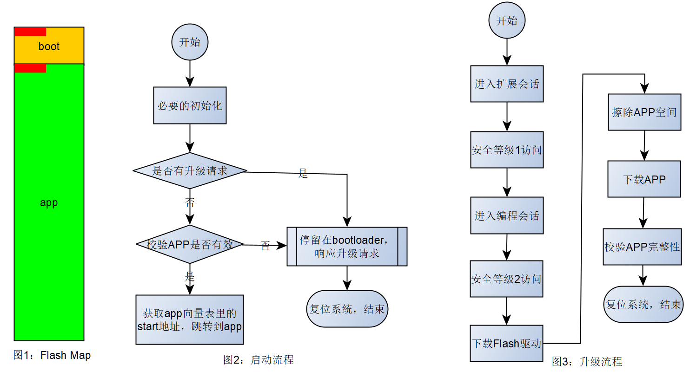

# CAN bootloader 简介

当下，汽车行业正在经历重大变革，一呢，由传统油车到电车的转变，二呢，没有高级辅助驾驶功能，都不好意思说自己是车企了。然后呢，受特斯拉互联网思维的影响，各厂商也开始有样学样，先硬件该堆得都堆上去，软件后续功能慢慢迭代升级嘛，所以一辆车造出来，可能首先要求的是所有模块都必须支持OTA。

这里不介绍OTA，但不管怎样，汽车上的传统MCU控制器，基本都是以CAN网络为基础进行通信的，所以这里介绍对于MCU而言，通常其bootloader是如何设计及怎样工作的。

对于bootloader而言，其有2大主要功能：

* boot启动APP的过程
* loader响应升级请求，升级APP的过程

## boot启动APP的过程

对于汽车MCU而言，通常程序是固化在Flash空间，MCU上电后，会从Flash的特定地址处开始执行其存储的指令，那么这个特定地址空间通常用作为boot区间，用于存储bootloader程序。 然后，将boot区以外的区间用作application，存储应用程序。下图1是一个简单实例，红色区域用以分别表征boot和app的中断向量表。



通常而言，中断向量表的第一项为系统复位向量，存储着程序的开始函数地址，通常该函数为汇编编写，用以准备C运行时环境，比如初始化data段、bss段以及初始化堆栈，之后main函数就开始执行了，关于MCU的C运行时环境的准备过程这里不做过多介绍，有兴趣的可以自行谷歌学习相关内容。

这里，如上图2所示为boot main程序正常的启动APP的过程。正常启动APP的流程是相当简单的，这也是为了更快速的启动APP，提高系统的开机响应速度。

## loader升级APP的过程

通常来讲，MCU的loader是一个通用诊断服务（UDS）提供者，其作为服务器响应一切来自客户端的UDS服务请求，从而完成APP的升级过程，其流程大致如上图3所示。

这里暂不细讲，每一个步骤由哪些UDS服务所构成，这里先讲做bootloader项目通常需要的三个工程！

* bootloader 工程
* Flash Driver 工程
* Application 工程

## QEMU Versatilepb bootloader demo

这里将以QEMU Versatilepb虚拟机为例，讲解着三个工程大概的样子，以及一个完整的升级流程是怎样的。

该例子代码开源于： [autoas/qemu](https://github.com/autoas/qemu)

好吧，让我们先编译运行一把该例子吧。

首先，请参考 [开发环境搭建](https://autoas.github.io/ssas-public/autosar/2021/12/03/setup.html)，构建基础编译环境及其工具链， 之后双击ssas-public工程目录下的Console.bat启动ConEmu终端。

```sh
# app 页， 执行如下命令
D:\repository\ssas-public>cd app\platform
D:\repository\ssas-public\app\platform>git clone https://github.com/autoas/qemu.git
D:\repository\ssas-public\app\platform>cd ../..
# 开始编译
D:\repository\ssas-public>scons --app=Loader
D:\repository\ssas-public>scons --app=CanBridge
D:\repository\ssas-public>scons --app=CanDump

# 设置CANFD模式，数据最大长度为64字节
D:\repository\ssas-public>set LL_DL=64
D:\repository\ssas-public>scons --cpl=QemuVersatilepbGCC --app=VersatilepbFlashDriver
# 第一次编译需要比较久，因为需要下载编译器gcc-arm-none-eabi
D:\repository\ssas-public>scons --cpl=QemuVersatilepbGCC --app=VersatilepbCanApp
D:\repository\ssas-public>scons --cpl=QemuVersatilepbGCC --app=VersatilepbCanBL

# 这个时候修改app/app/main.c, main函数里的打印输出如下：
# int main(int argc, char *argv[]) {
#   ASLOG(INFO, ("application v2 build @ %s %s\n", __DATE__, __TIME__));
# 然后重新编译CanAPP
D:\repository\ssas-public>scons --cpl=QemuVersatilepbGCC --app=VersatilepbCanApp

# 切换回 app 页，启动qemu虚拟机
D:\repository\ssas-public>scons --cpl=QemuVersatilepbGCC --app=VersatilepbCanBLRun
scons: Reading SConscript files ...
qemu-system-arm.exe: -serial tcp:127.0.0.1:9000,server: info: QEMU waiting for connection on: disconnected:tcp:127.0.0.1:9000,server=on
# 在sim页启动 CanBridge
D:\repository\ssas-public>build\nt\GCC\CanBridge\CanBridge.exe -d qemu -d simulator_v2
# 在tool页启动 CanDump
D:\repository\ssas-public>build\nt\GCC\CanDump\CanDump.exe
# 切回app页
INFO    :bootloader build @ Dec 15 2021 19:26:46
INFO    :application is valid
INFO    :application build @ Dec 14 2021 22:55:11
# 上面日志说明， boot成功启动APP, 并且没有v2字样，说明是没改之前的APP代码

# 等虚拟机启动完成，切换到 boot 页，如下命令开始升级
# 加入参数 "-v"可以看到更详细的日志
D:\repository\ssas-public>build\nt\GCC\Loader\Loader.exe -a build\nt\QemuVersatilepbGCC\VersatilepbCanApp\VersatilepbCanApp.s19.sign -f build\nt\QemuVersatilepbGCC\VersatilepbFlashDriver\VersatilepbFlashDriver.s19.sign -l 64

# 因为是模拟，升级过程可能比较漫长，可能我的笔记本性能太差了，一帧CAN报文需要100ms左右的通信时间（bug待查）！
# 你可以在app和boot页来回切换，观察输出日志。
# 如果看到任何错误日志，通常是由于windows非实时操作系统，CANTP通讯超时所导致，可重新运行上面的命令，重新开始
# 一次新的升级过程。
# 如果尝试多次依然不成功，放弃吧！请看下节以host为运行实体的CanBL demo。

# 在boot页，最终可以看到如下日志
block information of build\nt\QemuVersatilepbGCC\VersatilepbCanApp\VersatilepbCanApp.s19.sign:
srec 0: address=0x00040000, length=0x0000C5C0, offset=0x00000000, data=18F09FE518F09FE5 crc16=C022
srec 1: address=0x0013FFFE, length=0x00000002, offset=0x0000C5C0, data=05C3 crc16=BD5
block information of build\nt\QemuVersatilepbGCC\VersatilepbFlashDriver\VersatilepbFlashDriver.s19.sign:
srec 0: address=0x00140000, length=0x00000568, offset=0x00000000, data=010200A918001400 crc16=4E9D
srec 1: address=0x00140FFE, length=0x00000002, offset=0x00000568, data=4DBF crc16=30AB
loader started:
enter extended session          progress  0.10%  okay
level 1 security access         progress  0.30%  okay
enter program session           progress  0.40%  okay
level 2 security access         progress  0.60%  okay
download flash driver           progress  3.62%  okay
erase flash okay
download application            progress 95.91%  okay
check integrity                 progress 96.01%  okay
ecu reset                       progress 99.00%  okay
loader exited without error
                                progress 100.00%
# 在APP页，可以看到如下日志
INFO    :bootloader build @ Dec 15 2021 19:26:46
INFO    :application is valid
INFO    :application build @ Dec 14 2021 22:55:11
DCM     :physical service 10, len=2
INFO    :App_GetSessionChangePermission(1 --> 3)
DCM     :physical service 27, len=2
INFO    :App_GetExtendedSessionSeed(seed = CF712C84)
DCM     :physical service 27, len=6
INFO    :App_CompareExtendedSessionKey(key = B7E26AF7(B7E26AF7))
DCM     :physical service 10, len=2
INFO    :App_GetSessionChangePermission(3 --> 2)
INFO    :bootloader build @ Dec 15 2021 19:26:46 # 此日志说明，系统复位，重新进入了bootloader
DCM     :physical service 27, len=2
DCM     :physical service 27, len=6
DCM     :physical service 34, len=11
DCM     :download memoryAddress=0x50000 memorySize=0x568
...
...
DCM     :physical service 31, len=4
DCM     :start p2server
DCM     :physical service 11, len=2
INFO    :bootloader build @ Dec 15 2021 19:26:46
INFO    :application is valid
INFO    :application v2 build @ Dec 15 2021 21:47:05
# 看到v2字样，说明升级成功，新版本APP开始运行了
```

上面的步骤很多，花费时间也很长，请耐心一点，如果你选择加入的参数"-v"，可看到如下类容，从此内容，即可知升级过程即一系列UDS服务的组合来共同实现升级APP的目的。

```sh
build\nt\GCC\Loader\Loader.exe -v -a build\nt\QemuVersatilepbGCC\VersatilepbCanApp\VersatilepbCanApp.s19.sign -f build\nt\QemuVersatilepbGCC\VersatilepbFlashDriver\VersatilepbFlashDriver.s19.sign -l 64

loader started:
enter extended session
 request service 10:
  TX: len=2 10 03
  RX: len=6 50 03 13 88 00 32
  PASS
 okay
level 1 security access
 request service 27:
  TX: len=2 27 01
  RX: len=6 67 01 CF 71 2C 84
  PASS
...
...
download flash driver
 request service 34:
  TX: len=11 34 00 44 00 05 00 00 00 00 05 68
  RX: len=4 74 20 02 02
  PASS

 request service 36:
  TX: len=514 36 01 01 02 00 A9 18 00 05 00 84 00 05 00 B0 00 05 00 2C 02 05 00 B8 03 05 00 04 B0 2D E5 00 B0
  RX: len=2 76 01
  PASS

 request service 36:
  TX: len=514 36 02 00 20 A0 E3 B4 20 C3 E1 03 00 00 EA 02 00 00 EA 18 30 1B E5 01 20 A0 E3 B4 20 C3 E1 00 00
  RX: len=2 76 02
  PASS

 request service 36:
  TX: len=362 36 03 0C 30 0B E5 20 30 1B E5 08 30 93 E5 10 30 0B E5 20 30 1B E5 10 30 93 E5 14 30 0B E5 10 30
  RX: len=2 76 03
  PASS

 request service 37:
  TX: len=1 37
  RX: len=1 77
  PASS
 ...
 ...
```

### bootloader各工程介绍

本例子使用QEMU Versatilepb来模拟，地址空间0x00008000到0x00140000，模拟为Flash，大小1248Kb；地址空间0x00140000到0x00180000，模拟为RAM，大小256Kb。但其实，对这款QEMU虚拟机，其只有RAM，这里只是将部分RAM抽象认为其是Flash而已。

OK，这个时候在回过头来看，bootloader项目需要的三个工程，第一个是bootloader自己，这个毋庸置疑，从上图1我们也知道其在Flash空间的开始地址处。这里涉及到一点小知识，如何编译链接bootloader，将其放在图1所示boot空间呢？这个就要讲到链接脚本， 我们先看看QEMU Versatilepb的bootloader工程的链接脚本[linker-boot.lds](https://github.com/autoas/qemu/versatilepb/linker-boot.lds)，这里要说明下，不同的编译器，其控制链接的脚本的格式可能不一样。

```txt
MEMORY
{
   FLASH        (rx)   : ORIGIN = 0x00008000, LENGTH = 224K
   APPCODE      (rx)   : ORIGIN = 0x00040000, LENGTH = 1024K
   FLSDRV       (rwx)  : ORIGIN = 0x00140000, LENGTH = 4K
   RAM          (rwx)  : ORIGIN = 0x00141000, LENGTH = 252K
}
```

如上为其片段，可以看到，我们将从地址0x00008000到0x00040000区间划分用作boot区间，将0x00040000开始剩下的空间划分用作app区间。app工程的链接脚本[linker-app.lds](https://github.com/autoas/qemu/versatilepb/linker-app.lds)的部分内容如下：

```txt
MEMORY
{
   FLASH        (rx)   : ORIGIN = 0x00040000, LENGTH = 1024K
   RAM          (rwx)  : ORIGIN = 0x00140000, LENGTH = 256K
}
```

再来看看Flash Driver工程的链接脚本[linker-flsdrv.lds](https://github.com/autoas/qemu/versatilepb/linker-flsdrv.lds)的全部内容如下：

```txt
MEMORY
{
  FLASH        (rwx)  : ORIGIN = 0x00140000, LENGTH = 4K
}

ENTRY(FlashHeader)

SECTIONS
{
    .text :
    {
      *(.rodata*)
      *(.text*)
    } > FLASH
}
```

眼尖的同学，应该可以立刻注意到bootoader的RAM要比app的RAM少最开始处的4K，那这4K去哪了呢？在看看FlashDriver的Flash区间，其和bootloader的RAM合起来刚好是256K，即可知，对bootloader工程来说，需要将RAM保留一定空间用来下载存储FlashDriver，即bootloader + FlashDriver合起来才可以完成升级过程。

这里很多人会问，为何要将FlashDriver从bootloader工程里分离出来？这主要是为了安全的考虑，因为程序或许有bug，或者MCU受电磁干扰，导致程序跑飞，万一误触发执行了FlashDriver里的擦写指令，万一擦写坏bootloader或者app，势必有可能导致系统变砖的可能行。所以，业界就解决该问题的方式主要有2种：

* 一种如本例子所示，动态下载Flash驱动

* 另一种，加密存储Flash驱动，例如对Flash驱动二进制指令取反，从而将有效指令变为无效指令

对于做bootloader的同学而言，分区的划分实现算是一个难点。创建bootloader和app工程，因为有IDE的帮助，也不算什么难事，链接到指定分区通过IDE也可以很容易做到。但最难的还是如何创建编译一份只有FlashDriver的工程。不懂编译链接原理的同学，可能会在这里有种挫败感而止步不前，但我能告诉你的是，这个时候你需要查看你所使用的编译器的文档，去搞清楚如何去控制链接，如何设置程序入口地址等（搞MCU嵌入式同学，一定不要认为程序的入口是main函数），如上FlashDriver的链接脚本，其通过语句“ENTRY(FlashHeader)”，将程序的入口地址改写为“FlashHeader”，并且阅读SECTIONS描述，“rodata”段放Flash区间的开始处，结合FlashDriver代码[Flash.c](https://github.com/autoas/qemu/flash/Flash.c)， 如下片段，可知，FlashHeader为const常量，放rodata段，而该工程只有这一个const常量，所以FlashHeader的地址即为0x00140000，所以通过该地址，按tFlashHeader访问该内存，即可获取Flash驱动的各函数地址，也可以拿到动态下载的Flash驱动的版本信息等，bootloader也可根据该内容做些相关检查等！

```c
const tFlashHeader FlashHeader = {.Info.W.MCU = 1,
                                  .Info.W.mask = 2,
                                  .Info.W.version = 169,
                                  .Init = FlashInit,
                                  .Deinit = FlashDeinit,
                                  .Erase = FlashErase,
                                  .Write = FlashWrite,
                                  .Read = FlashRead};
```

好吧，其实很多非常细节性的多西这篇文章是远远没有讲到的！但如果你认真看完本文，并且动手完成了QEMU的实验，对bootloader你也会有一个基本的认识。

## Host CanBL demo

本例子只作为备选，如果上述QEMU为例的bootloader始终因为CANTP超时而升级失败。
那么我们可以转而运行可以在Wondows Host上直接运行的CanBL，但改仿真模拟不了bootloader到APP的跳转，也模拟不了进入编程会话从APP到bootloader的跳转。

```sh
# build the CanBL
set LL_DL=64
scons --app=CanBL

# Run the CanBL
build\nt\GCC\CanBL\CanBL.exe
# Run the Loader
build\nt\GCC\Loader\Loader.exe -a build\nt\QemuVersatilepbGCC\VersatilepbCanApp\VersatilepbCanApp.s19.sign -f build\nt\QemuVersatilepbGCC\VersatilepbFlashDriver\VersatilepbFlashDriver.s19.sign -d CAN.simulator_v2 -l 64

# 本实例使用了基于UDP广播特性的CAN simulator_v2,所以完整的bootloader UDS服务很快就可以完成
# 但因为是模拟，内存映射和QEMU是有区别的，对于该问题，目前我也懒得修复。
download application            progress 97.16%   negative response 31
loader failed
```
