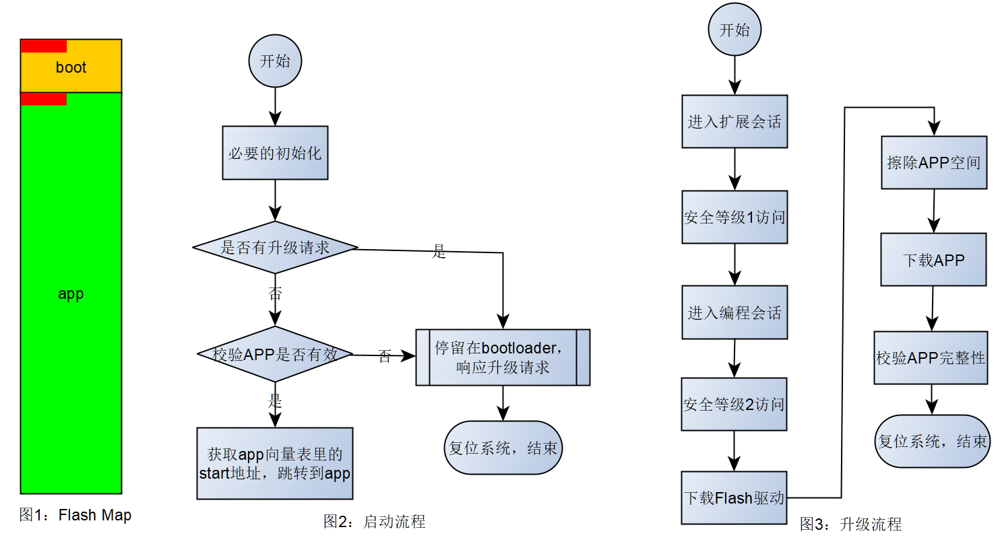

# CAN bootloader 简介

汽车电子电气架构正在经历重大变革：动力总成由燃油转向电动，辅助驾驶功能几乎成为标配；而以特斯拉为代表的"硬件预埋、软件迭代"模式，也促使各厂商要求车上的每个控制器都必须支持 OTA 升级。

本文不讨论 OTA 云端方案，只聚焦其中最基础的一环：汽车上的传统 MCU 控制器大多运行在 CAN 网络之上，那么一个运行在 MCU 内部的 CAN bootloader 通常是如何设计、如何工作的。

bootloader 有两大主要功能：

* **boot**：上电后校验并启动 APP 的过程；
* **loader**：响应诊断升级请求，把新 APP 刷写到 Flash 的过程。

## boot 启动 APP 的过程

汽车 MCU 的程序通常固化在 Flash 中。MCU 上电后从 Flash 的特定地址取第一条指令，这个起始区间就是 **boot 区**，存放 bootloader；其余空间划分为 **app 区**，存放应用程序。下图是一个简单的分区实例，红色区域分别表示 boot 和 app 的中断向量表。



中断向量表的第一项是系统复位向量，存放程序入口函数（通常为汇编）的地址，负责准备 C 运行时环境：初始化 data 段、bss 段和堆栈，然后调用 main 函数。

上图（2）所示为 boot 正常启动 APP 的过程。正常启动路径刻意保持简单，以便尽快把控制权交给 APP，缩短开机时间。

## loader 升级 APP 的过程

MCU 中的 loader 是一个 UDS（统一诊断服务）服务器，响应诊断仪（客户端）发来的一系列 UDS 请求，配合完成 APP 升级，整体流程如上图（3）所示。具体每一步由哪些 UDS 服务构成，后文实验中会看到。

一个 bootloader 项目通常需要三个工程：

* **bootloader 工程**：位于 Flash 起始地址，负责启动与刷写；
* **Flash Driver 工程**：独立的 Flash 擦/写驱动，刷写时才下载到 RAM 执行；
* **Application 工程**：实际的应用程序。

## QEMU Versatilepb bootloader 实验

下面以 QEMU Versatilepb 虚拟机为例，介绍这三个工程的样子，以及一次完整升级的流程。该平台已经集成在本仓库中（[app/platform/qemu](../../app/platform/qemu)），无需额外下载。

首先参考[开发环境搭建](./build-env-setup.md)准备好编译环境，双击工程目录下的 Console.bat 启动 ConEmu 终端。

```sh
# app 页：编译 PC 端工具
D:\repository\as>scons --app=Loader
D:\repository\as>scons --app=CanBridge
D:\repository\as>scons --app=CanDump

# 设置 CAN FD 模式，单帧数据最长 64 字节
D:\repository\as>set LL_DL=64
D:\repository\as>scons --cpl=QemuVersatilepbGCC --app=VersatilepbFlashDriver
# 首次编译需要下载 gcc-arm-none-eabi，时间较长
D:\repository\as>scons --cpl=QemuVersatilepbGCC --app=VersatilepbCanApp
D:\repository\as>scons --cpl=QemuVersatilepbGCC --app=VersatilepbCanBL
```

> 编译后会自动调用 Loader 完成签名（SCons post-action，无需手工执行）：
> APP 使用 crc16-v3 签名，签名地址 `0x3FE80`；Flash Driver 在偏移 4096 处附加 crc16，产物均为 `*.s19.sign`。

此时可以先修改 [app/app/main.c](../../app/app/main.c) 中 main 函数的打印，例如改为：

```c
int main(int argc, char *argv[]) {
  ASLOG(INFO, ("application v2 build @ %s %s\n", __DATE__, __TIME__));
```

然后重新编译 APP，以便刷写后直观确认新版本运行：

```sh
D:\repository\as>scons --cpl=QemuVersatilepbGCC --app=VersatilepbCanApp
```

启动虚拟机与总线桥接：

```sh
# app 页：启动 QEMU 虚拟机（自带一个串口转 CAN）
D:\repository\as>scons --cpl=QemuVersatilepbGCC --app=VersatilepbCanBLRun
qemu-system-arm.exe: -serial tcp:127.0.0.1:9000,server: info: QEMU waiting for connection ...

# sim 页：把 QEMU 的串口 CAN 桥接到 v2 虚拟总线
D:\repository\as>build\nt\GCC\CanBridge\CanBridge.exe -d qemu -d simulator_v2
# tool 页（可选）：总线抓包监视器
D:\repository\as>build\nt\GCC\CanDump\CanDump.exe
```

回到 app 页，可以看到 boot 校验通过并启动了旧版 APP（没有 v2 字样）：

```text
INFO    :bootloader build @ Dec 15 2021 19:26:46
INFO    :application is valid
INFO    :application build @ Dec 14 2021 22:55:11
```

在 boot 页执行升级命令（加 `-v` 可查看每条 UDS 服务的收发明细）：

```sh
D:\repository\as>build\nt\GCC\Loader\Loader.exe -a build\nt\QemuVersatilepbGCC\VersatilepbCanApp\VersatilepbCanApp.s19.sign -f build\nt\QemuVersatilepbGCC\VersatilepbFlashDriver\VersatilepbFlashDriver.s19.sign -l 64
```

全系统仿真是软件定时，速度比真实硬件慢；若偶发 CanTp 超时错误，重新执行一次即可。也可以先在 PC 主机上跑 Host CanBL 演示熟悉流程，参见 [BL 配置与主机仿真](./BL.md#6-canbl-的-windows-仿真测试)。

刷写成功后 boot 页输出：

```text
loader started:
enter extended session          progress  0.10%  okay
level 1 security access         progress  0.30%  okay
enter program session           progress  0.40%  okay
level 2 security access         progress  0.60%  okay
download flash driver           progress  3.62%  okay
erase flash okay
download application            progress 95.91%  okay
check integrity                 progress 96.01%  okay
ecu reset                       progress 99.00%  okay
loader exited without error
                                progress 100.00%
```

app 页随后打印新版本号，说明升级成功、新 APP 已运行：

```text
INFO    :bootloader build @ Dec 15 2021 19:26:46
INFO    :application is valid
INFO    :application v2 build @ Dec 14 2021 21:47:05
```

加 `-v` 可以看到，整个升级过程就是一串 UDS 服务的有序组合：

```text
enter extended session
 request service 10:  TX 10 03               RX 50 03 13 88 00 32
level 1 security access
 request service 27:  TX 27 01               RX 67 01 CF 71 2C 84
                      TX 27 02 B7 E2 6A F7   RX 67 02
enter program session
 request service 10:  TX 10 02               RX 50 02 ...
level 2 security access
 request service 27:  TX 27 03 / 27 04 ...
download flash driver
 request service 34:  TX 34 00 44 ...        RX 74 20 02 02   # RequestDownload
 request service 36:  TX 36 01 ...           RX 76 01         # TransferData
 ...
 request service 37:  TX 37                  RX 77            # RequestTransferExit
download application
 request service 31:  TX 31 01 ...           RX 71 01 ...     # RoutineControl: erase / check
 request service 34 / 36 / 37 ...                                              # download app
check integrity
 request service 31:  TX 31 01 ...           RX 71 01 ...     # RoutineControl: CRC check
ecu reset
 request service 11:  TX 11 01               RX 51 01         # ECUReset
```

涉及的 UDS 服务依次是：10（会话控制）、27（安全访问）、34（请求下载）、36（传输数据）、37（退出传输）、31（例程控制：擦除与校验）、11（ECU 复位）。

## 三个工程的地址空间布局

本例把 Versatilepb 的 `0x00008000 ~ 0x00140000`（1248 KB）模拟为 Flash，`0x00140000 ~ 0x00180000`（256 KB）模拟为 RAM。实际上该 QEMU 机型只有 RAM，这里只是把一部分 RAM 抽象成 Flash。

bootloader 的链接脚本 [linker-boot.lds](../../app/platform/qemu/versatilepb/linker-boot.lds) 片段如下：

```txt
MEMORY
{
   FLASH        (rx)   : ORIGIN = 0x00008000, LENGTH = 224K
   APPCODE      (rx)   : ORIGIN = 0x00040000, LENGTH = 1024K
   FLSDRV       (rwx)  : ORIGIN = 0x00140000, LENGTH = 4K
   RAM          (rwx)  : ORIGIN = 0x00141000, LENGTH = 252K
}
```

`0x00008000 ~ 0x00040000` 为 boot 区，`0x00040000` 起为 app 区。app 的链接脚本 [linker-app.lds](../../app/platform/qemu/versatilepb/linker-app.lds) 对应为：

```txt
MEMORY
{
   FLASH        (rx)   : ORIGIN = 0x00040000, LENGTH = 1024K
   RAM          (rwx)  : ORIGIN = 0x00140000, LENGTH = 256K
}
```

Flash Driver 的链接脚本 [linker-flsdrv.lds](../../app/platform/qemu/versatilepb/linker-flsdrv.lds) 为：

```txt
MEMORY
{
  FLASH        (rwx)  : ORIGIN = 0x00140000, LENGTH = 4K
}

ENTRY(FlashHeader)

SECTIONS
{
    .text :
    {
      *(.rodata*)
      *(.text*)
    } > FLASH
}
```

注意 bootloader 的 RAM 比 app 少了起始处的 4K：这 4K（`0x00140000 ~ 0x00141000`）预留给下载到 RAM 中执行的 Flash Driver，bootloader 与 Flash Driver 合起来才能完成刷写。BL 侧的分区配置在 [BL.json](../../app/platform/qemu/versatilepb/config/BL/BL.json)。

### 为什么 Flash Driver 要独立出来

这是功能安全上的考量：程序本身可能有 bug，MCU 也可能因电磁干扰跑飞，如果擦/写 Flash 的指令静态链接在常驻代码里，一旦误执行就可能擦坏 boot 或 app，导致控制器变砖。业界常见的两种防护：

* **动态下载**（本例采用）：Flash Driver 平时不在 ECU 中，进入编程会话、通过安全访问后才由 UDS 下载到指定 RAM 执行，刷完即弃；
* **加密/取反存储**：把 Flash Driver 的机器码取反或加密存放，使用前在 RAM 中复原，保证 Flash 中不存在可直接执行的有效擦写指令。

分区与链接是 bootloader 移植的主要难点。借助 IDE 把普通工程链接到指定地址并不难，难点在于单独构建一份"只有 Flash Driver"的工程。不同编译器控制链接的方式不同，需要查阅对应文档搞清入口点、段放置等概念——嵌入式开发不要误以为程序入口一定是 main。如上脚本用 `ENTRY(FlashHeader)` 改写入口，并把 rodata 放在 FLASH 起始；而 [Flash.c](../../app/platform/qemu/flash/Flash.c) 中整个工程唯一的 const 常量就是 FlashHeader：

```c
const tFlashHeader FlashHeader = {.Info.W.MCU = 1,
                                  .Info.W.mask = 2,
                                  .Info.W.version = 169,
                                  .Init = FlashInit,
                                  .Deinit = FlashDeinit,
                                  .Erase = FlashErase,
                                  .Write = FlashWrite,
                                  .Read = FlashRead};
```

因此 FlashHeader 的地址就是 `0x00140000`。bootloader 按该地址把内存解释为 tFlashHeader，即可取得 Init/Erase/Write/Read 等函数指针和版本信息，并据此做一致性检查。

本文只覆盖了主干内容。认真做完 QEMU 实验后，对 bootloader 的工作原理就能建立基本认识；BL 模块自身的配置项（A/B 分区、元数据、三种签名格式等）见参考文档 [BL 配置说明](./BL.md)。

## Host CanBL 演示

如果 QEMU 全系统仿真遇到问题，可以直接在 Windows 主机上运行 CanBL 做刷写实验（用虚拟 Flash 模拟），完整步骤见 [BL 配置说明第 6 章](./BL.md#6-canbl-的-windows-仿真测试)。

## QEMU GDB 调试

### 1. 以 GDB 服务器模式启动 QEMU

```sh
scons --cpl=QemuVersatilepbGCC --app=VersatilepbCanBLRun gdb
```

该命令会在 QEMU 参数后附加 `-gdb tcp::1234 -S`，即虚拟机冻结在第一条指令，等待 GDB 连接。

### 2. 用 arm-none-eabi-gdb 连接

新开一个终端：

```sh
arm-none-eabi-gdb.exe build/nt/QemuVersatilepbGCC/VersatilepbCanBL/VersatilepbCanBL.exe
```

在 GDB 中：

```gdb
(gdb) target remote localhost:1234

# 例如单步执行到 PC 离开复位向量
while $pc != 4
  stepi
  print/x $pc
end
```
