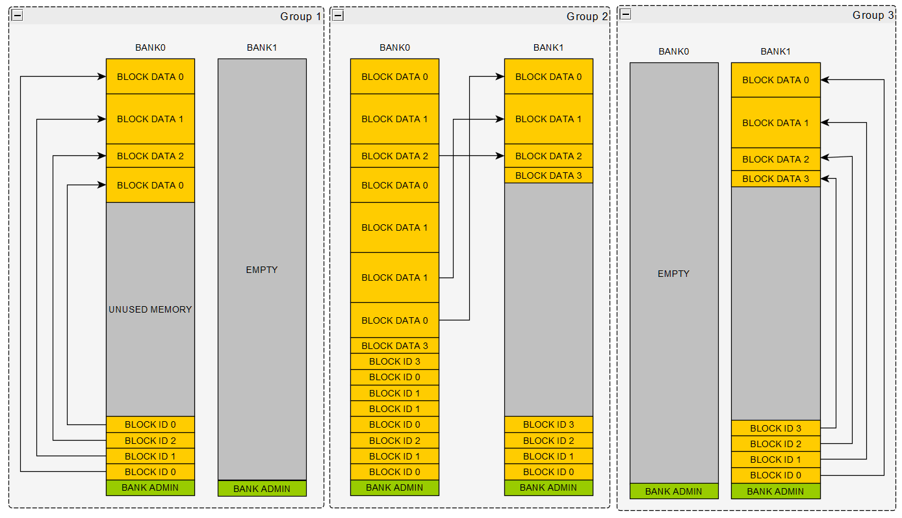
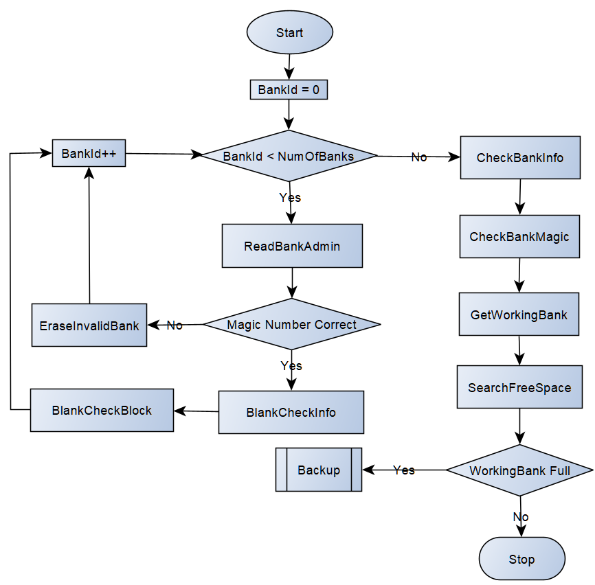
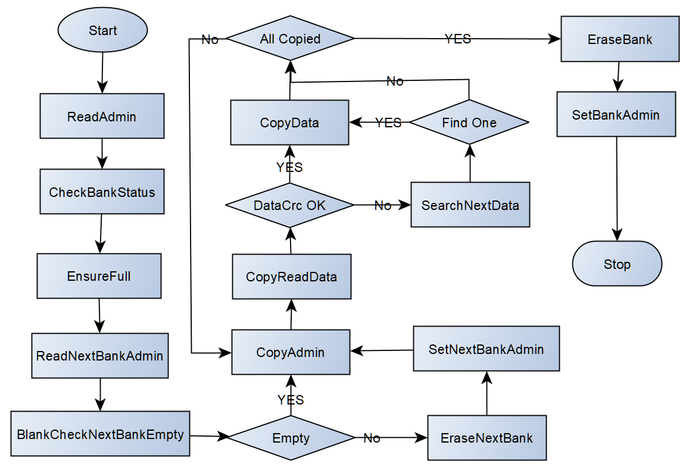

我相信绝大多数的嵌入式系统都需要有一个存储空间来存储一些关键非易失性数据，可选的存储器件那就相当的多了，如TF/SD卡，NAND/NOR FLASH什么的，汽车电子了常用的则为EEPROM和FLASH。

使用EEPROM是一种很常用的方式，一般来说FLASH和EPROM在写数据之前都需要先执行擦出操作，但现在有些EEPROM是不需要擦出操作的，直接发命令写数据就好。但更多的时候，为确保安全在写数据之前，都会执行一个擦写操作，一般对于EEPROM而言，其最小可擦除单元为8到32个字节，而FLASH就会很大，可能512字节以上。所以这也决定了使用EEPROM更加简单，软件不会很复杂。

例如对于汽车常见需要存储的数据里程信息（总里程Odometer和小计里程Tripmeter）而言，对总里程需要４个字节，对小计里程需要２个字节，２个字节的校验码共８个字节，充分考虑EPROM的使用寿命，可能说固定分配EERPOM的０地址起始处的８个最小可擦除单元供其存储使用，这样软件每次冷启动找到总里程最大值作为当前值，并知道了下一个数据更新的地址，从而轮循使用这８个单元来存储里程信息，软件是何其的简单，也就是说，对EEPROM的使用多为一个数据一个或者多个固定地址的坑。

但是对于FLASH就不那么简单了，最小可擦除单元太大，一个数据一个坑的话，呵呵，基本就不用玩了，因为有些MCU控制器，其内部可能就那么几个FLASH块，并且每个块要被擦的话是整个块被全部擦出，所以像EERPOM那样的那种使用方式已经变得不切实际的了。所以这个时候就要换一种玩法，一般被称作用FLASH来模拟EEPROM，所以在AUTOSAR里就有一个模块叫做Fee（Flash Emulation Eeprom）。这里提一下，有些MCU控制器会告诉你其片内带有EEPROM，同时会注明是用FLASH模拟的，个人觉得可能是MCU控制器实现了一个简单的算法来实现该功能，这里不研究了。

本文将介绍[ssas-public/infras/memory/Fee](https://github.com/autoas/ssas-public/tree/master/infras/memory/Fee)的具体实现，首先介绍下FEE的基本原理，如下图所示：



<center> 图1 AUTOSAR FEE 原理图 </center>

上图中展示了如何使用２个FLASH块来模拟EEPROM的过程，使用过程中可以看出，总会有一个FLASH块空闲未使用。当然使用３个及其以上的FLASH块来模拟EEPROM的过程其实是相似的。在系统刚准备就绪时，２个FLASH块肯定都是空的，没有任何数据，这个时候软件将使用BANK0来存储数据，因为是空的，所以理所当然软件很容易知道下一个要写入的数据块的ID域底部地址和DATA域上部地址。通常而言数据块的ID域至少包含数据编码号和数据地址信息，其大小和结构固定，但数据块的DATA域大小和结构都不固定。图1 Group1展示了在依次更新写入数据块0/数据块1/数据块2和又写入一次数据0之后的样子，可见其是依照先后顺序为每个要更新的数据块动态的分配存储空间的，系统冷启动时，又可依照数据块ID域找到最新的有效数据，还是相当巧妙的方法的，从两头向中间靠拢，虽然每个数据块的数据域大小可能不一样，但由于动态分配，一点也不浪费空间。图1 Group2展现了当ID域和DATA域合拢而在该BANK0内没有多余空间时，则软体将备份所有数据块最新数据至BANK1，之后如图1 Group3所示BANK0将被擦出供下一次当BANK1内存耗尽时使用。当然，DATA域中可存入校验码(CRC或者checksum)来保证数据完整性。

OK，以上只是基本原理，实际上要实现一个这样的模块可一点都不简单，当我做完本模块开发，我甚至觉得这是AUTOSAR CP所有模块中最复杂的一个模块，如果能实现这样一个模块，并且抗住压力测试（突然掉电），还是有些许的成就感。但不管怎样，在复杂的功能，如果能将其拆解划分为一个个简单工序，其实也没有那么的复杂。

首先，对于FEE来说，其有大致有如下4种工作状态：

* 初始化（Fee_Init）
* 读数据（Fee_Read）
* 写数据（Fee_Write）
* 数据备份（Backup）

本FEE实现使用了自研[factory库](https://github.com/autoas/ssas-public/tree/master/infras/libraries/factory)来更好的管理这几种工作状态，[factory.json](https://github.com/autoas/ssas-public/blob/master/infras/memory/Fee/factory.json)详细的定义了各工作状态下的各工序。

## 1. 初始化（Fee_Init）

常规而言，初始化无非遍历所有FEE Bank的Admin，确定活动bank（即当前可用来写入读取数据的bank），当考虑到突然掉电这种情况，初始话需要判断当前bank是否有足够的剩余空间来存入新的数据，如果没有，其需要进入数据备份状态，如下，为初始化工作状态下各工序的迁移图：


<center> 图1 FEE 初始化 </center>

参考[Fee_Priv.h](https://github.com/autoas/ssas-public/blob/master/infras/memory/NvM/NvM_Priv.h), 可知Fee_BankAdminType的定义，如下，其主要包含如下三个部分：

```c
 High: | Full Magic | ~ Full Magic | <- Status -\
       | Number     | ~ Number     | <- Info     + <- Bank Admin
 Low:  | FEE Magic  | ~ FEE Magic  | <- Header -/
```

* Header - FEE Magic Number：用以标识这是一块正确被FEE管理的Flash Bank。
* Info - Number: 用以记录本Flash Bank当前被擦写的次数，当达到某个阈值，意味着Flash Bank生命的结束，不可继续擦写。
* Status - Full Magic：默认为Blank空的状态，当本Flash Bank没有可用空间时，在开始做Backup备份时，写入Full Magic。

这里要注意的是，Bank Admin的三部分Header、Info和Status位于三个不同的page处，以保证这三个部分可独力写操作。

* 步骤1：初始话，BankID为0
* 步骤2：ReadBankAdmin - 读取BankID指向的Flash Bank的Admin和紧接Admin的第一个Block（page）的数据
* 步骤3：判断读取的Admin中的Header - FEE Magic Number是否正确，如果正确，跳转到步骤5
* 步骤4：擦除BankID指向的Flash Bank，跳转到步骤7
* 步骤5：BlankCheckInfo - 执行Admin中Info的Fls_BlankCheck, 以确认Info的状态，如果为空，将读取的Info填充为FLS_ERASED_VALUE
* 步骤6：BlankCheckBlock - 执行第一个Block（page）的Fls_BlankCheck, 以确认BankID指向的Bank是否为空，如果为空，将读取的Block填充为FLS_ERASED_VALUE。

注：Fls_BlankCheck是可选操作，主要用来兼容某些Flash擦除后其值不恒为FLS_ERASED_VALUE的ECU，如tc387，所以Fls_BlankCheck将用以确保读取到的Admin中的Info和第一个Block（page）到底是有效数据还是为刚擦除后的空状态
* 步骤7：BankID++，如果所有使用的Bank的Admin都被读入，进入下一步，否则跳转到步骤2。
* 步骤8：CheckBankInfo - 检查所有读取到的Admin信息中的Info是否有效，如果有无效的，写入已知的最大的Number数。

注：本步骤主要考虑擦写Bank Admin过程中突然掉电的情况

* 步骤9: CheckBankMagic - 检查是否存在非法Magic(刚被擦出的Bank)，如果有，写入合法的Magic。

* 步骤10: GetWorkingBank - 遍历所有Bank的Admin, 找到当前活动的Bank。被标记为满状态的Bank优先为当前活动Bank。

* 步骤11: SearchFreeSpace - 从当前活动Bank遍历所有数据，找到有效数据的合法地址，直到找到空闲空间。判断剩余空闲空间是否足够大，如果不是，开始备份操作；否则初始化完成。

## 2. 读数据（Fee_Read）
太简单，懒得描述了。

## 3. 写数据（Fee_Write）
太简单，懒得描述了。

## 4. 数据备份（Backup）


<center> 图2 FEE 数据备份 </center>

* 步骤1：ReadAdmin - 读取当前Bank的Admin和紧接Admin的第一个Block（page）的数据

* 步骤2：CheckBankStatus - 执行Admin中Status的Fls_BlankCheck, 以确认Status的状态，如果为空，将读取的Status填充为FLS_ERASED_VALUE

* 步骤3：EnsureFull - 检查Admin中Status是否为FLS_ERASED_VALUE，如果是，写入FULL_MAGIC（“DEAD”），以标识该Bank为满状态

* 步骤4：ReadNextBankAdmin - 读取下一个Flash Bank的Admin和紧接Admin的第一个Block（page）的数据

* 步骤5：BlankCheckNextBankEmpty - 执行下一个Flash Bank的第一个Block（page）的Fls_BlankCheck，以判断该Bank是否为空，如果为空，执行步骤6，否则，步骤8

* 步骤6：EraseNextBank - 擦除下一个Flash Bank

* 步骤7：SetNextBankAdmin - 设置合法Bank Admin

注：步骤6，7充分考虑在备份数据过程中突然掉电的情况，这时，如果不去遍历下一个Bank的所有数据，无从得知备份到哪里了。考虑到突然掉电是不会经常发生，并为了程序的简单化，干脆擦了重新来过。

* 步骤8：CopyAdmin - 循环，有有效数据的合法地址的数据块，写入Admin

* 步骤9：CopyReadData - 读取合法地址指向的数据，如果CRC有效，执行步骤11

* 步骤10：SearchNextData - 从当前Flash Bank中查找有效数据

* 步骤11：CopyData - 写入有效数据，如果所有数据备份没有完毕，执行步骤8

* 步骤12：EraseBank - 擦除当前Bank

* 步骤13：SetBankAdmin - 当前Bank写入合法Admin
