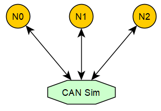

# CAN总线仿真技术

本文假设读者已经具备一定CAN协议相关知识，但就算不了解，也没关系，因为CAN协议本身是非常简单的，CAN协议文档当然讲了一大堆，但很多是其硬件特性的介绍，但我是做软件的，如果仅从软件角度来讲，无外乎，发送和接收CAN报文。

从软件定义角度，如下分别为AUTOSAR 和Linux的CAN报文定义：

 ```c
 // AUTOSAR
 typedef struct {
   uint8_t length;
   Can_IdType id;
   uint8_t *sdu;
 } Can_PduType;
 
 // linux
 struct can_frame {
     canid_t can_id;  /* 32 bit CAN_ID + EFF/RTR/ERR flags */
     __u8    can_dlc; /* frame payload length in byte (0 .. 8) */
     __u8    __pad;   /* padding */
     __u8    __res0;  /* reserved / padding */
     __u8    __res1;  /* reserved / padding */
     __u8    data[8] __attribute__((aligned(8)));
 };
 ```

而CAN网络的一个突出特性就是广播，即同一总线上的节点，其发送CAN报文，可以被其他节点同时接收到。既如此，我们可以在Windows 或者 Linux 操作系统上，利用socket套接字去模拟这一特性，实现CAN网络数据通讯的仿真。但其实，Linux操作系统是默认提供[virtual CAN]([How to create a virtual CAN interface on Linux - PragmaticLinux](https://www.pragmaticlinux.com/2021/10/how-to-create-a-virtual-can-interface-on-linux/)), 有兴趣的同学可以深入研究下其用法，但在windows系统，目前还没有类似的东西，所以这也是我为什么要自己开发基于socket的CAN总线仿真方案。



如上图所以，CAN Sim是一个TCP Server, N0、N1和N2是TCP Client， N0、N1和N2各自和CAN Sim建立TCP链接，当比如N0发送CAN报文时，N0实际是发送CAN报文数据给CAN Sim，在由CAN sim 负责将该CAN报文转发给N1和N2，从而实现一个虚拟的广播。此方案尽管不是很完美，其实是可以使用UDP广播技术会更好，但这是在我还不懂UDP广播技术之前就已开发实现的方案，尽管没有UDP广播技术方案好，但其也很nice，这么多年来，此技术方案帮助我向上实现验证了各CAN通讯栈基础模块，比如CANTP、DCM、COM、CANNM和OSKENM等，也辅助开发验证了bootloader解决方案。

在我[ssas-public](https://github.com/autoas/ssas-public)仓库中，[CAN Sim代码](https://github.com/autoas/ssas-public/tools/libraries/Can/utils/can_simulator.c)是开源的，其实现相当的简单， 代码不超过500行，有兴趣的可以阅读理解下。client端实现代码也已开源，client端头文件[canlib.h](https://github.com/autoas/ssas-public/tools/libraries/Can/include/canlib.h)提供如下API接口：

```c
int can_open(const char *device_name, uint32_t port, uint32_t baudrate);
bool can_write(int busid, uint32_t canid, uint8_t dlc, const uint8_t *data);
bool can_read(int busid, uint32_t *canid /* InOut */, uint8_t *dlc /* InOut */, uint8_t *data);
bool can_close(int busid);
```

目前该canlib支持的设备如下：

* TCP CAN simulator: device_name = "simulator"
* UDP Multicast CAN simulator v2 : device_name = "simulator_v2"
* QEMU serial CAN: device_name = "qemu"
* [Vector VXL CAN](https://www.vector.com/int/en/products/products-a-z/libraries-drivers/xl-driver-library/): device_name = "vxl"
* [Peak CAN](https://www.peak-system.com/): device_name = "peak"
* [ZLG CAN](https://www.zlg.cn/can/can/index.html): device_name = "zlg"

总共也没有几个API，同样的为了和AUTOSAR兼容，我同样在canlib的基础上封装了符合AUTOSAR CAN驱动的接口，代码为[Simulator CAN](https://github.com/autoas/ssas-public/tree/master/app/platform/simulator/src/Can.c)，API接口如下：

```c
void Can_Init(const Can_ConfigType *Config);
void Can_DeInit(void);
Std_ReturnType Can_Write(Can_HwHandleType Hth, const Can_PduType *PduInfo);
Std_ReturnType Can_SetControllerMode(uint8_t Controller, Can_ControllerStateType Transition);
void CanIf_RxIndication(const Can_HwType *Mailbox, const PduInfoType *PduInfoPtr);
```

OK, 本文就讲这么多吧，关于canlib 及其 AUTOSAR CAN驱动如何使用，请关注后续文章，待更。


## 实验-通过python去发送接收报文：

```sh
# step 1: 切换到 app 页，编译如下程序
D:\repository\ssas-public>scons --app=CanSimulator
D:\repository\ssas-public>scons --lib=AsPy
D:\repository\ssas-public>cp build\nt\GCC\AsPy\AsPy.dll AsPy.pyd
# sim 页，运行CAN总线0仿真器
D:\repository\ssas-public>build\nt\GCC\CanSimulator\CanSimulator.exe 0

# step 2: 切换到 app 页，运行如下python交互命令，相当于模拟了一个CAN节点N0
D:\repository\ssas-public>python
Type "help", "copyright", "credits" or "license" for more information.
>>> import os
>>> os.add_dll_directory('C:/msys64/mingw64/bin')
>>> import AsPy
>>> n0 = AsPy.can('simulator', 0)

# step 3: boot 页， 运行如下python交互命令，相当于模拟了一个CAN节点N1
D:\repository\ssas-public>python
Type "help", "copyright", "credits" or "license" for more information.
>>> import os
>>> os.add_dll_directory('C:/msys64/mingw64/bin')
>>> import AsPy
>>> n1 = AsPy.can('simulator', 0)

# step 4: 切换到 sim 页， 可以看到如下输出, CAN Sim 检测到两个节点上线
can socket 104 on-line!
can socket 108 on-line!

# step 5: 切换到 app 页，运行如下python交互命令，N0节点发送一条CAN报文
>>> n0.write(0x731, bytes(range(8)))
True

# step 6: 切换到 sim 页， 可以看到如下输出，N0报文发送成功
canid=00000731,dlc=08,data=[00,01,02,03,04,05,06,07,] [........] @ 1011.104675 s rel 625132.69 ms

# step 7: boot 页， 运行如下python交互命令，接收和发送CAN报文
>>> n1.read(0x731)
[True, 1841, b'\x00\x01\x02\x03\x04\x05\x06\x07']
# 此处可以看到N0的ID为0x731的报文被N1接收到
>>> n1.write(0x732, bytes(range(8)))
True

# step 8: 切换到 sim 页， 可以看到如下输出
canid=00000732,dlc=08,data=[00,01,02,03,04,05,06,07,] [........] @ 1098.185181 s rel 87080.51 ms

# step 9: 切换到 app 页， 继续执行如下python指令
>>> n0.read(0x732)
[True, 1842, b'\x00\x01\x02\x03\x04\x05\x06\x07']
# 可以看到 N1发送的ID为0x732的报文可以被N0接收到。
```

可以看到，该canlib库是如此的方便，通过python就可以轻松访问CAN设备并操纵CAN报文的发送和接收，使用该库可以利用python快速的开发CAN相关测试用例及相关上位机工具，真的不要太容易。人生苦短，请用python！
