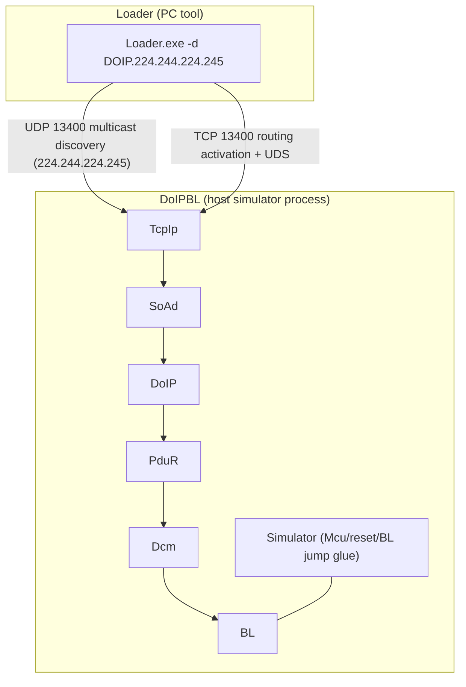
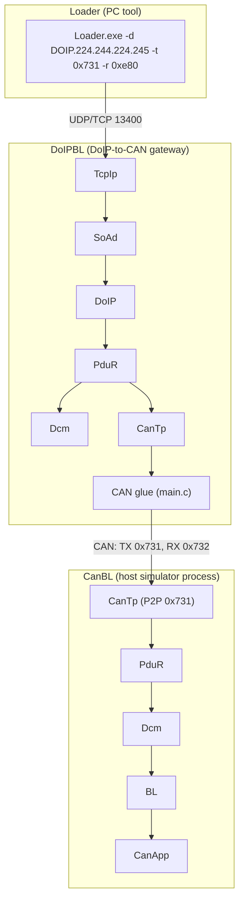

# BL over DoIP Demo on Host Simulator

## Table of Contents

1. [Introduction](#1-introduction)
2. [Architecture](#2-architecture)
3. [Configuration](#3-configuration)
4. [Build](#4-build)
5. [Run DoIPBL](#5-run-doipbl)
6. [Test Flashing over DoIP](#6-test-flashing-over-doip)
   - [Generate Dummy Flash Driver](#61-generate-dummy-flash-driver-1052-bytes)
   - [Generate Dummy Application](#62-generate-dummy-application-partition-a-and-b)
   - [Sign Flash Driver and Application](#63-sign-flash-driver-and-application)
   - [Program over DoIP](#64-program-over-doip)
7. [DoIP to CAN Gateway Demo (Loader -> DoIPBL -> CanBL)](#7-doip-to-can-gateway-demo-loader---doipbl---canbl)
   - [Gateway Configuration](#71-gateway-configuration)
   - [Run the Gateway Loop Demo](#72-run-the-gateway-loop-demo)
   - [Loader SA/TA Mapping](#73-loader-sata-mapping)

## 1. Introduction

`DoIPBL` is a bootloader application running on the host simulator (Windows or Linux) that demonstrates flashing the bootloader over DoIP (ISO 13400) diagnostic services, instead of CAN.

It is built from the same BL stack as `CanBL` (see [BL Configuration & Host Simulation](BL.md)), with the CAN related modules (CanTp) replaced by the Ethernet diagnostic stack: DoIP on top of SoAd and TcpIp. The BL, Dcm and PduR configuration and behavior stay the same.

Notes:

- On the host simulator the DoIPBL build (`USE_BL` + `USE_DOIP`) keeps the bootloader running: it never jumps to the application and never performs a warm reset, so it is a pure target for flashing over DoIP and the demo is reproducible. (The CAN BL still jumps to the application and resets as on real hardware.)
- The application side of this demo is the `Loader` PC tool, which supports DoIP as transport (e.g. `-d DOIP.224.244.224.245`).

## 2. Architecture



The diagnostic request path: `Loader -> TCP 13400 -> TcpIp -> SoAd -> DoIP -> PduR(P2P_RX) -> Dcm -> BL`.
The response path: `BL -> Dcm -> PduR(P2P_TX) -> DoIP -> SoAd -> TcpIp -> TCP -> Loader`.

DoIP creates two SoAd sockets automatically:

- A UDP socket joined in the vehicle identification discovery multicast group `224.244.224.245:13400`.
- A TCP server socket listening on port `13400` (up to `max_connections`).

After the TCP connection is established, the tester sends a routing activation request with source address `0xbeef`; once activated, UDS requests are routed to Dcm with target address `0xdead`.

## 3. Configuration

All DoIP related configurations are under `app/bootloader/config/Net`:

| File | Content |
| --- | --- |
| `Network.json` | DoIP module: discovery address, `max_connections`, target `P2P` with logical address `0xdead`, routine `default` and tester `default` with address `0xbeef` |
| `Dcm.json` | Dedicated Dcm configuration for DoIPBL with only the `P2P` physical channel (no CAN functional channel `P2A`) |
| `PduR.json` | PduR routing: `P2P_RX` from DoIP to Dcm and `P2P_TX` from Dcm to DoIP |
| `Mempool.json` | Memory pool (`MemCluster` named `Net`) used by SoAd/DoIP |

The DoIP target is named `P2P` and the PduR routines are named `P2P_RX`/`P2P_TX`, so they map to the Dcm `P2P` channel (index 0) generated by `Dcm.json`.

The application glue code is in `app/bootloader/src/doip.c`, guarded by `USE_DOIP`, it provides:

- `DoIP_default_RoutingActivationAuthenticationCallback` and `DoIP_default_RoutingActivationConfirmationCallback`: accept the routing activation without authentication.
- `Dcm_GetVin`: reports the VIN used by the DoIP vehicle announcement.
- `DoIP_UserGetEID`/`DoIP_UserGetGID`/`DoIP_UserGetPowerModeStatus`/`DoIP_UserGetRoutingActivationResponseOem`: DoIP user callbacks.

In `app/bootloader/main.c`, when `USE_TCPIP`, `USE_SOAD` and `USE_DOIP` are defined, the initialization calls `TcpIp_Init`, `SoAd_Init`, `DoIP_Init` and `DoIP_ActivationLineSwitchActive`, and the main functions `TcpIp_MainFunction`, `SoAd_MainFunction` and `DoIP_MainFunction` are scheduled.

## 4. Build

Refer to [build environment setup](build-env-setup.md) for the toolchain. Then build the `AsOne` and `LoaderFBL` libraries, the `Loader` PC tool and the `DoIPBL` bootloader one by one, the same pattern as the CanBL simulation test:

```bash
scons --lib=AsOne
scons --lib=LoaderFBL
scons --app=Loader
scons --app=DoIPBL
```

The outputs on Windows are:

- `build/nt/GCC/DoIPBL/DoIPBL.exe`, the bootloader over DoIP.
- `build/nt/GCC/Loader/Loader.exe`, the PC flashing tool.

Building `DoIPBL` also generates the Dcm/PduR/SoAd/DoIP configuration code from `app/bootloader/config/Net/*.json` into the build directory.

## 5. Run DoIPBL

Start the bootloader (on Windows, make sure the MSYS2 `mingw64/bin` runtime DLLs such as `libstdc++-6.dll` are in `PATH`):

```bash
# optional: enable the Dcm module logs (DCMI is DEBUG level, hidden by default)
set AS_LOG_DCMI=1            # Windows CMD; on Linux use export AS_LOG_DCMI=1
build\nt\GCC\DoIPBL\DoIPBL.exe
```

The DoIPBL host build never jumps to the application and never resets, so it stays running in the default session and is ready for flashing.

Expected behavior:

- It prints `bootloader build @ ...` and stays running.
- TcpIp/SoAd report link up, and DoIP listens on UDP/TCP port `13400`.
- `-v <level>` sets the global log verbosity, higher level means more logs; the `AS_LOG_<module>` environment variables control the level per module (e.g. `AS_LOG_DCMI=1` enables the Dcm logs).
- Verify the listening sockets with `netstat -ano | findstr 13400`, it shall show a `TCP 0.0.0.0:13400 LISTENING` entry and an UDP discovery socket on port `13400`.
- To exit, press `Ctrl+C`.

## 6. Test Flashing over DoIP

This section gives the complete command list to verify flashing end to end on the host. All commands run from the repository root. Prerequisites: `python` is in `PATH`, and `Loader.exe`/`DoIPBL.exe` have been built per section 4.

### 6.1 Generate Dummy Flash Driver (1052 bytes)

Use the same generator script as section 6.2 to generate a single 1052-byte section with sequential values (0, 1, 2, ..., 255, 0, 1, ...) at address 0:

```bash
python tools/utils/gensims19.py -n 1 -s 1052 -g 0 -b 0 -o build/FlashDriverDummy.s19
```

### 6.2 Generate Dummy Application (partition A and B)

The generator script is kept at [tools/utils/gensims19.py](../../tools/utils/gensims19.py). It generates a multi-section S19 image; partition A starts at `0x1000` and partition B at `0x100000` (same memory layout as CanBL, because DoIPBL shares `config/BL/BL.json`):

```bash
# partition A
python tools/utils/gensims19.py -n 8 -s 8192 -g 2048 -b 0x1000 -o build/AppDummy.s19.A

# partition B
python tools/utils/gensims19.py -n 8 -s 8192 -g 2048 -b 0x100000 -o build/AppDummy.s19.B
```

### 6.3 Sign Flash Driver and Application

Sign the images with the Loader (signature areas match the BL A/B layout):

```bash
# sign the application for partition A
build\nt\GCC\Loader\Loader.exe -f build/AppDummy.s19.A -s 0xfff00 -S crc32-v3

# sign the application for partition B
build\nt\GCC\Loader\Loader.exe -f build/AppDummy.s19.B -s 0x1fff00 -S crc32-v3

# sign the flash driver
build\nt\GCC\Loader\Loader.exe -f build/FlashDriverDummy.s19 -s 2048 -S crc32
```

### 6.4 Program over DoIP

Run the Loader from another terminal (on Windows make sure `C:\msys64\mingw64\bin` and `build\nt\GCC\one` are in `PATH` for the Loader runtime DLLs). Start DoIPBL and keep it running; because the DoIPBL host build never jumps to the application or resets, a single DoIPBL instance can be used to program both partitions one after another.

```bash
# start DoIPBL and keep it running
set AS_LOG_DCMI=1            # Windows CMD; on Linux use export AS_LOG_DCMI=1
build\nt\GCC\DoIPBL\DoIPBL.exe

# program partition A
build\nt\GCC\Loader\Loader.exe -d DOIP.224.244.224.245 -c FBL -S crc32 -f build/FlashDriverDummy.s19.sign -a build/AppDummy.s19.A.sign

# program partition B (no need to restart DoIPBL)
build\nt\GCC\Loader\Loader.exe -d DOIP.224.244.224.245 -c FBL -S crc32 -f build/FlashDriverDummy.s19.sign -a build/AppDummy.s19.B.sign
```

A successful run ends with every step printing `okay`, `progress 100.00%` and a loader speed summary (about 4 kbps on the host loopback). The flashing procedure goes through DoIP routing activation, extended session, communication control off, security access (extended and program levels), erase, download, verification, check integrity, ECU reset, communication enable and DTC setting on; each step prints `PASS` or `FAIL`, and a `FAIL` aborts the flashing.

Notes:

- `-d DOIP.224.244.224.245` selects DoIP transport and the discovery multicast address.
- The DoIP default port is `13400`, the tester source address is `0xbeef` and the ECU target address is `0xdead` (defaults of the Loader DoIP client, matching `Network.json`).
- `-l 64` is not needed here, it is only for CAN TP.
- `-c FBL` selects the FBL loader, `-S crc32` must match the BL configuration, see [BL Configuration](BL.md) for details.
- Troubleshooting: erasing without the flash driver (missing `-f`) fails with NRC `0x24` (request sequence error), always flash the flash driver first.

## 7. DoIP to CAN Gateway Demo (Loader -> DoIPBL -> CanBL)

DoIPBL additionally works as a DoIP-to-CAN diagnostic gateway: UDS requests received over DoIP with target address `0x731` are forwarded over CAN via CanTp to `CanBL`, so the CAN application (`CanApp`) can be flashed remotely over DoIP. The full loop is `Loader -> DoIPBL -> CanBL -> CanApp`:



- Request path: `Loader -> DoIP -> PduR(CAN_BL_RX) -> CanTp -> CAN 0x731 -> CanBL`.
- Response path: `CanBL -> CAN 0x732 -> CanTp -> PduR(CAN_BL_TX) -> DoIP -> Loader`.
- The `P2P` target `0xdead` still routes to the gateway's own Dcm/BL (section 6), so DoIPBL itself stays flashable while it forwards.

### 7.1 Gateway Configuration

Compared with section 3, the following is added under `app/bootloader/config/Net` (BL `main.c` stays unchanged):

| File | Content |
| --- | --- |
| `Network.json` | Extra target: `CAN_BL` at `0x0731` with node TX CAN id `0x731`; extra routine/tester `CANBL` with tester address `0x0E80` |
| `PduR.json` | TP gateway routes `CAN_BL_RX` (DoIP -> CanTp) and `CAN_BL_TX` (CanTp -> DoIP) with `DestBufferSize: 4096` (the TP gateway buffer is mandatory, otherwise DoIP answers NACK `0x08`) |
| `CanTp.json` | One TP gateway channel `CAN_BL` (`LL_DL: 64`, the source/destination PduIds are derived from the PduR routing) |

The gateway CAN TX id and RX filter are given statically as build definitions in `app/bootloader/SConscript` (`CAN_DIAG_P2P_TX=0x731`, `CAN_DIAG_P2P_RX=0x732`); the glue in `main.c` uses them as defaults, and the command line `-t`/`-r` can override them at runtime.

Note: the Loader parses `-t`/`-r` as decimal unless a `0x` prefix is given, always use e.g. `-t 0x731`.

### 7.2 Run the Gateway Loop Demo

Build the CAN side and start the three processes (Windows: keep MSYS2 `mingw64/bin` DLLs in `PATH`):

```bash
scons --app=CanBL
scons --app=CanApp

# terminal 1: the CAN target (flashes itself into partition A/B, then jumps to CanApp)
build\nt\GCC\CanBL\CanBL.exe

# terminal 2: the DoIP-to-CAN gateway (CAN TX id 0x731, RX filter 0x732, from the SConscript build definitions)
# the Dcm DCMI logs (DEBUG level) are hidden by default, enable them per module:
set AS_LOG_DCMI=1            # Windows CMD; on Linux use export AS_LOG_DCMI=1
build\nt\GCC\DoIPBL\DoIPBL.exe

# terminal 3: flash the CAN application over DoIP, tester SA 0xE80, target TA 0x731
build\nt\GCC\Loader\Loader.exe -d DOIP.224.244.224.245 -t 0x731 -r 0xe80 -c FBL -S crc32 -f build/FlashDriverDummy.s19.sign -a build/AppDummy.s19.A.sign

# program partition B (no need to restart)
build\nt\GCC\Loader\Loader.exe -d DOIP.224.244.224.245 -t 0x731 -r 0xe80 -c FBL -S crc32 -f build/FlashDriverDummy.s19.sign -a build/AppDummy.s19.B.sign
```

A successful run ends with `progress 100.00%` (about 2-3 kbps, the DoIP-to-CAN gateway forwards every UDS request through CAN TP). After the final ECU reset, CanBL verifies the application integrity, activates the flashed partition and jumps to `CanApp.exe`.

### 7.3 Loader SA/TA Mapping

The gateway introduces the tester `CANBL` (SA `0x0E80`) and the target `CAN_BL` (TA `0x0731`) routed by its routine. The Loader needs no modification to use the mapping via the command line; the mapping mechanism of its DOIP branch ([loader_cmd.cpp](../../tools/libraries/loader/utils/loader_cmd.cpp)) is:

- `-r` maps to the tester source address `params.U.DoIP.sourceAddress`, default `0xbeef` when not given (matches the `default` tester);
- `-t` maps to the diagnostic target address `params.U.DoIP.targetAddress`, default `0xdead` when not given (flashes the gateway itself, see section 6);
- The routing activation type is fixed to `0`; SA `0x0E80` matches the `CANBL` routine in `Network.json`;
- The Loader does not check the response SA, so no code change is needed.

Optional: to forward through the gateway by default when `-r`/`-t` are not given (instead of flashing the gateway itself), differentiate the defaults by device name in the DOIP branch of `loader_cmd.cpp`, e.g. for device name `DOIP-CANBL.224.244.224.245` default to `rxid = 0xe80` (CANBL tester) and `txid = 0x731` (`CAN_BL` target). Keep the existing `0xbeef/0xdead` defaults (section 6 relies on them). Do not change `toU32` to parse hex by default: `-s` (signature offset), `-T` (timeout) and other options share it, that would change their behavior; keep the `0x` prefix convention.
