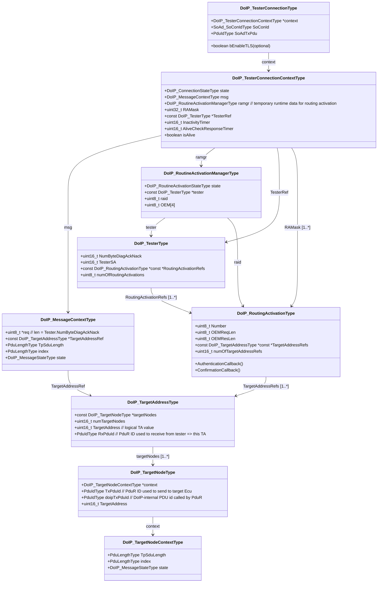
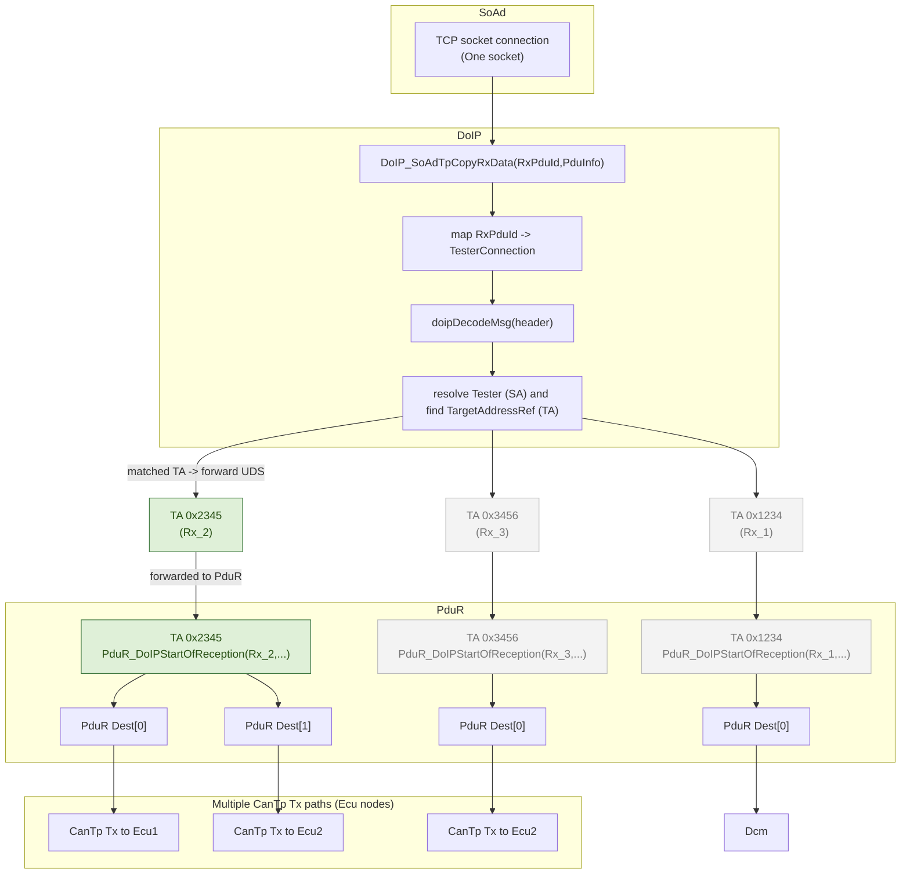
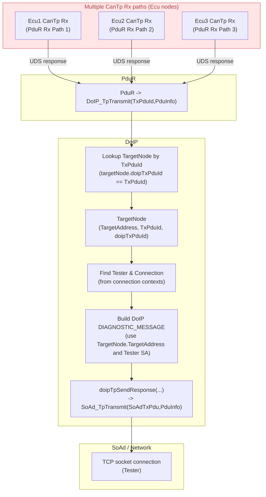

# DoIP Socket Configuration and Example Setup

This document explains the socket types used in a DoIP (Diagnostics over Internet Protocol) server implementation and provides a step-by-step example for testing with sample applications.

---

## 1. DoIP Socket Types

### 1.1 UDP Discovery Socket
- **Purpose**: Handles broadcast communication for vehicle discovery.  
- **Configuration**: By default, this socket is set to broadcast mode to send vehicle announcement messages (e.g., `VehicleAnnouncement` PDU) to announce the Ecu¡¯s presence on the network.  
- **Key Feature**: Broadcast traffic allows other DoIP clients (e.g., diagnostic tools) to detect the server on the local network.

### 1.2 TCP DoIP Server Socket
- **Purpose**: Acts as a server to accept incoming TCP connections from DoIP clients (e.g., diagnostic testers).  
- **Function**: Listens for client connection requests (via the DoIP `Connect` PDU) and manages persistent communication channels for diagnostic services (e.g., vehicle data exchange).  

---

## 2. Example Application Setup

This example demonstrates testing DoIP functionality using two sample applications:  
- **NetApp**: Integrates SOME/IP/SD, DoIP, and CAN stack for end-to-end communication.  
- **DoIPSend**: A standalone DoIP tester to validate server behavior (e.g., discovery, connection, and data exchange).  

---

### 2.1 Building CanApp as edge node

```sh
scons --app=CanApp
```

---

### 2.2 Building NetApp Without LWIP/VirtualBox Adapter
To test CAN-related functionality (bypassing virtual network adapters), rebuild NetApp using the OS Abstraction Layer (OSAL) instead of LWIP:

```sh
# Rebuild NetApp without LWIP/VirtualBox (uses OSAL for networking)
scons --app=NetApp --os=OSAL
```

---

### 2.3 Building the DoIP Tester (DoIPSend)  
Compile the standalone DoIP tester to validate server behavior:  

```sh
# Build the DoIPSend tester application
scons --app=DoIPSend
```

---

### 2.4 Running the Example  
ExEcute the applications in sequence to test DoIP communication:

#### Step 1: Start NetApp (Server)  
Launch the NetApp server, which initializes DoIP, SOME/IP-SD, and CAN stacks:

```sh
# Run NetApp
build\nt\GCC<br>etApp<br>etApp.exe

# run CanApp as edge node
build\nt\GCC\CanApp\CanApp.exe
```

#### Step 2: Start DoIPSend (Tester)  
Use `DoIPSend` to send DoIP requests to the server. Examples include:

- **Basic Connection Test**:
  ```sh
  build\nt\GCC\DoIPSend\DoIPSend.exe -v 1001
  # press key "d" to simulate DoIP online `DoIP_ActivationLineSwitchActive`
  ```

- **Edge Node Connection Test**:  
  ```sh
  build\nt\GCC\DoIPSend\DoIPSend.exe -v 1001 -t caaa
  ```

- **TLS Encrypted Connection Test**:

  For this test, need to ensure `EnableTLS` of [App Network.json](../../app/app/config/Net/Network.json) is `true`, and need to rebuild the NetApp.

  ```sh
  # Specify a custom TLS certificate for sEcure communication
  build\nt\GCC\DoIPSend\DoIPSend.exe -v 1001 -T app\app\config<br>et\Cert\TLS0_CasCerts.pem
  ```


# 3 DoIP Architecture

# 3.1 DoIP_TesterConnectionType



# 3.2 DoIP UDS Message Rx



# 3.2 DoIP UDS Message Reply

