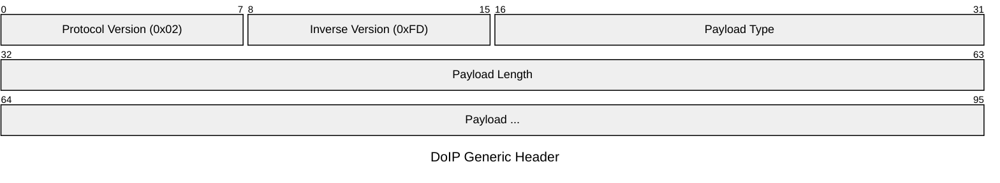
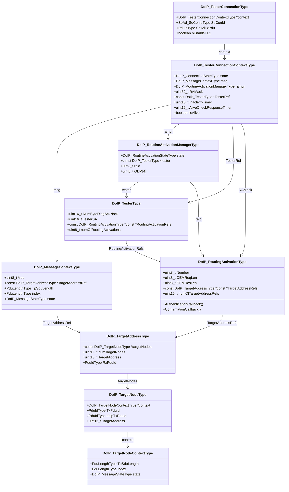
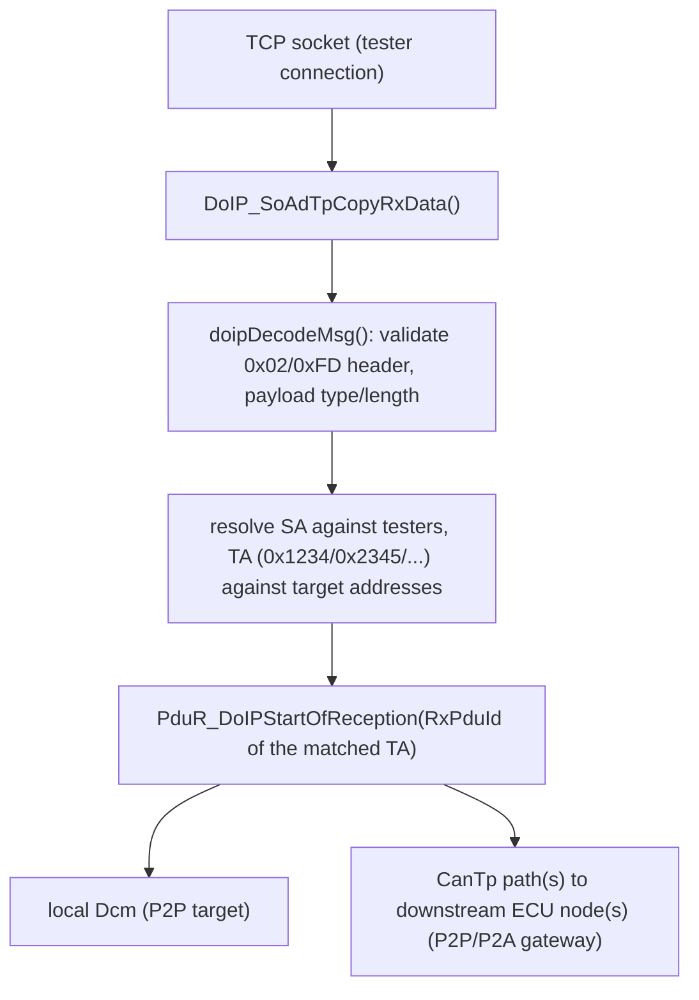
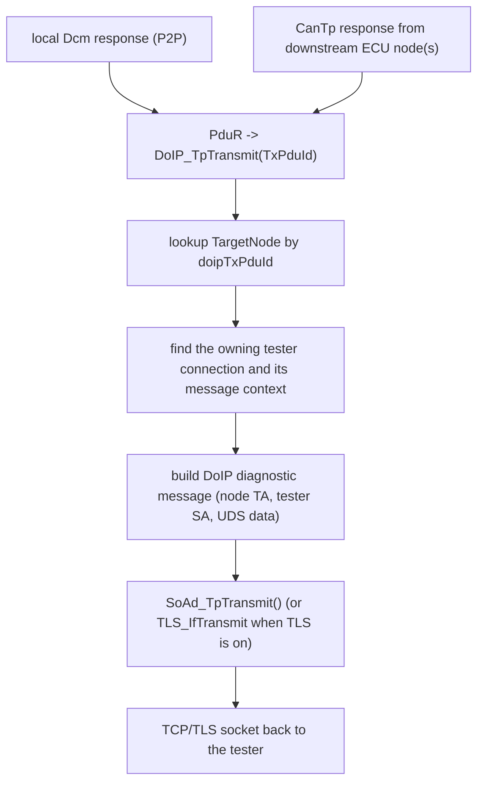

# DoIP - UDS Diagnostics over Ethernet

**DoIP** (Diagnostics over IP, ISO 13400 / AUTOSAR CP 4.4) carries UDS diagnostic traffic over Ethernet. A DoIP server running on the ECU (or on the host simulator) lets an external tester:

* discover the ECU on the network (vehicle identification, VIN/EID/GID/logical address);
* open a TCP connection and request routing activation;
* exchange UDS messages (service 0x10/0x22/0x2E/0x31/0x34/0x36/...), either terminating them locally in Dcm or forwarding them as a gateway to other ECUs over CAN (CanTp).

The implementation lives in [infras/communication/DoIP](../../infras/communication/DoIP/DoIP.c); the host-side tester library is [doipc](../../tools/libraries/doipc) (DoIPClient).

## 1. Protocol Basics

Every DoIP message starts with an 8-byte generic header followed by the payload:


```mermaid
packet-beta
title DoIP Generic Header
0-7: "Protocol Version (0x02)"
8-15: "Inverse Version (0xFD)"
16-31: "Payload Type"
32-63: "Payload Length"
64-95: "Payload ..."
```

The version bytes must be `0x02` and `0xFD` (inverse), otherwise a generic header NACK (payload type `0x0000`) is returned (see [DoIP.c](../../infras/communication/DoIP/DoIP.c) `doipFillHeader()` / `doipDecodeMsg()`).

Supported payload types (see [DoIP_Priv.h](../../infras/communication/DoIP/DoIP_Priv.h)):

| Payload Type | Value | Transport | Purpose |
| --- | --- | --- | --- |
| Generic header NACK | 0x0000 | UDP/TCP | malformed header / unknown type / bad length |
| Vehicle identification request | 0x0001/0x0002/0x0003 | UDP | by VIN/EID or broadcast identification |
| Vehicle announcement / VIN response | 0x0004 | UDP | VIN(17) + LA + EID(6) + GID(6) + sync status |
| Routing activation request / response | 0x0005 / 0x0006 | TCP | tester asks for diagnostic routing |
| Alive check request / response | 0x0007 / 0x0008 | TCP | connection liveness monitoring |
| Entity status request / response | 0x4001 / 0x4002 | UDP | node type, max/open connections |
| Power mode request / response | 0x4003 / 0x4004 | UDP | power mode status |
| Diagnostic message | 0x8001 | TCP | UDS request (SA + TA + user data) |
| Diagnostic message positive ACK | 0x8002 | TCP | request accepted for routing |
| Diagnostic message negative ACK | 0x8003 | TCP | invalid SA / unknown TA / too large / unreachable / TP error |

Sockets (generated from the `discovery` / `max_connections` config, see [Net.py ProcDoIp](../../tools/generator/Net.py)):

* **UDP 13400** on the multicast group `224.244.224.245`: vehicle identification requests/responses and cyclic vehicle announcements;
* **TCP server 13400**: accepts tester connections; up to `max_connections` concurrent tester sockets (`DOIP_TCP_APT0..n`).

The DoIP entity stays **silent until the application activates it** by calling `DoIP_ActivationLineSwitchActive()` ([DoIP.c](../../infras/communication/DoIP/DoIP.c)): before that, all received DoIP messages are silently dropped and no socket is opened. Once active, the entity sends 3 vehicle announcements (initial delay 50 ms, interval 200 ms; values generated by [DoIp.py](../../tools/generator/DoIp.py)). On a real ECU this call is tied to the KL15/activation line state; the integration example does it in `EcuM_AL_EnterRUN()`.

## 2. Configuration (Network.json)

DoIP is configured by the `DoIp` module inside `Network.json` (class `Net`). Example from [app/app/config/Net/Network.json](../../app/app/config/Net/Network.json):

```json
{
  "name": "DoIp",
  "class": "DoIp",
  "discovery": "224.244.224.245:13400",
  "EnableTLS": false,
  "max_connections": 3,
  "targets": [
    { "name": "P2P",    "address": "0xdead" },
    { "name": "GW_P2P", "address": "0xcaaa" },
    { "name": "GW_P2A",  "address": "0xcaab",
      "nodes": [
        { "name": "GW_P2A0", "address": "0xcaa0" },
        { "name": "GW_P2A1", "address": "0xcaa1" }
      ]
    }
  ],
  "routines": [
    { "name": "default", "number": "0x00", "targets": ["P2P", "GW_P2P", "GW_P2A"] }
  ],
  "testers": [
    { "name": "default", "address": "0xbeef", "routines": ["default"] }
  ]
}
```

| Field | Meaning |
| --- | --- |
| `discovery` | multicast group and UDP port for vehicle identification / announcement |
| `EnableTLS` | wrap the DoIP TCP connections in TLS (requires a TLS.json entry and mbedTLS) |
| `max_connections` | maximum simultaneous tester TCP connections; also the listen backlog |
| `targets[].address` | target address (TA) a tester can address |
| `targets[].nodes[]` | optional: one TA is served by several downstream nodes (one-to-any gateway); each node gets its own PduR path |
| `routines[]` | routing activation types (`number`) and the target addresses each one unlocks; optional authentication/confirmation callbacks |
| `testers[]` | known tester source addresses (SA) and the routing types they may activate |

The generator [DoIp.py](../../tools/generator/DoIp.py) produces `DoIP_Cfg.c/.h`: the target/node tables, tester connections (TCP socket + TxPdu, TLS TxPdu when enabled), socket connector references, timers (initial/general inactivity 5000 ms, alive-check timeout 50 ms, main function period 10 ms) and the entity logical address (`0xdead`).

### 2.1 PduR routing: local Dcm vs. CAN gateway

Where a diagnostic message goes is decided by [PduR.json](../../app/app/config/Net/PduR.json):

* **P2P (point-to-point)**: `DoIP <-> Dcm`, the UDS request terminates inside this ECU (target `0xdead`);
* **GW_P2P**: `DoIP <-> CanTp`, forwarded to exactly one CAN ECU (target `0xcaaa`);
* **GW_P2A (point-to-any)**: one DoIP target (`0xcaab`) fans out to several CAN nodes (`0xcaa0`, `0xcaa1`, ...); a 4096-byte routing buffer is shared and the response comes back from the node that answered.

### 2.2 TLS

When `EnableTLS` is true the TCP server socket is owned by the TLS layer instead of DoIP, and [TLS.json](../../app/app/config/Net/TLS.json) provides the certificate files (`Cert/TLS0_ServerCerts.pem`, `TLS0_ServerKey.pem`, `TLS0_CasCerts.pem` under [config/Net/Cert](../../app/app/config/Net/Cert)). The tester side verifies the server certificate against the CA PEM passed with `-T` (mbedTLS client in [doip_client.cpp](../../tools/libraries/doipc/src/doip_client.cpp)).

## 3. Host Lab

Everything in this section runs on the host with native OSAL sockets - no LWIP, VirtualBox or PCAP needed.

### 3.1 Build

```sh
# ECU side: integrated app (SOME/IP + DoIP + CAN stacks)
scons --app=NetApp --os=OSAL

# CAN edge-node ECU answering the gateway requests (optional, for -t caaa/caab)
scons --app=CanApp

# standalone DoIP tester
scons --app=DoIPSend
```

### 3.2 Activating DoIP in the host app

Linking the DoIP library makes the build define `USE_DOIP`, so EcuM already calls `DoIP_Init()` and schedules `DoIP_MainFunction()` automatically ([EcuM_Cfg.c](../../infras/system/EcuM/config/EcuM_Cfg.c)). The application still has to switch the activation line once at run-time. Add the same snippet the real-ECU demo uses ([AsDemo main.c](../../app/platform/tc3x7/AsDemo/src/main.c)) to `EcuM_AL_EnterRUN()`:

```c
#ifdef USE_DOIP
  DoIP_ActivationLineSwitchActive();
#endif
```

### 3.3 Running

```sh
# terminal 1: the DoIP ECU
build/nt/GCC/NetApp/NetApp.exe

# terminal 2 (optional): the CAN edge node
build/nt/GCC/CanApp/CanApp.exe -d simulator_v2

# terminal 3: the tester - send UDS 10 01 (defaultSession) to local target 0xdead
build/nt/GCC/DoIPSend/DoIPSend.exe -v 1001
```

DoIPSend first waits for a vehicle announcement on the multicast group, then falls back to sending a vehicle identification request, opens TCP 13400, performs routing activation, sends **one** UDS request and prints the response.

### 3.4 DoIPSend command line

Source: [doip_send.c](../../tools/libraries/doipc/utils/doip_send.c).

| Option | Default | Meaning |
| --- | --- | --- |
| `-v <hex>` | (mandatory) | UDS request as a hex string, e.g. `1001` = DiagnosticSessionControl defaultSession; also the payload sent in the DoIP diagnostic message |
| `-i <ip>` | `224.244.224.245` | discovery IP / multicast group (UDP_TEST_EQUIPMENT_REQUEST target) |
| `-p <port>` | `13400` | DoIP UDP/TCP port |
| `-s <hex>` | `beef` | tester source address (SA) |
| `-a <hex>` | `00` | routing activation type |
| `-t <hex>` | `dead` | target address (TA) |
| `-T <pem>` | none | CA certificate PEM; enables a TLS (mbedTLS) tester connection |

More examples:

```sh
# gateway test: UDS 10 01 routed over CAN to the edge node at TA 0xcaaa
build/nt/GCC/DoIPSend/DoIPSend.exe -v 1001 -t caaa

# secure connection (requires "EnableTLS": true in Network.json and a NetApp rebuild)
build/nt/GCC/DoIPSend/DoIPSend.exe -v 1001 -T app/app/config/Net/Cert/TLS0_CasCerts.pem
```

Instead of CanApp you can also simulate the downstream CAN ECUs in Python; [TestDoIP_CANTP_GW.py](../../app/app/config/Net/TestDoIP_CANTP_GW.py) shows two ISO-TP responders on the v2 multicast CAN bus (rxid/txid 0x7E0/0x7D0 and 0x7E1/0x7D1).

The same DoIP client functionality is available to PC tools through the DoIPClient library ([doip_client.h](../../tools/libraries/doipc/include/doip_client.h)): `doip_create_client()`, `doip_await_vehicle_announcement()`, `doip_request()`, `doip_connect()`, `doip_activate()`, `doip_transmit()`.

## 4. DoIP Architecture

### 4.1 Tester connection model


```mermaid
classDiagram
  class DoIP_TesterConnectionType {
    +DoIP_TesterConnectionContextType *context
    +SoAd_SoConIdType SoConId
    +PduIdType SoAdTxPdu
    +boolean bEnableTLS
  }
  class DoIP_TesterConnectionContextType {
    +DoIP_ConnectionStateType state
    +DoIP_MessageContextType msg
    +DoIP_RoutineActivationManagerType ramgr
    +uint32_t RAMask
    +const DoIP_TesterType *TesterRef
    +uint16_t InactivityTimer
    +uint16_t AliveCheckResponseTimer
    +boolean isAlive
  }
  class DoIP_MessageContextType {
    +uint8_t *req
    +const DoIP_TargetAddressType *TargetAddressRef
    +PduLengthType TpSduLength
    +PduLengthType index
    +DoIP_MessageStateType state
  }
  class DoIP_RoutineActivationManagerType {
    +DoIP_RoutineActivationStateType state
    +const DoIP_TesterType *tester
    +uint8_t raid
    +uint8_t OEM[4]
  }
  class DoIP_TesterType {
    +uint16_t NumByteDiagAckNack
    +uint16_t TesterSA
    +const DoIP_RoutingActivationType *const *RoutingActivationRefs
    +uint8_t numOfRoutingActivations
  }
  class DoIP_RoutingActivationType {
    +uint8_t Number
    +uint8_t OEMReqLen
    +uint8_t OEMResLen
    +const DoIP_TargetAddressType *const *TargetAddressRefs
    +uint16_t numOfTargetAddressRefs
    +AuthenticationCallback()
    +ConfirmationCallback()
  }
  class DoIP_TargetAddressType {
    +const DoIP_TargetNodeType *targetNodes
    +uint16_t numTargetNodes
    +uint16_t TargetAddress
    +PduIdType RxPduId
  }
  class DoIP_TargetNodeType {
    +DoIP_TargetNodeContextType *context
    +PduIdType TxPduId
    +PduIdType doipTxPduId
    +uint16_t TargetAddress
  }
  class DoIP_TargetNodeContextType {
    +PduLengthType TpSduLength
    +PduLengthType index
    +DoIP_MessageStateType state
  }
  DoIP_TesterConnectionType --> DoIP_TesterConnectionContextType : context
  DoIP_TesterConnectionContextType --> DoIP_MessageContextType : msg
  DoIP_TesterConnectionContextType --> DoIP_RoutineActivationManagerType : ramgr
  DoIP_TesterConnectionContextType --> DoIP_TesterType : TesterRef
  DoIP_RoutineActivationManagerType --> DoIP_TesterType : tester
  DoIP_RoutineActivationManagerType --> DoIP_RoutingActivationType : raid
  DoIP_TesterConnectionContextType --> DoIP_RoutingActivationType : RAMask
  DoIP_MessageContextType --> DoIP_TargetAddressType : TargetAddressRef
  DoIP_TesterType --> DoIP_RoutingActivationType : RoutingActivationRefs
  DoIP_RoutingActivationType --> DoIP_TargetAddressType : TargetAddressRefs
  DoIP_TargetAddressType --> DoIP_TargetNodeType : targetNodes
  DoIP_TargetNodeType --> DoIP_TargetNodeContextType : context
```

### 4.2 UDS message reception (tester -> ECU)

One TCP connection carries all diagnostic traffic. DoIP decodes the header, resolves the TA to a configured target address, and starts a PduR TP reception on the RxPduId of that target. PduR then routes the assembled UDS message either to the local Dcm (P2P) or to one/several CanTp paths (gateway).


```mermaid
flowchart TD
  Sock["TCP socket (tester connection)"]
  Rx["DoIP_SoAdTpCopyRxData()"]
  Decode["doipDecodeMsg(): validate 0x02/0xFD header, payload type/length"]
  Resolve["resolve SA against testers, TA (0x1234/0x2345/...) against target addresses"]
  PduR["PduR_DoIPStartOfReception(RxPduId of the matched TA)"]
  Dcm["local Dcm (P2P target)"]
  CAN["CanTp path(s) to downstream ECU node(s) (P2P/P2A gateway)"]
  Sock --> Rx --> Decode --> Resolve --> PduR
  PduR --> Dcm
  PduR --> CAN
```

### 4.3 UDS reply (ECU -> tester)

The downstream UDS response arrives through PduR (`DoIP_TpTransmit`). DoIP looks up the target node by `doipTxPduId`, finds the tester connection that previously routed to it, rebuilds a diagnostic message with the node TA and the tester SA, and sends it over the same TCP (or TLS) connection.


```mermaid
flowchart TD
  Dcm["local Dcm response (P2P)"]
  CAN["CanTp response from downstream ECU node(s)"]
  PduR["PduR -> DoIP_TpTransmit(TxPduId)"]
  Lookup["lookup TargetNode by doipTxPduId"]
  Find["find the owning tester connection and its message context"]
  Build["build DoIP diagnostic message (node TA, tester SA, UDS data)"]
  Send["SoAd_TpTransmit() (or TLS_IfTransmit when TLS is on)"]
  Sock["TCP/TLS socket back to the tester"]
  Dcm --> PduR
  CAN --> PduR
  PduR --> Lookup --> Find --> Build --> Send --> Sock
```

## 5. Real ECU Integration: AURIX TC3x7 AsDemo

The [tc3x7 AsDemo](../../app/platform/tc3x7/AsDemo/SConscript) is a production-shaped example: DoIP runs on Ethernet while 30+ target addresses are gatewayed to CAN/CAN FD ECUs (the P2A `MCANFD_E400` target even fans out to two nodes with different CAN TxIds). Activation happens automatically at start-up ([main.c](../../app/platform/tc3x7/AsDemo/src/main.c), `EcuM_AL_EnterRUN` under `USE_DOIP`). Example tester invocations registered in its SConscript:

```sh
# local ECU (TA 0xE400), tester SA 0x0E80
DoIPSend.exe -v 1001 -s 0x0E80 -t 0xE400
# gateway to CAN TA 0x0724
DoIPSend.exe -v 1001 -s 0x0E80 -t 0x724
# second tester SA, TA 0x0757
DoIPSend.exe -v 1001 -s 0x0F00 -t 0x757
```
