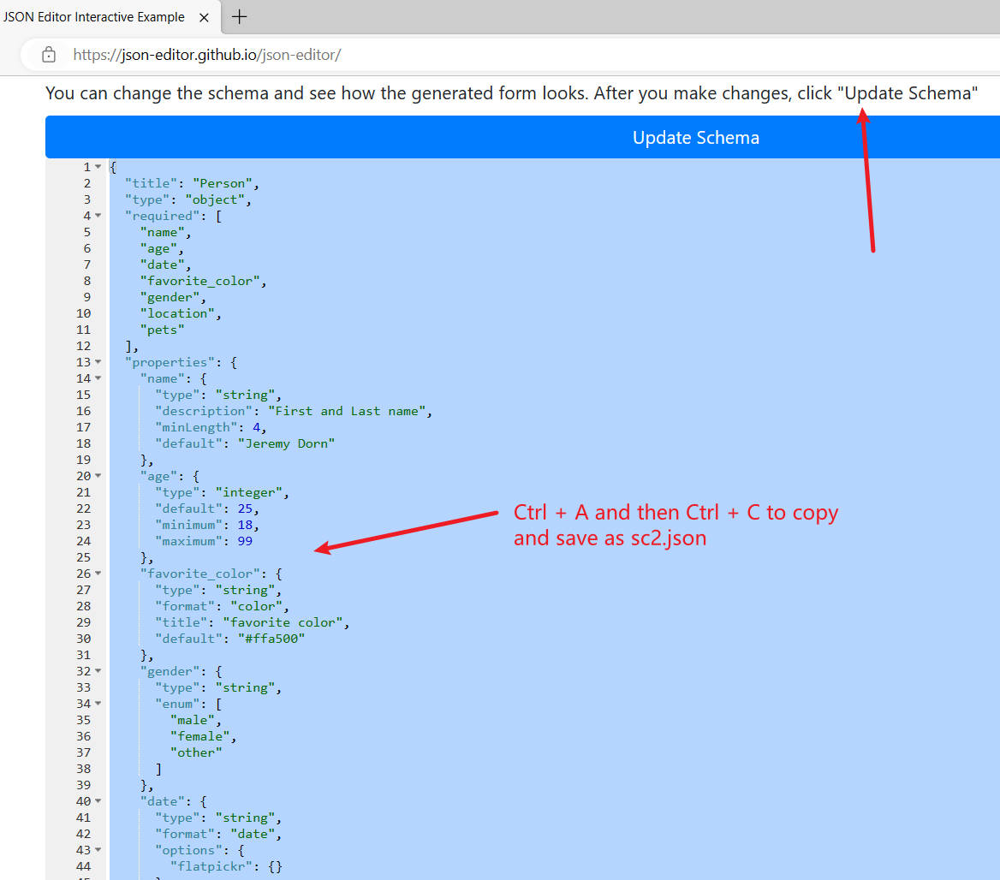
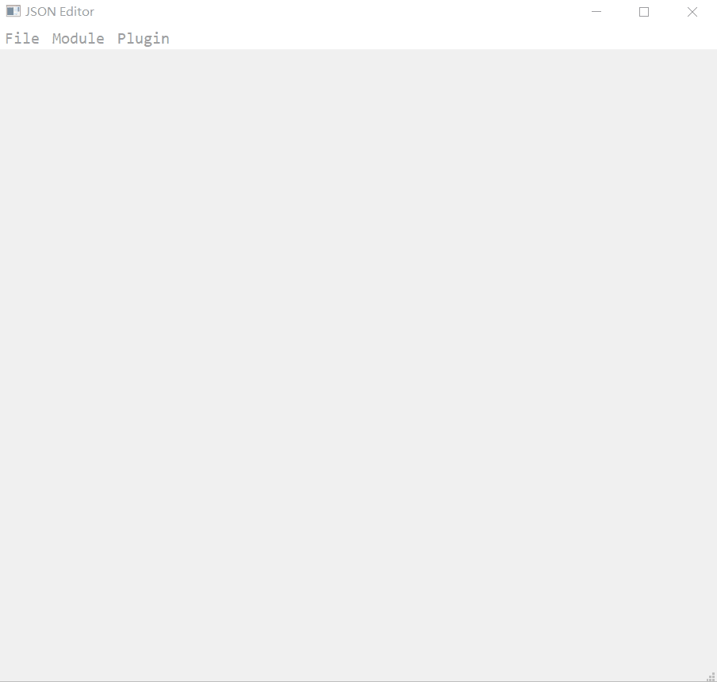
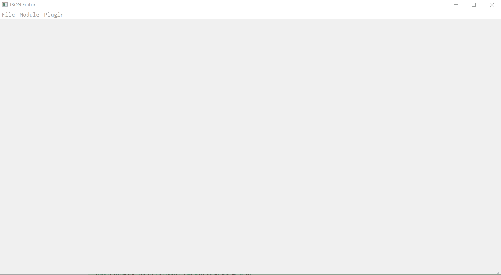

# JsonEditor for SSAS

JsonEditor itself is very general, almost the same as https://json-editor.github.io/json-editor/, but reimplemented by using PyQT5. This tool is very flexible and can be used to configure BSWs of SSAS, but it can also be used for other areas.

If you open and look into pages of https://json-editor.github.io/json-editor/, the GUI is automatially generated based on the schema provided, and the configuration is also automatically generated when you save it, this will make the work easir to design the GUI configuration tool for SSAS.

Let's see an example, open https://json-editor.github.io/json-editor/ and scroll to bottom and click "Update Schema" and use "Ctrl + A" and "Ctrl + C" to copy the json schema and save it as sc2.json.



Then command as below to launch the json editor:

```sh
cd tools\json.editor
python main.py -s sc2.json
```



But please note that this tool doesn't support all the schema features as described by https://json-schema.org/, and it's not exactly the same as https://json-schema.org/, it has some special design for SSAS, such as the "enumref", for more about how to worte a schema file, ref [SSAS/schema](../../tools/json.editor/schema.json).

Anyway, with this tool, it will be easier for new one to start to configure SSAS and get the configuration C/H source files generated. Below is a command that start the json editor with [SSAS/schema](../../tools/json.editor/schema.json).

```sh
cd tools\json.editor
python main.py
```




