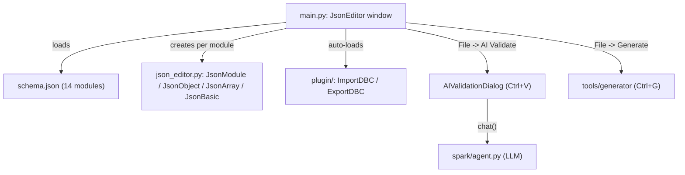
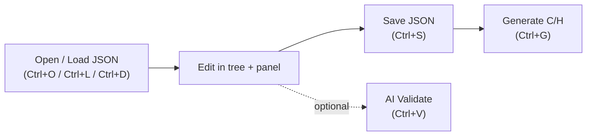

# JSON Editor

The **JSON Editor** is a PyQt5-based desktop GUI tool for configuring AUTOSAR BSW modules of the AS project. Instead of hand-editing JSON or generated C files, integrators edit configuration through a schema-driven tree view, and the tool writes back JSON and (via the code generator) C/H source files.

This document covers the tool's architecture, command-line usage, main features, and the workflow from opening a configuration to generating C code.

## 1. Overview

The editor loads a single [schema.json](../../tools/json.editor/schema.json) that declares every supported ECU module as a top-level object. For each module it renders a docked window with a tree (left) and a property panel (right). Multiple modules are loaded as tabs.

Supported top-level modules (defined in [schema.json](../../tools/json.editor/schema.json)):

| Module | Purpose |
| --- | --- |
| Dcm | UDS diagnostic services, sessions, security, DIDs, routines |
| OS | OS task / alarm / resource configuration |
| Dem | Diagnostic Event Manager (DTCs, snapshots, extended data) |
| NvM | NVRAM Manager (block descriptors, RAM mirrors) |
| EcuC | ECU Configuration (PDU registry, shared across modules) |
| CanIf | CAN Interface (networks, Rx/Tx PDUs, upper-layer routing) |
| LinIf | LIN Interface |
| PduR | PDU Router (routing paths between modules) |
| CanTp | ISO 15765 CAN transport layer |
| J1939Tp | J1939 transport layer |
| Com | COM signal / I-PDU / group / trigger definitions |
| Net | Ethernet stack: SoAd, DoIP, SomeIp, SomeIpXf, TLS |
| E2E | End-to-end protection profiles |
| BL | Bootloader (memory layout, signature, security) |

The same JSON files are also consumed directly by the code generator under [tools/generator](../../tools/generator) (e.g. `Dcm.py`, `Com.py`, `CanIf.py`, `NvM.py`, `BL.py`, `DoIp.py`, `SomeIp.py`).

## 2. Architecture

| Component | Role |
| --- | --- |
| [main.py](../../tools/json.editor/main.py) | Entry point; CLI parsing, main window, menu bar (File / Module / Plugin), file I/O, AI validation dialog, cross-module orchestration |
| [json_editor.py](../../tools/json.editor/json_editor.py) | Schema-driven widget framework: `JsonBase`, `JsonObject`, `JsonArray`, `JsonBasic`, `JsonModule`, field widgets, issue annotations |
| [schema.json](../../tools/json.editor/schema.json) | Declarative schema for all 14 modules (types, defaults, constraints, cross-references, conditional visibility) |
| [plugin/](../../tools/json.editor/plugin) | Auto-discovered plugins: `ImportDBC.py`, `ExportDBC.py` (Vector CAN DBC import/export) |
| [tools/generator](../../tools/generator) | Backend invoked by the Generate action to turn JSON into C/H |


```mermaid
flowchart TD
    M["main.py: JsonEditor window"]
    SCH["schema.json (14 modules)"]
    JE["json_editor.py: JsonModule / JsonObject / JsonArray / JsonBasic"]
    PLG["plugin/: ImportDBC / ExportDBC"]
    AID["AIValidationDialog (Ctrl+V)"]
    SPARK["spark/agent.py (LLM)"]
    GEN["tools/generator (Ctrl+G)"]

    M -->|"loads"| SCH
    M -->|"creates per module"| JE
    M -->|"auto-loads"| PLG
    M -->|"File -> AI Validate"| AID
    AID -->|"chat()"| SPARK
    M -->|"File -> Generate"| GEN
```

## 3. Command-line usage

```sh
cd tools/json.editor
python main.py                       # use default schema.json
python main.py -s myschema.json      # custom schema
python main.py -i path/to/jse.json   # open a configuration on startup
```

Arguments (see [main.py](../../tools/json.editor/main.py)):

| Option | Default | Meaning |
| --- | --- | --- |
| `-s`, `--schema` | `tools/json.editor/schema.json` | Schema file to load |
| `-i`, `--input` | none | JSON configuration file to open at startup |

## 4. Key features

### 4.1 Schema-driven GUI
The whole UI is generated from `schema.json`; adding a module only requires adding a schema entry, no Python code. Each property maps to a widget by type.

### 4.2 Cross-module references (`enumref`)
A field can reference values defined in another module. For example a Dcm service's `sessions` field uses `"enumref": "/Dcm/sessions:name"`, so the dropdown always lists the session names currently defined in the Dcm module. References are refreshed every second.

### 4.3 Conditional visibility (`enabled`)
Fields can be shown or hidden with an expression using the `${path}` template syntax:

```json
"enabled": "'${../use_dbc}' == 'True'"
```

Supported path forms: `${/Module/path}` (absolute), `${../field}` (parent), `${field}` (same object). Operators: `==`, `!=`, `in`, `and`, `or`, `not`.

### 4.4 Polymorphism via `map` + `extends`
When a `map` field has `"extend": true`, selecting a choice dynamically merges an `extends` block into the object's schema (e.g. picking a UDS service type adds the relevant sub-fields). Deselecting restores the original schema.

### 4.5 Numeric formats and expressions
Integer fields accept `0x` hexadecimal values and arithmetic expressions such as `8*1024` or `0xA0600000 - 0xA0300000`, useful for memory layout sizing.

### 4.6 Auto-value fields (`auto_field`)
Template strings like `Xxx_ReadDID${name}` are resolved against the current object's context, so names propagate automatically.

### 4.7 AI validation (Ctrl+V)
The **AI Validate** action sends the current configuration to an OpenAI-compatible LLM (via [spark/agent.py](../../tools/spark/agent.py)) and parses a structured JSON response listing issues with severity (`ERROR` / `WARNING` / `INFO`), location, suggestion, and optional fixable `changes`.

In the validation dialog each fixable issue offers **Show in Editor** (navigates to and highlights the tree node/field) and **Apply Fix**. Leaf-value fixes are applied in place (preserving tree selection); structural changes (add/delete) reload the module. An **Apply All** button applies every remaining fix at once. Issue locations are also annotated in the editor tree with severity-colored icons and field borders, and annotations clear automatically once the user edits the affected field.

### 4.8 Plugins
Plugins are auto-discovered from the [plugin/](../../tools/json.editor/plugin) directory and added to the **Plugin** menu. Each plugin exports a `Plugin(QAction)` class. The bundled plugins are:

- **ImportDBC**: reads a Vector `.dbc` file and updates `EcuC`, `CanIf`, `PduR`, and `Com` in one operation.
- **ExportDBC**: writes the COM network configuration out as a `.dbc` file.

### 4.9 Cross-module orchestration
When a `CanIf` or `PduR` configuration is loaded, the editor automatically creates/updates PDU entries in the `EcuC` module (see `UpdateEcuCByCanIf` / `UpdateEcuCByPduR` in [main.py](../../tools/json.editor/main.py)), keeping the shared PDU registry consistent.

## 5. Workflow


```mermaid
flowchart LR
    A["Open / Load JSON<br/>(Ctrl+O / Ctrl+L / Ctrl+D)"] --> B["Edit in tree + panel"]
    B --> C["Save JSON<br/>(Ctrl+S)"]
    C --> D["Generate C/H<br/>(Ctrl+G)"]
    B -.->|"optional"| E["AI Validate<br/>(Ctrl+V)"]
```

**Open** (`Ctrl+O`): loads a combined JSON file (`jse.json`) containing every module as one array, matching each entry's `class` to a schema `title`.

**Load** (`Ctrl+L`): loads a single-module JSON file; **Load Directory** (`Ctrl+D`) loads every `*.json` in a folder (e.g. an `app/<platform>/config/` tree).

**Save** (`Ctrl+S`): if every module came from its own file, each is saved back individually and a combined `jse.json` is written next to the directory; otherwise a single combined file is written.

**Generate** (`Ctrl+G`): writes one `<Module>.json` per module into a `config/` subdirectory and calls [tools/generator](../../tools/generator) `Generate()` to produce C/H source files.

## 6. Schema language reference

| Feature | JSON key | Example |
| --- | --- | --- |
| Type | `type` | `"integer"`, `"string"`, `"bool"`, `"object"`, `"array"` |
| Range | `minimum`, `maximum` | `"minimum": 0, "maximum": 255` |
| Default | `default` | `"default": 100` |
| Numeric format | `format` | `"hex"` or `"dec"` |
| Fixed choices | `enum` | `"enum": ["CAN", "CANFD", "LIN"]` |
| Cross-ref choices | `enumref` | `"enumref": "/Dcm/sessions:name"` |
| Conditional visibility | `enabled` | `"'${../use_dbc}' == 'True'"` |
| Named choice + auto-fill | `map`, `friends` | fills sibling fields on selection |
| Schema extension on select | `map` with `extend: true` | merges the `extends` block |
| Field ordering | `orders` | `["name", "Driver", "Action"]` |
| Tooltip | `description` | shown on hover |

## 7. Troubleshooting

- **A field is missing**: check its `enabled` expression - it may depend on another field's value.
- **An `enumref` dropdown is empty**: the referenced module (e.g. `Dcm`) is not loaded; use **Load** or **Load Directory** to open it.
- **Generate produces no files**: ensure at least one module is loaded and the JSON was saved; `Generate()` only regenerates modules whose hash changed (force via the GUI's Generate action which passes `force=True`).
- **AI validation fails**: check `.spark/settings.json` for a valid `api_key`, `base_url`, and `model`; the agent requires an OpenAI-compatible endpoint.
