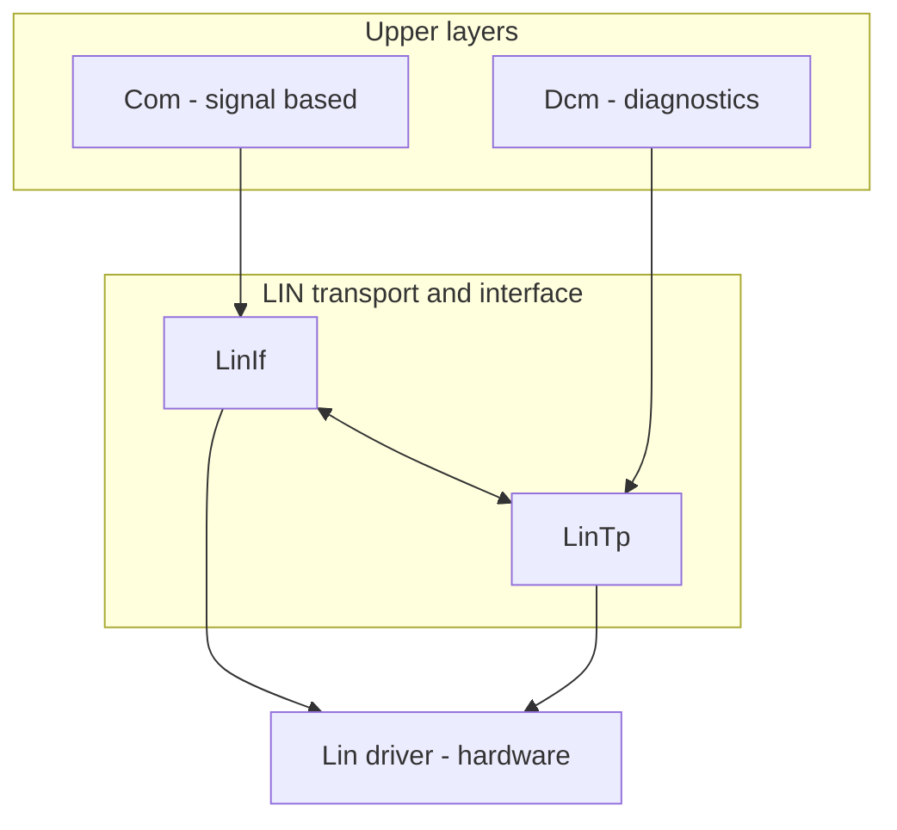
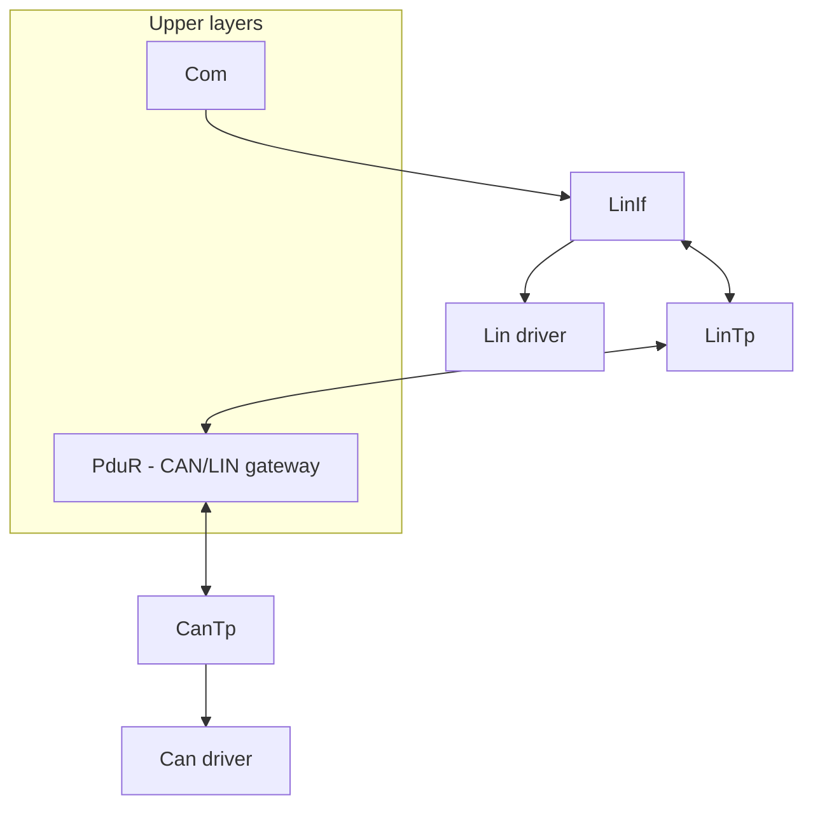

# AUTOSAR LinIf Configuration Overview

The LIN Interface (LinIf) manages communication between the LIN bus and the upper-layer modules (Com for signal exchange, LinTp for segmented transfer). It sits on top of the Lin driver and provides schedule-table handling, frame transmission/reception and the hooks needed by LinTp. The configuration is consumed by [LinIf.py](../../tools/generator/LinIf.py).

## 1. Core configuration principles

* define the LIN network parameters (network name, self node, LDF file, timeout);
* keep the same network/LDF referenced by the Com configuration so that signal routing stays consistent;
* add LinTp when segmented diagnostics (for example UDS over LIN) are needed.

## 2. LinIf configuration example

Each entry in `networks` describes one LIN network:

```json
{
  "class": "LinIf",
  "networks": [
    {
      "name": "LIN0",
      "me": "AS",
      "timeout": 100,
      "ldf": "LIN0.ldf"
    }
  ]
}
```

* `name` - logical network name (user defined);
* `me` - name of the local (self) node;
* `timeout` - LIN frame timeout in milliseconds;
* `ldf` - path to the LIN Description File defining the frames and signals.

## 3. Integration with the Com module

Com performs signal-based communication over LIN. Its network entry must use the same `name` and `ldf` as LinIf:

```json
{
  "class": "Com",
  "networks": [
    {
      "name": "LIN0",
      "network": "LIN",
      "me": "AS",
      "ldf": "LIN0.ldf"
    }
  ]
}
```

The LDF file must be identical in both configurations so that the signal mapping cannot drift; the Com generator converts the LDF to its internal DBC representation automatically (see the Com document).

## 4. LinTp configuration (master and slave)

LinTp segments and reassembles large data over LIN. The configuration depends on the node role.

### 4.1 LIN slave node

A LIN slave answers the requests of the master (for example sensor data or read/write DTC access). Configure the slave-side LinTp channel parameters (response timeouts, frame mapping) in `LinTp_Cfg.c`.

### 4.2 LIN master node (gateway)

A LIN master typically gateways between LIN and CAN through PduR/CanTp (for example UDS over a CAN-to-LIN gateway). In addition to the local LinTp parameters, configure PduR routes between LinTp and CanTp (see the PduR document).

## 5. Architecture overview

### 5.1 LIN slave node



### 5.2 LIN master node (CAN/LIN gateway)



## 6. Key considerations

* **LDF consistency**: the same `.ldf` file must be referenced by LinIf and Com;
* **timeout tuning**: adapt `timeout` to the bus speed and slave response time, typical values are 50 to 200 ms;
* **gateway routing**: on a master node configure PduR to route segmented traffic between LinTp and CanTp for UDS-over-CAN-to-LIN gateways.

## 7. Generator

[LinIf.py](../../tools/generator/LinIf.py) generates `LinIf_Cfg.c` and `LinIf_Cfg.h` next to the JSON file.
