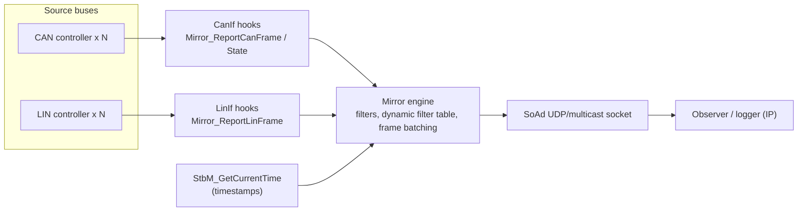

# AUTOSAR Bus Mirror Configuration and Integration Guide

The Bus Mirror module copies (mirrors) raw CAN and LIN traffic to an IP destination for observation, logging or rest-bus analysis. Source frames are captured through CanIf/LinIf hooks, collected into UDP packets and sent through SoAd. The example configuration is [app/app/config/Mirror/Mirror.json](../../app/app/config/Mirror/Mirror.json).

## Architecture overview



## Contents

* [Configuration notes for Bus Mirror](#configuration-notes-for-bus-mirror)
  * [`SourceNetworkCan` configuration](#sourcenetworkcan-configuration)
  * [`SourceNetworkLin` configuration](#sourcenetworklin-configuration)
  * [`DestNetworkIp` configuration](#destnetworkip-configuration)
* [Integration notes for Bus Mirror](#integration-notes-for-bus-mirror)
  * [LinIf integration notes](#linif-integration-notes)
  * [CanIf integration notes](#canif-integration-notes)
  * [SoAd integration notes](#soad-integration-notes)
  * [Mirror timestamp integration notes](#mirror-timestamp-integration-notes)

# Configuration notes for Bus Mirror

## `SourceNetworkCan` configuration

Defines a source CAN network with its acceptance filters and controller identification.

### JSON example

```json
"SourceNetworkCan": [
  {
    "name": "CAN0",
    "StaticFilters": [
      { "type": "range", "lower": 0, "upper": "0x100" },
      { "type": "mask", "code": "0x700", "mask": "0x700" }
    ],
    "MaxDynamicFilters": 128,
    "ControllerId": 0,
    "NetworkId": 3
  }
]
```

### Parameter definitions

| Parameter | Required? | Description |
| --- | --- | --- |
| `name` | Yes | Name of the CAN network, for example `"CAN0"` |
| `StaticFilters` | No | List of static filters (see below). Default: `[]` |
| `MaxDynamicFilters` | Yes | Maximum dynamic filters allowed (range 1 to 255). The total number of static plus dynamic filters must not exceed 255 |
| `ControllerId` | Yes | Numeric CAN controller ID, for example `0` |
| `NetworkId` | Yes | Numeric network ID placed into the mirrored frame header |

### Static filter types

1. **`range`** - accepts CAN IDs inside `[lower, upper]`:
   * `lower` - range start, for example `0`;
   * `upper` - range end, for example `"0x100"`.
2. **`mask`** - accepts IDs matching a bit pattern:
   * `code` - pattern to match, for example `"0x700"`;
   * `mask` - mask applied to both sides, for example `"0x700"`;
   * match condition: `(received & mask) == (code & mask)`.

## `SourceNetworkLin` configuration

Defines a source LIN network with filters and controller identification.

### JSON example

```json
"SourceNetworkLin": [
  {
    "name": "LIN0",
    "StaticFilters": [
      { "type": "range", "lower": 0, "upper": "0x10" },
      { "type": "mask", "code": "0x20", "mask": "0x70" }
    ],
    "MaxDynamicFilters": 128,
    "ControllerId": 0,
    "NetworkId": 3
  }
]
```

### Parameter definitions

| Parameter | Required? | Description |
| --- | --- | --- |
| `name` | Yes | Name of the LIN network, for example `"LIN0"` |
| `StaticFilters` | No | List of static filters (see below). Default: `[]` |
| `MaxDynamicFilters` | Yes | Maximum dynamic filters allowed (range 1 to 255). The total number of static plus dynamic filters must not exceed 255 |
| `ControllerId` | Yes | Numeric LIN controller ID, for example `0` |
| `NetworkId` | Yes | Numeric network ID placed into the mirrored frame header |

### Static filter types

1. **`range`** - accepts LIN PIDs inside `[lower, upper]`:
   * `lower` - range start, for example `0`;
   * `upper` - range end, for example `"0x10"`.
2. **`mask`** - accepts PIDs matching a bit pattern:
   * `code` - pattern to match, for example `"0x20"`;
   * `mask` - mask applied, for example `"0x70"`.

## `DestNetworkIp` configuration

Defines an IP destination with its queue/buffer sizes and its SoAd socket association.

### JSON example

```json
"DestNetworkIp": [
  {
    "name": "AS",
    "DestQueueSize": 2,
    "DestBufferSize": 1400,
    "MirrorDestTransmissionDeadline": 655,
    "SoAd": "MIRROR_CLIENT_0"
  }
]
```

### Parameter definitions

| Parameter | Required? | Description |
| --- | --- | --- |
| `name` | Yes | Logical name of the IP destination, for example `"AS"` |
| `DestQueueSize` | Yes | Maximum number of frames buffered in the output queue; affects latency and memory usage; must be a power of 2 |
| `DestBufferSize` | Yes | Size in bytes of each batched output packet; align it with the MTU/packet size limit |
| `MirrorDestTransmissionDeadline` | Yes | Maximum time in milliseconds that source frames are collected into one destination packet; the packet is sent at the latest when the deadline expires |
| `SoAd` | Yes | Name of the SoAd socket connection, for example `"MIRROR_CLIENT_0"` |

# Integration notes for Bus Mirror

## LinIf integration notes

```c
void Mirror_ReportLinFrame(NetworkHandleType network, Lin_FramePidType pid,
                           const PduInfoType *pdu, Lin_StatusType status);

/* this API is optional */
Std_ReturnType LinIf_EnableBusMirroring(NetworkHandleType Channel,
                                        boolean MirroringActive);

/* suggested implementation for LinIf_EnableBusMirroring */
static boolean bLinMirroringActive[4];
Std_ReturnType LinIf_EnableBusMirroring(NetworkHandleType Channel,
                                        boolean MirroringActive) {
  bLinMirroringActive[Channel] = MirroringActive;
  return E_OK;
}

/* call Mirror_ReportLinFrame at the corresponding point in LinIf */
if (TRUE == bLinMirroringActive[Channel]) {
  /* status: LIN_RX_OK, LIN_TX_OK or another error status */
  Mirror_ReportLinFrame(Channel, pid, &PduInfo, status);
}
```

## CanIf integration notes

```c
void Mirror_ReportCanFrame(uint8_t controllerId, Can_IdType canId,
                           uint8_t length, const uint8_t *payload);
void Mirror_ReportCanState(uint8_t controllerId,
                           Mirror_CanNetworkStateType NetworkState);

/* this API is optional */
Std_ReturnType CanIf_EnableBusMirroring(uint8_t ControllerId,
                                        boolean MirroringActive);

/* suggested implementation for CanIf_EnableBusMirroring */
static boolean bCanMirroringActive[4];
Std_ReturnType CanIf_EnableBusMirroring(uint8_t ControllerId,
                                        boolean MirroringActive) {
  bCanMirroringActive[ControllerId] = MirroringActive;
  return E_OK;
}

/* call Mirror_ReportCanFrame at the corresponding point in CanIf */
if (TRUE == bCanMirroringActive[ControllerId]) {
  Mirror_ReportCanFrame(ControllerId, canId, &length, payload);
}

/* call Mirror_ReportCanState from CanIf or the Can state ISR */
if (TRUE == bCanMirroringActive[ControllerId]) {
  Mirror_ReportCanState(ControllerId, MIRROR_CAN_NS_BUS_ONLINE);
  /* or */
  Mirror_ReportCanState(ControllerId, MIRROR_CAN_NS_BUS_OFF);
  /* or */
  Mirror_ReportCanState(ControllerId,
      MIRROR_CAN_NS_ERROR_PASSIVE |
      ((TxErrorCounter / 8) & MIRROR_CAN_NS_TX_ERROR_COUNTER_MASK));
}
```

## SoAd integration notes

### AS SoAd configuration example

```json
"sockets": [
  {
    "name": "MIRROR_CLIENT_0",
    "client": "224.244.224.245:30511",
    "protocol": "UDP",
    "multicast": true,
    "up": "Mirror",
    "RxPduId": "0"
  }
]
```

The same idea applies to any other AUTOSAR SoAd implementation: one socket is configured for Bus Mirror and bound to the Mirror upper layer.

The generator [SoAd.py](../../tools/generator/SoAd.py) may need adaptation so that the generated `SoAd_Cfg.h` uses the right macro prefixes for the SoConId and TxPduId names:

```python
C.write("    SOAD_SOCKID_%s, /* SoConId */\n" % (network["SoAd"]))
C.write("    SOAD_TX_PID_%s, /* TxPduId */\n" % (network["SoAd"]))
```

```c
/* in the AS Mirror_Cfg.c */
static const Mirror_DestNetworkIpType Mirror_DestNetworkIps[] = { {
    &Mirror_DestNetworkIpContexts[0],
    Mirror_DestBuffersAS,
    MIRROR_CONVERT_MS_TO_MAIN_CYCLES(655u), /* MirrorDestTransmissionDeadline */
    SOAD_SOCKID_MIRROR_CLIENT_0,           /* SoConId */
    SOAD_TX_PID_MIRROR_CLIENT_0,           /* TxPduId */
    2u,                                    /* NumDestBuffers */
} };
```

Either update the generator or edit the generated `Mirror_Cfg.c` manually so that `SoConId` and `TxPduId` follow the target project's naming convention.

## Mirror timestamp integration notes

### A standard `StbM_GetCurrentTime` API must be provided

AS does not include a full StbM module, but a minimal demonstration implementation exists in [std_timer.c](../../infras/system/timer/std_timer.c). Mirror only needs the three time fields `secondsHi`, `seconds` and `nanoseconds`:

```c
Std_ReturnType StbM_GetCurrentTime(StbM_SynchronizedTimeBaseType timeBaseId,
                                   StbM_TimeTupleType *timeTuple,
                                   StbM_UserDataType *userData) {
  Std_ReturnType ret = E_OK;
  std_time_t tm;

  if (0 == timeBaseId) {
    tm = Std_GetTime();
    timeTuple->globalTime.secondsHi = (tm / 1000000) >> 32;
    timeTuple->globalTime.seconds = (tm / 1000000) & 0xFFFFFFFFul;
    timeTuple->globalTime.nanoseconds = (tm % 1000000) * 1000;
  } else {
    ret = E_NOT_OK;
  }
  return ret;
}
```

The platform must also implement `std_time_t Std_GetTime(void)` returning the current monotonic time in microseconds.
