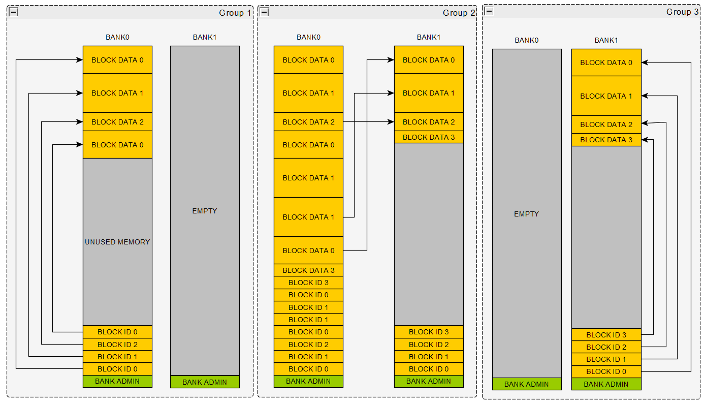
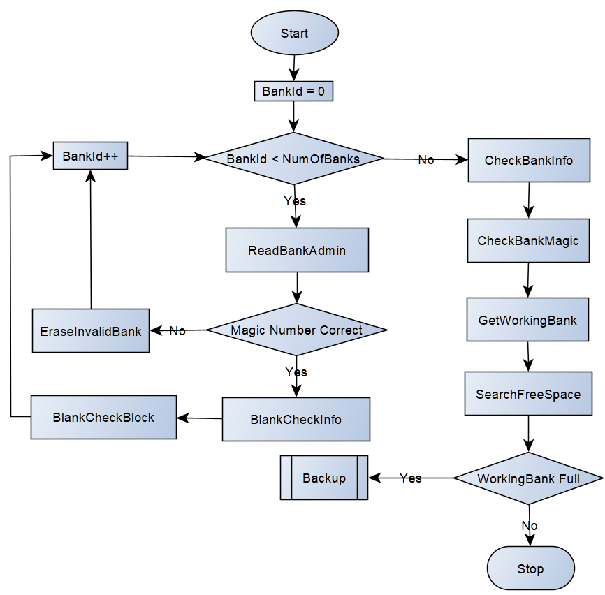
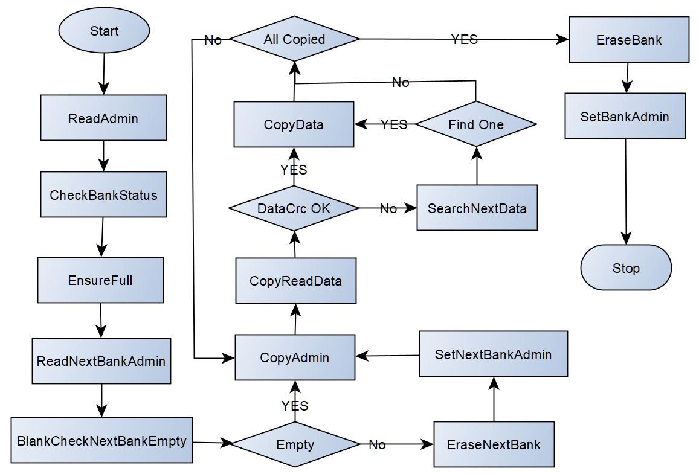

# AUTOSAR NvM Configuration Overview

The **Non-Volatile Memory (NvM)** module in AUTOSAR manages persistent storage of critical data (e.g., DTCs, calibration parameters) across power cycles or ECU resets. This document provides configuration guidelines, JSON schema details, and best practices for defining NvM blocks and data elements, with a focus on DTC storage use cases.

---

## 1. Key Configuration Concepts

### 1.1 Core Purpose of NvM
- **Persistent Storage**: Ensures data (e.g., DTC statuses, fault counters) survives ECU resets or power loss.  
- **Block-Based Management**: Organizes data into logical "blocks" with configurable repetition (for scalability).  
- **Target Selection**: Supports two underlying storage targets:  
  - `Fee`: Flash EEPROM Emulation (software-based non-volatile storage).  
  - `Ea`: EEPROM Abstraction.  

---

## 2. JSON Configuration Structure

### Example NvM Configuration (DTC Storage)
```json
{
  "class": "NvM",          // Fixed class identifier for NvM configurations
  "target": "Fee",         // Underlying storage target ("Fee" or "Ea")
  "blocks": [              // List of logical NvM blocks to manage
    {
      "name": "Dem_NvmEventStatusRecord{}",  // Block name (ends with "{}" if repeated)
      "repeat": 8,         // Repeat this block 8 times (creates 8 instances)
      "data": [            // Data elements within the block
        { 
          "name": "status", 
          "type": "uint8", 
          "default": "0x50"  // Default value (C initializer: 0x50)
        },
        { 
          "name": "testFailedCounter", 
          "type": "uint8", 
          "default": 0       // Default value (C initializer: 0)
        }
      ]
    },
    // Additional blocks (e.g., for other DTC-related data)
  ]
}
```

---

## 3. Detailed Attribute Breakdown

### 3.1 Top-Level Attributes
| Attribute | Type       | Description                                                                 |
|-----------|------------|-----------------------------------------------------------------------------|
| `class`   | String     | Fixed value `"NvM"` (identifies the configuration type).                    |
| `target`  | String     | Storage target: `"Fee"` (Flash EEPROM Emulation) or `"Ea"` (EEPROM Abstraction). |
| `blocks`  | Array      | List of NvM blocks to manage (each block defines a logical data group).      |

---

### 3.2 Block-Level Attributes
Each block in `blocks` defines a group of related data elements (e.g., DTC status and counters).  

| Attribute | Type       | Description                                                                 |
|-----------|------------|-----------------------------------------------------------------------------|
| `name`    | String     | Logical name of the block. If `repeat` is used, the name **must end with `{}`** (e.g., `Dem_NvmEventStatusRecord{}`). |
| `repeat`  | Integer    | Optional. Number of times to repeat the block (creates `repeat` instances, e.g., `repeat: 8` generates `Dem_NvmEventStatusRecord0` to `Dem_NvmEventStatusRecord7`). |
| `data`    | Array      | List of data elements within the block (defines the structure of the block). |

---

### 3.3 Data Element Attributes
Each data element within a block defines a specific piece of stored data (e.g., `status` or `testFailedCounter`).  

| Attribute | Type       | Description                                                                 |
|-----------|------------|-----------------------------------------------------------------------------|
| `name`    | String     | Name of the data element. If `repeat` is used, the name **must end with `{}`** (e.g., `status{}`). |
| `repeat`  | Integer    | Optional. Number of times to repeat the data element within the block (creates `repeat` copies, e.g., `repeat: 2` generates `status[2]`). |
| `type`    | String     | Data type. Supported types: <br>- Scalar: `int8`, `int16`, `int32`, `uint8`, `uint16`, `uint32` <br>- Array: `int8_n`, `int16_n`, `int32_n`, `uint8_n`, `uint16_n`, `uint32_n` (requires `size` attribute). |
| `size`    | Integer    | Required for array types (e.g., `uint8_5` defines an array of 5 `uint8` elements). |
| `default` | String     | Default value (evaluated as a Python expression; used to initialize the C variable). |

---

### 3.4 Block-Level Attribute: NumberOfWriteCycles
The `NumberOfWriteCycles` attribute specifies the maximum number of times a block can be written during its lifetime. This is critical for Flash-based storage (Fee target) where each block has a limited number of write/erase cycles.

| Attribute | Type       | Description                                                                 |
|-----------|------------|-----------------------------------------------------------------------------|
| `NumberOfWriteCycles` | Integer | Optional. Maximum write cycles per block. **Default: 10,000,000** (10 million). |

#### Key Considerations:
- **Flash Wear Leveling**: Flash memory has a finite number of erase cycles (typically 100,000 to 1,000,000 cycles per sector). FEE manages this by distributing writes across multiple banks.
- **Application-Specific Values**: Set realistic values based on your application requirements:
  - **Odometer**: If max value is 100,000 km with 0.1 km resolution ¡ú 1,000,000 write cycles.
  - **DTC Status**: Written when a fault occurs ¡ú depends on fault rate (e.g., 100,000 cycles).
  - **Configuration Data**: Rarely changed ¡ú 10,000 cycles may suffice.
- **Default Value**: If not specified, the generator uses `10,000,000` as a conservative default.

#### Example with NumberOfWriteCycles:
```json
{
  "blocks": [
    {
      "name": "Dem_NvmEventStatusRecord{}",
      "repeat": 8,
      "NumberOfWriteCycles": 100000,
      "data": [
        { "name": "status", "type": "uint8", "default": "0x50" },
        { "name": "testFailedCounter", "type": "uint8", "default": 0 }
      ]
    },
    {
      "name": "Dem_NvmPrimaryFreezeFrameRecord{}",
      "repeat": 3,
      "NumberOfWriteCycles": 1000000,
      "data": [
        { "name": "timestamp", "type": "uint32", "default": 0 },
        { "name": "value", "type": "uint32", "default": 0 }
      ]
    }
  ]
}
```

---

## 5. Flash Life Cycle Calculation

### 5.1 Overview
For vehicle applications requiring 10-year persistence, it is critical to validate that the FEE configuration can sustain the expected number of write cycles without exceeding the Flash memory's maximum erase cycles.

### 5.2 Life Cycle Calculator Tool
The [FeeLifeCycle.py](../../tools/utils/memory/FeeLifeCycle.py) script calculates the worst-case backup rounds for a given FEE configuration. This helps ensure the Flash memory will last for the required lifetime.

#### Usage:
```bash
# Basic usage
python FeeLifeCycle.py app/app/config/NvM/NvM.json

# With verbose output
python FeeLifeCycle.py app/app/config/NvM/NvM.json -v

# Custom bank configuration
python FeeLifeCycle.py app/app/config/NvM/NvM.json --block_size "32*1024" --num_of_banks 4 -v
```

#### Parameters:
| Parameter | Description | Default |
|-----------|-------------|---------|
| `config` | Path to NvM.json configuration file | (required) |
| `-v` / `--verbose` | Enable detailed output | False |
| `--block_size` | Bank size in bytes (supports expressions like "32*1024") | 32768 (32KB) |
| `--page_size` | Flash page size in bytes | 8 |
| `--num_of_banks` | Number of banks (2 or 4) | 2 |

### 5.3 Calculation Algorithm
The tool considers two scenarios to determine the worst-case backup rounds:

#### Scenario A - Per-Block Sum:
Each block can be written independently. For each block:
- **First Phase**: When the bank is empty, it can fit `N` copies of the block.
- **Subsequent Phases**: After each backup, the new bank contains one copy of all blocks. The remaining space determines how many additional writes can fit before another backup is needed.
- **Total Rounds**: Sum of rounds for all blocks, divided by the number of banks.

#### Scenario B - Accumulated Total:
All blocks contribute to filling the bank simultaneously. The total data written across all blocks determines the backup rounds.

#### Final Result:
The maximum of both scenarios gives the worst-case per-bank backup rounds. This value must be **less than the Flash's maximum erase cycles** (typically 100,000 to 1,000,000).

### 5.4 Example Analysis

**Test Configuration:**
- Bank Size: 32KB, 2 banks
- Block A: 2KB data, NumberOfWriteCycles=100
- Block B: 4KB data, NumberOfWriteCycles=200

**Calculation:**
```
Effective Bank Size: 28648 bytes
Total Space per all blocks: 6192 bytes
Remaining Space After Backup: 22456 bytes

Block A:
  firstPhaseWrites = 28648 // 2072 = 13
  subsequentWrites = 22456 // 2072 = 10
  rounds_A = ceil((100 - 13) / 10) = 9

Block B:
  firstPhaseWrites = 28648 // 4120 = 6
  subsequentWrites = 22456 // 4120 = 5
  rounds_B = ceil((200 - 6) / 5) = 39

Scenario A (Per-Block Sum): (9 + 39) // 2 = 24
Scenario B (Accumulated): 45 // 2 = 22

MAXIMUM BACKUP ROUNDS (Worst Case): 24
```

**Interpretation:** With 2 banks, each bank will be erased approximately 24 times. If the Flash supports 100,000 erase cycles, the configuration is safe.

### 5.5 Best Practices

1. **Set Realistic Write Cycles**:
   - Avoid using the default 10,000,000 for blocks that don't need it.
   - Calculate based on expected usage: `Write Cycles = Expected Writes per Day ¡Á 365 ¡Á Lifetime (years) ¡Á Safety Factor (2-10)`

2. **Distribute Writes**:
   - Avoid having one block with significantly more writes than others.
   - If possible, split high-write data across multiple blocks.

3. **Choose Appropriate Bank Size**:
   - **Larger banks are generally preferred**: Reduce backup frequency, which minimizes Flash erase cycles and extends Flash lifetime.
   - **Trade-off**: Larger banks increase erase time (longer backup operations).
   - **Smaller banks**: Increase backup frequency (more erase cycles), which reduces Flash lifetime but allows finer granularity and faster erase operations.

4. **Validate Regularly**:
   - Re-run the life cycle calculator whenever the NvM configuration changes.
   - Include in CI/CD pipeline to catch potential issues early.

5. **Consider 10-Year Vehicle Lifespan**:
   - Most automotive applications require 10-year persistence.
   - Ensure calculated backup rounds are well below Flash erase limits.

---

## 4. Generator Tool

The [NvM Generator](../../tools/generator/NvM.py) converts the JSON configuration into C code that initializes NvM blocks and data elements. Key features:  
- Validates JSON syntax and attribute compliance (e.g., ensures `repeat` is used correctly).  
- Generates type-safe C structures (e.g., `Dem_NvmEventStatusRecord0` for repeated blocks).  
- Auto-populates default values (using Python `eval` to resolve expressions like `"0xFF * 2"`).  
- Supports `NumberOfWriteCycles` attribute with default value of 10,000,000.  

---

# 2 NvM backend FEE

I believe the vast majority of embedded systems require storage space for critical non-volatile data, and there are quite a few storage devices to choose from, such as TF/SD cards, NAND/NOR FLASH, etc. Automotive electronics commonly use EEPROM and FLASH.


Using EEPROM is a common approach. Generally, both FLASH and EEPROM require an erase operation before writing data, but some EEPROMs now do not require erasure, data can be written directly with a command. However, more often than not, an erase-write operation is performed before writing to ensure safety. Typically, the minimum erasable unit for EEPROM is 8 to 32 bytes, while for FLASH it is much larger (possibly over 512 bytes). This is why using EEPROM is simpler, and the software is less complex.


For example, consider automotive data that needs to be stored, such as mileage information (total odometer and trip meter). The total odometer requires 4 bytes, the trip meter requires 2 bytes, and 2 bytes for a checksum, totaling 8 bytes. Fully accounting for the service life of EEPROM, 8 minimum erasable units starting from address 0 in EEPROM might be allocated fixedly for its storage. This way, the software can find the maximum total odometer value as the current value upon each cold start and know the next data update address, thus cyclically using these 8 units to store mileage information. The software is incredibly simple, meaning EEPROM usage is often a data point or multiple fixed-address "slots."


However, FLASH is not so simple. Its minimum erasable unit is too large, if you tried a "one slot per data point" approach, well, it's basically unworkable. Some MCU controllers may only have a few internal FLASH blocks, and erasing a block requires erasing the entire block. Thus, the EEPROM-like usage method becomes impractical. This is where a different approach comes in, commonly called **emulating EEPROM with FLASH**. Hence, in AUTOSAR, there is a module called `Fee` (Flash Emulation Eeprom). By the way, some MCU controllers claim to have on-chip EEPROM but note that it is emulated with FLASH. Personally, I think this means the MCU implements a simple algorithm to achieve this function, we won't delve into that here.


This article will introduce the specific implementation of [as/infras/memory/Fee](../../infras/memory/Fee). First, let's cover the basic principle of FEE, as shown in the figure below:



<center> Fig. 1 AUTOSAR FEE Principle Diagram </center>


The figure above shows the process of emulating EEPROM using 2 FLASH blocks. During use, there will always be one FLASH block idle. Of course, the process of emulating EEPROM with 3 or more FLASH blocks is similar. When the system is just ready, both FLASH blocks are definitely empty with no data. At this time, the software will use `BANK0` to store data. Since it's empty, the software can easily know the bottom address of the **ID field** and the top address of the **DATA field** of the next data block to be written. Typically:  
- The **ID field** of a data block contains at least the data code number and data address information (fixed size/structure).  
- The **DATA field** varies in size and structure.  

Figure 1 Group1 shows the state after sequentially updating/writing Data Block 0 -> Data Block 1 -> Data Block 2 -> and re-writing Data 0. You can see storage space is dynamically allocated for each data block to be updated in order. Upon a cold start, the system can find the latest valid data via the data block ID field, quite a clever method. It converges from both ends to the middle; although the DATA field size may vary per block, dynamic allocation ensures no space is wasted.  

Figure 1 Group2 shows that when the ID and DATA fields converge and there's no extra space left in `BANK0`, the software will back up all the latest data blocks to `BANK1`. Then, as shown in Figure 1 Group3, `BANK0` will be erased for reuse when `BANK1` runs out of memory next time. Of course, checksum codes (CRC or checksum) can be stored in the DATA field to ensure data integrity.


Okay, the above is just the basic principle. In reality, implementing such a module is by no means simple. After completing the development of this module, I even felt it was the most complex module among all AUTOSAR CP modules. If you can implement such a module and withstand stress tests (sudden power loss), you'll have a sense of accomplishment. But regardless, complex functions can be less daunting if broken down into simple steps.


First, FEE has roughly 4 working states:  
- Initialization (`Fee_Init`)  
- Read Data (`Fee_Read`)  
- Write Data (`Fee_Write`)  
- Data Backup (`Backup`)  


This FEE implementation uses a self-developed [factory](../../infras/libraries/factory) to better manage these working states. [factory.json](../../infras/memory/Fee/factory.json) defines the steps for each working state in detail.


## 1. Initialization (`Fee_Init`)  
Typically, initialization involves traversing the **Admin** (administration metadata) of all FEE Banks to determine the **active bank** (the bank currently usable for writing/reading data). Considering sudden power loss, initialization also checks if the current bank has enough remaining space for new data. If not, it enters the data backup state. Below is the migration diagram of steps in the initialization working state:  



<center> Fig. 1 FEE Initialization </center>  


Referencing [Fee_Priv.h](../../infras/memory/NvM/NvM_Priv.h), the definition of `Fee_BankAdminType` is as follows. It mainly includes three parts:  

```c
 High: | Full Magic | ~ Full Magic | <- Status -\
       | Number     | ~ Number     | <- Info     + <- Bank Admin
 Low:  | FEE Magic  | ~ FEE Magic  | <- Header -/
```  

- **Header - FEE Magic Number**: Identifies that this is a Flash Bank correctly managed by FEE.  
- **Info - Number**: Records how many times this Flash Bank has been erased/written. When it reaches a threshold, the bank is end-of-life (no more erasures/writes).  
- **Status - Full Magic**: Defaults to a blank state. When the bank has no available space, `Full Magic` is written during backup initiation.  


Note: The three parts of Bank Admin (Header, Info, Status) are stored in **three separate pages** to ensure they can be written independently.


### Initialization Steps  
1. **Initialize**: Start with `BankID = 0`.  
2. **ReadBankAdmin**: Read the Admin of the bank pointed to by `BankID` and the data of the first Block (page) immediately after the Admin.  
3. **Check Header Magic**: Verify if the `FEE Magic Number` in the Admin is correct. If yes, jump to Step 5.  
4. **Erase Bank**: Erase the bank pointed to by `BankID`, then jump to Step 7.  
5. **BlankCheckInfo**: Perform `Fls_BlankCheck` on the `Info` field of the Admin to confirm its state. If empty, fill the read `Info` with `FLS_ERASED_VALUE`.  
6. **BlankCheckBlock**: Perform `Fls_BlankCheck` on the first Block (page) to confirm if the bank is empty. If yes, fill the read Block with `FLS_ERASED_VALUE`.  

   > **Note**: `Fls_BlankCheck` is optional, used for those ECUs where Flash does not retain a constant `FLS_ERASED_VALUE` after erasure (e.g., TC387). It ensures whether the read `Info`/Block is valid data or just erased space.  

7. **Increment BankID**: If all banks' Admin have been read, proceed to the next step; otherwise, jump back to Step 2.  
8. **CheckBankInfo**: Validate the `Info` in all read Admin data. If invalid, write the known maximum `Number`.  

   > **Note**: Accounts for sudden power loss during Admin erasure/writing.  

9. **CheckBankMagic**: Check for illegal Magic (banks just erased). If found, write valid Magic.  
10. **GetWorkingBank**: Traverse all banks' Admin to find the active bank. Banks marked as "full" are prioritized.  
11. **SearchFreeSpace**: Traverse data in the active bank to find valid addresses of existing data until free space is found. Check if remaining space is sufficient. If not, start backup; otherwise, initialization is complete.  


## 2. Read Data (`Fee_Read`)  
Too simple, too lazy to describe.  


## 3. Write Data (`Fee_Write`)  
Too simple, too lazy to describe.  


## 4. Data Backup (`Backup`)  



<center> Fig. 2 FEE Data Backup </center>  


1. **ReadAdmin**: Read the Admin of the current bank and the data of the first Block (page) after the Admin.  
2. **CheckBankStatus**: Perform `Fls_BlankCheck` on the `Status` field of the Admin. If empty, fill the read `Status` with `FLS_ERASED_VALUE`.  
3. **EnsureFull**: Check if `Status` is `FLS_ERASED_VALUE`. If yes, write `FULL_MAGIC` ("DEAD") to mark the bank as full.  
4. **ReadNextBankAdmin**: Read the Admin of the next Flash bank and the data of the first Block (page) after its Admin.  
5. **BlankCheckNextBankEmpty**: Perform `Fls_BlankCheck` on the first Block (page) of the next bank. If empty, proceed to Step 6; otherwise, Step 8.  
6. **EraseNextBank**: Erase the next Flash bank.  
7. **SetNextBankAdmin**: Configure valid Admin for the next bank.  

   > **Note**: Steps 6-7 account for sudden power loss during backup. Without traversing the next bank's data, you can't resume where you left off. Since power loss is rare, we simplify by erasing and restarting.  

8. **CopyAdmin**: Loop through data blocks with valid data at legal addresses and write to the next bank's Admin.  
9. **CopyReadData**: Read data from the legal address. If CRC is valid, proceed to Step 11.  
10. **SearchNextData**: Search for valid data in the current bank.  
11. **CopyData**: Write valid data. If backup is incomplete, return to Step 8.  
12. **EraseBank**: Erase the current bank.  
13. **SetBankAdmin**: Write valid Admin to the current bank.