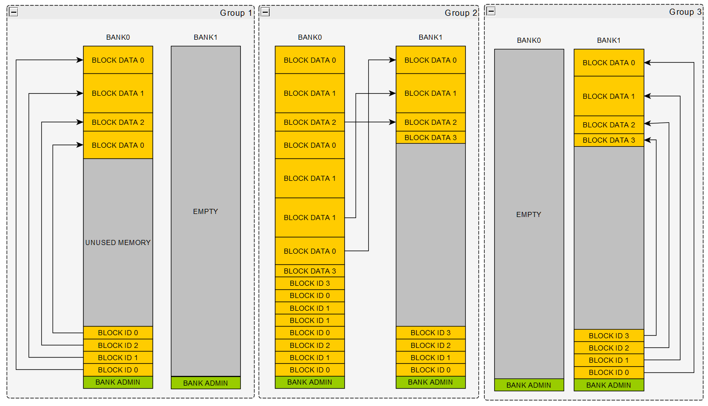
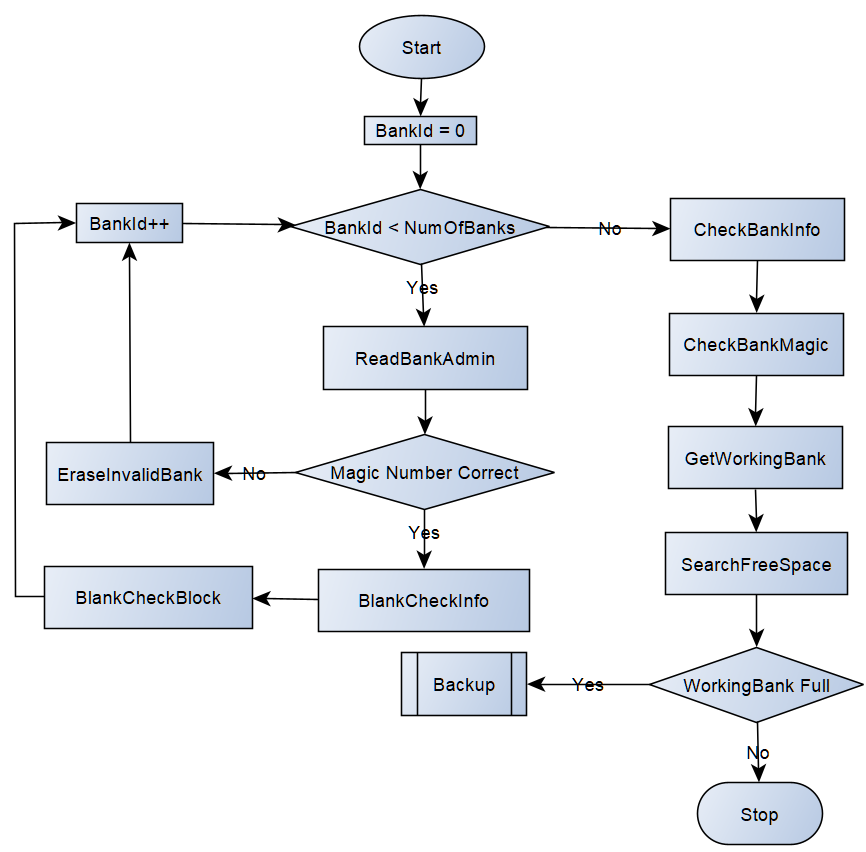
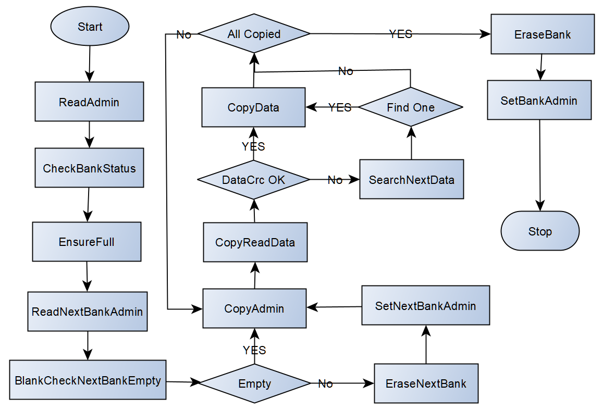

# AUTOSAR Non-Volatile Memory (NvM / FEE)

Virtually every embedded system needs storage for critical non-volatile data. There are many devices to choose from (TF/SD cards, NAND/NOR flash, ...); automotive electronics most commonly use EEPROM and flash.

This article first covers the upper-layer NvM service (configuration and API), then the implementation of its flash backend Fee (Flash EEPROM Emulation).

## 1. EEPROM vs. Flash

Using an EEPROM is straightforward. In general both flash and EEPROM require an erase before writing (some modern EEPROMs allow byte-wise writes without erase). The smallest erasable unit of an EEPROM is typically 8-32 bytes, while a flash sector is much larger (512 bytes or more) and is always erased as a whole, which makes EEPROM-based software considerably simpler.

Take the common automotive mileage example: the total odometer takes 4 bytes, the trip meter 2 bytes, plus a 2-byte checksum - 8 bytes in total. On an EEPROM you might statically allocate 8 minimum erasable units starting at address 0 and rotate writes over them: on every cold start the software picks the maximum odometer value as the current one and therefore knows where the next write goes. In other words, EEPROM usage is typically "one or more fixed-address slots per data item".

Flash is different. Its erase granularity is too large; some MCUs have only a handful of flash blocks and erasing a block wipes the whole block, so the EEPROM-style slot scheme is impractical. Instead, flash is used to emulate EEPROM, which in AUTOSAR is the job of the **Fee (Flash EEPROM Emulation)** module. (Some MCUs advertise an on-chip EEPROM and note that it is flash-emulated - usually the vendor simply implemented an algorithm like the one described here.)

## 2. The NvM Service Layer

NvM (NVRAM Manager) sits between the application and Fee/Ea and manages non-volatile data in units of "blocks": it maps logical blocks onto the underlying Fee (flash emulation) or Ea (real EEPROM abstraction) target and takes care of defaults, CRC and read/write job scheduling.

### 2.1 JSON Configuration

An NvM configuration example for DTC storage (complete file: [NvM.json](../../app/app/config/NvM/NvM.json)):

```json
{
  "class": "NvM",
  "target": "Fee",
  "blocks": [
    {
      "name": "Dem_NvmEventStatusRecord{}",
      "repeat": 8,
      "NumberOfWriteCycles": 100000,
      "data": [
        { "name": "status", "type": "uint8", "default": "0x50" },
        { "name": "testFailedCounter", "type": "uint8", "default": 0 }
      ]
    }
  ]
}
```

Top-level attributes:

| Attribute | Description |
| --- | --- |
| `class` | Fixed value `"NvM"` |
| `target` | Storage target: `"Fee"` (flash emulation) or `"Ea"` (EEPROM abstraction) |
| `blocks` | List of logical blocks |

Block-level attributes:

| Attribute | Description |
| --- | --- |
| `name` | Block name; when used with `repeat` it must end with `{}` (generates `Record0` ... `Record7`) |
| `repeat` | Optional, number of block instances |
| `NumberOfWriteCycles` | Optional, maximum writes over the block's lifetime, **default 10,000,000**; used for the life-cycle calculation |
| `data` | List of data elements inside the block |

Data element attributes:

| Attribute | Description |
| --- | --- |
| `name` | Element name; arrays end with `{}` |
| `repeat` | Optional, number of copies of the element |
| `type` | Scalars: `int8/int16/int32/uint8/uint16/uint32/uint64`; arrays: `<type>_n` together with `size`, e.g. `uint8_n` |
| `size` | Number of array elements |
| `default` | Default value, evaluated as a Python expression (`"0x50"`, `"[0xFF]*13"`, ...); used to initialize the ROM defaults |

The [NvM.py](../../tools/generator/NvM.py) generator reads the JSON and emits the block configuration C code (per-block size, write-cycle limit, ROM defaults), expanding `repeat` into concrete instance names.

### 2.2 Main APIs

NvM jobs are asynchronous: an API call only queues the request, `NvM_MainFunction` drives the processing, and the outcome is polled with `NvM_GetErrorStatus` (see [NvM.h](../../infras/include/NvM.h)):

```c
void NvM_Init(const NvM_ConfigType *ConfigPtr);

Std_ReturnType NvM_ReadBlock(NvM_BlockIdType BlockId, void *NvM_DstPtr);   /* returns ROM default if invalid */
Std_ReturnType NvM_WriteBlock(NvM_BlockIdType BlockId, const void *NvM_SrcPtr);
Std_ReturnType NvM_RestoreBlockDefaults(NvM_BlockIdType BlockId, void *NvM_DstPtr);
Std_ReturnType NvM_EraseNvBlock(NvM_BlockIdType BlockId);
Std_ReturnType NvM_InvalidateNvBlock(NvM_BlockIdType BlockId);
Std_ReturnType NvM_SetRamBlockStatus(NvM_BlockIdType BlockId, boolean BlockChanged);
Std_ReturnType NvM_GetErrorStatus(NvM_BlockIdType BlockId, NvM_RequestResultType *RequestResultPtr);

void NvM_ReadAll(void);    /* bulk read of all blocks at startup */
void NvM_WriteAll(void);   /* bulk write-back of all blocks before shutdown */
void NvM_FirstInitAll(void);
void NvM_MainFunction(void);   /* must be called periodically */
```

## 3. FEE Fundamentals

The implementation lives in [infras/memory/Fee](../../infras/memory/Fee). The basic principle is shown below:


<center> Fig. 1 AUTOSAR FEE principle </center>

The figure shows EEPROM emulation with 2 flash blocks; at any time one block is idle (the scheme works the same with 3 or more blocks). When the system is fresh, both blocks are empty and the software starts with BANK0. Because the block is empty, it is trivial to locate the bottom of the next ID field and the top of the next DATA field:

* **ID field**: holds at least the block number and data address information; fixed size and layout;
* **DATA field**: variable size and layout; a CRC/checksum can be appended for integrity.

Group 1 in Fig. 1 shows the state after writing block 0, 1, 2 and then block 0 again: storage is allocated dynamically in write order, and on a cold start the latest valid copy of every block is found through its ID field. The ID area grows upward and the DATA area grows downward toward the middle; since allocation is dynamic, no space is wasted even though the data sizes differ.

Group 2: when the two areas meet and BANK0 runs out of space, the software compacts (backs up) the newest copy of every block into BANK1; as shown in Group 3, BANK0 is then erased and becomes the spare for the next swap when BANK1 fills up.

This FEE implementation uses the in-house [factory library](../../infras/libraries/factory) to split the complex flow into explicit state machines; the steps of each state are defined in [factory.json](../../infras/memory/Fee/factory.json). FEE has 4 working states (4 state machines):

* Initialization (Init)
* Read (Fee_Read)
* Write (Fee_Write)
* Backup

### 3.1 Initialization (Fee_Init)

Initialization traverses the admin area of every FEE bank to determine the active bank (the bank currently used for reading and writing). With sudden power loss in mind, it must also check whether the active bank has enough free space for new data; if not, it enters the backup flow.


<center> Fig. 2 FEE initialization </center>

The `Fee_BankAdminType` layout in [Fee_Priv.h](../../infras/memory/Fee/Fee_Priv.h) consists of three parts:

```c
 High: | Full Magic | ~ Full Magic | <- Status -\
       | Number     | ~ Number     | <- Info     + <- Bank Admin
 Low:  | FEE Magic  | ~ FEE Magic  | <- Header -/
```

* **Header - FEE Magic**: identifies a flash bank correctly managed by FEE (ASCII `"FEEF"` in code);
* **Info - Number**: records how many times this bank has been erased; when it reaches the threshold (`FEE_MAX_ERASED_NUMBER`, default 1,000,000) the bank is end-of-life;
* **Status - Full Magic**: blank by default (`0xFFFFFFFF`); when the bank runs out of space and a backup starts, the full marker (ASCII `"DEAD"`, see `FEE_BANK_FULL_MAGIC`) is written.

The three parts live in three different pages so each can be written independently without corrupting the others on power loss.

Initialization steps (the Init machine in [factory.json](../../infras/memory/Fee/factory.json)):

1. Start with BankID = 0;
2. **ReadBankAdmin**: read the admin of the bank pointed to by BankID and the first block (page) right after the admin;
3. Verify the Header FEE Magic; if correct go to step 5;
4. **EraseInvalidBank**: erase the bank, go to step 7;
5. **BlankCheckInfo**: run `Fls_BlankCheck` on the admin Info to determine its state; if blank, treat it as `FLS_ERASED_VALUE`;
6. **BlankCheckBlock**: run `Fls_BlankCheck` on the first block (page) to determine whether the bank is empty; if blank, treat the block as `FLS_ERASED_VALUE`.

   > `Fls_BlankCheck` is optional. It exists for flashes whose erased state is not reliably `FLS_ERASED_VALUE` (0xFF), e.g. TC387, so that valid data can be distinguished from a freshly erased state.

7. Increment BankID; once all bank admins are read go to the next step, otherwise back to step 2;
8. **CheckBankInfo**: validate the Number in every admin; if invalid, write the known maximum Number (covers power loss while rewriting the admin);
9. **CheckBankMagic**: look for an illegal magic (a just-erased bank) and write a valid one if needed;
10. **GetWorkingBank**: traverse all admins to find the active bank; a bank marked full takes priority;
11. **SearchFreeSpace**: walk the existing data in the active bank to locate the newest valid data and the free-space boundary. If the remaining space cannot hold the largest block (`FEE_MIN_FREE_SPACE`), start a backup; otherwise initialization is done.

### 3.2 Reading (Fee_Read)

The Read machine has just two nodes, **ReadData** and **SearchNext**:

1. **ReadData**: read the newest copy at the address recorded in the block context through Fls (with `FLS_DIRECT_ACCESS` it is a direct memory access). Each record carries a CRC16 and its bitwise inverse at the tail; the inverse is checked first and the CRC16 is then recomputed. Only when both pass is the data copied to the caller;
2. **SearchNext**: if that copy has a bad CRC (power-loss corruption), its address is invalidated and the search continues toward the beginning of the bank for the next (older) valid copy of the same BlockNumber, then ReadData runs again;
3. If no valid copy exists anywhere in the bank, the block's **ROM default** (the configured `default`) is returned and the job completes successfully.

### 3.3 Writing (Fee_Write)

The Write machine has three nodes, **WriteCheckDataChanged / WriteAdmin / WriteData**:

1. **WriteCheckDataChanged**: if a previous copy exists, read the old data, verify its CRC and compare it byte by byte with the new payload. **If nothing changed the job ends immediately** - no flash is consumed, minimizing wear. Old data with a broken CRC is treated as "must rewrite";
2. **WriteAdmin**: check whether the space left between the ID area and the DATA area can hold "block admin plus aligned data" (`FEE_BLOCK_ADMIN_AND_DATA_SIZE`). If yes, write the block admin (BlockNumber, ...) from the ID side. If not, trigger the Backup machine to compact/swap banks and then continue;
3. **WriteData**: write the payload from the DATA side (2-byte aligned, with CRC16 and its inverse appended), then update the newest-address record in the block context.

### 3.4 Backup


<center> Fig. 3 FEE data backup </center>

Backup machine nodes (14 nodes in factory.json):

1. **ReadAdmin**: read the current bank's admin and its first block;
2. **CheckBankStatus**: BlankCheck the admin Status; if blank treat it as `FLS_ERASED_VALUE`;
3. **EnsureFull**: when Status is blank, write `FULL_MAGIC` ("DEAD") to mark the current bank as full;
4. **ReadNextBankAdmin**: read the next bank's admin and its first block;
5. **BlankCheckNextBankEmpty**: BlankCheck the first block of the next bank to see whether it is empty;
6. **EnsureNextBankEmpty**: confirm the next bank is in a blank state ready to receive the backup;
7. **EraseNextBank**: erase the next bank;
8. **SetNextBankAdmin**: write a valid admin into the next bank.

   > Steps 7-8 cover power loss during backup: after a reset there is no way to tell how far the copy progressed, and since power loss is rare the implementation keeps things simple by erasing and starting over.

9. **CopyAdmin**: loop over every block that still has valid data and write a new block admin;
10. **CopyReadData**: read the data at the current bank's valid address; if the CRC is good go to step 12;
11. **SearchNextData**: keep scanning the current bank for the next valid record;
12. **CopyData**: write the valid data into the new bank; if more blocks remain go back to step 9;
13. **EraseBank**: after the full copy, erase the current (full) bank;
14. **SetBankAdmin**: write a valid admin into the erased bank, making it the new spare.

## 4. Flash Life-Cycle Calculation

Vehicle applications usually require 10+ years of data retention, so the bank erase count under a given FEE configuration must stay below the flash endurance limit (typically 100k to 1M cycles).

[FeeLifeCycle.py](../../tools/utils/memory/FeeLifeCycle.py) computes the worst-case backup (erase) rounds from the block sizes and `NumberOfWriteCycles` in NvM.json:

```bash
# basic usage
python tools/utils/memory/FeeLifeCycle.py app/app/config/NvM/NvM.json

# verbose output
python tools/utils/memory/FeeLifeCycle.py app/app/config/NvM/NvM.json -v

# custom bank parameters
python tools/utils/memory/FeeLifeCycle.py app/app/config/NvM/NvM.json --block_size "32*1024" --num_of_banks 4 -v
```

Parameters:

| Parameter | Description | Default |
| --- | --- | --- |
| `config` | Path to NvM.json | required |
| `-v/--verbose` | Print the detailed calculation | off |
| `--block_size` | Bank size (expressions allowed) | `32*1024` (32 KB) |
| `--page_size` | Flash page size in bytes | 8 |
| `--num_of_banks` | Number of banks | 2 |

The tool estimates the worst-case backup rounds from two angles and takes the maximum:

* **Scenario A (per-block sum)**: each block is written independently; for each block it computes how many copies fit into an empty bank initially and how many additional writes fit after each backup, then sums the rounds and divides by the number of banks;
* **Scenario B (accumulated total)**: writes of all blocks consume the bank together; rounds are derived from the accumulated data volume.

Practical advice:

* Size `NumberOfWriteCycles` to the real requirement (expected writes per day x 365 x lifetime in years x a safety factor of 2-10); do not blindly keep the 10-million default;
* Larger banks mean fewer backups/erases and longer life, but each backup takes longer; balance against erase time;
* Rerun the calculator whenever the NvM configuration changes; consider adding it to the CI checks.
