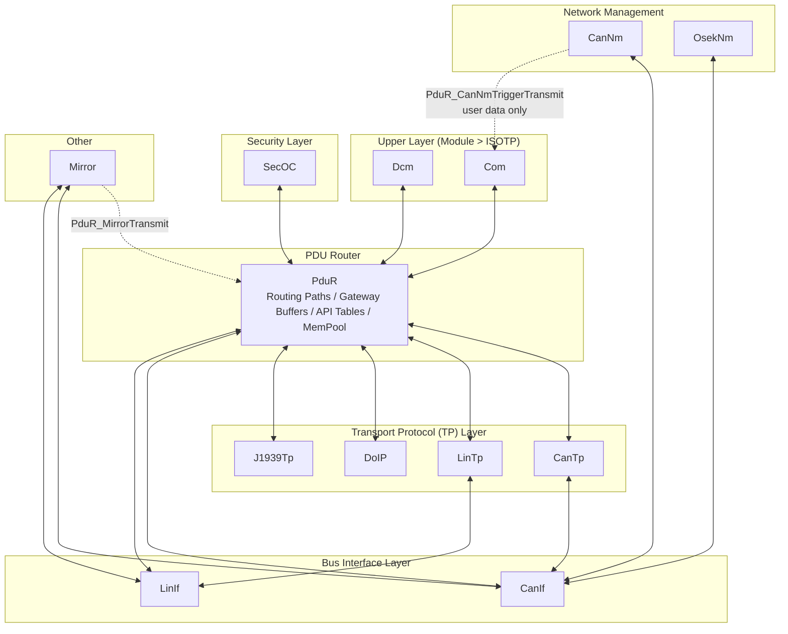
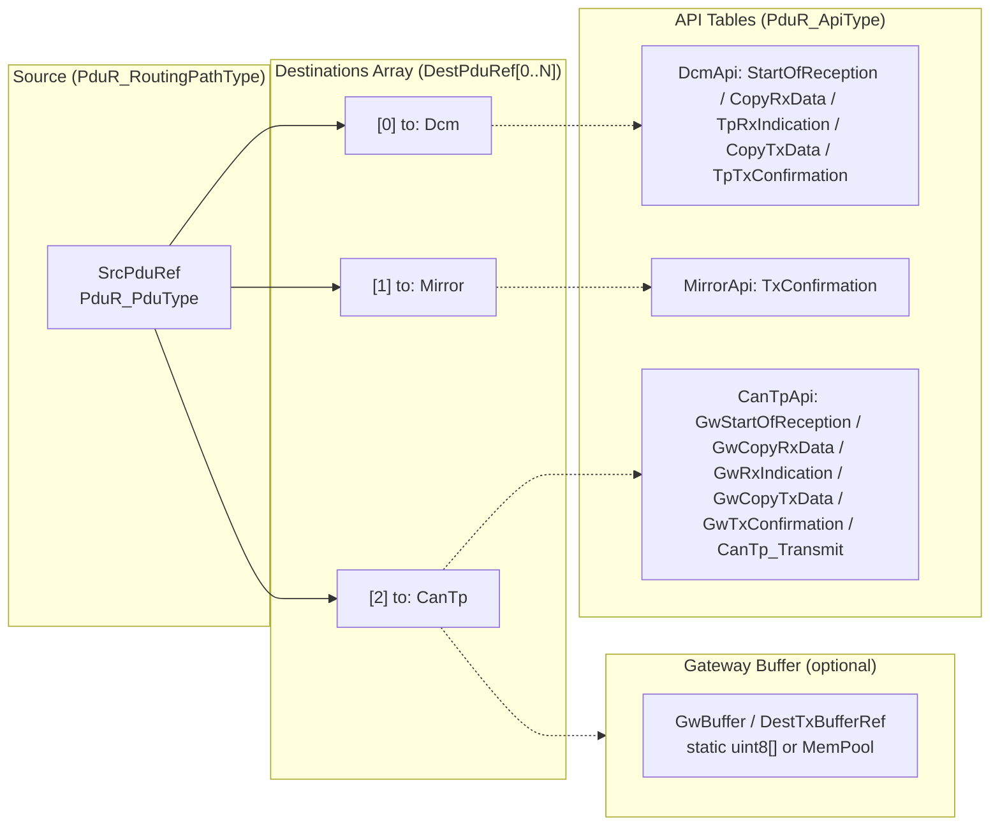
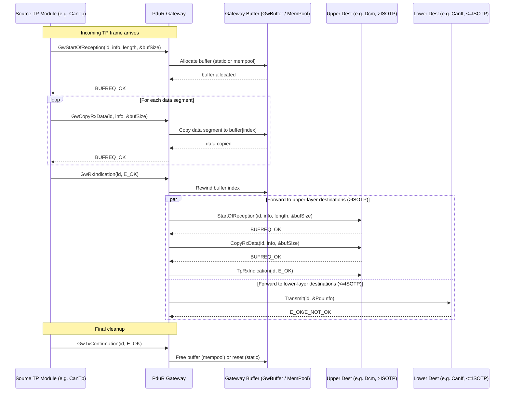

---
layout: post
title: AUTOSAR PduR
category: AUTOSAR
comments: true
---

# AUTOSAR PduR Configuration Overview

The **PDU Router (PduR)** in AUTOSAR manages communication between software modules (e.g., `CanTp`, `Dcm`, `LinTp`) by routing Protocol Data Units (PDUs) across the system. This document explains how to configure PduR networks, routines, memory pools, and buffers, leveraging JSON definitions and automated code generation.

---

## 1. Core Concepts

### 1.1 What is PduR?
PduR acts as a software router that:
- Routes PDUs between upper-layer modules (e.g., `Dcm` <-> `CanTp`).
- Supports gateway scenarios (e.g., routing a CAN PDU to another CAN network via `CanTp` <-> `CanTp`).
- Relies on `Com` and `CanIf` for physical bus communication (PduR itself does not handle hardware).

### 1.2 Key Components
- **Routines**: Define routing paths mapping a PDU from a source module to one or more destination modules.
- **Networks**: Define logical communication channels (e.g., `CAN0`, `LIN0`) for auto-generating routines from DBC files.
- **Memory**: Memory pool configuration for PduR internal buffering.
- **Buffers**: Gateway buffer pools for TP (Transport Protocol) gateway scenarios.

### 1.3 Supported Modules

The following module identifiers are used in `from` / `to` fields:

| Module     | Type                   | Description                             |
|------------|------------------------|-----------------------------------------|
| `CanIf`    | Low Module             | CAN Interface                           |
| `CanTp`    | Transport Protocol (TP)| CAN Transport Protocol                  |
| `LinTp`    | Transport Protocol (TP)| LIN Transport Protocol                  |
| `DoIP`     | Transport Protocol (TP)| DoIP Transport Protocol                 |
| `J1939Tp`  | Transport Protocol (TP)| J1939 Transport Protocol                |
| `Dcm`      | High Module            | Diagnostic Communication Manager        |
| `Com`      | Low Module             | Communication (Signal-based)            |
| `OsekNm`   | Network Management     | OSEK Network Management                 |
| `CanNm`    | Network Management     | CAN Network Management                  |
| `PduR`     | Router                 | PDU Router (self-reference)             |
| `SecOC`    | Security               | Secure On-Board Communication           |
| `Mirror`   | Mirror                 | Mirror module for testing/observation   |

> **TP Modules**: `DoIP`, `CanTp`, `LinTp`, `J1939Tp` - when both `from` and `to` are TP modules, a **gateway** scenario is detected and gateway-specific code (buffering, copy functions) is generated.
>
> **High Module**: `Dcm` - routes targeting Dcm are treated as high-priority diagnostic paths.
>
> **Low Modules**: TP modules + `CanIf` - all other non-Dcm modules.

### 1.4 PduR Architecture Overview

The following diagram shows how PduR sits at the center of the AUTOSAR communication stack, routing PDUs between upper-layer modules (Dcm, Com), security modules (SecOC), transport protocols (CanTp, LinTp, DoIP, J1939Tp), and bus interfaces (CanIf, LinIf). Mirror receives routed PDUs from PduR (`PduR_MirrorTransmit`) but transmits mirrored frames directly to CanIf/LinIf. CanNm and OsekNm bypass PduR entirely and communicate directly with CanIf.

<!-- HTML Architecture Diagram: PduR Module Layering -->


**Layer Boundary**: The `ISOTP` boundary (Module > 8) separates upper-layer modules (Dcm, Com, SecOC, Mirror) from lower-layer modules (CanIf, CanTp, LinTp, DoIP, J1939Tp, CanNm, OsekNm). This boundary determines gateway forwarding behavior — upper-layer destinations receive data via TP callbacks, while lower-layer destinations receive data via direct `Transmit`.

---

## 2. Full PduR JSON Configuration

```json
{
  "class": "PduR",

  "routines": [
    {
      "name": "P2P_RX",
      "from": "CanTp",
      "to": "Dcm"
    },
    {
      "name": "P2P_TX",
      "from": "Dcm",
      "to": "CanTp"
    }
  ],

  "networks": [
    {
      "name": "CAN0",
      "network": "CAN",
      "me": "AS",
      "use_dbc": true,
      "dbc": "CAN0.dbc",
      "ignore": ["IGNORED_MSG"]
    }
  ],

  "memory": [
    {
      "name": "MyPool",
      "size": 256,
      "number": 2
    }
  ],

  "buffers": [
    {
      "name": "GwBuf",
      "size": 4096
    }
  ]
}
```

---

## 3. Routines Configuration

### 3.1 Overview

Routines define **how PDUs are routed between modules**. Each routine maps a PDU from a source module to one or more destination modules. The generator assigns each routine a unique index (macro `PDUR_<name>`) and generates source/destination Pdu structures.

### 3.2 Routine Parameters

| Parameter         | Type    | Required | Default | Description |
|-------------------|---------|----------|---------|-------------|
| `name`            | string  | Yes      | -        | PDU name, referenced from `EcuC.Pdus[].name`. Used to generate `PDUR_<name>` macro. |
| `from`            | string  | Yes      | -        | Source module. Must be one of: `CanIf`, `CanTp`, `OsekNm`, `CanNm`, `PduR`, `Dcm`, `Com`, `LinTp`, `DoIP`, `J1939Tp`, `SecOC`, `Mirror`. |
| `to`              | string  | Yes      | -        | Destination module. Same enum as `from`. |
| `useDest`         | bool    | No       | `true`   | Enable/disable the `dest` field. When `false`, the `dest` value is ignored and `name` is used as the destination PDU name. |
| `dest`            | string  | No       | `name`   | Alternative destination PDU name. Only effective when `useDest` is `true`. When set, the destination PDU identifier uses this name instead of `name`. Both `PDUR_<name>` and `PDUR_<dest>` macros are generated. |
| `useDestBuffer`   | bool    | No       | `false`  | Enable/disable gateway buffer configuration. When `true`, enables `DestBufferType`, `DestBuffer`, and `DestBufferSize`. |
| `DestBufferType`  | string  | No       | `private`| Type of gateway buffer: `"private"` allocates a dedicated buffer of size `DestBufferSize`; `"shared"` references a pre-defined buffer by `DestBuffer` name (from `buffers[]`). Only effective when `useDestBuffer` is `true`. |
| `DestBuffer`      | string  | No       | -        | Name of a pre-defined shared gateway buffer (from `buffers[]`) to use for this routine's gateway data. Only effective when `useDestBuffer` is `true` and `DestBufferType` is `"shared"`. |
| `DestBufferSize`  | integer | No       | 0        | Size of a dedicated private gateway buffer for this routine. When > 0 and `useDestBuffer` is `true` with `DestBufferType` `"private"`, a private `PduR_GwBuffer_<name>` is allocated. |
| `useFake`         | bool    | No       | `true`   | Enable/disable the `fake` field. When `false`, the `fake` value is ignored and no fake PDU macro is generated. |
| `fake`            | string  | No       | -        | Fake PDU name used for mirrored routing. Only effective when `useFake` is `true`. Generates an additional `PDUR_<fake>` macro pointing to the same index. |
| `destinations`    | array   | No       | -       | Additional destinations for multi-cast / mirror routing. Each entry can duplicate the PDU to other modules. |

#### 3.2.1 Destination Entry Parameters

| Parameter | Type   | Required | Default | Description |
|-----------|--------|----------|---------|-------------|
| `name`    | string | Yes      | -       | Destination PDU name for this additional leg. |
| `to`      | string | Yes      | -       | Destination module (same enum as routine `to`). Inherits `from` from the parent routine. |
| `useFake` | bool   | No       | `false` | Enable/disable fake PDU name for this destination. |
| `fake`    | string | No       | -       | Fake PDU name for mirrored routing on this destination leg. Only effective when the parent routine's `useFake` is `true`. |

### 3.3 Gateway Detection

When both `from` and `to` (or any `destinations[].to`) are **TP Modules** (`DoIP`, `CanTp`, `LinTp`, `J1939Tp`), the generator:

1. Sets `hasGW = true`, generating the `PDUR_USE_TP_GATEWAY` macro.
2. Places TP-to-TP destinations **first** in the destination array (gateway paths take priority).
3. Allocates a `PduR_BufferType` structure for runtime gateway buffering.
4. Generates gateway-specific callbacks (`PduR_<Mod>GwStartOfReception`, `PduR_<Mod>GwCopyRxData`, `PduR_<Mod>GwRxIndication`, etc.) for the involved modules.

### 3.4 Destination Buffer Specification

For gateway routines requiring data buffering, first enable gateway buffer configuration by setting `useDestBuffer` to `true`, then select the buffer type via `DestBufferType`:

- **`DestBufferType = "private"`**: Allocates a dedicated `uint8_t PduR_GwBuffer_<name>[<DestBufferSize>]` for this routine. Configure the size via `DestBufferSize`.
- **`DestBufferType = "shared"`**: References a pre-defined buffer from `buffers[]` by name via `DestBuffer`.

When `useDestBuffer` is `false`, no dedicated gateway buffer is used (`NULL`).

### 3.5 Code Generation Behavior

For each routine, the generator emits:

- **Macro**: `#define PDUR_<name> <index>` - unique zero-based index for the routing path.
- **Source Pdu**: `PduR_SrcPdu_<from>_<to>_<name>` - contains module ID, PDU ID, and API table pointer.
- **Destination Pdu Array**: `PduR_DstPdu_<from>_<to>_<name>[]` - array of destination Pdu entries.
- **Routing Path**: Entry in `PduR_RoutingPaths[]` table, linking source to destinations with optional gateway buffer.

The following diagram illustrates the routing path data structure and how a source PDU fans out to multiple destinations:

<!-- HTML Routing Path Diagram -->


**Routing Patterns**:
| API | Fan-out | Target | Gateway Support |
|-----|---------|--------|----------------|
| `PduR_Transmit` / `PduR_RxIndication` | All destinations | DestPduRef[0..N] | No |
| `PduR_TpTransmit` | First only | DestPduRef[0] | Yes (uses GwBuffer) |
| `PduR_StartOfReception` / `CopyRxData` / `TpRxIndication` | First only | DestPduRef[0] | No |
| `PduR_CopyTxData` / `TxConfirmation` | Source only | SrcPduRef | Yes (uses GwBuffer) |
| `PduR_Gw*` | Gateway-specific | Buffer -> DestPduRef[0..N] | Yes |

### 3.6 Example: Basic Diagnostic Routing

```json
{
  "name": "DiagRequest_RX",
  "from": "CanTp",
  "to": "Dcm"
}
```

Routes PDUs from `CanTp` (transport layer) to `Dcm` (diagnostic manager).

### 3.7 Example: Gateway with Private Buffer

```json
{
  "name": "CAN0_Diag",
  "from": "CanTp",
  "to": "DoIP",
  "DestBufferSize": 2048
}
```

Routes PDUs from `CanTp` to `DoIP` with a dedicated 2048-byte gateway buffer.

### 3.8 Example: Multi-Destination with Mirror

```json
{
  "name": "CAN1_MSG",
  "from": "CanIf",
  "to": "Com",
  "destinations": [
    {
      "name": "CAN1_MSG_MIRROR",
      "to": "Mirror",
      "from": "CanIf"
    }
  ]
}
```

Routes CAN message to `Com` and also mirrors it to the `Mirror` module for monitoring.

### 3.9 Example: Gateway Using Shared Buffer

```json
{
  "name": "J1939_To_CanTp",
  "from": "J1939Tp",
  "to": "CanTp",
  "DestBuffer": "GwBuf"
}
```

Routes PDUs from `J1939Tp` to `CanTp` using a shared buffer named `GwBuf` (defined in `buffers[]`).

### 3.10 Generated Macros

For each routine, the following macros are generated in `PduR_Cfg.h`:

```
#define PDUR_<name>              <index>
#define PDUR_<dest>              <index>    // only if dest != name
#define PDUR_<fake>              <index>    // only if fake is set
#define PDUR_<destinations[i].name>  <index>    // for each destination
#define PDUR_<destinations[i].fake>  <index>    // for each destination with fake
```

---

## 4. Networks Configuration

### 4.1 Purpose

Networks define **logical communication channels** (e.g., CAN0, LIN0) that are used to **auto-generate routines** from DBC files. Unlike `CanIf` (which handles physical bus configuration), PduR networks focus on **inter-module routing discovery**.

### 4.2 Network Parameters

| Parameter  | Type    | Required | Default | Description |
|------------|---------|----------|---------|-------------|
| `name`     | string  | Yes      | `CAN?`  | Logical name of the network (e.g., `CAN0`). Used as prefix for generated PDU symbols. |
| `network`  | string  | Yes      | -       | Physical network type. Must be `"CAN"` or `"LIN"`. Determines the lower module: `CAN` -> `CanIf`, `LIN` -> `LinIf`. |
| `me`       | string  | Yes      | `AS`    | Self node name. Messages where `node == me` are treated as **transmit** (`Com` -> `CanIf`/`LinIf`); others are **receive** (`CanIf`/`LinIf` -> `Com`). |
| `use_dbc`  | boolean | No       | `false` | Enable DBC-based routine generation. When `true`, `dbc` must point to a valid file. |
| `dbc`      | string  | Conditional | `""` | Path to a Vector CAN DBC file. Resolved relative to the configuration directory. Required when `use_dbc` is `true`. |
| `ignore`   | array   | No       | -       | List of PDU/message names to exclude from DBC-based routine generation. |

### 4.3 DBC-Based Auto-Generation

When `use_dbc` is `true`, the `extract()` function in the generator:

1. Reads the DBC file and extracts all messages.
2. For each message **not** in `ignore`:
   - If `msg.node == me` (self-transmitted): generates a **TX routine** (`from: "Com"` -> `to: "CanIf"`/`"LinIf"`), PDU name suffixed with `_TX`.
   - If `msg.node != me` (received from others): generates an **RX routine** (`from: "CanIf"`/`"LinIf"` -> `to: "Com"`), PDU name suffixed with `_RX`.
3. Writes the generated routines into `PduR.json` in the output directory.

> Common suffixes: `_RX` for receive, `_TX` for transmit. The generator checks for these suffixes and appends them if missing.

### 4.4 Example: DBC-Based Network

```json
{
  "name": "CAN0",
  "network": "CAN",
  "me": "AS",
  "use_dbc": true,
  "dbc": "config/CAN0.dbc",
  "ignore": ["DEBUG_MSG", "TEST_MSG"]
}
```

This generates routing routines for all messages in `CAN0.dbc` except `DEBUG_MSG` and `TEST_MSG`.

---

## 5. Memory Configuration

### 5.1 Purpose

The `memory` array defines **memory pools** used for PduR internal data buffering. When configured, the `PDUR_USE_MEMPOOL` macro is generated, and `MemCluster` definitions are emitted.

### 5.2 Memory Parameters

| Parameter | Type    | Required | Default | Description |
|-----------|---------|----------|---------|-------------|
| `name`    | string  | Yes      | -       | Memory pool name. Used as cluster identifier. |
| `size`    | integer | No       | 256     | Size of each memory block in bytes. Range: 0 - 4294967295. |
| `number`  | integer | No       | 2       | Number of memory blocks in the pool. Range: 0 - 4294967295. |

### 5.3 Example

```json
"memory": [
  {
    "name": "PduR_MemPool",
    "size": 512,
    "number": 4
  }
]
```

Creates a memory pool named `PduR_MemPool` with 4 blocks of 512 bytes each.

### 5.4 Code Generation

When `memory` is present, the generator:

- Writes `#define PDUR_USE_MEMPOOL` in the header.
- Generates `MemCluster` macros via `MC.Gen_Macros()`.
- Generates memory pool definitions via `MC.Gen_Defs()`.
- References `&MC_PduR` in `PduR_Config`.

---

## 6. Buffers Configuration

### 6.1 Purpose

The `buffers` array defines **shared gateway buffer pools** that can be referenced by multiple routines via the `DestBuffer` parameter. These are used in TP-to-TP gateway scenarios for temporary data storage during routing.

### 6.2 Buffer Parameters

| Parameter | Type    | Required | Default | Description |
|-----------|---------|----------|---------|-------------|
| `name`    | string  | Yes      | -       | Buffer name. Referenced by routine `DestBuffer`. |
| `size`    | integer | No       | 4096    | Buffer size in bytes. Range: 0 - 4294967295. |

### 6.3 Example

```json
"buffers": [
  {
    "name": "GwBuf",
    "size": 8192
  }
]
```

Allocates a `uint8_t PduR_GwBuffer_GwBuf[8192]` static buffer.

### 6.4 Code Generation

For each buffer entry, the generator emits:

```c
static uint8_t PduR_GwBuffer_<name>[<size>];
```

---

## 7. Configuration Flags

The following build-time configuration flags are controlled via macros:

| Macro                    | Description                                    | Default      |
|--------------------------|------------------------------------------------|--------------|
| `PDUR_USE_PB_CONFIG`    | Enable post-build configuration support        | Enabled      |
| `PDUR_USE_MEMPOOL`      | Enable memory pool support                     | When `memory` is configured |
| `PDUR_USE_TP_GATEWAY`   | Enable TP-to-TP gateway support                | When any routine has TP-to-TP routing |

The `PDUR_USE_PB_CONFIG` macro is controlled by the `UsePostBuildConfig` setting (defaults to `true`) at the PduR configuration level. If set to `false`, the macro is commented out.

---

## 8. Public API Reference

The PduR public API is defined in [PduR.h](../../infras/include/PduR.h) following AUTOSAR CP 4.4.0.

### 8.1 Error Codes

| Macro                            | Value | Description |
|----------------------------------|-------|-------------|
| `PDUR_E_PDU_ID_INVALID`          | 0x02  | PDU ID is out of valid range |
| `PDUR_E_ROUTING_PATH_GROUP_ID_INVALID` | 0x08 | Routing path group ID is invalid |
| `PDUR_E_PARAM_POINTER`           | 0x09  | Null pointer passed to API |

### 8.2 Core API Functions

| Function | Description |
|----------|-------------|
| `PduR_Init(const PduR_ConfigType *ConfigPtr)` | Initializes the PduR module. When `PDUR_USE_MEMPOOL` is defined, calls `PduR_MemInit()` to initialize memory pools. |
| `PduR_EnableRouting(PduR_RoutingPathGroupIdType id)` | Enables a routing path group. |
| `PduR_DisableRouting(PduR_RoutingPathGroupIdType id, boolean initialize)` | Disables a routing path group. |
| `PduR_GetVersionInfo(Std_VersionInfoType *versionInfo)` | Returns PduR module version information. Reports: vendor `STD_VENDOR_ID_AS`, module `MODULE_ID_PDUR`, version 4.0.0. |

### 8.3 Per-Module Adapter APIs

Each connected module exposes a set of adapter functions that PduR uses as callback entry points. These are defined in module-specific headers:

#### CanIf Module ([PduR_CanIf.h](../../infras/include/PduR_CanIf.h))

| Function | Direction | Description |
|----------|-----------|-------------|
| `PduR_CanIfRxIndication(RxPduId, PduInfoPtr)` | Rx | Forwards CAN receive indication to PduR routing. Delegates to `PduR_RxIndication()`. |
| `PduR_CanIfTxConfirmation(TxPduId, result)` | Tx | Forwards CAN transmit confirmation. Delegates to `PduR_TxConfirmation()`. |

#### CanTp Module ([PduR_CanTp.h](../../infras/include/PduR_CanTp.h))

| Function | Description |
|----------|-------------|
| `PduR_CanTpStartOfReception(id, info, TpSduLength, bufferSizePtr)` | Delegates to `PduR_StartOfReception()` |
| `PduR_CanTpCopyRxData(id, info, bufferSizePtr)` | Delegates to `PduR_CopyRxData()` |
| `PduR_CanTpCopyTxData(id, info, retry, availableDataPtr)` | Delegates to `PduR_CopyTxData()` |
| `PduR_CanTpRxIndication(id, result)` | Delegates to `PduR_TpRxIndication()` |
| `PduR_CanTpTxConfirmation(id, result)` | Delegates to `PduR_TxConfirmation()` |
| `PduR_CanTpGwStartOfReception(id, info, TpSduLength, bufferSizePtr)` | Gateway: delegates to `PduR_GwStartOfReception()` |
| `PduR_CanTpGwCopyRxData(id, info, bufferSizePtr)` | Gateway: delegates to `PduR_GwCopyRxData()` |
| `PduR_CanTpGwCopyTxData(id, info, retry, availableDataPtr)` | Gateway: delegates to `PduR_GwCopyTxData()` |
| `PduR_CanTpGwRxIndication(id, result)` | Gateway: invokes `LINTP_GW_USER_HOOK_RX_IND` then delegates to `PduR_GwRxIndication()` |
| `PduR_CanTpGwTxConfirmation(id, result)` | Gateway: delegates to `PduR_GwTxConfirmation()` |

#### Com Module ([PduR_Com.h](../../infras/include/PduR_Com.h))

| Function | Description |
|----------|-------------|
| `PduR_ComTransmit(TxPduId, PduInfoPtr)` | Delegates to `PduR_Transmit()` |
| `PduR_ComRxIndication(RxPduId, PduInfoPtr)` | Delegates to `PduR_RxIndication()` |
| `PduR_ComTxConfirmation(TxPduId, result)` | Delegates to `PduR_TxConfirmation()` |
| `PduR_ComTriggerTransmit(TxPduId, PduInfoPtr)` | Trigger transmit (SWS_PduR_00369) |

#### Dcm Module ([PduR_Dcm.h](../../infras/include/PduR_Dcm.h))

| Function | Description |
|----------|-------------|
| `PduR_DcmTransmit(TxPduId, PduInfoPtr)` | Delegates to `PduR_TpTransmit()` |
| `PduR_DcmCancelTransmit(TxPduId)` | Cancel ongoing TP transmit |
| `PduR_DcmCancelReceive(RxPduId)` | Cancel ongoing TP receive |

#### DoIP Module ([PduR_DoIP.h](../../infras/include/PduR_DoIP.h))

| Function | Description |
|----------|-------------|
| `PduR_DoIPStartOfReception(id, info, TpSduLength, bufferSizePtr)` | Delegates to `PduR_StartOfReception()` |
| `PduR_DoIPCopyRxData(id, info, bufferSizePtr)` | Delegates to `PduR_CopyRxData()` |
| `PduR_DoIPCopyTxData(id, info, retry, availableDataPtr)` | Delegates to `PduR_CopyTxData()` |
| `PduR_DoIPRxIndication(id, result)` | Delegates to `PduR_TpRxIndication()` |
| `PduR_DoIPTxConfirmation(id, result)` | Delegates to `PduR_TxConfirmation()` |
| `PduR_DoIPGwStartOfReception(id, info, TpSduLength, bufferSizePtr)` | Gateway: delegates to `PduR_GwStartOfReception()` |
| `PduR_DoIPGwCopyRxData(id, info, bufferSizePtr)` | Gateway: delegates to `PduR_GwCopyRxData()` |
| `PduR_DoIPGwCopyTxData(id, info, retry, availableDataPtr)` | Gateway: delegates to `PduR_GwCopyTxData()` |
| `PduR_DoIPGwRxIndication(id, result)` | Gateway: delegates to `PduR_GwRxIndication()` |
| `PduR_DoIPGwTxConfirmation(id, result)` | Gateway: delegates to `PduR_GwTxConfirmation()` |

#### J1939Tp Module ([PduR_J1939Tp.h](../../infras/include/PduR_J1939Tp.h))

| Function | Description |
|----------|-------------|
| `PduR_J1939TpTransmit(TxPduId, PduInfoPtr)` | Delegates to `PduR_TpTransmit()` |
| `PduR_J1939TpStartOfReception(id, info, TpSduLength, bufferSizePtr)` | Delegates to `PduR_StartOfReception()` |
| `PduR_J1939TpCopyRxData(id, info, bufferSizePtr)` | Delegates to `PduR_CopyRxData()` |
| `PduR_J1939TpCopyTxData(id, info, retry, availableDataPtr)` | Delegates to `PduR_CopyTxData()` |
| `PduR_J1939TpRxIndication(id, result)` | Delegates to `PduR_TpRxIndication()` |
| `PduR_J1939TpTxConfirmation(id, result)` | Delegates to `PduR_TxConfirmation()` |

#### LinTp Module ([PduR_LinTp.h](../../infras/include/PduR_LinTp.h))

Same function set as CanTp (StartOfReception, CopyRxData, CopyTxData, RxIndication, TxConfirmation + Gateway variants).

#### SecOC Module ([PduR_SecOC.h](../../infras/include/PduR_SecOC.h))

| Function | Description |
|----------|-------------|
| `PduR_SecOCTransmit(TxPduId, PduInfoPtr)` | Delegates to `PduR_Transmit()` |
| `PduR_SecOCRxIndication(RxPduId, PduInfoPtr)` | Delegates to `PduR_RxIndication()` |
| `PduR_SecOCTxConfirmation(TxPduId, result)` | Delegates to `PduR_TxConfirmation()` |
| `PduR_SecOCTriggerTransmit(TxPduId, PduInfoPtr)` | Trigger transmit |

#### Mirror Module ([PduR_Mirror.h](../../infras/include/PduR_Mirror.h))

| Function | Description |
|----------|-------------|
| `PduR_MirrorTransmit(TxPduId, PduInfoPtr)` | Delegates to `PduR_TpTransmit()` |

---

## 9. Internal Data Structures

The private header [PduR_Priv.h](../../infras/communication/PduR/PduR_Priv.h) defines the core runtime data structures.

### 9.1 Module Enumeration (`PduR_ModuleType`)

```c
typedef enum {
  PDUR_MODULE_CANIF,    // 0 - CAN Interface
  PDUR_MODULE_CANTP,    // 1 - CAN Transport Protocol
  PDUR_MODULE_J1939TP,  // 2 - J1939 Transport Protocol
  PDUR_MODULE_LINIF,    // 3 - LIN Interface
  PDUR_MODULE_LINTP,    // 4 - LIN Transport Protocol
  PDUR_MODULE_DOIP,     // 5 - DoIP Transport Protocol
  PDUR_MODULE_CANNM,    // 6 - CAN Network Management
  PDUR_MODULE_OSEKNM,   // 7 - OSEK Network Management
  /* ---- boundary ---- */
  PDUR_MODULE_ISOTP,    // 8 - ISO-TP boundary marker
  PDUR_MODULE_SECOC,    // 9 - Secure On-Board Communication
  PDUR_MODULE_COM,      // 10 - Communication (signal-based)
  PDUR_MODULE_DCM,      // 11 - Diagnostic Communication Manager
  PDUR_MODULE_MIRROR,   // 12 - Mirror module
} PduR_ModuleType;
```

> **Architectural Significance**: Modules at or below `PDUR_MODULE_ISOTP` (0-8) are treated as "lower-layer" modules. Modules above `PDUR_MODULE_ISOTP` (9-12) are "upper-layer" modules. This affects gateway routing behavior (see Gateway Data Flow).

### 9.2 API Function Pointer Table (`PduR_ApiType`)

Each module registers a table of 7 function pointers:

```c
typedef struct {
  BufReq_ReturnType (*StartOfReception)(PduIdType, const PduInfoType*,
                                        PduLengthType, PduLengthType*);
  BufReq_ReturnType (*CopyRxData)(PduIdType, const PduInfoType*, PduLengthType*);
  void (*TpRxIndication)(PduIdType, Std_ReturnType);
  void (*RxIndication)(PduIdType, const PduInfoType*);
  Std_ReturnType (*Transmit)(PduIdType, const PduInfoType*);
  BufReq_ReturnType (*CopyTxData)(PduIdType, const PduInfoType*,
                                  const RetryInfoType*, PduLengthType*);
  void (*TxConfirmation)(PduIdType, Std_ReturnType);
} PduR_ApiType;
```

NULL pointers are allowed for unused callbacks. Each module fills in only the callbacks it supports.

### 9.3 PDU Descriptor (`PduR_PduType`)

```c
typedef struct {
  PduR_ModuleType Module;    // Module identifier (enum)
  PduIdType PduHandleId;    // PDU identifier for the module
  const PduR_ApiType *api;  // Pointer to module's API table
} PduR_PduType;
```

### 9.4 Gateway Buffer (`PduR_BufferType`)

```c
typedef struct {
  uint8_t *data;         // Pointer to buffer data
  PduLengthType size;    // Total buffer size
  PduLengthType index;   // Current read/write position
} PduR_BufferType;
```

### 9.5 Routing Path (`PduR_RoutingPathType`)

```c
typedef struct {
  const PduR_PduType *SrcPduRef;          // Source PDU descriptor
  const PduR_PduType *DestPduRef;         // Destination PDU array (first entry)
  PduR_BufferType *DestTxBufferRef;       // Gateway transmit buffer (optional)
  uint8_t *GwBuffer;                      // Static gateway destination buffer
  PduLengthType GwBufferSize;             // Static buffer size
  uint16_t numOfDestPdus;                 // Number of destination entries
} PduR_RoutingPathType;
```

### 9.6 Configuration Structure

```c
struct PduR_Config_s {
#if defined(PDUR_USE_MEMPOOL)
  const mem_cluster_t *mc;    // Memory pool cluster descriptor
#endif
  const PduR_RoutingPathType *RoutingPaths;  // Array of all routing paths
  uint16_t numOfRoutingPaths;                // Number of routing paths
};
```

---

## 10. Routing Path Processing

Each PduR API function follows a specific routing pattern based on the path configuration.

### 10.1 Transmit Routing (`PduR_Transmit`)

1. Validates `pathId` against `numOfRoutingPaths` (reports `PDUR_E_PDU_ID_INVALID` on failure).
2. Validates `PduInfoPtr` and `PduInfoPtr->SduDataPtr` (reports `PDUR_E_PARAM_POINTER` on failure).
3. Iterates through **all** destinations (`DestPduRef[0..numOfDestPdus-1]`).
4. Calls each destination's `Transmit` callback.
5. Returns `E_OK` only if **all** transmits succeed; otherwise returns the first failure code.

### 10.2 TP Transmit Routing (`PduR_TpTransmit`)

1. Routes only to `DestPduRef[0]` (the **first** destination only, not all).
2. If a gateway buffer exists (`DestTxBufferRef != NULL`), uses `pathId` as the PDU handle.
3. Otherwise, uses the destination's own `PduHandleId`.

### 10.3 TP Reception Sequence (`PduR_StartOfReception` -> `PduR_CopyRxData` -> `PduR_TpRxIndication`)

All three functions route to `DestPduRef[0]` only:

- **StartOfReception**: Called when a new TP reception begins. Returns required buffer size.
- **CopyRxData**: Called to copy received data segments.
- **TpRxIndication**: Called when TP reception completes (success or failure).

### 10.4 RX Indication Routing (`PduR_RxIndication`)

- Iterates through **all** destinations (like `PduR_Transmit`).
- Calls each destination's `RxIndication` callback.

### 10.5 TX Data Copy & Confirmation Routing (`PduR_CopyTxData`, `PduR_TxConfirmation`)

- Routes to `SrcPduRef` (the **source** module, not the destination).
- If a gateway buffer exists, uses `pathId` as the PDU handle.
- Otherwise, uses the source's own `PduHandleId`.

### 10.6 Handle ID Selection Logic

A consistent pattern is used throughout: when `DestTxBufferRef` is not NULL (gateway mode), the `pathId` itself serves as the PDU handle ID. Otherwise, the module's configured `PduHandleId` is used:

```
if (RoutingPath->DestTxBufferRef != NULL)
    PduHandleId = pathId;          // Use routing path index
else
    PduHandleId = DestPduRef->PduHandleId;  // Use module's PDU ID
```

---

## 11. Gateway Data Flow

Gateway routing handles TP-to-TP forwarding (e.g., `CanTp` <-> `DoIP`, `CanTp` <-> `LinTp`). The gateway mechanism uses an internal buffer to temporarily store the complete TP message before forwarding.

### 11.1 Gateway Reception Flow

The following sequence diagram shows the complete lifecycle of a gateway TP-to-TP forwarding:

<!-- HTML TP Gateway Sequence Diagram -->


### 11.2 `PduR_GwStartOfReception` - Buffer Allocation

1. If a **static** buffer is configured (`GwBuffer != NULL` and `GwBufferSize >= TpSduLength`):
   - Uses the static buffer directly: `buffer->data = RoutingPath->GwBuffer`
   - No dynamic allocation needed.
2. If no static buffer or size is insufficient, falls back to **memory pool** (`PDUR_USE_MEMPOOL`):
   - Frees any previously allocated dynamic buffer.
   - Calls `PduR_MemAlloc(TpSduLength)` to allocate exact size needed.
3. Sets `buffer->size = TpSduLength`, `buffer->index = 0`, returns `BUFREQ_OK`.

### 11.3 `PduR_GwCopyRxData` - Data Copying

- Copies `info->SduDataPtr` into `buffer->data[buffer->index]`.
- Advances `buffer->index` by `info->SduLength`.
- Returns `BUFREQ_E_OVFL` if buffer overflow is detected.

### 11.4 `PduR_GwRxIndication` - Forwarding Logic

On successful reception (`result == E_OK`), iterates through all destinations:

| Destination Module Type | Behavior |
|------------------------|----------|
| **Upper-layer** (Module > `PDUR_MODULE_ISOTP`, e.g., SecOC, Com, Dcm, Mirror) | Calls `StartOfReception` + `CopyRxData` + `TpRxIndication` sequence to deliver the complete buffered data as a TP reception. |
| **Lower-layer** (Module <= `PDUR_MODULE_ISOTP`, e.g., CanIf, CanTp, DoIP) | Sets `buffer->index = 0` and calls `Transmit` directly with the complete buffered data as a single I-PDU. |

On failure (`E_NOT_OK`), if `PDUR_USE_MEMPOOL` and the buffer was dynamically allocated, the buffer is freed via `PduR_MemFree()`.

### 11.5 Gateway Transmit Path

```
PduR_GwCopyTxData()           -- Copy from buffer to output (for retry)
    |
    v
PduR_GwTxConfirmation()       -- Free buffer after successful transmit
```

### 11.6 `PduR_GwCopyTxData` - Outbound Data Copy

- Reads `offset` from `info->MetaDataPtr`.
- Copies `info->SduLength` bytes from `buffer->data[offset]` to `info->SduDataPtr`.
- Updates offset and returns `BUFREQ_OK`.

### 11.7 `PduR_GwTxConfirmation` - Buffer Cleanup

- On transmit confirmation, resets `buffer->data = NULL`.
- If `PDUR_USE_MEMPOOL` and the buffer was dynamically allocated (not the static `GwBuffer`), calls `PduR_MemFree()`.

---

## 12. Zero-Cost Optimization Macros

The PduR implementation supports **zero-cost routing** macros that bypass the PduR layer entirely for direct module-to-module connections, eliminating routing overhead at compile time.

| Macro | Effect |
|-------|--------|
| `PDUR_DCM_CANTP_ZERO_COST` | `PduR_DcmTransmit` -> `CanTp_Transmit` (direct), `PduR_CanTp*` callbacks -> `Dcm_*` (direct) |
| `PDUR_DCM_LINTP_ZERO_COST` | `PduR_DcmTransmit` -> `LinTp_Transmit` (direct), `PduR_LinTp*` callbacks -> `Dcm_*` (direct) |
| `PDUR_DCM_J1939TP_ZERO_COST` | `PduR_J1939Tp*` callbacks -> `Dcm_*` (direct) |

When enabled, the corresponding adapter functions are replaced by `#define` macros in the header files, eliminating function call overhead and reducing code size.

Example from [PduR_Dcm.h](../../infras/include/PduR_Dcm.h):
```c
#ifdef PDUR_DCM_CANTP_ZERO_COST
#define PduR_DcmTransmit CanTp_Transmit
#endif
```

Example from [PduR_CanTp.h](../../infras/include/PduR_CanTp.h):
```c
#ifdef PDUR_DCM_CANTP_ZERO_COST
#define PduR_CanTpCopyTxData      Dcm_CopyTxData
#define PduR_CanTpRxIndication    Dcm_TpRxIndication
#define PduR_CanTpTxConfirmation  Dcm_TpTxConfirmation
#define PduR_CanTpStartOfReception Dcm_StartOfReception
#define PduR_CanTpCopyRxData      Dcm_CopyRxData
#endif
```

---

## 13. User Hooks

The LinTp gateway implementation provides user-defined hook macros for custom behavior:

| Hook Macro | Location | Description |
|------------|----------|-------------|
| `LINTP_GW_USER_HOOK_RX_IND(id, result)` | [PduR_LinTp.c](../../infras/communication/PduR/PduR_LinTp.c) | Called before `PduR_GwRxIndication()`. Default: no-op. |
| `LINTP_GW_USER_HOOK_TX_CONFIRM(id, result)` | [PduR_LinTp.c](../../infras/communication/PduR/PduR_LinTp.c) | Called before `PduR_TxConfirmation()`. Default: no-op. |

These hooks allow application-specific processing (e.g., logging, metrics, traffic shaping) without modifying the PduR core code.

---

## 14. Error Reporting (Det Integration)

PduR integrates with the **Default Error Tracer (Det)** module for runtime diagnostic error reporting. All API functions validate parameters using the `DET_VALIDATE` macro:

| Validation | Error Code | Reported Service ID |
|------------|------------|-------------------|
| `pathId >= numOfRoutingPaths` | `PDUR_E_PDU_ID_INVALID` | Function-specific (0x40-0xF5) |
| NULL pointer in Transmit | `PDUR_E_PARAM_POINTER` | 0x49 |
| NULL pointer in GetVersionInfo | `PDUR_E_PARAM_POINTER` | 0xF1 |

The `DET_THIS_MODULE_ID` is set to `MODULE_ID_PDUR`.

---

## 15. Memory Pool Internals

The memory pool subsystem ([PduR_Mem.c](../../infras/communication/PduR/PduR_Mem.c)) provides dynamic buffer allocation for gateway scenarios. It is compiled only when `PDUR_USE_MEMPOOL` is defined.

| Function | Description |
|----------|-------------|
| `PduR_MemInit()` | Initializes the memory pool cluster via `mc_init(config->mc)` |
| `PduR_MemAlloc(size)` | Allocates a buffer of `size` bytes from the pool |
| `PduR_MemGet(size)` | Gets next available buffer without allocation |
| `PduR_MemFree(buffer)` | Returns a buffer to the pool |

The memory pool is configured via the `memory[]` configuration array (see Section 6) and is managed by the `MemPool` library (linked via `SConscript`).

---

## 16. Application Configuration Examples

### 16.1 Basic Diagnostic Routing (Bootloader)

From [app/bootloader/config/PduR/PduR.json](../../app/bootloader/config/PduR/PduR.json):

```json
{
  "class": "PduR",
  "routines": [
    { "name": "P2P_RX", "from": "CanTp", "to": "Dcm" },
    { "name": "P2P_TX", "from": "Dcm", "to": "CanTp" },
    { "name": "P2A_RX", "from": "CanTp", "to": "Dcm" },
    { "name": "P2A_TX", "from": "Dcm", "to": "CanTp" }
  ]
}
```

Simple diagnostic request/response routing without gateway or DBC support.

### 16.2 Full Application with SecOC and Mirror

From [app/app/config/Com/PduR.json](../../app/app/config/Com/PduR.json):

```json
{
  "class": "PduR",
  "routines": [
    { "name": "P2P_RX", "from": "CanTp", "to": "Dcm" },
    { "name": "P2P_TX", "from": "Dcm", "to": "CanTp" },
    { "name": "P2A_RX", "from": "CanTp", "to": "Dcm",
      "destinations": [{ "name": "P2A_FW_TX", "to": "CanTp", "fake": "P2A_FW_RX" }] },
    { "name": "P2A_TX", "from": "Dcm", "to": "CanTp" },
    { "name": "CAN0_SECOC_MSG0_TX", "from": "Com", "to": "SecOC" },
    { "name": "FW_CAN0_SECOC_MSG0_TX", "from": "SecOC", "to": "CanIf" },
    { "name": "FW_CAN0_SECOC_MSG1_RX", "from": "CanIf", "to": "SecOC" },
    { "name": "CAN0_SECOC_MSG1_RX", "from": "SecOC", "to": "Com" },
    { "name": "MIRROR_TX", "from": "Mirror", "to": "CanIf" }
  ],
  "networks": [
    { "name": "CAN0", "network": "CAN", "me": "AS", "dbc": "CAN0.dbc",
      "ignore": ["CanNmUserData"] },
    { "name": "CAN1", "network": "CAN", "me": "AS", "dbc": "CAN0.dbc",
      "ignore": ["CanNmUserData"] }
  ],
  "memory": [
    { "name": "middle", "size": 64, "number": 2 }
  ]
}
```

Key features demonstrated:
- **SecOC chain**: `Com -> SecOC -> CanIf` for TX, `CanIf -> SecOC -> Com` for RX
- **Multi-destination**: P2A_RX has an additional destination for forwarding (`P2A_FW_TX` with `fake` for mirrored receive)
- **Mirror**: `Mirror -> CanIf` allows test/monitoring injection
- **DBC networks**: Two CAN networks (CAN0, CAN1) sharing the same DBC file
- **Memory pool**: 2 blocks of 64 bytes for dynamic gateway buffering

### 16.3 SecOC via CanTp (Backup Routing)

Alternative routing paths (commented as `backup-routines-secoc-test-over-cantp`) demonstrate routing SecOC-protected PDUs through CanTp instead of CanIf:

```json
{
  "name": "FW_CAN0_SECOC_MSG0_TX",
  "from": "SecOC",
  "to": "CanTp"
},
{
  "name": "FW_CAN0_SECOC_MSG0_RX",
  "from": "CanTp",
  "to": "SecOC",
  "dest": "CAN0_SECOC_MSG1_RX"
}
```

---

## 17. Build System Integration

The [SConscript](../../infras/communication/PduR/SConscript) build script:

- Compiles all `.c` files in the PduR directory.
- Includes configuration paths for all supported modules: `CanIf_Cfg`, `Com_Cfg`, `CanTp_Cfg`, `LinTp_Cfg`, `J1939Tp_Cfg`, `Dcm_Cfg`, `NvM_Cfg`, `SecOC_Cfg`, `Mirror_Cfg`, `DoIP_Cfg`.
- Links with the `MemPool` library when the compiler is not `CWS12` (CodeWarrior for HC(S)12).

---

## 18. Generated Output

### 18.1 Output Files

The generator produces two files in `<cfg_dir>/GEN/`:

| File             | Description |
|------------------|-------------|
| `PduR_Cfg.h`     | Header with `PDUR_<name>` macros, configuration flags, and MemCluster macros. |
| `PduR_Cfg.c`     | Source with routing tables, API tables, buffer definitions, and `PduR_Config` structure. |

### 18.2 Generated API Tables

For each module referenced in any routine, a `PduR_<Module>Api` table is generated containing function pointers for:

```
PduR_ApiType {
  StartOfReception     // called when a TP reception starts
  CopyRxData           // copy received data
  TpRxIndication       // TP reception complete indication
  RxIndication         // single-frame reception indication (Com only)
  Transmit             // transmit function
  CopyTxData           // copy data for transmission
  TxConfirmation       // transmit confirmation
}
```

Gateway modules (when `hasGW` is true) get gateway-specific callbacks:
- `PduR_<Mod>GwStartOfReception`
- `PduR_<Mod>GwCopyRxData`
- `PduR_<Mod>GwRxIndication`
- `PduR_<Mod>GwCopyTxData`
- `PduR_<Mod>GwTxConfirmation`

### 18.3 Generated Configuration Structure

```c
const PduR_ConfigType PduR_Config = {
  &MC_PduR,                // MemCluster pointer (if PDUR_USE_MEMPOOL)
  PduR_RoutingPaths,       // routing path table
  ARRAY_SIZE(PduR_RoutingPaths)  // number of routing paths
};
```

---

## 19. Code Generation with `PduR.py`

The [Generator PduR.py](../../tools/generator/PduR.py) script:

1. **Extracts configuration**: Reads the module configuration JSON and calls `extract()` to process DBC files and auto-generate routines.
2. **Validates**: Ensures module references are correct and DBC files exist.
3. **Generates code**: Calls `Gen_PduR()` to produce `PduR_Cfg.h` and `PduR_Cfg.c` in the `GEN/` output directory.

### 19.1 Extraction Flow (`extract()`)

- Reads `routines`, `memory`, and `buffers` from configuration.
- For each network with a `dbc` file:
  - Resolves the DBC path (absolute or relative to `../`).
  - Parses messages using `Com.get_messages()`.
  - Generates TX/RX routines based on `node == me` comparison.
  - Writes updated config to `PduR.json`.

### 19.2 Generation Flow (`Gen_PduR()`)

- Groups routines by source module, then by high/low destination.
- Generates header with macros and configuration flags.
- Generates source with:
  - API tables for each referenced module.
  - Source and destination PDU structures.
  - Gateway buffer allocations.
  - `PduR_RoutingPaths[]` table.
  - `PduR_Config` structure.

---

## 20. Summary of Configuration Parameters

### 20.1 Top-Level Parameters

| Section      | Type    | Required | Description |
|--------------|---------|----------|-------------|
| `routines`   | array   | Yes      | PDU routing rules (at least one required). |
| `networks`   | array   | No       | Network definitions for DBC-based auto-generation. |
| `memory`     | array   | No       | Memory pool configuration. |
| `buffers`    | array   | No       | Shared gateway buffer pools. |

### 20.2 Parameter Reference Tables

#### Routine Parameters

| Field            | Type   | Default | Description |
|------------------|--------|---------|-------------|
| `name`           | string | -       | PDU name (referenced from EcuC.Pdus). |
| `from`           | enum   | -       | Source module. |
| `to`             | enum   | -       | Destination module. |
| `useDest`        | bool     | `true`  | Enable/disable alternative destination name. |
| `dest`           | string   | `name`  | Alternative destination PDU name. |
| `useDestBuffer`  | bool     | `false` | Enable/disable gateway buffer. |
| `DestBufferType`  | string   | `private`| `"private"` or `"shared"`. |
| `DestBuffer`      | string   | -        | Shared gateway buffer name. |
| `DestBufferSize`  | int      | 0        | Private gateway buffer size. |
| `useFake`        | bool     | `true`  | Enable/disable fake PDU name for mirroring. |
| `fake`           | string   | -       | Fake PDU name for mirroring. |
| `destinations`   | array  | -       | Additional routing legs. |

#### Network Parameters

| Field      | Type    | Default | Description |
|------------|---------|---------|-------------|
| `name`     | string  | `CAN?`  | Logical network name. |
| `network`  | enum    | -       | `"CAN"` or `"LIN"`. |
| `me`       | string  | `AS`    | Self node name. |
| `use_dbc`  | bool    | `false` | Enable DBC parsing. |
| `dbc`      | string  | `""`    | Path to DBC file. |
| `ignore`   | array   | -       | PDUs to exclude from DBC parsing. |

#### Memory Parameters

| Field    | Type | Default | Description |
|----------|------|---------|-------------|
| `name`   | string | -     | Memory pool name. |
| `size`   | int  | 256     | Block size in bytes. |
| `number` | int  | 2       | Number of blocks. |

#### Buffer Parameters

| Field  | Type   | Default | Description |
|--------|--------|---------|-------------|
| `name` | string | -       | Buffer name. |
| `size` | int    | 4096    | Buffer size in bytes. |