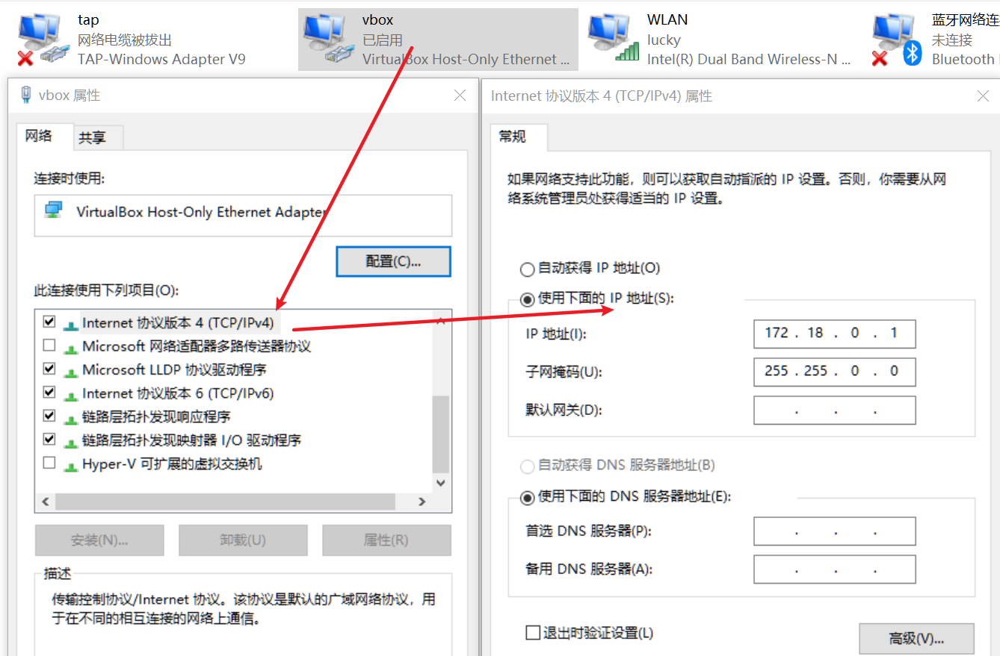
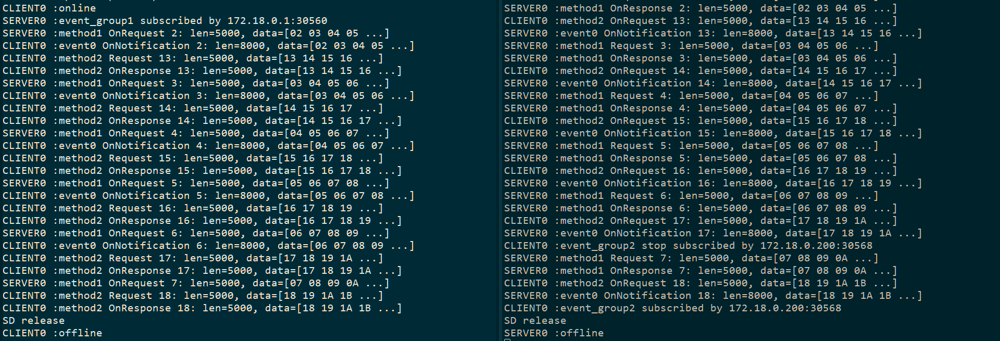
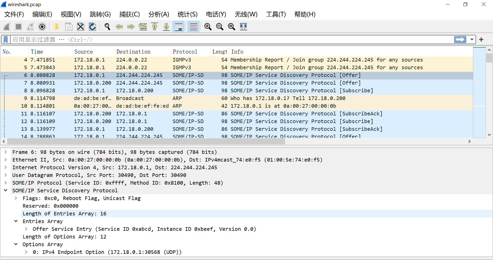

## SOMEIP and its Service Discovery

SOMEIP/SD and SOMEIPXF dedicated examples:

  - [SOMEIP CAN message publisher and subscriber](../../app/examples/someip/can/README.md)
  - [SOMEIP math add client and server](../../app/examples/someip/add/README.md)

But before trying the above examples, try the following example and following the step below to get environment ready.

An example to play with:

* NetApp: An app with SOMEIP/SD, DoIP and CAN stack together
* NetAppT: An anti-test purpose app with SOMEIP/SD only, this is used to test SOMEIP/SD
* CanSimulator: An app used to simulate CAN bus

```sh
# The NetApp is built with FreeRTOS+LWIP sockets
# the index of the Virtual Box Network Adaptor "Oracle"
# on my PC, it's zero, but on your PC, it's maybe not
# and please staticly configured its ipv4 address to 172.18.0.1
set PACKET_LIB_ADAPTER_NR=0
# enable PCAP dump for wireshak
set USE_PCAP=YES
scons --app=NetApp --net=LWIP --os=FreeRTOS

# The NetAppT is built with host windows sockets
scons --app=NetAppT --os=OSAL

# in 2 different pannel, launch below commands to start the apps
build\nt\GCC\NetApp\NetApp.exe
build\nt\GCC\NetAppT\NetAppT.exe
```

When you launch the NetApp, generally you will see below messages, please note that for the NetApp + FreeRTOS + LWIP, it's using the [windows PCAP](https://www.winpcap.org/) to simulate a virtual network adapter for the easy study/development process. And I find that the [VirtualBox](https://www.virtualbox.org/) network adapter is the most stable one that works perfect.  So you need to install the VirtualBox and then manually configure its ipv4 address to "172.18.0.1", as below picture shows:



```sh
INFO    :application build @ May  3 2022 21:06:24
... ...
TCPIPI  :Starting lwIP, IP 172.18.0.200
 0: NPF_{7C69ADB8-A49E-46AA-AA62-5E367B965EE9}
     Desc: "Oracle"
 1: NPF_{D8E510AC-9490-42A0-AA88-3BE0BD41E52D}
     Desc: "TAP-Windows Adapter V9"
 2: NPF_{8FAE2F35-41DC-4D5D-A2FC-8426852265FF}
     Desc: "Microsoft"
 3: NPF_{8F9E1CE9-4EA7-4354-844F-848EA56AF7EE}
     Desc: "Microsoft"
 4: NPF_{434E0818-480A-450B-A7F1-99F473224151}
     Desc: "Microsoft"
Using adapter_num: 0
Using adapter: "Oracle"
DEMI    :Set Event 5 status 2
DEMI    :Set Event 5 status 2
DEMI    :Operation Cycle 1 Start
```

After all the applications launched, press key "s" to put SOMEIP related server/client/event group online, running for several seconds, press key "s" again to put them  offline, you can see logs as below:



And under the root directory of ssas-public, you could see net.log and wireshark.pcap.

* net.log: A text file with logs about SOMEIP/SD
* wireshark.pcap: a network pcap file has all the ethernet packets received or transmitted by lwip



### ref

[LwIP + Win PCAP](https://blog.csdn.net/zengsenhua/article/details/123914711)

### verify communication with vsomeip

#### build vsomeip with WSL Ubuntu 20.04

```sh
git clone https://gitee.com/autoas/vsomeip.git
cd vsomeip
mkdir build
cd build
cmake ..
```

#### Run ssas client example

```sh
cd build
export LD_LIBRARY_PATH=`pwd`:$LD_LIBRARY_PATH
ln -fs ../examples/ssas/vsomeip.json vsomeip.json
 ./examples/ssas/client-example
```


