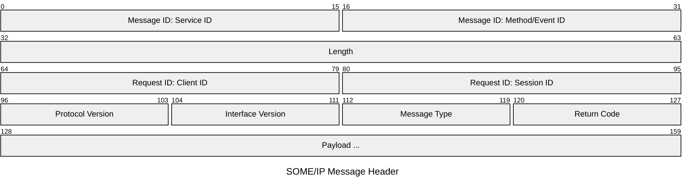
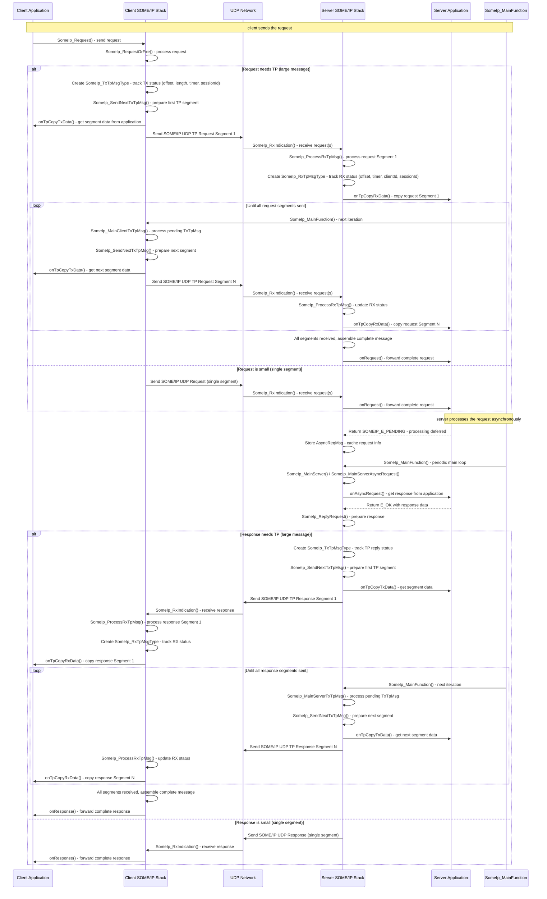
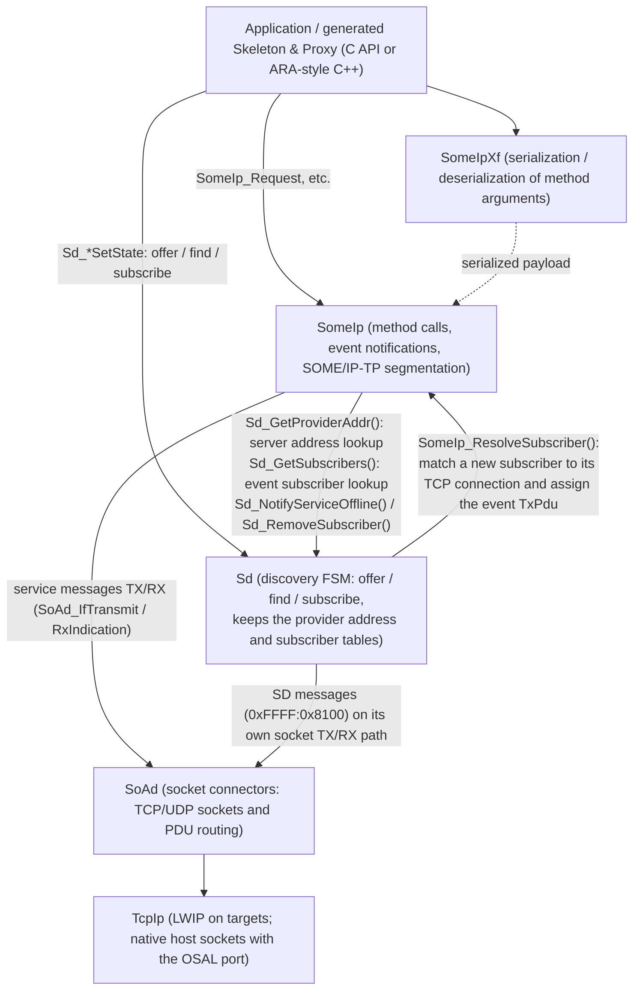

# AUTOSAR SOME/IP and SOME/IP-SD

**SOME/IP** (Scalable service-Oriented MiddlewarE over IP) is the AUTOSAR standard for service-oriented communication over Ethernet/IP: a server offers services (methods, events and fields), a client discovers them dynamically and invokes them, without any static binding at build time. **SOME/IP-SD** (Service Discovery) is the control protocol that lets servers and clients find each other at runtime.

This article introduces the AS SOME/IP stack, its JSON configuration, and the host-side example applications that can be built and run without any ECU hardware.

## Table of Contents

1. [Protocol Basics](#1-protocol-basics)
2. [Stack Architecture](#2-stack-architecture)
3. [Configuration (Network.json)](#3-configuration-networkjson)
4. [Host Examples](#4-host-examples)
5. [NetApp / NetAppT (Integrated Stack)](#5-netapp--netappt-integrated-stack)
6. [Interoperability with vsomeip](#6-interoperability-with-vsomeip)
7. [Troubleshooting](#7-troubleshooting)

## 1. Protocol Basics

A SOME/IP message consists of a 16-byte header followed by the serialized payload:


```mermaid
packet-beta
title SOME/IP Message Header
0-15: "Message ID: Service ID"
16-31: "Message ID: Method/Event ID"
32-63: "Length"
64-79: "Request ID: Client ID"
80-95: "Request ID: Session ID"
96-103: "Protocol Version"
104-111: "Interface Version"
112-119: "Message Type"
120-127: "Return Code"
128-159: "Payload ..."
```

The message types implemented by this stack (see [SomeIp.c](../../infras/communication/SomeIp/SomeIp.c)):

| Type | Value | Direction |
| --- | --- | --- |
| REQUEST | 0x00 | client -> server, response expected |
| REQUEST_NO_RETURN | 0x01 | client -> server, fire-and-forget |
| NOTIFICATION | 0x02 | server -> client, event |
| RESPONSE | 0x80 | server -> client |
| ERROR | 0x81 | server -> client |
| TP flag | 0x20 | OR-ed into the type for SOME/IP-TP segmented messages |

A plain UDP datagram carries a payload up to 1396 bytes; larger payloads use SOME/IP-TP (the segmented transport, max 1392 bytes per segment, offset field in the TP header). TCP is used for reliable methods.

### SOME/IP-TP Request/Response Flow

The sequence diagram below shows the complete UDP request/response TP flow, including the asynchronous server pattern (`SOMEIP_E_PENDING`):


```mermaid
sequenceDiagram
    participant ClientApp as Client Application
    participant ClientSOMEIP as Client SOME/IP Stack
    participant UDP as UDP Network
    participant ServerSOMEIP as Server SOME/IP Stack
    participant ServerApp as Server Application
    participant Main as SomeIp_MainFunction

    Note over ClientApp,Main: client sends the request
    ClientApp->>ClientSOMEIP: SomeIp_Request() - send request
    ClientSOMEIP->>ClientSOMEIP: SomeIp_RequestOrFire() - process request

    alt Request needs TP (large message)
        ClientSOMEIP->>ClientSOMEIP: Create SomeIp_TxTpMsgType - track TX status (offset, length, timer, sessionId)
        ClientSOMEIP->>ClientSOMEIP: SomeIp_SendNextTxTpMsg() - prepare first TP segment
        ClientSOMEIP->>ClientApp: onTpCopyTxData() - get segment data from application
        ClientSOMEIP->>UDP: Send SOME/IP UDP TP Request Segment 1
        UDP->>ServerSOMEIP: SomeIp_RxIndication() - receive request(s)
        ServerSOMEIP->>ServerSOMEIP: SomeIp_ProcessRxTpMsg() - process request Segment 1
        ServerSOMEIP->>ServerSOMEIP: Create SomeIp_RxTpMsgType - track RX status (offset, timer, clientId, sessionId)
        ServerSOMEIP->>ServerApp: onTpCopyRxData() - copy request Segment 1
        loop Until all request segments sent
            Main->>ClientSOMEIP: SomeIp_MainFunction() - next iteration
            ClientSOMEIP->>ClientSOMEIP: SomeIp_MainClientTxTpMsg() - process pending TxTpMsg
            ClientSOMEIP->>ClientSOMEIP: SomeIp_SendNextTxTpMsg() - prepare next segment
            ClientSOMEIP->>ClientApp: onTpCopyTxData() - get next segment data
            ClientSOMEIP->>UDP: Send SOME/IP UDP TP Request Segment N
            UDP->>ServerSOMEIP: SomeIp_RxIndication() - receive request(s)
            ServerSOMEIP->>ServerSOMEIP: SomeIp_ProcessRxTpMsg() - update RX status
            ServerSOMEIP->>ServerApp: onTpCopyRxData() - copy request Segment N
        end
        ServerSOMEIP->>ServerSOMEIP: All segments received, assemble complete message
        ServerSOMEIP->>ServerApp: onRequest() - forward complete request
    else Request is small (single segment)
        ClientSOMEIP->>UDP: Send SOME/IP UDP Request (single segment)
        UDP->>ServerSOMEIP: SomeIp_RxIndication() - receive request(s)
        ServerSOMEIP->>ServerApp: onRequest() - forward complete request
    end

    Note over ServerApp,Main: server processes the request asynchronously
    ServerApp-->>ServerSOMEIP: Return SOMEIP_E_PENDING - processing deferred
    ServerSOMEIP->>ServerSOMEIP: Store AsyncReqMsg - cache request info
    Main->>ServerSOMEIP: SomeIp_MainFunction() - periodic main loop
    ServerSOMEIP->>ServerSOMEIP: SomeIp_MainServer() / SomeIp_MainServerAsyncRequest()
    ServerSOMEIP->>ServerApp: onAsyncRequest() - get response from application
    ServerApp-->>ServerSOMEIP: Return E_OK with response data
    ServerSOMEIP->>ServerSOMEIP: SomeIp_ReplyRequest() - prepare response

    alt Response needs TP (large message)
        ServerSOMEIP->>ServerSOMEIP: Create SomeIp_TxTpMsgType - track TP reply status
        ServerSOMEIP->>ServerSOMEIP: SomeIp_SendNextTxTpMsg() - prepare first TP segment
        ServerSOMEIP->>ServerApp: onTpCopyTxData() - get segment data
        ServerSOMEIP->>UDP: Send SOME/IP UDP TP Response Segment 1
        UDP->>ClientSOMEIP: SomeIp_RxIndication() - receive response
        ClientSOMEIP->>ClientSOMEIP: SomeIp_ProcessRxTpMsg() - process response Segment 1
        ClientSOMEIP->>ClientSOMEIP: Create SomeIp_RxTpMsgType - track RX status
        ClientSOMEIP->>ClientApp: onTpCopyRxData() - copy response Segment 1
        loop Until all response segments sent
            Main->>ServerSOMEIP: SomeIp_MainFunction() - next iteration
            ServerSOMEIP->>ServerSOMEIP: SomeIp_MainServerTxTpMsg() - process pending TxTpMsg
            ServerSOMEIP->>ServerSOMEIP: SomeIp_SendNextTxTpMsg() - prepare next segment
            ServerSOMEIP->>ServerApp: onTpCopyTxData() - get next segment data
            ServerSOMEIP->>UDP: Send SOME/IP UDP TP Response Segment N
            ClientSOMEIP->>ClientSOMEIP: SomeIp_ProcessRxTpMsg() - update RX status
            ClientSOMEIP->>ClientApp: onTpCopyRxData() - copy response Segment N
        end
        ClientSOMEIP->>ClientSOMEIP: All segments received, assemble complete message
        ClientSOMEIP->>ClientApp: onResponse() - forward complete response
    else Response is small (single segment)
        ServerSOMEIP->>UDP: Send SOME/IP UDP Response (single segment)
        UDP->>ClientSOMEIP: SomeIp_RxIndication() - receive response
        ClientSOMEIP->>ClientApp: onResponse() - forward complete response
    end
```

Notes:

1. **Timing of `SomeIp_RxIndication()`**: on the server side it is called shortly after the client sends the request segment(s); on the client side it is called shortly after the server sends the response segment(s).
2. **TP message handling**: the TX side tracks segmented transfer state in `SomeIp_TxTpMsgType` (offset, timer, sessionId), the RX side tracks and assembles in `SomeIp_RxTpMsgType`; `SomeIp_MainFunction` advances pending TX/RX TP messages periodically, so the main function must be scheduled cyclically.
3. **Async request processing**: when the server application returns `SOMEIP_E_PENDING`, the request is cached as an `AsyncReqMsg`; the main function later obtains the finished response via the `onAsyncRequest()` callback.
4. **Callback roles**: `onTpCopyTxData()` fetches segment data from the application for transmission; `onTpCopyRxData()` delivers received segment data; `onRequest()` delivers a complete request; `onAsyncRequest()` fetches the response for a pending request; `onResponse()` delivers a complete response to the application.

SOME/IP-SD itself is a SOME/IP message (service ID 0xFFFF, method ID 0x8100, UDP) exchanged over a configurable multicast group. Its entries (see [Sd.c](../../infras/communication/Sd/Sd.c)) are:

| Entry | Value | Purpose |
| --- | --- | --- |
| FindService | 0x00 | client searches for a service instance |
| OfferService | 0x01 | server announces a service instance (cyclic / on demand) |
| SubscribeEventgroup | 0x06 | client subscribes to an event group |
| SubscribeEventgroupAck/Nack | 0x07 | server accepts/rejects the subscription |

(plus the matching StopOfferService / StopSubscribeEventgroup entries). Every entry carries a TTL; an entity disappears when its offer/subscription expires or is sent with TTL = 0.

## 2. Stack Architecture

The implementation follows the AUTOSAR CP 4.4 module decomposition, but **SomeIp and Sd are not strict layers: they are peer modules sitting side by side on top of SoAd**, cooperating through a set of horizontal APIs:


```mermaid
flowchart TD
    APP["Application / generated Skeleton &amp; Proxy (C API or ARA-style C++)"]
    XF["SomeIpXf (serialization / deserialization of method arguments)"]
    SIP["SomeIp (method calls, event notifications, SOME/IP-TP segmentation)"]
    SD["Sd (discovery FSM: offer / find / subscribe,<br/>keeps the provider address and subscriber tables)"]
    SOAD["SoAd (socket connectors: TCP/UDP sockets and PDU routing)"]
    TCPIP["TcpIp (LWIP on targets; native host sockets with the OSAL port)"]

    APP -->|"SomeIp_Request, etc."| SIP
    APP -->|"Sd_*SetState: offer / find / subscribe"| SD
    APP --> XF
    XF -.->|"serialized payload"| SIP

    SIP -->|"Sd_GetProviderAddr(): server address lookup<br/>Sd_GetSubscribers(): event subscriber lookup<br/>Sd_NotifyServiceOffline() / Sd_RemoveSubscriber()"| SD
    SD -->|"SomeIp_ResolveSubscriber():<br/>match a new subscriber to its TCP connection and assign the event TxPdu"| SIP

    SIP -->|"service messages TX/RX (SoAd_IfTransmit / RxIndication)"| SOAD
    SD -->|"SD messages (0xFFFF:0x8100) on its own socket TX/RX path"| SOAD
    SOAD --> TCPIP
```

The interactions shown above are taken from the code:

* **SomeIp -> Sd**: before a client sends a request, it calls `Sd_GetProviderAddr()` to obtain the server address discovered by Sd (and opens the TCP connection accordingly); before a server sends an event notification, it calls `Sd_GetSubscribers()` to get the subscriber list maintained by Sd; on connection drop or service shutdown it calls `Sd_RemoveSubscriber()` / `Sd_NotifyServiceOffline()`.
* **Sd -> SomeIp**: when the server-side Sd receives a SubscribeEventgroup entry, it calls `SomeIp_ResolveSubscriber()`, and SomeIp matches the subscriber against the established TCP connections by remote address and assigns the event TxPdu (for a UDP service the unicast TxPdu is used directly; once the number of subscribers reaches MulticastThreshold, Sd switches to the multicast TxPdu and opens the multicast socket itself).
* **Both share SoAd but use independent paths**: SD messages (Service ID 0xFFFF, Method ID 0x8100) are sent/received by Sd over its own socket connectors, while regular SOME/IP traffic uses SomeIp's connections; on the receive path SoAd routes the PDU to either `Sd_RxIndication` or `SomeIp_RxIndication` according to its PDU/connector.

Relevant modules under [infras/communication](../../infras/communication): [SomeIp](../../infras/communication/SomeIp), [SomeIpXf](../../infras/communication/SomeIpXf), [Sd](../../infras/communication/Sd), [SoAd](../../infras/communication/SoAd), plus the optional [E2E](../../infras/communication/E2E) end-to-end protection module (profiles P04/P05/P07/P11/...).

Key public APIs:

* SomeIp: `SomeIp_Request`, `SomeIp_RxIndication`, `SomeIp_SoAdTpStartOfReception`, `SomeIp_MainFunction` ([SomeIp.h](../../infras/include/SomeIp.h));
* Sd: `Sd_ServerServiceSetState(handle, SD_SERVER_SERVICE_AVAILABLE/DOWN)`, `Sd_ClientServiceSetState(handle, SD_CLIENT_SERVICE_REQUESTED/RELEASED)`, `Sd_ConsumedEventGroupSetState`, `Sd_MainFunction` ([Sd.h](../../infras/include/Sd.h)).

Application code normally never calls these directly: the code generator emits a **Skeleton** (server-side) and a **Proxy** (client-side) for every service in the configuration. The generated C API looks like:

```c
/* server skeleton */
Std_ReturnType Math_OfferService(void);
Std_ReturnType Math_StopOfferService(void);
Std_ReturnType Math_add(const add_args_Type *args, Result_Type *ret);  /* user implements */

/* client proxy */
Std_ReturnType Math_add_Call(const add_args_Type *args);               /* asynchronous */
void Math_add_OnResponse(Result_Type *ret);                            /* user implements */
```

A C++/ARA-flavored variant (`MathSkeleton` / `MathProxy` with `ara::core::Result`, futures and callbacks) is generated as well, and a vsomeip backend can be selected for cross-stack interoperability (see section 6).

## 3. Configuration (Network.json)

All networking modules are configured from a single `Network.json` (class `Net`). The request/response example below is the server side of the TCP "add" example ([add/config/server/Network.json](../../app/examples/someip/add/config/server/Network.json)):

```json
{
  "class": "Net",
  "Modules": [
    {
      "name": "SomeIp",
      "class": "SomeIp",
      "SD": { "hostname": "ssas", "multicast": "224.244.224.245" },
      "structs": [
        { "name": "Vector", "data": [
          { "name": "number", "type": "uint8_n", "variable_array": true, "size": 2048 } ] },
        { "name": "Result", "data": [
          { "name": "ercd", "type": "uint8" },
          { "name": "summary", "type": "uint32" },
          { "name": "number", "type": "uint8_n", "variable_array": true, "size": 2048 } ] }
      ],
      "args": [
        { "name": "add-args", "args": [
          { "name": "A", "type": "Vector" }, { "name": "B", "type": "Vector" } ] }
      ],
      "servers": [
        {
          "name": "Math", "service": "0xadda", "instance": "0x1001",
          "clientId": "0x1001", "protocol": "TCP", "reliable": 30680,
          "methods": [
            { "name": "add", "methodId": "0x0add", "args": "add-args",
              "return": "Result", "tp": true, "version": "0" }
          ],
          "event-groups": []
        }
      ]
    }
  ]
}
```

Configuration elements:

| Element | Meaning |
| --- | --- |
| `SD.multicast` | multicast group used by SOME/IP-SD (and DoIP discovery can share it) |
| `structs` | user data types; scalar/array members, fixed or `variable_array` |
| `args` | reusable argument lists for methods |
| `servers` / `clients` | one entry per provided/consumed service instance |
| `service` / `instance` / `clientId` | SOME/IP Service ID, Instance ID and Client ID |
| `protocol` + `reliable` / `unreliable` | TCP port or UDP port the service is reachable on |
| `methods[]` | methodId, args, return struct, `tp: true` to allow segmented transport, interface `version` |
| `event-groups[]` | events (NOTIFICATION); UDP, with optional multicast and E2E protection |
| `fields[]` | getter/setter/notifier triplet (each is a reserved method/event) |

The client-side JSON is identical except that `servers` is replaced by `clients`. The generator turns it into C configuration for SomeIp/SomeIpXf/Sd/SoAd plus the Skeleton/Proxy code; the JSON Editor tool (see [JSON Editor doc](./JsonEditor.md)) can edit and generate these files graphically.

A full-featured example is [RadarService](../../app/examples/someip/ara/RadarService/Skeleton/config/Network.json) (service 0xadaa / instance 0x2001 over UDP port 12345): it shows an `Adjust` method, a `BrakeEvent` event group, a `UpdateRate` field (get/set/notify), variable-length arrays and E2E profile P11 protection.

## 4. Host Examples

The quickest way to see the stack running is the OSAL host build, which uses the operating system's native TCP/IP sockets (loopback / multicast) - no VirtualBox, PCAP or LWIP needed.

### 4.1 Request/Response over TCP: the "add" example

```sh
scons --app=AddServerEx --os=OSAL
scons --app=AddClientEx --os=OSAL
```

Run the server and the client in two terminals:

```sh
build\nt\GCC\AddServerEx\AddServerEx.exe
build\nt\GCC\AddClientEx\AddClientEx.exe
```

The client discovers the `Math` service through SD, invokes `add` over TCP with a 2 KB TP-segmented payload, and prints:

```text
MATH    :add response session=2: ercd = 0 summary 64448 == 64448
MATH    :add response session=3: ercd = 0 summary 68096 == 68096
```

See [examples/someip/add/README.md](../../app/examples/someip/add/README.md).

### 4.2 Publish/Subscribe over UDP multicast: the "can" example

```sh
scons --app=CanPubEx --os=OSAL
scons --app=CanSubEx --os=OSAL
```

Start the publisher once and any number of subscribers; every subscriber receives the same NOTIFICATION via UDP multicast. See [examples/someip/can/README.md](../../app/examples/someip/can/README.md).

### 4.3 ARA-style RadarService (C++ or C, optional E2E)

```sh
# C++/ARA Skeleton and Proxy
scons --app=RadarServiceServer --os=OSAL
scons --app=RadarServiceClient --os=OSAL

# plain C Skeleton and Proxy
scons --app=RadarServiceServerC --os=OSAL
scons --app=RadarServiceClientC --os=OSAL
```

The server offers the `RadarService` (method + event group + field), the client finds it, subscribes to the event group and exchanges E2E-protected messages.

Wireshark can capture all of the above on the loopback adapter; the SD multicast handshakes, OfferService/FindService entries and SOME/IP-TP segments are all decoded by the Wireshark SOME/IP dissector.

## 5. NetApp / NetAppT (Integrated Stack)

The main integrated application lives in [app/app](../../app/app) and combines the SOME/IP stack with DoIP and the CAN communication stack:

* **NetApp** - full stack on FreeRTOS + LWIP. On a Windows host it uses [PCAP](../../tools/libraries/pcap/pcap.c) against a virtual adapter to emulate a real ECU Ethernet interface. Build:

  ```sh
  set PACKET_LIB_ADAPTER_NR=0
  set USE_PCAP=YES
  scons --app=NetApp --net=LWIP --os=FreeRTOS
  ```

  Install VirtualBox and assign its host-only network adapter the static IPv4 address `172.18.0.1`; LWIP on the simulated ECU comes up as `172.18.0.200` (use `ipconfig` to find the adapter index if it is not 0):

  

* **NetAppT** - the SAME SOME/IP configuration but built on the OSAL host sockets (SoAd_T / SomeIp_T / Sd_T test variants), i.e. the protocol stack runs natively on the PC without LWIP:

  ```sh
  scons --app=NetAppT --os=OSAL
  build\nt\GCC\NetAppT\NetAppT.exe
  ```

Run NetApp and NetAppT in two terminals and they discover each other over SD and exchange method/event data. The offered services come online through the generated `ServiceX_OfferService()` calls in the application skeleton code. With `USE_PCAP=YES`, a text trace `net.log` and a capture file `wireshark.pcap` are written to the working directory:


## 6. Interoperability with vsomeip

To prove wire-level compatibility, the ARA-style RadarService example can be compiled with the open-source [vsomeip](https://github.com/COVESA/vsomeip) backend instead of the AS stack, and the two backends interoperate. The build scripts fetch a maintained mirror automatically ([infras/libraries/dds/vsomeip/SConscript](../../infras/libraries/dds/vsomeip/SConscript)):

```sh
# build the vsomeip shared libraries (downloaded from gitee.com/autoas/vsomeip)
scons --lib=vsomeip3 -j8
scons --lib=vsomeip3-cfg --prebuilt -j8
scons --lib=vsomeip3-sd --prebuilt -j8
scons --lib=vsomeip3-e2e --prebuilt -j8
scons --app=vsomeip3-routingmanagerd --prebuilt -j8
```

Then build one side with the vsomeip backend and the other side with the AS backend (selected by the `SOMEIP_BACKEND` environment variable in the RadarService SConscripts):

```sh
# client uses vsomeip
set SOMEIP_BACKEND=vsomeip
scons --app=RadarServiceClient --os=OSAL --gen

# server uses the native AS SOME/IP stack
set SOMEIP_BACKEND=someip
scons --app=RadarServiceServer --os=OSAL --gen
```

Run the routing manager first (vsomeip requires a routing manager on each machine), then the server and client. The vsomeip client discovers the AS server through SD and communicates with it exactly as with another vsomeip node.

## 7. Troubleshooting

* **LWIP/PCAP cannot open an adapter** - check that `PACKET_LIB_ADAPTER_NR` matches the VirtualBox adapter index printed by `ipconfig`; assign it `172.18.0.1`; allow the traffic through the Windows firewall.
* **OSAL examples see no traffic** - the OSAL port uses the host socket stack; make sure UDP multicast `224.244.224.245` is not blocked by a VPN or firewall, and capture on the correct (loopback / multicast) adapter in Wireshark.
* **Services never find each other** - verify both sides use the same multicast group and Service/Instance IDs; SD entries carry TTLs, so a stopped side disappears after the TTL expires.
* **vsomeip client does not connect** - the routing manager must be running, and its JSON configuration must match the network interfaces; start it before the client/server applications.
* **TP messages time out** - remember `SomeIp_MainFunction` (and `Sd_MainFunction`) must be scheduled cyclically; segmented transfers and the SD timers are driven from these main functions.
