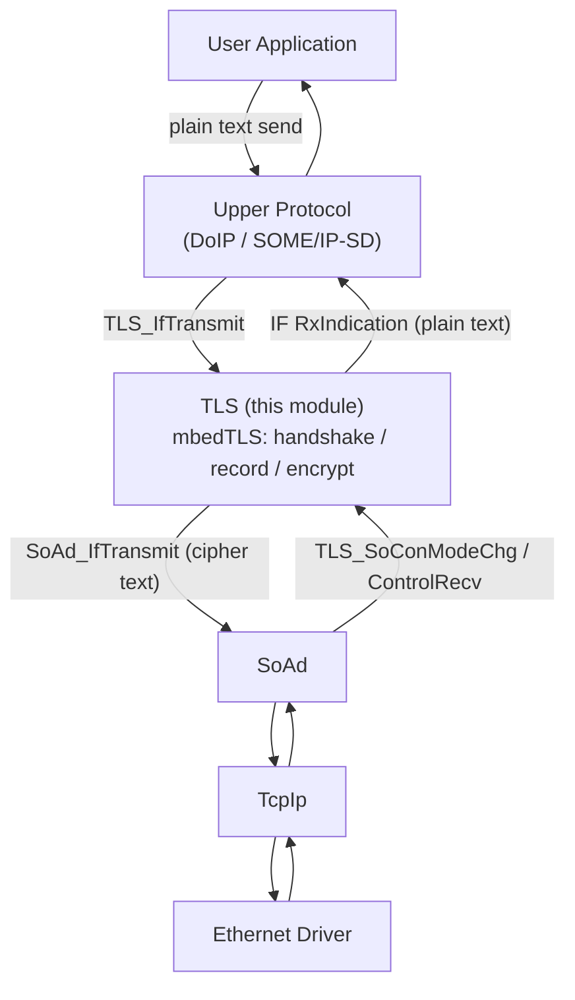
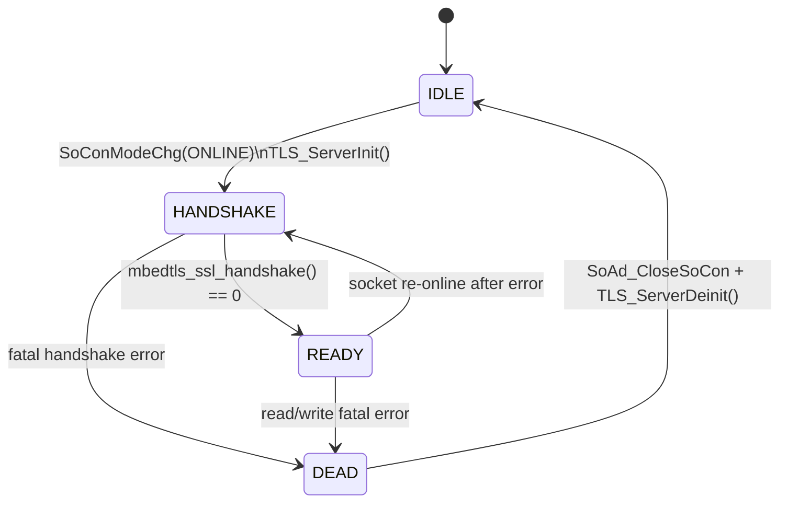

# TLS Overview

The **TLS** module adds TLS 1.x encryption to socket-based automotive protocols (DoIP, SOME/IP-SD). It is a thin adaptation layer on top of the [mbedTLS](https://www.trustedfirmware.org/projects/mbed-tls/) library. mbedTLS implements the TLS protocol and cryptography, while the AS TLS module connects its BIO (transport) callbacks to [SoAd](SoAd.md) and its decrypted application stream to the upper protocol layer (DoIP/Sd).

The current implementation acts as a **TLS server only** (`MBEDTLS_SSL_IS_SERVER`): the ECU accepts secured TCP connections from external testers or clients.

## 1. Position in the Communication Stack

TLS sits transparently between the upper protocol and the socket adapter:



The upper layer keeps using the same `PduInfoType` based interface; encryption and decryption are invisible to it. When TLS is not enabled, the upper protocol talks to SoAd directly.

Source files:

- Public API: [TLS.h](../../infras/include/TLS.h)
- Implementation: [TLS.c](../../infras/communication/TLS/TLS.c)
- Private types: [TLS_Priv.h](../../infras/communication/TLS/TLS_Priv.h)
- Code generator: [TLS.py](../../tools/generator/TLS.py)

## 2. Configuration File (TLS.json)

Real example from [app/app/config/Net/TLS.json](../../app/app/config/Net/TLS.json):

```json
{
  "class": "TLS",
  "servers": [
    {
      "name": "DOIP_TCP",
      "ServerCerts": "Cert/TLS0_ServerCerts.pem",
      "CasCerts": "Cert/TLS0_CasCerts.pem",
      "ServerKey": "Cert/TLS0_ServerKey.pem",
      "MaxSize": 512,
      "up": "DoIP",
      "SoConId": "DOIP_TCP_APT",
      "RxPduId": "DOIP_RX_PID_TCP",
      "repeat": 3
    }
  ]
}
```

### 2.1 Server Parameters

| Field | Type | Required | Default | Description |
| --- | --- | --- | --- | --- |
| `name` | string | yes | - | Logical server name, used to build the macro `TLS_SERVER_<name>` |
| `up` | string | yes | - | Upper protocol module: `DoIP`, `SD` or `SOMEIP`. For these three the generator sets the de-framing header length to 8 bytes |
| `SoConId` | string | yes | - | SoAd socket this server is bound to. The generator expands it to `SOAD_SOCKID_<SoConId>` and `SOAD_TX_PID_<SoConId>` |
| `RxPduId` | string | yes | - | Upper-layer receive PDU id, expanded as written (for example the DoIP `DOIP_RX_PID_TCP`) |
| `ServerCerts` | string | yes | - | PEM file holding the server certificate chain |
| `CasCerts` | string | yes | - | PEM file holding all trusted CA certificates concatenated together |
| `ServerKey` | string | yes | - | PEM file holding the server private key |
| `repeat` | integer | no | 1 | Creates several server contexts sharing one configuration. Generated names get a numeric suffix (`<name>0`, `<name>1`, ...) to match repeated SoAd sockets |
| `MaxSize` | integer | no | 512 | Maximum size hint kept in the generated configuration |

### 2.2 Top-Level Parameters

| Field | Type | Default | Description |
| --- | --- | --- | --- |
| `servers` | array | - | TLS server list |
| `UsePostBuildConfig` | bool | `false` | When true, emits `#define TLS_USE_PB_CONFIG` so the configuration pointer passed to `TLS_Init()` is used at runtime |

### 2.3 Certificates

PEM paths are resolved relative to the configuration directory (the parent of the generated `GEN/` folder). In the example above the files live in `app/app/config/Net/Cert/`:

- [TLS0_ServerCerts.pem](../../app/app/config/Net/Cert/TLS0_ServerCerts.pem)
- [TLS0_CasCerts.pem](../../app/app/config/Net/Cert/TLS0_CasCerts.pem)
- [TLS0_ServerKey.pem](../../app/app/config/Net/Cert/TLS0_ServerKey.pem)

The generator embeds every PEM file as a C string constant in `TLS_Cfg.c`, so no file system access is needed on the target. See [How to create CA(x.509)](HowToCreateCA.md) for a workflow to create the root CA, intermediate CA and server certificates with OpenSSL.

## 3. Generated Output

The generator produces `TLS_Cfg.h` and `TLS_Cfg.c` in the `GEN/` directory.

### 3.1 Macros (TLS_Cfg.h)

For each server (and for each instance when `repeat` is used):

```c
#define TLS_SERVER_DOIP_TCP0 0u
#define TLS_RX_PID_DOIP_TCP0 0u
#define TLS_TX_PID_DOIP_TCP0 0u
```

Other generated macros:

| Macro | Description |
| --- | --- |
| `TLS_HEADER_MAX_LEN` | Maximum de-framing header length. Set to 8 when any server has `up` of `DoIP`/`SD`/`SOMEIP`, otherwise 1 |
| `TLS_CONVERT_MS_TO_MAIN_CYCLES(x)` | Converts milliseconds to calls of `TLS_MainFunction`, using the application-provided `TLS_MAIN_FUNCTION_PERIOD` |
| `TLS_USE_PB_CONFIG` | Emitted only when `UsePostBuildConfig` is true |

### 3.2 Configuration Structures (TLS_Cfg.c)

For every distinct upper protocol, a SoAd interface table is generated:

```c
static const SoAd_InterfaceType SoAd_DoIP_IF = {
  DoIP_HeaderIndication,
  DoIP_RxIndication,
  NULL,
};
```

Then per server the generator builds one `TLS_ServerConfigType` entry (runtime context, name, upper-layer interface, mode-change callback, the three embedded PEM blobs plus their sizes, SoConId/TxPduId/RxPduId and header length) and finally:

```c
const TLS_ConfigType TLS_Config = {
  TLS_ServerConfigs,
  TLS_TxPduIds,
  ARRAY_SIZE(TLS_ServerConfigs),
  ARRAY_SIZE(TLS_TxPduIds),
};
```

## 4. Runtime State Machine

Each server owns a `TLS_ServerContextType` holding the mbedTLS contexts (entropy, CTR-DRBG, SSL, SSL config, certificate, private key) and its state:



| State | Value | Meaning |
| --- | --- | --- |
| `TLS_SERVER_IDLE` | 0 | No connection; mbedTLS contexts are not initialized |
| `TLS_SERVER_HANDSHAKE` | 1 | TCP socket online, TLS handshake in progress |
| `TLS_SERVER_READY` | 2 | Handshake done, application data can flow |
| `TLS_SERVER_RESPONSE` | 3 | Reserved response state |
| `TLS_SERVER_DEAD` | 4 | Fatal error; the socket is being closed |

Initialization (`TLS_ServerInit`) performs the standard mbedTLS server setup:

1. `SoAd_TakeControl()` to own the socket receive path;
2. Seed the random generator (`mbedtls_ctr_drbg_seed`);
3. Parse server certificates, CA certificates and the private key;
4. `mbedtls_ssl_config_defaults(..., MBEDTLS_SSL_IS_SERVER, MBEDTLS_SSL_TRANSPORT_STREAM, ...)`;
5. Register RNG, debug callback, optional session cache and the own certificate;
6. `mbedtls_ssl_setup()` and install the BIO callbacks (`TLS_NetSend` / `TLS_NetRecv`).

The handshake itself is driven cooperatively by `TLS_MainFunction()`: mbedTLS returns `MBEDTLS_ERR_SSL_WANT_READ/WRITE` while more network I/O is needed, and the main function simply retries on the next cycle. On success the upper layer is notified with `SoConModeChgNotification(SoConId, SOAD_SOCON_ONLINE)`.

## 5. Data Flow

### 5.1 Sending (Upper Layer -> TLS -> Socket)

1. The upper layer calls `TLS_IfTransmit(TxPduId, PduInfoPtr)`;
2. When the server state is `TLS_SERVER_READY`, the plain text is passed to `mbedtls_ssl_write()`;
3. mbedTLS calls the BIO callback `TLS_NetSend()`, which forwards the encrypted TLS record to `SoAd_IfTransmit()`.

### 5.2 Receiving (Socket -> TLS -> Upper Layer)

1. The BIO callback `TLS_NetRecv()` pulls cipher text on demand through `SoAd_ControlRecv()`. It returns `MBEDTLS_ERR_SSL_WANT_READ` when no data is available;
2. `TLS_MainFunction()` calls `mbedtls_ssl_read()` to get decrypted bytes;
3. For `DoIP`/`SD`/`SOMEIP` servers (header length 8), the first 8 bytes are passed to `<up>_HeaderIndication()` to learn the total payload length. The remaining fragments are assembled in a `Net_MemAlloc()` buffer and delivered in one piece;
4. Servers without header parsing deliver every chunk immediately through `<up>_RxIndication()`;
5. The remote socket address is attached via `PduInfoPtr->MetaDataPtr` (`SoAd_GetRemoteAddr()`).

On a fatal TLS error the server closes the SoAd socket, frees its mbedTLS contexts and notifies the upper layer with `SOAD_SOCON_OFFLINE`.

## 6. SoAd and DoIP Integration

- In the SoAd JSON configuration, a socket with `"up": "TLS"` is generated with the interface table `SoAd_TLS_IF` and its socket-mode-change callback is `TLS_SoConModeChg`;
- The DoIP configuration field `EnableTLS` marks DoIP TCP connections as secured. The DoIP generator then guards the TLS transmit path with the compile switch `USE_TLS` and stores the flag `bEnableTLS` per connection;
- At runtime, when `bEnableTLS == TRUE`, DoIP sends responses through `TLS_IfTransmit()` instead of calling `SoAd_IfTransmit()` directly;
- Define the `USE_TLS` preprocessor symbol in the application build to compile the DoIP TLS path, and make sure the TLS library is linked.

## 7. Build Integration

The TLS [SConscript](../../infras/communication/TLS/SConscript) links two libraries: `MbedTls` and `MemPool` (receive buffers come from the network memory pool).

Application requirements:

- Provide an mbedTLS configuration override when the default one does not fit the target (for example `config/mbedtls_config.h`, registered as the `MbedTls` configuration, with `MBEDTLS_CONFIG_FILE`);
- Schedule `TLS_MainFunction()` periodically and define `TLS_MAIN_FUNCTION_PERIOD` (in milliseconds), which the generated `TLS_CONVERT_MS_TO_MAIN_CYCLES()` macro depends on;
- Call `TLS_Init(&TLS_Config)` during startup (handled by the generated EcuM configuration in the demo application).

## 8. Public API

Declared in [TLS.h](../../infras/include/TLS.h):

| Function | Description |
| --- | --- |
| `TLS_Init(config)` | Initializes all server contexts (zeroed). Uses the post-build pointer when `TLS_USE_PB_CONFIG` is defined |
| `TLS_ServerOpen(server)` | Opens/activates a TLS server |
| `TLS_MainFunction()` | Drives handshakes and receives for every server; call periodically |
| `TLS_SoConModeChg(SoConId, Mode)` | SoAd socket mode-change entry; starts or tears down the TLS session |
| `TLS_IfTransmit(TxPduId, PduInfoPtr)` | Upper-layer transmit; encrypts and sends via mbedTLS |
| `TLS_SoAdIfRxIndication(RxPduId, PduInfoPtr)` | Plain receive indication entry |
| `TLS_SoAdIfTxConfirmation(TxPduId, result)` | Transmit confirmation entry |
| `TLS_SoAdStartOfReception(...)` | TP-style start-of-reception entry |
| `TLS_SoAdCopyRxData(...)` | TP-style copy received data entry |
| `TLS_SoAdRxIndication(RxPduId, result)` | TP-style reception completion entry |

## 9. Limitations

- Server role only; no TLS client initiation;
- Stream transport only (`MBEDTLS_SSL_TRANSPORT_STREAM`, TCP);
- The de-framing header length is fixed at 8 for `DoIP`, `SD` and `SOMEIP`;
- All generated transmit PDU ids map to server contexts (`bServer = TRUE`).
