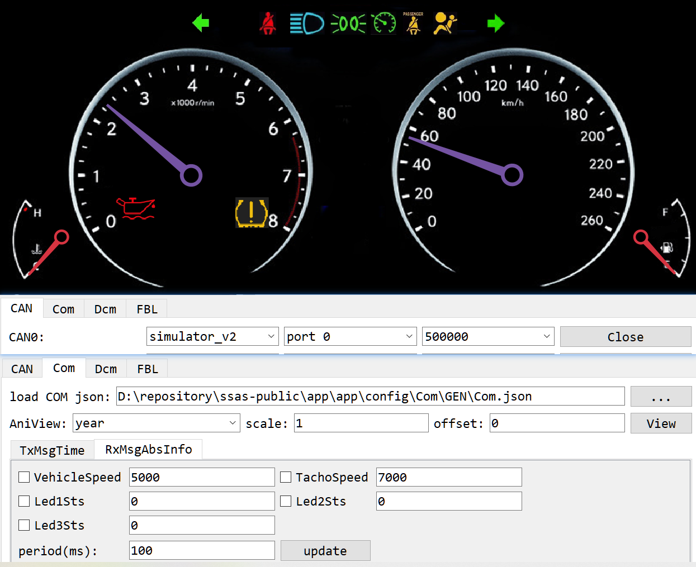

## UIVIC

What is UIVIC? UIVIC is a QT GUI based Virtual Instrusment Cluster I implemeted to simulate telltales and gauges.

Default, this UIVIC is a backend GUI for CanIC, but this is just simulation, the data exchange between CanIC and UIVIC is based on SOMEIP.

follow below command to build and run, please note better to disable any vbox related adapter.

```sh
# build
scons --app=CanIC --os=OSAL
scons --lib=AsOne
scons --app=asone --prebuilt
scons --lib=UIVIC --prebuilt --os=OSAL

# run
build\nt\GCC\CanIC\CanIC.exe

cd build\nt\GCC\one
asone.exe

cd tools\asone
python main.py
# in the CAN pannel, open the CAN0, then switch to COM, press key 'x' to request
# the CanIC to enter Network mode, you can see the TxMsgTime changed each second
# goto RxMsgAbsInfo, you can use it to control the gauge pointer of UIVIC.
```



For more details, reading the related source code.

[Swc_Telltale.c](../../app/app/config/SWC/Telltale/Swc_Telltale.c)

[Swc_Gauge.c](../../app/app/config/SWC/Gauge/Swc_Gauge.c)

[SOMEIP server on CanIC](../../tools/asone/src/ui/vic/server.cpp)

[SOMEIP client on UIVIC](../../tools/asone/src/ui/vic/client.cpp)

[UIVIC](../../tools/asone/src/ui/UIVIC.cpp)


