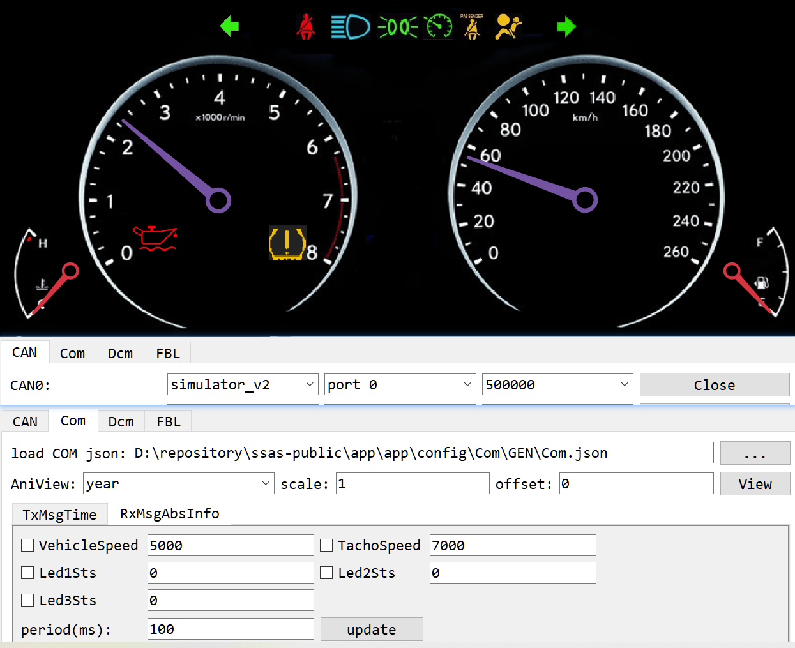

# UIVIC Virtual Instrument Cluster

UIVIC is a Qt GUI based **Virtual Instrument Cluster** implemented to simulate vehicle telltales and gauges.

By default UIVIC acts as the backend GUI for the CanIC demo application. This is only a simulation: the data exchange between CanIC and UIVIC runs over SOME/IP.

## 1. Build and Run

Follow the commands below. It is recommended to disable any VirtualBox related network adapter before running.

```sh
# build
scons --app=CanIC --os=OSAL
scons --lib=AsOne
scons --app=asone --prebuilt
scons --lib=UIVIC --prebuilt --os=OSAL

# run
build\nt\GCC\CanIC\CanIC.exe

cd build\nt\GCC\one
asone.exe

cd tools\asone
python main.py
# In the CAN panel, open CAN0, then switch to COM and press key 'x' to request
# CanIC to enter Network mode. You can see TxMsgTime change every second.
# Go to RxMsgAbsInfo and use it to control the gauge pointer of UIVIC.
```



## 2. Source Code

For more details, read the related source code:

- [Swc_Telltale.c](../../app/app/config/SWC/Telltale/Swc_Telltale.c) - telltale software component
- [Swc_Gauge.c](../../app/app/config/SWC/Gauge/Swc_Gauge.c) - gauge software component
- [SOME/IP server on CanIC](../../tools/asone/src/ui/vic/server.cpp)
- [SOME/IP client on UIVIC](../../tools/asone/src/ui/vic/client.cpp)
- [UIVIC main window](../../tools/asone/src/ui/UIVIC.cpp)
