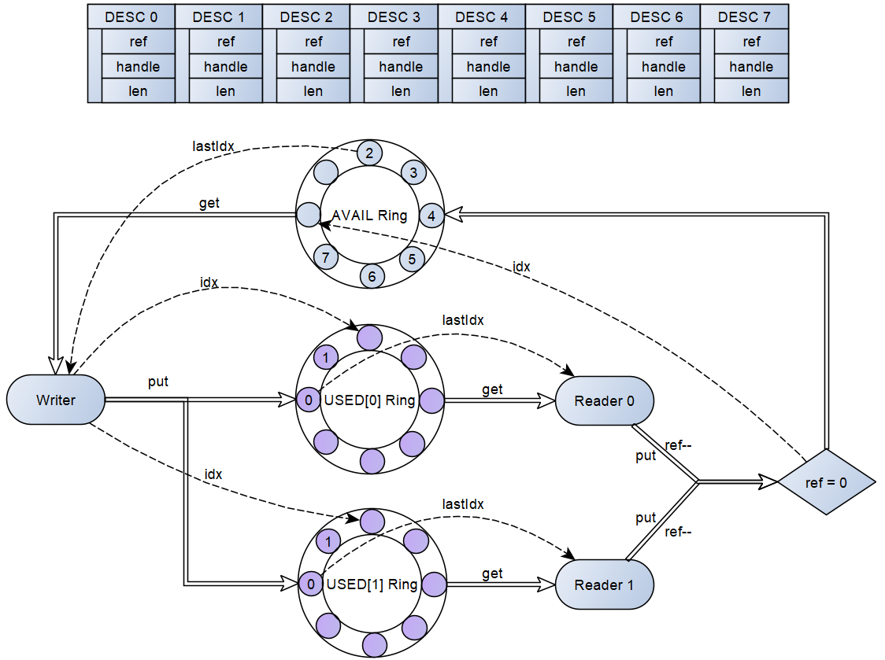
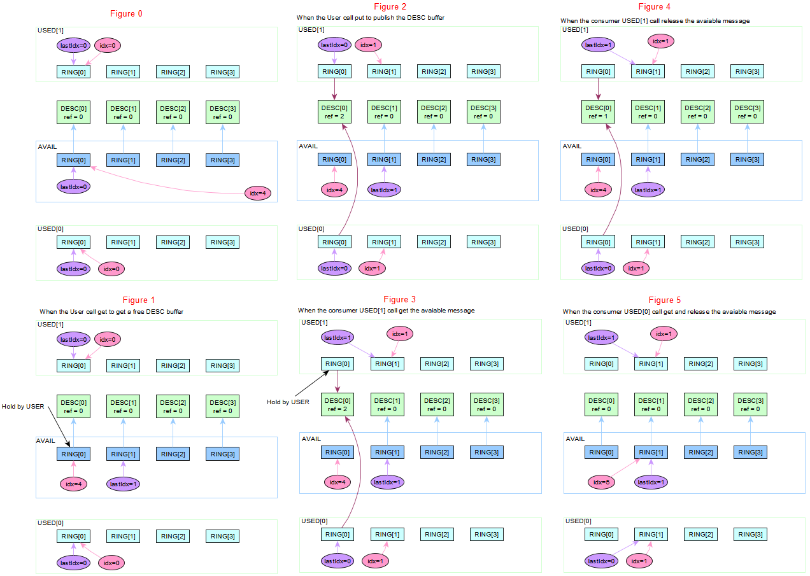
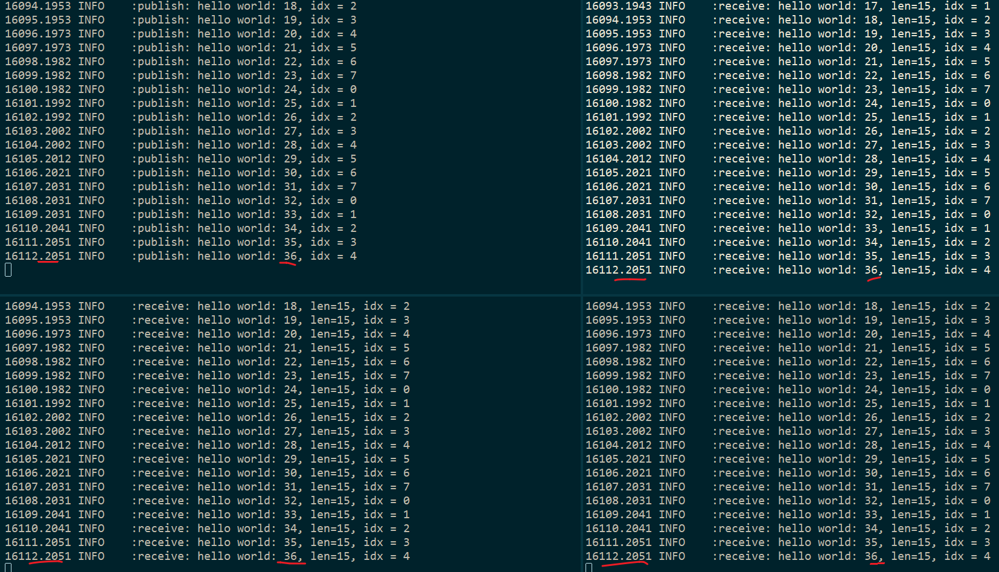

# VDDS - The Virtio Ring Buffer & Shared Memory based DDS

This is a concept project inspired by iceoryx, but I see iceoryx is too complex and it need a center daemon Roudi.
Here I think the [vitrio](https://docs.kernel.org/driver-api/virtio/virtio.html) is so perfect and why not based on the virtio ring buffer to implement a virtio type DDS that dedicated for inter-process communication, so I named it VDDS.

Below is the simple diagram to show the architecture and the shared named semaphore was used to sync between reader and writer. And the atomic was used to manage the reference counter of the used DESC, thus ensure that if multiply consumers/readers, that last one decrease the reference counter to 0 do the real action to put the DESC back to the avaiable ring of the producer/writer. And atomic based spinlock was used to protect some atomic multiply actions.

The code footprint is very small, just about 1000 lines of code, good for you to study.

The idea was perfect as I think, it can be expanded to be used widely for large data sharing for inter-process communication.

```txt
The VRing memory layout: N = capability - 1, K = maxReaders - 1

  +--------------------------------+
  |           META                 |
  +--------------------------------+
  |  DESC[0]  DESC[1] ... DESC[N]  |
  +--------------------------------+
  |           AVAIL                |
  |  lastIdx              idx      |
  |  ring[0] ring[1] ... ring[N]   |
  +--------------------------------+
  |           USED[0]              |
  |  lastIdx    idx                |
  |  ring[0] ring[1] ... ring[N]   |
  +--------------------------------+
  |           USED[1]              |
  |  lastIdx    idx                |
  |  ring[0] ring[1] ... ring[N]   |
  +--------------------------------+
  |          ...                   |
  +--------------------------------+
  |           USED[K]              |
  |  lastIdx    idx                |
  |  ring[0] ring[1] ... ring[N]   |
  +--------------------------------+

The Writer from AVAIL get a free DESC, and put the DESC to those onlined reader used ring.
The DESC manage a reference counter. e.g as below shows, 2 Readers online:

            get        +-----------------+   put the DESC[0] back to the AVAIL ring
      +----------------|   AVAIL ring    |<---------------------------------------------------+
      |                +-----------------+                                                    |
      | DESC[0] is returned                                                                   |
      V           DESC[0].ref = 2                                                             |
+------------+  put     +-----------------+  get   +---------------+ put: DESC[0].ref--,      |
|   Writer   |----+---->|  USED[0] ring   |------->|   Reader[0]   |------------------[END]   |
+------------+    |     +-----------------+        +---------------+ ref > 0, stop            |
                  |                                                                           |
                  |     +-----------------+  get   +---------------+ put: DESC[0].ref--,      |
                  +---->|  USED[1] ring   |------->|   Reader[0]   |--------------------------+
                        +-----------------+        +---------------+ ref == 0, release
The Writer.put must ensure no Reader.put happens for the same DESC

The Writer.get update the AVAIL ring "lastIdx". Only the Writer will update this "lastIdx",
no need atomic action for this "lastIdx".

The Reader.put update the AVAIL ring "idx". It is possible that 2 or more readers put different
DESC at the same time thus race to update the AVAIL ring "idx". Need atomic action for this
"idx".

The Writer.put update the USED ring "idx". Only the Writer will update this "idx", no need
atomic.

The Reader.get update the used ring "lastIdx". Only the Reader will update this "lastIdx", no
need atomic.
```

The more key important details of the AVAIL ring and USED ring as below picture shows:



As the Figure 0 shows, when the Writer initialization is done and 2 Readers(USED ring) online, the ring of AVAIL is full and each points to a valid DESC(the shared memory descriptor). And the USED[0] and USED[1] ring are empty.

When the user of the Writer call API "get", the DESC[0] as pointed by the lastIdx of AVAIL ring will be returned to the user and the lastIdx will be moved to point to the next RING[1], as Figure 1 shows.

Then when the user of the Writer fill valid data to the memory point by DESC[0], a "put" API call to put the DESC[0] to all the online USED ring, thus the USED[0] and USED[1] ring will has 1 ring that point to the DESC[0], as 2 consumers, the "ref" of DESC[0] will be 2, as the Figure 2 shows. The Writer will notify the 2 online Readers by using the semaphore associated with the USED ring.

Now assume the Reader 1 wake up and take the DESC[0] from its USED ring, thus its USED ring will be empty again, the lastIdx move to point to the next ring which was no valid, as the Figure 3 shows, as DESC[0] now is still used by the Reader 0 and still in the USER ring of the Reader 1, the ref is still 2.

Then the reader finish process the memory point out by DESC[0], then it will put it back, the first action is to decrease the "ref" of the DESC[0], its value will be 1, as not zero, so the DESC[0] is still in use, the reader 0 will not do the action to put it back the the AVAIL ring of the writer, as the Figure 4 shows.

Only when the Reader 0 also consume the DESC[0] by call API "get" and "put", the ref of the DESC[0] will be 0, thus the Reader 0 will do the action to put the DESC[0] back to the AVAIL ring of the Writer, the idx will be moved to point to the next, the the AVAIL ring is full again in this case as Figure 5 shows.

OK, so with the virtio ring buffer, the DDS zero copy communiaiton is quite simple and fast between the 1 writer and the multiply online readers.



```sh
scons --app=VDDSHwPub
scons --app=VDDSHwSub

# launch 1 pub
build/posix/GCC/VDDSHwPub/VDDSHwPub

# launch 3 sub in different shell
build/posix/GCC/VDDSHwSub/VDDSHwSub
build/posix/GCC/VDDSHwSub/VDDSHwSub
build/posix/GCC/VDDSHwSub/VDDSHwSub
```

On my windows WSL linux sub system, I see performance was very good.

