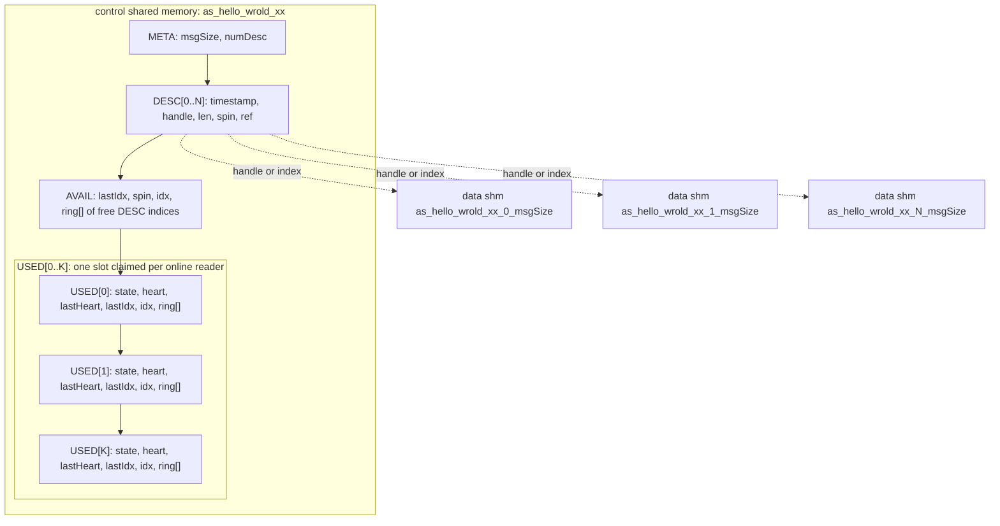
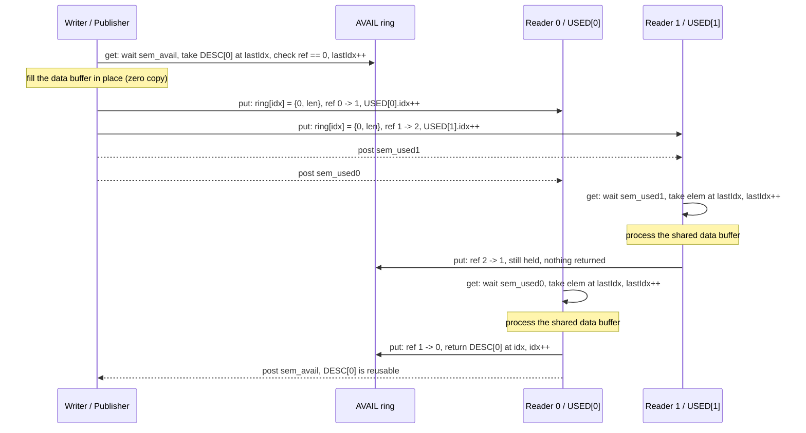

# VDDS - Virtio Ring Buffer based DDS

**VDDS** is a lightweight zero-copy publish/subscribe data-sharing service for
inter-process communication (IPC). It is inspired by
[iceoryx](https://iceoryx.io/) but deliberately kept small:

* no central daemon (iceoryx needs the RouDi daemon) - the publisher creates
  the shared memory objects and the subscribers attach to them;
* no data copy and no socket transport - the payload lives in shared memory
  and only 4-byte descriptor indices are exchanged through rings;
* single publisher, multiple consumers (SPMC), with a per-descriptor reference
  counter so a data buffer is recycled only after every online subscriber has
  consumed it;
* about 1000 lines of C++11 in namespace `as::vdds`, easy to study and port.

The design borrows the [virtio](https://docs.kernel.org/driver-api/virtio/virtio.html)
split-vring idea: an **AVAIL** ring hands free buffers from the writer side to
the producer, and one **USED** ring per reader delivers filled buffers to the
consumers. The code lives in
[infras/libraries/dds/vdds/](../../infras/libraries/dds/vdds/).

## 1. Architecture

One topic is one connection. A topic consists of:

* one control shared-memory object holding META, the descriptor table, the
  AVAIL ring and up to `VRING_MAX_READERS` (8 by default) USED rings;
* `numDesc` data shared-memory objects of `msgSize` bytes each, addressed by
  the descriptors. On Linux, when `/dev/dma_heap/system` exists the build
  defines `USE_DMA_BUF` and DMA-BUF heaps are used (the descriptor stores the
  DMA-BUF handle); plain POSIX `shm_open` is used otherwise;
* one named semaphore for the AVAIL ring (initial count `numDesc`) and one
  named semaphore per reader USED ring (initial count 0).

The topic name is converted to an object name by prefixing `as` and replacing
`/` with `_`; for example topic `/hello_wrold/xx` maps to shared memory and
semaphore name `as_hello_wrold_xx`.

All regions are 64-byte aligned (`VRING_ALIGNMENT`). Let `N = numDesc - 1` and
`K = VRING_MAX_READERS - 1`; the control region layout is:



The key structures (see `include/vring/base.hpp` and
`include/vring/spmc/base.hpp`) are:

* `VRing_MetaType { msgSize, numDesc }` - published geometry, checked by every
  reader when it attaches;
* `VRing_DescType { timestamp, handle, len, spin, ref }` - one data buffer.
  `timestamp` is the publish time in microseconds, `ref` is the number of
  readers that still hold the buffer, `spin` protects the compound ref/ring
  operations;
* `VRing_AvailType { lastIdx, spin, idx, ring[] }` - free descriptor indices.
  The writer consumes at `lastIdx`, buffers are returned at `idx`;
* `VRing_UsedType { state, heart, lastHeart, lastIdx, idx, ring[] }` with ring
  elements `{ id, len }` - one ring per reader. `state` is atomic and moves
  `FREE(0) -> INIT(1) -> READY(2)`, and `READY -> KILLED(3) -> FREE` when the
  writer reaps a dead reader.

Synchronization combines three mechanisms:

1. **named semaphores** block a side until the other side makes progress;
2. **atomic operations** on `DESC.ref` and `USED.state/heart` coordinate the
   cross-process reference counting and reader registration;
3. **spinlocks** ([rigtorp MCS-style ticket exchange](https://rigtorp.se/spinlock/),
   implemented with `__atomic_exchange_n`) protect short compound sections:
   `AVAIL.spin` for the free ring and `DESC[i].spin` for one descriptor. A
   lock attempt that spins longer than `VRING_SPIN_MAX_COUNTER` fails with
   `EDEADLK` instead of spinning forever.

## 2. Publish / subscribe flow

With two readers online, one sample travels like this:



Step by step:

1. **Writer init** (`Writer::init`) creates the control object with
   `O_CREAT | O_EXCL`, creates the `numDesc` data buffers, fills the AVAIL
   ring (`ring[i] = i`, `idx = numDesc`), creates the semaphores and starts a
   monitor thread. A second writer cannot be created on the same topic.
2. **Reader init** (`Reader::init`) opens the already existing objects. It
   atomically claims the first FREE USED slot (`FREE -> INIT -> READY`) and
   starts a heartbeat thread. If the publisher is not online yet `shm_open`
   fails and `EEXIST` is returned (the sample retries `init()` once per
   second); if all 8 USED slots are taken, `ENOSPC` is returned.
3. **load() / get()**: the writer waits on the AVAIL semaphore, takes
   `ring[lastIdx]`, verifies `ref == 0`, advances `lastIdx` and hands the
   application the direct pointer into the data buffer. Return values are 0,
   `ETIMEDOUT` (no post within the timeout) or `ENODATA` (all buffers are
   currently lent out).
4. **publish() / put()**: under `DESC[idx].spin`, the writer appends
   `{id, len}` to every READY USED ring, atomically increments `ref` once per
   reader and advances that ring's `idx`, then posts the reader semaphores. If
   no reader is online, the descriptor is dropped straight back into the
   AVAIL ring and `ENOLINK` is returned.
5. **receive() / get()**: a reader waits on its own USED semaphore, verifies
   its slot is still READY, takes the element at `lastIdx`, advances
   `lastIdx` and returns the direct shared-memory pointer (0, `ETIMEDOUT` or
   `ENOMSG`).
6. **release() / put()**: under `DESC[idx].spin`, the reader atomically
   decrements `ref`. While `ref > 0` other readers still hold the buffer; the
   last reader sees `ref == 0`, takes `AVAIL.spin`, appends the index at
   `idx`, advances `idx` and posts the AVAIL semaphore so the writer can
   reuse the buffer.

The single-writer discipline makes most indexes lock-free; spinlocks are only
needed where a compound update or a multi-reader race exists:

| Field | Updated by | Rule |
| --- | --- | --- |
| AVAIL.lastIdx | Writer `get()` only | single writer, no race |
| AVAIL.idx | Writer `drop()` and the last Reader `put()` | several readers may race, protected by `AVAIL.spin` |
| USED[i].idx | Writer `put()` only | single writer, no USED lock needed |
| USED[i].lastIdx | owning Reader `get()` only | one owner per claimed slot |
| DESC.ref | Writer `put()` inc, Reader `put()` dec | atomic RMW; compound "dec then recycle" guarded by `DESC.spin` |
| USED.state, USED.heart | reader and writer cross-update | plain atomics (`__atomic_*`) |

### Fault handling

Real processes crash and stall, so the writer runs a monitor thread every
500 ms (`threadMain`):

* **reader heartbeat**: every reader increments its `heart` counter every
  100 ms. If the counter stops moving, the writer marks the slot KILLED,
  drains every descriptor still pending in that USED ring through
  `releaseDesc()` (so references are released and buffers are recycled), then
  marks the slot FREE again for a new reader to claim;
* **descriptor lifetime**: if a descriptor stays referenced for longer than
  `VRING_DESC_TIMEOUT` (2,000,000 us, 2 seconds), it is force-recycled. This
  means an application held a sample without releasing it - the code comments
  call this out as a fatal application bug, the recycle only keeps the system
  alive;
* **clean reader exit**: the reader destructor first releases every
  unconsumed buffer in its own USED ring and then clears its slot state to
  FREE.


The figure above shows the rings and index movement around a descriptor; the
figure below shows the end-to-end zero-copy data path through the shared
memory regions.


## 3. Application API

Include the aggregate header and use namespace `as::vdds`:

```cpp
#include "vdds.hpp"
using namespace as::vdds;

typedef struct {
  char string[128];
} HelloWorld_t;
```

Publisher side (`include/publisher.hpp`):

```cpp
Publisher<HelloWorld_t> pub("/hello_wrold/xx");           /* queue depth 8 by default */
/* Publisher<HelloWorld_t> pub("/hello_wrold/xx", PublisherOptions(16)); */
int r = pub.init();

HelloWorld_t *sample = nullptr;
r = pub.load(sample);                 /* 0 / ETIMEDOUT / ENODATA; get a free buffer */
if (0 == r) {
  int len = snprintf(sample->string, sizeof(sample->string), "hello world");
  r = pub.publish(sample, len);       /* publish(sample) publishes sizeof(T) bytes */
}
uint32_t i = pub.idx(sample);         /* debug: descriptor index held by a sample */
```

`Publisher<T, VRingWriter>` defaults its second template parameter to
`vring::spmc::Writer`; `vring::spsc::Writer` can be selected for a
single-reader topic. The writer message size is `sizeof(T)` and the queue
depth (descriptor count) comes from `PublisherOptions::queueDepth`.

Subscriber side (`include/subscriber.hpp`):

```cpp
Subscriber<HelloWorld_t> sub("/hello_wrold/xx");
int r = sub.init();                    /* retry while EEXIST: publisher not online yet */

size_t size = 0;
HelloWorld_t *sample = nullptr;
r = sub.receive(sample, size);        /* 0 / ETIMEDOUT / ENOMSG; zero-copy pointer */
if (0 == r) {
  /* process sample->string ... */
  r = sub.release(sample);            /* MUST release once per received sample */
}
```

`Subscriber<T, VRingReader>` likewise defaults to `vring::spmc::Reader`;
`init()` returns `EEXIST` while the publisher shared memory does not exist and
`ENOSPC` when all reader slots are occupied.

## 4. Build and run

The applications are registered in
[infras/libraries/dds/vdds/SConscript](../../infras/libraries/dds/vdds/SConscript):

| App | Source | Ring variant |
| --- | --- | --- |
| VDDSHwPub | examples/hello_world_publisher.cpp | SPMC writer |
| VDDSHwSub | examples/hello_world_subscriber.cpp | SPMC reader |
| VDDSHwSPub | examples/hello_world_publisher.cpp | SPSC writer (`-DVRING_WRITER=vring::spsc::Writer`) |
| VDDSHwSSub | examples/hello_world_subscriber.cpp | SPSC reader (`-DVRING_READER=vring::spsc::Reader`) |
| VDDSHwPS | examples/hello_world_ps.cpp | one process: 1 publisher thread + N subscriber threads |

Multi-process demo, one publisher and three subscribers:

```sh
scons --app=VDDSHwPub
scons --app=VDDSHwSub

# terminal 1
build/posix/GCC/VDDSHwPub/VDDSHwPub -p 1000

# terminals 2, 3, 4
build/posix/GCC/VDDSHwSub/VDDSHwSub
build/posix/GCC/VDDSHwSub/VDDSHwSub
build/posix/GCC/VDDSHwSub/VDDSHwSub
```

Single-process demo (publisher and subscribers are threads, handy for a quick
smoke test); `-n` sets the subscriber count and `-p` the publish period in
milliseconds:

```sh
scons --app=VDDSHwPS
build/posix/GCC/VDDSHwPS/VDDSHwPS -n 3 -p 100
```

Linux and WSL are the primary run environments (the screenshot below is taken
in WSL). POSIX shared memory and named semaphores are used directly, and
DMA-BUF is enabled automatically when `/dev/dma_heap/system` is present. A
native Windows port of the platform layer (`shm_open/mmap` and semaphore
shims) exists under `src/platform/win/`.


## 5. Source layout

```
infras/libraries/dds/vdds/
  include/
    vdds.hpp               aggregate header (publisher + subscriber)
    publisher.hpp          Publisher<T> template
    subscriber.hpp         Subscriber<T> template
    shared_memory.hpp      POSIX shm wrapper
    named_semaphore.hpp    named semaphore wrapper
    dma_memory.hpp         data buffer / DMA-BUF wrapper
    vring/base.hpp         META / USED types, ring size macros, spinlock
    vring/spmc/            single publisher, multiple consumers ring
    vring/spsc/            single publisher, single consumer ring
  src/                     matching implementations
    platform/linux/        DMA-BUF backend
    platform/win/          shm and semaphore shims for native Windows
  examples/                hello_world_ps / hello_world_publisher / _subscriber
```
