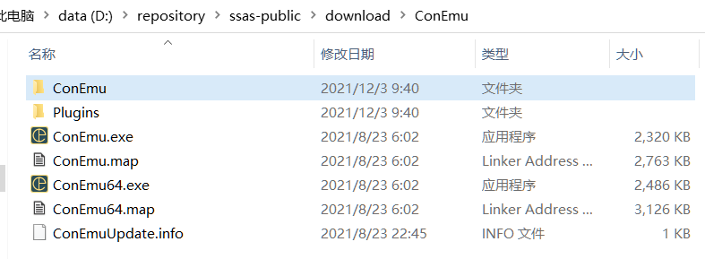
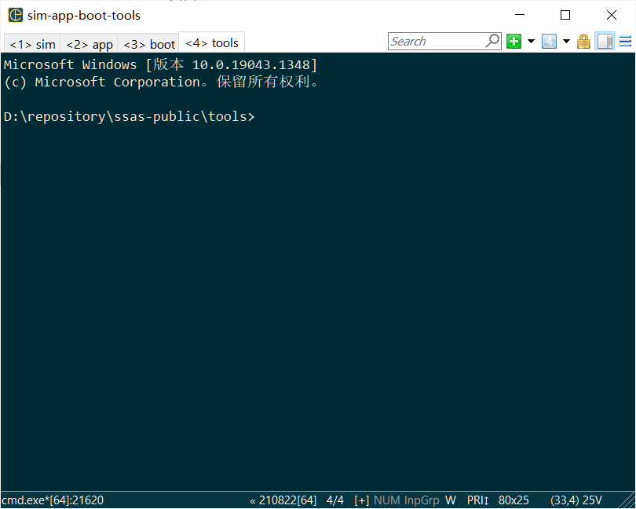

# Development Environment Setup


The building of my repository is based on python scons, it's very flexible and simple. Here I will introduce how to setup developement evnironment on Windows to evaluate and study [autoas/ssas-public ](https://github.com/autoas/ssas-public).

Install below software on Windows：


| Package                                  | Installation Directory |
| ---------------------------------------- | ----------- |
| [msys2]([MSYS2](https://www.msys2.org/)) | C:/msys64 |
| [anaconda3](https://www.anaconda.com/)   | C:/Anaconda3 |
|  [7z](https://sparanoid.com/lab/7z/)     | C:/Program Files/7-Zip/7z.exe |

For msys2, we can use "pacman" to install what is needed as ssas building toolchain, such as gcc, g++ and so on.

For anaconda3, we can use "pip" to install what is needed for ssas, such as scons, and also, by default anaconda3 will install many python packages, such as pyQT.

When those software has been installed on your Windows PC, you can double click the [Console.bat](https://github.com/autoas/ssas-public/blob/master/Console.bat) which is under ssas root directory. For the first launch of "Console.bat", it will automatically download and install [ConEmu](https://conemu.github.io/)(A very usefull Windows sheel command tool). If meet network issue that failed to download ConEmu, also, you can download this tool manually from[ConEmu Portable](https://www.fosshub.com/ConEmu.html), and install it as ssas-public/download/ConEmu, as below picture shows, and then double click [Console.bat](https://github.com/autoas/ssas-public/blob/master/Console.bat) to launch ssas development shell.



Finally, You will see what as below, from now on, we can start to install the related toolchain and libraies as the dependency of ssas.



In the ConEmu shell, line by line run the commands to install the dependency.

```sh
pacman -Syuu
pacman -S unzip wget git mingw-w64-x86_64-gcc mingw-w64-x86_64-glib2 mingw-w64-x86_64-gtk3
pacman -S mingw32/mingw-w64-i686-gcc mingw-w64-x86_64-diffutils
pacman -S ncurses-devel gperf curl make cmake automake-wrapper libtool
pacman -S unrar mingw-w64-x86_64-pkg-config mingw-w64-x86_64-binutils
pacman -S msys2-runtime-devel mingw-w64-x86_64-qemu mingw-w64-x86_64-dlfcn
pacman -S mingw-w64-x86_64-protobuf patch autotools
# For some anaconda installations, need to modify C:\Anaconda3\Lib\site.py to change the
# value of "ENABLE_USER_SITE" from "None" to "False", and need to ensure the user has full
# access rights to "C:\Anaconda3"
pip install scons pyserial pybind11 pillow ply pyqt5 bitarray
```

* The above commands may be out of date, and something may be missing, because at the time of writing this document, my development environment is already set up. But it doesn't matter, when we start compiling, the compilation error will tell us that a certain header file is missing, or a certain command is missing, you can Google by yourself, it is easy to solve this king of problem generally.

Then, we can try to compile the following APPs to test the developemnt environment we have just setup, first click ConEmu's app panel, switch to the app panel, and compile with the following command

```sh
# app panel
# better activate the python env before run scons, the same for other panels
D:\repository\ssas-public>c:\anaconda3\Scripts\activate
D:\repository\ssas-public>scons --app=IsoTpSend
scons: Reading SConscript files ...
scons: done reading SConscript files.
scons: Building targets ...
scons: building associated VariantDir targets: build\nt\GCC\IsoTpSend
CC app\platform\simulator\src\Can.c
......
CC tools\libraries\isotp\utils\isotp_send.c
LINK build\nt\GCC\IsoTpSend\IsoTpSend.exe
scons: done building targets.

D:\repository\ssas-public>scons --app=CanApp
scons: Reading SConscript files ...
scons: done reading SConscript files.
scons: Building targets ...
scons: building associated VariantDir targets: build\nt\GCC\CanApp
CC app\app\config\CanNm_Cfg.c
......
CC app\platform\simulator\src\simulator.c
LINK build\nt\GCC\CanApp\CanApp.exe
scons: done building targets.
```

Then, on the app panel, run CanApp, switch to boot panel, use the IsoTpSend to simulate a diagnostic node and send a diagnostic message:

```sh
# app panel
D:\repository\ssas-public> build\nt\GCC\CanApp\CanApp.exe
INFO    :application build @ Dec  3 2021 21:57:05
......
DCM     :physical service 10, len=2
INFO    :App_GetSessionChangePermission(1 --> 1)
INFO    :DCM s3server timeout!
```
```sh
# boot panel
D:\repository\ssas-public>build\nt\GCC\IsoTpSend\IsoTpSend.exe -v 1001
TX: 10 01
RX: 50 01 13 88 00 32
```

As above, we actually simulate a simple diagnostic session test, CanApp is equivalent to a CAN node, IsoTpSend is equivalent to another diagnostic node. As for the principle of simulation, please see the follow-up article.

Now, basically, the development environment setup is done. Enjoy！
