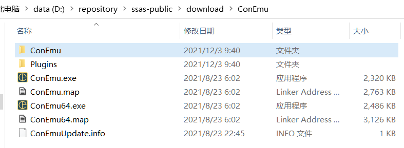
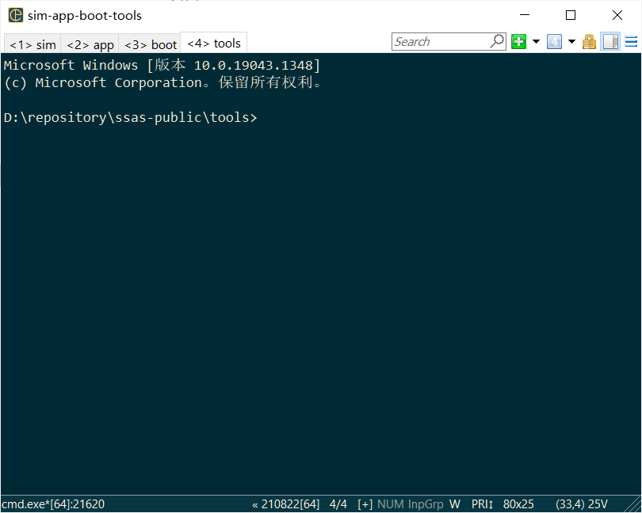

# Development Environment Setup Guide

## Build System Overview

The project (referred to as **AS** below) uses Python-based [SCons](https://scons.org/) as its build system. Python scripts orchestrate the compilation of a large number of modules with high flexibility and controllability. This guide explains how to set up the simulation development environment on Windows from scratch; no hardware board is required.

## 1. Install Required Software

Download and install the following three packages first. The default install paths are recommended:

| Package | Download Link | Default Install Path |
| --- | --- | --- |
| MSYS2 | [msys2.org](https://www.msys2.org/) | `C:/msys64` |
| Anaconda3 | [anaconda.com](https://www.anaconda.com/) | `C:/Anaconda3` |
| 7-Zip | [sparanoid.com/lab/7z](https://sparanoid.com/lab/7z/) | `C:/Program Files/7-Zip/7z.exe` |

* **MSYS2**: provides the pacman package manager used to install the gcc/g++ toolchain, qemu and other tools;
* **Anaconda3**: provides the Python environment and pip for installing scons and other Python dependencies (it already ships with many common libraries such as pyQt);
* **7-Zip**: required to unpack the development console (ConEmu), which is distributed as a 7z archive.

## 2. Launch the Development Console

Double-click [Console.bat](../../Console.bat) in the repository root. On the first run, the script automatically downloads and installs [ConEmu](https://conemu.github.io/), a handy Windows terminal, into `ssas/download/ConEmu`.

If automatic download fails because GitHub is unreachable on your network, download [ConEmu Portable](https://www.fosshub.com/ConEmu.html) manually, unpack it into the directory above, and run Console.bat again:



Once started, ConEmu opens four console tabs - **sim, app, boot and tools** - used to build and run the simulator node, applications, the bootloader and PC tools respectively:



> Tip: to keep ConEmu and third-party packages downloaded during the build outside the repository, set the `AS_DOWNLOAD_DIR` environment variable to a custom directory.

## 3. Install the Dependencies

Run the following commands line by line in any ConEmu tab to install the toolchain with pacman:

```sh
pacman -Syu
pacman -S --needed base-devel mingw-w64-ucrt-x86_64-toolchain
pacman -S unzip wget git make cmake patch automake-wrapper libtool
pacman -S mingw-w64-x86_64-gcc mingw32/mingw-w64-i686-gcc mingw-w64-x86_64-binutils
pacman -S mingw-w64-x86_64-diffutils mingw-w64-x86_64-pkg-config mingw-w64-x86_64-dlfcn
pacman -S mingw-w64-x86_64-glib2 mingw-w64-x86_64-gtk3 mingw-w64-x86_64-protobuf
pacman -S ncurses-devel gperf curl unrar msys2-runtime-devel mingw-w64-x86_64-qemu
```

Then activate the Anaconda environment and install the Python dependencies (it is recommended to activate it once per tab before running scons):

```sh
c:\anaconda3\Scripts\activate
pip install scons==4.5.2 pyserial pybind11 pillow ply pyqt5 bitarray
```

> Note: for some Anaconda installations, change `ENABLE_USER_SITE` in `C:\Anaconda3\Lib\site.py` from `None` to `False`, and make sure the current user has full access rights to `C:\Anaconda3`.

The command list above may not cover every dependency (the author's own environment was set up long before this document was written). If the build reports a missing header file or command, simply install the missing package with pacman/pip according to the error message.

## 4. Verify the Build

Switch to the **app** tab and build the two sample applications:

```sh
# app tab
D:\repository\as>scons --app=IsoTpSend
scons: Reading SConscript files ...
scons: done reading SConscript files.
scons: Building targets ...
scons: building associated VariantDir targets: build\nt\GCC\IsoTpSend
CC app\platform\simulator\src\Can.c
......
CC tools\libraries\isotp\utils\isotp_send.c
LINK build\nt\GCC\IsoTpSend\IsoTpSend.exe
scons: done building targets.

D:\repository\as>scons --app=CanApp
scons: Reading SConscript files ...
scons: done reading SConscript files.
scons: Building targets ...
scons: building associated VariantDir targets: build\nt\GCC\CanApp
CC app\app\config\CanNm_Cfg.c
......
CC app\platform\simulator\src\simulator.c
LINK build\nt\GCC\CanApp\CanApp.exe
scons: done building targets.
```

## 5. Run the Diagnostic Simulation Test

In the **app** tab, run CanApp, which acts as a simulated CAN node:

```sh
# app tab
D:\repository\as>build\nt\GCC\CanApp\CanApp.exe
INFO    :application build @ Dec  3 2021 21:57:05
......
DCM     :physical service 10, len=2
INFO    :App_GetSessionChangePermission(1 --> 1)
INFO    :DCM s3server timeout!
```

Then switch to the **boot** tab and run IsoTpSend to emulate a diagnostic tester, sending a UDS session-control request (`10 01`) to CanApp:

```sh
# boot tab
D:\repository\as>build\nt\GCC\IsoTpSend\IsoTpSend.exe -v 1001
TX: 10 01
RX: 50 01 13 88 00 32
```

You have now completed a simple diagnostic session simulation entirely without hardware: CanApp plays the role of the CAN node, while IsoTpSend plays the role of the diagnostic tester. The simulation principle will be explained in follow-up articles.

The development environment is ready. Enjoy!

## Appendix: GDB Debugging

The default `C:/msys64/usr/bin/gdb` may have issues debugging MinGW programs. Use the UCRT64 version `C:/msys64/ucrt64/bin/gdb.exe` instead; this toolchain is installed in section 3 with:

```sh
pacman -S --needed base-devel mingw-w64-ucrt-x86_64-toolchain
```
