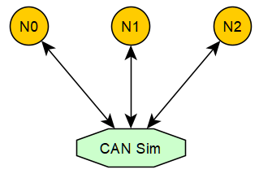

# CAN Bus Simulation

This article assumes the reader has some basic knowledge of CAN, but that is not strictly required: the CAN protocol itself is quite simple. The specification is a thick document, but much of it describes hardware characteristics. From a software point of view, CAN communication comes down to just two operations: sending a frame and receiving a frame.

From a software perspective, the CAN frame definitions in AUTOSAR and Linux look like this:

```c
// AUTOSAR
typedef struct {
  uint8_t length;
  Can_IdType id;
  uint8_t *sdu;
} Can_PduType;

// Linux
struct can_frame {
    canid_t can_id;  /* 32 bit CAN_ID + EFF/RTR/ERR flags */
    __u8    can_dlc; /* frame payload length in byte (0 .. 8) */
    __u8    __pad;   /* padding */
    __u8    __res0;  /* reserved / padding */
    __u8    __res1;  /* reserved / padding */
    __u8    data[8] __attribute__((aligned(8)));
};
```

A distinctive feature of a CAN network is broadcasting: a frame sent by any node on the bus can be received simultaneously by every other node. This property allows us to emulate the bus with sockets on a Windows or Linux host, and thereby simulate CAN communication entirely in software.

Linux already provides a native [virtual CAN](https://www.pragmaticlinux.com/2021/10/how-to-create-a-virtual-can-interface-on-linux/) (vcan) interface, which interested readers may want to explore. Windows has no equivalent built-in mechanism, which is why this project implements its own socket-based CAN bus simulation.



As shown above, CAN Sim acts as a TCP server, while N0, N1 and N2 are TCP clients, each holding a TCP connection to CAN Sim. When N0 sends a CAN frame, it is first delivered to CAN Sim, which then forwards it to N1 and N2, emulating bus broadcasting. This is the v1 TCP simulator; its source is [can_simulator.c](../../tools/libraries/Can/utils/can_simulator.c), which is less than 500 lines and easy to read.

### CAN Simulator v2 (recommended)

The v2 simulator is the recommended one. Instead of a central TCP server, it uses **UDP multicast** (group `224.244.224.245`, UDP port `8000 + bus id`), so:

* no simulator process has to be started - every node simply joins the multicast group and exchanges frames directly, which is much closer to the real broadcast behavior of a CAN bus;
* each frame carries an 8-byte timestamp and the sender's 16-byte UUID; a node uses the UUID to discard its own echoed frames;
* the payload supports up to 64 bytes, i.e. CAN FD.

The v2 client implementation is [simulator_can_v2.cpp](../../tools/libraries/Can/src/simulator_can_v2.cpp); the device name is `simulator_v2`. The v1 TCP scheme is kept for compatibility and has reliably supported the development and verification of communication-stack modules such as CanTp, Dcm, Com, CanNm and OsekNm, as well as the complete bootloader solution.

The client-side library is open as well; the header [canlib.h](../../tools/libraries/Can/include/canlib.h) exposes the following APIs:

```c
/* OR CAN_ID_EXTENDED into the ID for a 29-bit extended frame */
#define CAN_ID_EXTENDED 0x80000000U
#define CAN_ID_ANY     ((uint32_t)-1) /* read/wait filter: any ID            */
#define CAN_ID_MONITOR ((uint32_t)-2) /* read/wait the mixed TX+RX trace FIFO */

typedef struct {
  uint32_t canid;            /* 11/29-bit ID, OR with CAN_ID_EXTENDED */
  uint8_t  dlc;              /* 0 .. 64 (CAN FD) */
  uint8_t  data[64];
  uint64_t timestamp;        /* microseconds */
} can_frame_t;

int  can_open(const char *device_name, uint32_t port, uint32_t baudrate);
bool can_write(int busid, uint32_t canid, uint8_t dlc, const uint8_t *data);
bool can_read(int busid, uint32_t *canid /* InOut */, uint8_t *dlc /* InOut */, uint8_t *data);
bool can_write_v2(int busid, can_frame_t *can_frame); /* caller supplied timestamp, CAN FD */
bool can_read_v2(int busid, can_frame_t *can_frame);  /* returns the timestamp as well */
bool can_close(int busid);
bool can_reset(int busid);
bool can_wait(int busid, uint32_t canid, uint32_t timeoutMs);
bool can_wait_v2(int busid, uint32_t canid, uint32_t timeoutMs); /* low latency, used by the ISO-TP v2 flashloader */
```

The devices currently supported by canlib are:

| device_name | Device |
| --- | --- |
| `simulator` | TCP CAN bus simulator (v1, requires CanSimulator) |
| `simulator_v2` | UDP multicast CAN bus simulator (**v2, recommended**, serverless) |
| `qemu` | QEMU serial virtual CAN |
| `vxl` | [Vector XL Driver Library](https://www.vector.com/int/en/products/products-a-z/libraries-drivers/xl-driver-library/) (e.g. CANcaseXL) |
| `peak` | [PEAK CAN](https://www.peak-system.com/) (classic CAN) |
| `peakfd` | PEAK CAN (CAN FD) |
| `zlg` | [ZLG CAN](https://www.zlg.cn/can/can/index.html) |

There are only a handful of APIs. For AUTOSAR compatibility, an additional layer conforming to the AUTOSAR CAN driver interface is built on top of canlib; its code lives in [simulator/Can.cpp](../../app/platform/simulator/src/Can.cpp) and exposes:

```c
void Can_Init(const Can_ConfigType *Config);
void Can_DeInit(void);
Std_ReturnType Can_Write(Can_HwHandleType Hth, const Can_PduType *PduInfo);
Std_ReturnType Can_SetControllerMode(uint8_t Controller, Can_ControllerStateType Transition);
void CanIf_RxIndication(const Can_HwType *Mailbox, const PduInfoType *PduInfoPtr);
```

How to use canlib and the AUTOSAR CAN driver will be covered in follow-up articles.

## Lab: Send and Receive Frames with Python

The following walk-through uses the v1 TCP simulator (which needs a running CanSimulator). With the recommended v2 simulator, simply skip the CanSimulator build/start and pass `'simulator_v2'` instead of `'simulator'` to `AsPy.can()` - no central process is required.

```sh
# step 1: in the app tab, build the simulator and the AsPy library
D:\repository\as>scons --app=CanSimulator
D:\repository\as>scons --lib=AsPy
D:\repository\as>cp build\nt\GCC\AsPy\AsPy.dll AsPy.pyd

# sim tab: start the simulator for CAN bus 0 (not needed for simulator_v2)
D:\repository\as>build\nt\GCC\CanSimulator\CanSimulator.exe 0
```

```sh
# step 2: in the app tab, open a Python REPL to emulate CAN node N0
D:\repository\as>python
>>> import os
>>> os.add_dll_directory('C:/msys64/mingw64/bin')
>>> import AsPy
>>> n0 = AsPy.can('simulator', 0)

# step 3: in the boot tab, open another Python REPL to emulate CAN node N1
D:\repository\as>python
>>> import os
>>> os.add_dll_directory('C:/msys64/mingw64/bin')
>>> import AsPy
>>> n1 = AsPy.can('simulator', 0)
```

```text
# step 4: back in the sim tab, CAN Sim reports both nodes coming online
can socket 104 on-line!
can socket 108 on-line!
```

```python
# step 5: in the app tab, N0 sends a CAN frame
>>> n0.write(0x731, bytes(range(8)))
True
```

```text
# step 6: the sim tab shows the frame sent by N0
canid=00000731,dlc=08,data=[00,01,02,03,04,05,06,07,] [........] @ 1011.104675 s rel 625132.69 ms
```

```python
# step 7: in the boot tab, N1 receives N0's frame and replies with one
>>> n1.read(0x731)
[True, 1841, b'\x00\x01\x02\x03\x04\x05\x06\x07']
# the frame with ID 0x731 sent by N0 has been received by N1
>>> n1.write(0x732, bytes(range(8)))
True
```

```text
# step 8: the sim tab shows the frame sent by N1
canid=00000732,dlc=08,data=[00,01,02,03,04,05,06,07,] [........] @ 1098.185181 s rel 87080.51 ms
```

```python
# step 9: back in the app tab, N0 receives N1's frame
>>> n0.read(0x732)
[True, 1842, b'\x00\x01\x02\x03\x04\x05\x06\x07']
# the frame with ID 0x732 sent by N1 has been received by N0 as well
```

As shown above, canlib makes it possible to access CAN devices and send/receive frames from Python with very little effort, which is ideal for quickly writing CAN test cases and host-side tools.
