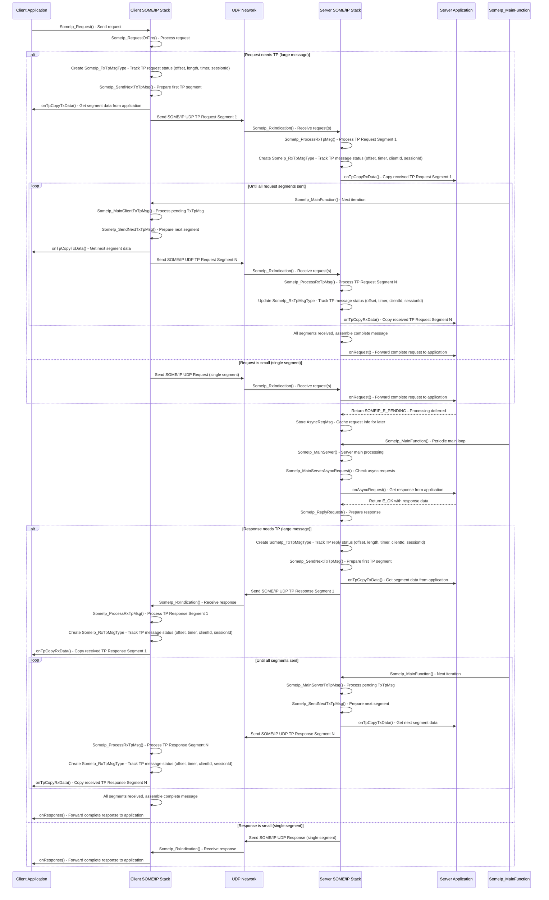

# SOME/IP

## SOME/IP UDP TP Message Request&Reply Flow Diagram

## Notes

1. **Timing of `SomeIp_RxIndication()`**: 
   - On the server side, `SomeIp_RxIndication()` generally happens soon after the client sends the request(s)
   - On the client side, `SomeIp_RxIndication()` generally happens soon after the server sends the response(s)

2. **TP Message Handling**: 
   - Large messages are split into segments using `SomeIp_TxTpMsgType` to track transmission status
   - Received segments are assembled using `SomeIp_RxTpMsgType` to track reception status
   - The `Main` function periodically processes pending TP messages to ensure all segments are sent/received

3. **Async Request Processing**: 
   - When the server application returns `SOMEIP_E_PENDING`, the request is cached in an `AsyncReqMsg`
   - The `Main` function later calls `onAsyncRequest()` to get the completed response

4. **Callback Interactions**: 
   - `onTpCopyTxData()`: Used to get segment data from the application for transmission
   - `onTpCopyRxData()`: Used to copy/receive segment data from received messages
   - `onRequest()`: Called when a complete request is ready for processing
   - `onAsyncRequest()`: Called to get the response for a pending request
   - `onResponse()`: Called when a complete response is ready for the application

